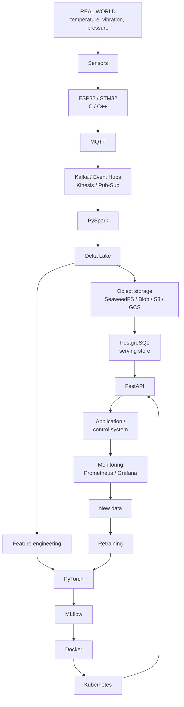

# Master architecture

How every technology in this vault connects, from a physical sensor to a retrained model.

Home: [[ULTIMATE ENGINEER]]

---

## The whole system

---

## Every arrow, explained

| Arrow | What actually happens | Note |
|---|---|---|
| **Real world → Sensors** | A physical quantity becomes a voltage. A thermistor's resistance changes with temperature. | [[Sensors overview]] |
| **Sensors → MCU** | The MCU's **ADC** samples that voltage and converts it to a number. Sampling rate and resolution decide what you can detect. | [[20 — EMBEDDED]] |
| **MCU → MQTT** | Firmware in C/C++ formats a reading and publishes it to a topic over WiFi. MQTT is chosen because it's tiny and tolerates bad networks. | [[MQTT]] |
| **MQTT → Kafka** | A bridge moves messages into a durable, replayable log. MQTT is a *transport*; Kafka is a *buffer with memory*. | [[Kafka]] |
| **Kafka → PySpark** | Spark reads the stream (or micro-batches it) and does distributed transformation. | [[PySpark core]] |
| **PySpark → Delta Lake** | Writes land as Parquet **plus a transaction log**, giving ACID, time travel and MERGE on cheap storage. | [[Databricks and Delta Lake]] |
| **Delta → Object storage** | Delta files physically live in buckets. Storage is cheap and effectively infinite. | [[ADLS Gen2]] |
| **Delta → PostgreSQL** | Small curated *gold* tables are copied to a real database so lookups are milliseconds, not seconds. | [[Azure SQL Database]] |
| **Delta → Feature engineering** | Raw events become model inputs: lags, rolling windows, aggregates. Where most model quality is won. | [[Data modeling]] |
| **Features → PyTorch** | Tensors, forward pass, loss, backward pass, optimiser step. | [[Tensors, autograd and the training loop]] |
| **PyTorch → MLflow** | Every run's params, metrics, artifacts and **data version** are recorded so the result is reproducible. | [[MLflow experiment tracking]] |
| **MLflow → Docker** | The winning model is exported (ONNX) and baked into an image with its serving code. | [[Model export and serving]] |
| **Docker → Kubernetes** | The image is scheduled onto machines, kept alive, scaled and rolled out safely. | [[Kubernetes and AKS]] |
| **Kubernetes → FastAPI** | The running container serves HTTP: validate input, look up features, run inference, return JSON. | [[FastAPI fundamentals]] |
| **PostgreSQL → FastAPI** | Precomputed predictions and features are fetched by primary key. | [[Deployment patterns]] |
| **FastAPI → Application** | A dashboard, a mobile app, or a **control loop** that acts on the prediction. | [[22 — CONTROL SYSTEMS]] |
| **Application → Monitoring** | Latency, errors, prediction distribution and input drift are recorded. | [[Observability for data and ML pipelines]] |
| **Monitoring → New data** | Real outcomes arrive and join the predictions that anticipated them. | [[Monitoring and iteration]] |
| **New data → Retraining** | Drift or schedule triggers a retrain, gated on beating the current champion. | [[Azure ML and the MLOps stack]] |

---

## The same architecture, four ways

| Layer | Local | Azure | AWS | GCP |
|---|---|---|---|---|
| Ingest | Mosquitto | IoT Hub | IoT Core | IoT Core |
| Stream | Kafka | Event Hubs | Kinesis | Pub/Sub |
| Process | Spark | Databricks | EMR | Dataproc |
| Storage | SeaweedFS | ADLS Gen2 | S3 | Cloud Storage |
| Warehouse | PostgreSQL | Azure PostgreSQL | RDS | Cloud SQL |
| Train | PyTorch | Azure ML | SageMaker | Vertex AI |
| Track | MLflow | Azure ML | SageMaker | Vertex AI |
| Serve | FastAPI + k3s | AKS | EKS | GKE |
| Monitor | Prometheus/Grafana | Azure Monitor | CloudWatch | Cloud Monitoring |

Full detail: [[Cloud comparison dictionary]]. Running it all on your laptop: [[Running the whole stack locally]].

---

## Working backwards from a problem

The point of the vault. Example — *"I want to predict aircraft engine failure."*

```mermaid
flowchart LR
    A["Aerospace<br/>what fails, and why"] --> B["Sensors<br/>what to measure"]
    B --> C["Embedded<br/>how to read it"]
    C --> D["Telemetry<br/>how to get it off the aircraft"]
    D --> E["Streaming<br/>how to not lose it"]
    E --> F["Processing<br/>how to clean it"]
    F --> G["Features<br/>what predicts failure"]
    G --> H["Model<br/>how to learn it"]
    H --> I["Serving<br/>how to use it"]
    I --> J["Monitoring<br/>how to trust it"]
```

Each box is a section. Follow the links down the chain and the vault tells you what you need to learn, in order.

---

## The three sub-systems

Not everything is one pipeline. Three distinct spines run through this vault:

**Data → intelligence**
[[02 — MATHEMATICS]] → [[08 — MACHINE LEARNING]] → [[09 — DEEP LEARNING]] → [[10 — PYTORCH]] → [[14 — MLOPS]] → [[19 — CLOUD]]

**Physical → digital**
[[03 — PROGRAMMING]] (C/C++) → [[20 — EMBEDDED]] → [[MQTT]] → [[Kafka]] → [[PySpark core]] → [[Databricks and Delta Lake]]

**Physics → autonomy**
[[23 — AEROSPACE]] → [[20 — EMBEDDED]] → [[22 — CONTROL SYSTEMS]] → [[21 — ROBOTICS]] → [[12 — REINFORCEMENT LEARNING]]

They meet at PyTorch and at the control loop.
