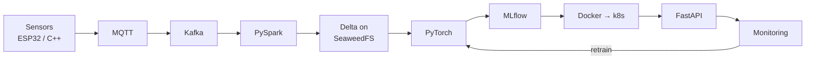

# ULTIMATE ENGINEER

The engineering brain. One vault, one taxonomy, no other resource needed.

Part of [[The 10x Engineer]].

---

## 🔴 Stuck right now?

**[[I HAVE A PROBLEM]]** — symptom → solution. Start there when something is broken, when you don't know how to do something, or when you're choosing between two tools.

---

## Where am I?

[[THE ULTIMATE ENGINEER ROADMAP]] — the whole path, in order, with the three tracks

[[Master architecture]] — how every technology connects, sensor to retrained model

---

## The 34 sections

| Foundation | Systems | Intelligence | Physical |
|---|---|---|---|
| [[02 — MATHEMATICS]] | [[05 — SOFTWARE ENGINEERING]] | [[08 — MACHINE LEARNING]] | [[20 — EMBEDDED]] |
| [[03 — PROGRAMMING]] | [[06 — DATABASES]] | [[09 — DEEP LEARNING]] | [[21 — ROBOTICS]] |
| [[04 — COMPUTER SCIENCE]] | [[07 — DATA ENGINEERING]] | [[10 — PYTORCH]] | [[22 — CONTROL SYSTEMS]] |
| [[24 — SCIENTIFIC COMPUTING]] | [[15 — FASTAPI]] | [[11 — COMPUTER VISION]] | [[23 — AEROSPACE]] |
| [[33 — SYSTEMS PERFORMANCE]] | [[16 — DOCKER]] · [[17 — KUBERNETES]] | [[12 — REINFORCEMENT LEARNING]] | |
| | [[18 — TERRAFORM]] · [[19 — CLOUD]] | [[13 — ML ENGINEERING]] · [[14 — MLOPS]] | |
| | [[25 — OBSERVABILITY]] · [[26 — SECURITY]] | [[27 — ML RESEARCH]] | |

---

## The four questions

### What should I learn next?

[[THE ULTIMATE ENGINEER ROADMAP]] orders everything and says what depends on what.
Curated path through the data/ML stack: **[[Data Engineering]]**.

### What am I building?

[[28 — PROJECTS]] — ten projects that build the whole architecture, one layer at a time.
Start: [[Project 001 — Aircraft Engine Sensor Analyzer]].

### What is this thing?

[[29 — DICTIONARY]] — A–Z index of every technology, each with the same structure:
*problem it solves → how it works → code → under the hood → when NOT to use → mistakes → debugging → cloud equivalents.*

### Something is broken

[[I HAVE A PROBLEM]] — the symptom router.
[[30 — TROUBLESHOOTING]] — how to reason about a failure.

---

## Fast lookup

| I need… | Go to |
|---|---|
| A formula | [[Mathematics reference]] |
| A complexity or algorithm | [[Algorithms and data structures reference]] |
| A port, status code, or network concept | [[Networking reference]] |
| A SQL or psql command | [[PostgreSQL reference]] · [[SQL fundamentals]] |
| Any CLI command | [[Command reference]] |
| PID or Kalman maths | [[PID and Kalman filters]] |
| The cloud equivalent of X | [[Cloud comparison dictionary]] |
| To run it all with no cloud | [[Running the whole stack locally]] |
| To take an idea to production | [[The playbook]] |
| Which career this leads to | [[31 — CAREERS]] |
| Books and courses | [[32 — RESOURCES]] |

---

## The stack

**Local — your laptop is the server**
Docker · k3s · PostgreSQL · **SeaweedFS** · Kafka · Spark · Delta Lake · PyTorch · MLflow · FastAPI · MQTT · Prometheus · Grafana · Terraform

**Cloud — the same architecture, three ways**
[[Cloud comparison dictionary]] translates every component across Azure, AWS and GCP.

Every arrow is explained in [[Master architecture]].
