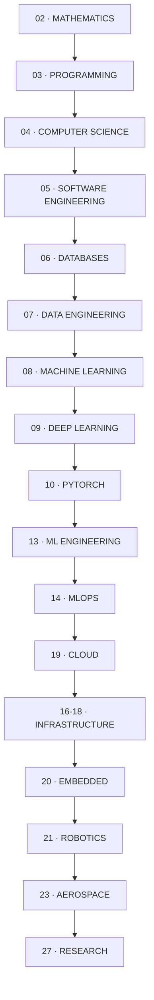
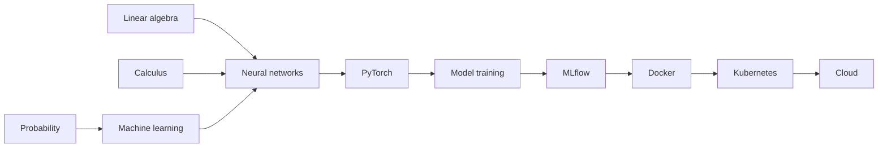
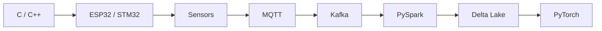
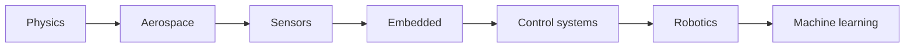

# THE ULTIMATE ENGINEER ROADMAP

The order to learn things in, and what depends on what.

Home: [[ULTIMATE ENGINEER]]

---

## The spine

That's the default order. But it is **not** a queue you must finish — see the three tracks below.

---

## The three tracks

Most people should pick a track and go deep, borrowing from the others as needed.

### Track A — Data / ML platform

> Mathematics → Programming → Databases → Data Engineering → ML → Deep Learning → MLOps → Cloud

Already built out in depth: **[[Data Engineering]]**. Start there, not here.

### Track B — Intelligent machines (embedded → robotics → aerospace)

> Mathematics → C/C++ → Embedded → Control Systems → Robotics → Computer Vision → RL → Aerospace

The one your [[Hardware]] and [[Embedded]] notes already start.

### Track C — Research

> Mathematics (deep) → Deep Learning → PyTorch → a domain (CV / RL / NLP) → ML Research

---

## Stage by stage

| # | Stage | Prerequisites | Why it comes here |
|---|---|---|---|
| 02 | [[02 — MATHEMATICS]] | None | Linear algebra *is* neural networks; calculus *is* backprop |
| 03 | [[03 — PROGRAMMING]] | None | [[Languages]] — Python first, then C, C++, Rust |
| 04 | [[04 — COMPUTER SCIENCE]] | 03 | Data structures, algorithms, OS, networking |
| 05 | [[05 — SOFTWARE ENGINEERING]] | 03, 04 | How to write code that survives contact with other people |
| 06 | [[06 — DATABASES]] | 03 | Everything stores state somewhere |
| 07 | [[07 — DATA ENGINEERING]] | 06 | No data, no ML |
| 08 | [[08 — MACHINE LEARNING]] | 02, 07 | Classical ML before deep learning — it usually wins on tabular data |
| 09 | [[09 — DEEP LEARNING]] | 08, calculus | The maths of learning |
| 10 | [[10 — PYTORCH]] | 09 | The tool that implements it |
| 11 | [[11 — COMPUTER VISION]] | 10 | First applied domain |
| 12 | [[12 — REINFORCEMENT LEARNING]] | 10, 22 | Needs control theory to be useful |
| 13 | [[13 — ML ENGINEERING]] | 10, 05 | Making a model into a system |
| 14 | [[14 — MLOPS]] | 13 | Keeping it alive |
| 15-18 | [[15 — FASTAPI]] · [[16 — DOCKER]] · [[17 — KUBERNETES]] · [[18 — TERRAFORM]] | 05 | The delivery layer |
| 19 | [[19 — CLOUD]] | 15-18 | Four stacks, one architecture |
| 20 | [[20 — EMBEDDED]] | C/C++ | Where software meets physics |
| 21 | [[21 — ROBOTICS]] | 20, 22 | Sensing, planning, acting |
| 22 | [[22 — CONTROL SYSTEMS]] | 02 (calculus) | The maths of making things behave |
| 23 | [[23 — AEROSPACE]] | 20, 21, 22 | The hardest integration of all of it |
| 24 | [[24 — SCIENTIFIC COMPUTING]] | 02, 03 | NumPy, numerical stability, simulation |
| 25 | [[25 — OBSERVABILITY]] | 05 | You cannot fix what you cannot see |
| 26 | [[26 — SECURITY]] | 04, 05 | Assume someone hostile is reading |
| 27 | [[27 — ML RESEARCH]] | 09, 10 | Reading, reproducing, publishing |

---

## The dependency graph that actually matters

Not the folder order — the *conceptual* one:

---

## How to use this

1. Pick a track.
2. Find the lowest stage you can't confidently explain to someone else.
3. Read that stage's notes.
4. Build the matching project in [[28 — PROJECTS]].
5. Move up one.

> **The rule: never learn a stage without building something with it.** Reading about Kafka teaches you the vocabulary. Debugging a consumer group that stopped consuming teaches you Kafka.
