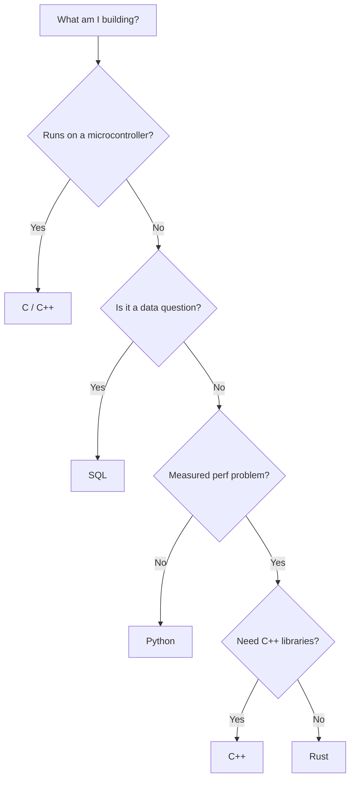

# 03 — PROGRAMMING

> Python, C, C++, Rust, SQL, Bash — and when to reach for which.

**Why it matters:** One language is a hammer. Several let you pick the right tool: Python to think in, C for hardware, Rust for safe speed, SQL for data, Bash to glue it together.

Home: [[ULTIMATE ENGINEER]] · Roadmap: [[THE ULTIMATE ENGINEER ROADMAP]]

---

## The languages

| Language | Existing notes | Use for |
|---|---|---|
| **Python** | [[Python]] · [[Python libraries]] | Everything by default. Orchestration, ML, APIs. |
| **C** | [[C]] · [[C libraries]] | Embedded, hardware registers, tiny footprints ([[20 — EMBEDDED]]) |
| **C++** | [[C++]] · [[C++ libraries]] · [[C++ for this stack]] | LibTorch, ONNX Runtime, CUDA, robotics |
| **Rust** | [[Rust]] · [[Rust for this stack]] | Fast safe services and ingestion ([[Actix Web]]) |
| **SQL** | [[SQL]] · [[SQL fundamentals]] | Anything touching a database |
| **Bash** | [[Bash]] · [[Command reference]] | Glue, CI, servers |

## For each language, cover

Syntax · variables · types · memory model · control flow · functions · modules · classes/structs · error handling · concurrency · networking · file I/O · testing · package management · build system · debugging · performance · security · when to use · when not to · comparison with the others

## Choosing

> Read [[When to leave Python]] before rewriting anything for speed. Most "Python is slow" is a Python loop around a fast library.

## Related
[[Languages]] · [[04 — COMPUTER SCIENCE]] · [[Systems performance]]
