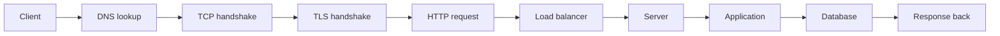

# 04 — COMPUTER SCIENCE

> Data structures, algorithms, operating systems, networking.

**Why it matters:** This is what separates someone who can use a framework from someone who can debug one. Every performance problem and every distributed-systems bug traces back to something here.

Home: [[ULTIMATE ENGINEER]] · Roadmap: [[THE ULTIMATE ENGINEER ROADMAP]]

---

## References

**[[Algorithms and data structures reference]]** — complexity tables, code, when to use each.

**[[Networking reference]]** — TCP/UDP, HTTP, DNS, TLS, ports, container networking, diagnostics.

## Data structures

Arrays · lists · linked lists · stacks · queues · hash tables · trees · binary trees · BSTs · heaps · graphs · tries · sets · maps

For each: simple explanation, visual, code, complexity, real-world use.

## Algorithms

Searching · sorting · recursion · dynamic programming · greedy · graph algorithms · BFS · DFS · shortest paths · Dijkstra · A* · complexity analysis · Big O

> **Big O in one line:** how the time grows as the input grows. O(n) means double the data, double the time. O(n²) means double the data, **four times** the time. That difference is why [[When to leave Python]] says algorithms beat languages.

## Operating systems

Processes · threads · scheduling · memory · virtual memory · filesystems · system calls · permissions · drivers · kernels · Linux · IPC · containers

> Containers are an OS feature, not a virtual machine — namespaces and cgroups. Understanding that makes [[Docker deep dive]] obvious instead of magic.

## Networking

IP · TCP · UDP · HTTP · HTTPS · DNS · TLS · ports · sockets · routing · NAT · firewalls · load balancers · reverse proxies · REST · gRPC · WebSockets · [[MQTT]]

### What happens when you type a URL

Every hop can fail differently. Knowing the chain is how you debug ([[_Troubleshooting template]]).

## Related
[[03 — PROGRAMMING]] · [[05 — SOFTWARE ENGINEERING]] · [[26 — SECURITY]] · [[17 — KUBERNETES]]
