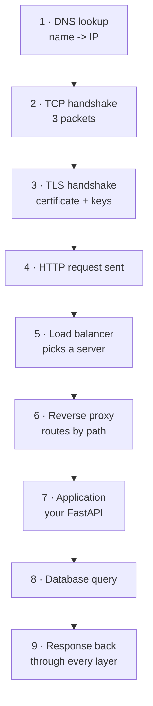

# Networking reference

What actually happens when one computer talks to another. Section: [[04 — COMPUTER SCIENCE]]

---

## The layers

| Layer | Job | Examples |
|---|---|---|
| **Application** | The actual conversation | HTTP, MQTT, gRPC, DNS |
| **Transport** | Reliable (or not) delivery between programs | TCP, UDP |
| **Network** | Getting packets between machines | IP, routing |
| **Link** | One physical hop | Ethernet, WiFi |

> **You work at the top two.** The bottom two matter when things break in ways that make no sense.

---

## TCP vs UDP

| | TCP | UDP |
|---|---|---|
| Connection | Handshake first | None — just send |
| Delivery | Guaranteed, retried | Best effort, may vanish |
| Order | Guaranteed | Not guaranteed |
| Speed | Slower | Faster |
| Use | HTTP, SQL, Kafka, MQTT | Video, games, telemetry, DNS |

**The TCP handshake** — three round trips before any data:

```
Client              Server
  |---- SYN -------->|
  |<--- SYN-ACK -----|
  |---- ACK -------->|
  |=== data ========>|
```

> **This is why connection pooling matters.** Each new database connection pays the handshake (plus TLS — another 1-2 round trips). At 50ms each, opening a connection per request adds 150ms before you do any work ([[Azure SQL Database]]).

> **MAVLink telemetry uses UDP** ([[Project 010 — Advanced Aerospace Intelligent System]]) — a dropped packet at 50Hz doesn't matter, and you don't want retransmissions delaying fresh data.

---

## What happens when you request a URL



**Where the time actually goes:**

| Step | Typical | Fix if slow |
|---|---|---|
| DNS | 0-100ms | Cached after first lookup |
| TCP handshake | 1 RTT (~20-50ms) | Keep-alive, connection pooling |
| TLS handshake | 1-2 RTT | Session resumption, HTTP/2 |
| App processing | Yours | Profile it |
| **Database** | **5-50ms** | **Usually the real bottleneck** |

> **When your API feels slow, it is almost never inference.** Measure per stage ([[Observability for data and ML pipelines]]) — the database and the network dominate ([[Deployment patterns]]).

---

## DNS

Translates `api.example.com` into `20.108.4.12`.

| Record | Means |
|---|---|
| **A** | Name → IPv4 |
| AAAA | Name → IPv6 |
| **CNAME** | Name → another name (alias) |
| MX | Mail server |
| TXT | Arbitrary text — domain verification, SPF |

```bash
dig api.example.com          # full detail
nslookup api.example.com     # simpler
host api.example.com
```

> **DNS caching causes "it works on my machine".** A record changed but your machine cached the old IP for the TTL. `dig` shows the TTL; that's your answer.

---

## Ports

| Port | Service |
|---|---|
| 22 | SSH |
| 80 | HTTP |
| **443** | HTTPS |
| 1433 | SQL Server / Azure SQL |
| **1883** | MQTT (plain) |
| 8883 | MQTT over TLS |
| **5432** | PostgreSQL |
| 6379 | Redis |
| **8000/8080** | Dev HTTP (FastAPI) |
| 8501 | Streamlit |
| **9092** | Kafka |
| 9000/9001 | SeaweedFS API / console |
| 5000 | MLflow |
| 3000 | Grafana |
| 9090 | Prometheus |

```bash
ss -tlnp                     # what's listening (Linux)
netstat -ano | findstr :8000 # Windows
lsof -i :8000                # macOS/Linux - what's using this port
nc -zv host 5432             # can I reach it?
curl -v https://host/health  # full request/response detail
```

---

## HTTP

### Methods

| Method | Meaning | Body | Safe to repeat? |
|---|---|---|---|
| `GET` | Read | No | ✅ Yes |
| `POST` | Create / act | Yes | ❌ No |
| `PUT` | Replace entirely | Yes | ✅ Yes (idempotent) |
| `PATCH` | Partial update | Yes | Usually |
| `DELETE` | Remove | No | ✅ Yes |

> **A `GET` that changes data is a bug.** Browsers, proxies and caches all assume `GET` is harmless and may repeat it without asking.

### Status codes

| Code | Meaning | Whose fault |
|---|---|---|
| 200 | OK | — |
| 201 | Created | — |
| 204 | No content | — |
| **400** | Malformed request | Caller |
| **401** | Not authenticated — *who are you?* | Caller |
| **403** | Authenticated but forbidden — *we know, and no* | Caller |
| 404 | Not found | Caller |
| **422** | Validation failed | Caller — **FastAPI's Pydantic errors** |
| 429 | Rate limited | Caller |
| **500** | Server crashed | **You** |
| 502 | Bad gateway — upstream broken | Infrastructure |
| 503 | Unavailable — starting or overloaded | You |
| 504 | Gateway timeout — upstream too slow | You |

> **4xx = caller's fault, 5xx = yours.** Returning 500 for bad input means you're blaming the user for your missing validation ([[FastAPI fundamentals]]).

### Headers worth knowing

```http
Content-Type: application/json
Authorization: Bearer <token>
Accept: application/json
Cache-Control: no-cache
X-Request-ID: abc-123          # trace correlation
```

---

## TLS / HTTPS

1. Client says hello, lists supported ciphers
2. Server sends its **certificate** (signed by a CA)
3. Client verifies the signature chain
4. They agree a shared symmetric key
5. Everything after is encrypted

| Problem | Cause |
|---|---|
| "certificate has expired" | Literally that — renew it |
| "self-signed certificate" | Not signed by a trusted CA |
| "hostname mismatch" | Cert is for a different domain |
| Works in curl, fails in Python | Different CA bundle — `certifi` |

> **Certificate expiry is a classic 3am outage** and a perfect example of "what changed? — time did" from [[_Troubleshooting template]].

---

## The container networking rules

The three that cause most problems:

**1. `localhost` inside a container means *that container*.** Not your machine, not another container.

**2. Containers on a network find each other by service name** — `http://api:8000`, not `http://localhost:8000`.

**3. Your app must bind `0.0.0.0`, not `127.0.0.1`.** Binding to localhost means "reachable only from inside this container" — publishing the port won't help.

```
-p 8000:8000      # HOST:CONTAINER
```

Full detail: [[Docker deep dive]].

---

## Load balancers and reverse proxies

| Thing | Does |
|---|---|
| **Load balancer** | Spreads requests across identical servers |
| **Reverse proxy** | Routes by path/host; terminates TLS; caches |
| **API gateway** | Reverse proxy + auth + rate limiting + metrics |
| **CDN** | Caches static content near users |

In Kubernetes: a **Service** is the internal load balancer, an **Ingress** is the reverse proxy ([[Kubernetes and AKS]]).

---

## Protocol comparison

| Protocol | Transport | Use | Note |
|---|---|---|---|
| **HTTP/REST** | TCP | APIs, browsers | Universal, human-readable |
| **gRPC** | TCP/HTTP2 | Service-to-service | Binary, fast, typed, streaming |
| **WebSockets** | TCP | Live bidirectional | Chat, live dashboards |
| **MQTT** | TCP | IoT devices | Tiny header, pub/sub ([[MQTT]]) |
| **Kafka protocol** | TCP | Event streaming | Durable log ([[Kafka]]) |

---

## Diagnostic commands

```bash
ping host                      # is it reachable at all (ICMP)
traceroute host                # which hops, and where it stalls
dig name                       # DNS
curl -v https://host/path      # full HTTP exchange
curl -w "@curl-format.txt" ... # timing breakdown per stage
nc -zv host port               # is the port open
ss -tlnp                       # what am I listening on
tcpdump -i any port 5432       # packet-level (last resort)
openssl s_client -connect host:443   # inspect the certificate
```

> **Diagnose in this order:** DNS resolves? → port reachable? → TLS valid? → HTTP responds? → application logic. Each step rules out a whole layer ([[_Troubleshooting template]]).

## Related

[[04 — COMPUTER SCIENCE]] · [[Algorithms and data structures reference]] · [[Docker deep dive]] · [[Kubernetes and AKS]] · [[26 — SECURITY]] · [[MQTT]] · [[FastAPI fundamentals]]
