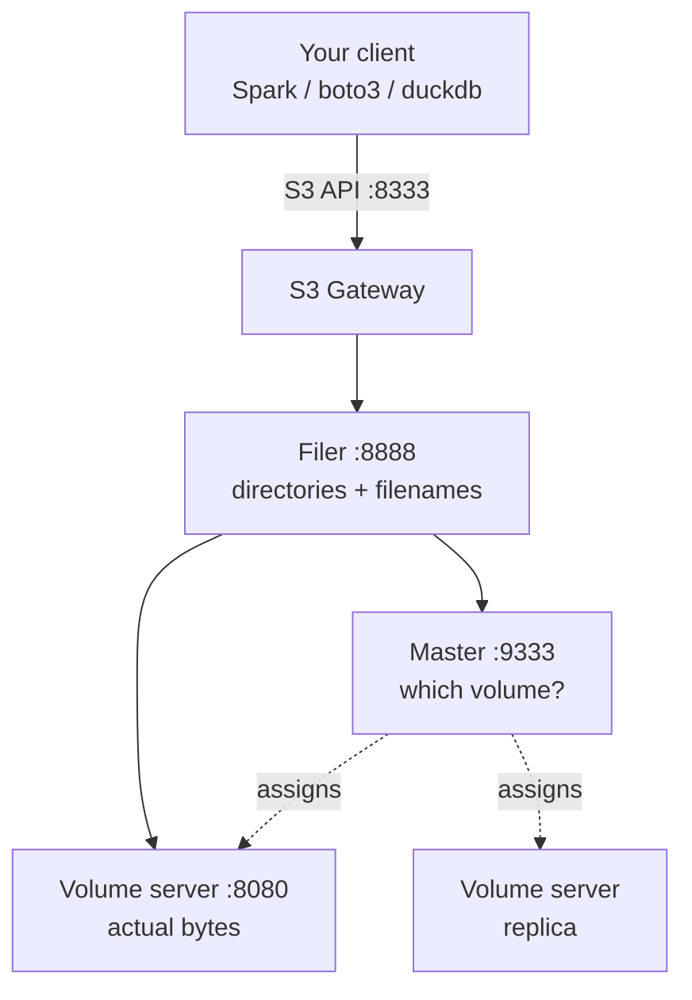

# SeaweedFS

Template: [[_Dictionary template]] · Section: [[07 — DATA ENGINEERING]]

**This is the object-storage layer of the local stack.** Everything that would sit in Blob Storage / S3 / GCS in the cloud sits here on your own machine.

---

> **Want the hands-on version?** [[Using SeaweedFS]] — buckets explained, running it on WSL, every command, and saving PySpark DataFrames into it.

## One sentence

SeaweedFS is a fast distributed object store that speaks the S3 API, built so that billions of *small* files stay quick.

## In simple words

Think of a huge warehouse.

**Most object stores** keep an index card for every single item. Ten items, fine. Ten billion items, and just *finding* the card takes longer than fetching the item.

**SeaweedFS** groups items into large crates ("volumes") and remembers only which crate each item is in — a much smaller index that stays in memory. One lookup, one disk read, whatever the scale.

That design choice is the whole point: it's built for **many small files**, which is exactly what a data lake full of Parquet parts and a lake full of sensor readings actually looks like.

## The problem it solves

You need somewhere to put raw files: CSVs, Parquet, Delta tables, model artifacts, images.

A normal filesystem breaks down because:
- One machine's disk fills up
- One machine dies and the data goes with it
- Millions of files in a directory make listing unbearably slow
- Nothing else on the network can reach it cleanly

An object store fixes all four: it spreads across machines, replicates, scales to billions of objects, and speaks HTTP so anything can read it.

**Why SeaweedFS specifically over MinIO** (the usual default):

| | SeaweedFS | MinIO |
|---|---|---|
| Designed for | **Billions of small files** | Large objects |
| Small-file performance | O(1) disk seek — index is in memory | Degrades as object count grows |
| Architecture | Master + volume servers + filer + S3 gateway | Single-layer, simpler |
| Licence | **Apache 2.0** | AGPL v3 |
| Operational simplicity | More moving parts | Simpler |
| S3 compatibility | Very good | Excellent |

> **The licence is a real consideration, not a footnote.** MinIO is AGPL v3, which has obligations if you distribute software built around it. SeaweedFS is Apache 2.0. For anything you might ship, that difference matters.

> **The small-file argument is the technical one.** A bronze layer written by Spark is thousands of Parquet part-files; a sensor pipeline is millions of tiny objects. That is precisely the workload SeaweedFS is designed for.

## How it works

Four components. In development they run as one process; in production they scale separately.



| Component | Port | Job |
|---|---|---|
| **Master** | 9333 | Tracks volumes, assigns file IDs, handles replication policy |
| **Volume server** | 8080 | Stores the actual bytes in large append-only volume files |
| **Filer** | 8888 | Adds directories and filenames on top (S3 needs this) |
| **S3 gateway** | 8333 | Translates S3 API calls into filer operations |

**The key mechanism:** a file gets an ID like `3,01637037d6`. The `3` is the volume; the rest is an offset within it. The master keeps only volume→server mapping in memory — tiny. The volume server seeks straight to the offset. **One disk read, regardless of how many files exist.**

## Important vocabulary

| Term | Meaning |
|---|---|
| **Volume** | A large (default 30GB) append-only file holding many objects |
| **File ID** | `volume,offset_cookie` — how SeaweedFS addresses a blob |
| **Master** | Assigns file IDs and tracks volume locations |
| **Filer** | Maps paths (`/bronze/data.parquet`) to file IDs |
| **Bucket** | S3 bucket — a top-level directory in the filer |
| **Replication** | `000` = none, `001` = one replica, `010` = another rack, `100` = another DC |
| **Collection** | A named group of volumes, e.g. one per bucket |

## Code

### Level 1 — one container, everything

```bash
docker run -d --name seaweedfs \
  -p 9333:9333 -p 8080:8080 -p 8888:8888 -p 8333:8333 \
  -v seaweed:/data \
  chrislusf/seaweedfs:latest \
  server -dir=/data -s3 -s3.port=8333 -filer -master.volumeSizeLimitMB=1024
```

That single command gives you a working S3 endpoint at `http://localhost:8333`.

### Level 2 — Docker Compose with credentials

```yaml
services:
  seaweedfs:
    image: chrislusf/seaweedfs:latest
    command: >
      server -dir=/data -s3 -s3.port=8333 -s3.config=/etc/seaweedfs/s3.json
      -filer -master.volumeSizeLimitMB=1024 -volume.max=0
    ports:
      - "9333:9333"    # master UI
      - "8080:8080"    # volume
      - "8888:8888"    # filer
      - "8333:8333"    # S3 API   <- this is the one you use
    volumes:
      - seaweed_data:/data
      - ./s3.json:/etc/seaweedfs/s3.json:ro
    healthcheck:
      test: ["CMD", "wget", "-qO-", "http://localhost:9333/cluster/status"]
      interval: 10s
      retries: 10

volumes:
  seaweed_data:
```

```json
// s3.json - identities and permissions
{
  "identities": [
    {
      "name": "engine",
      "credentials": [
        { "accessKey": "engineadmin", "secretKey": "engineadmin" }
      ],
      "actions": ["Admin", "Read", "Write", "List", "Tagging"]
    }
  ]
}
```

> **Without `-s3.config`, the S3 gateway is wide open — anonymous read and write.** Fine for a laptop; never expose it. See Security below.

### Level 3 — using it

```bash
# create buckets with the AWS CLI
aws --endpoint-url http://localhost:8333 s3 mb s3://bronze
aws --endpoint-url http://localhost:8333 s3 mb s3://silver
aws --endpoint-url http://localhost:8333 s3 mb s3://gold

aws --endpoint-url http://localhost:8333 s3 cp data.csv s3://bronze/raw/
aws --endpoint-url http://localhost:8333 s3 ls s3://bronze/raw/
```

```python
# boto3
import boto3
s3 = boto3.client("s3",
    endpoint_url="http://localhost:8333",
    aws_access_key_id="engineadmin",
    aws_secret_access_key="engineadmin")
s3.upload_file("data.csv", "bronze", "raw/data.csv")
```

### Level 4 — Spark + Delta on SeaweedFS

The configuration that makes the whole local lakehouse work:

```python
from pyspark.sql import SparkSession

spark = (SparkSession.builder
    .appName("local-lakehouse")
    .master("local[*]")
    .config("spark.jars.packages",
            "io.delta:delta-spark_2.12:3.2.0,"
            "org.apache.hadoop:hadoop-aws:3.3.4,"
            "com.amazonaws:aws-java-sdk-bundle:1.12.262")
    .config("spark.sql.extensions", "io.delta.sql.DeltaSparkSessionExtension")
    .config("spark.sql.catalog.spark_catalog", "org.apache.spark.sql.delta.catalog.DeltaCatalog")
    # ---- point Spark's S3 client at SeaweedFS ----
    .config("spark.hadoop.fs.s3a.endpoint", "http://localhost:8333")
    .config("spark.hadoop.fs.s3a.access.key", "engineadmin")
    .config("spark.hadoop.fs.s3a.secret.key", "engineadmin")
    .config("spark.hadoop.fs.s3a.path.style.access", "true")          # <- REQUIRED
    .config("spark.hadoop.fs.s3a.connection.ssl.enabled", "false")    # local, no TLS
    .config("spark.hadoop.fs.s3a.impl", "org.apache.hadoop.fs.s3a.S3AFileSystem")
    .config("spark.sql.shuffle.partitions", "4")
    .getOrCreate())

df.write.format("delta").mode("overwrite").save("s3a://bronze/engine_telemetry/")
```

> **`path.style.access=true` is mandatory.** Real S3 uses `bucket.host/key` (virtual-hosted). SeaweedFS uses `host/bucket/key` (path-style). Without this you get DNS resolution errors that look nothing like a configuration problem.

## What happens under the hood

When you `PUT` an object:

1. The **S3 gateway** receives the request and passes the path to the **filer**.
2. The filer asks the **master**: "where can I write?" The master replies with a file ID and volume server, honouring the replication policy.
3. The filer streams the bytes to the **volume server**, which **appends** them to a volume file and returns the offset.
4. The volume server replicates to other volume servers if replication is configured.
5. The filer stores the mapping `path → file ID` in its metadata store.

When you `GET`:

1. Filer looks up `path → file ID`.
2. Master (cached) says which server holds that volume.
3. Volume server seeks directly to the offset. **One read.**

> **Why this is fast:** it's append-only sequential writes, and the lookup index is small enough to stay in memory. It's the same reason Kafka is fast ([[Kafka]]) — do the simplest possible thing with the hardware.

## When to use it

- The local/self-hosted object-storage layer of a lakehouse
- Workloads with very many small files
- You want the S3 API without AWS
- Licence matters (Apache 2.0)
- Edge or on-premise deployments

## When NOT to use it

| Situation | Use instead |
|---|---|
| You're on Azure/AWS/GCP already | Their native store — managed, durable, integrated |
| You need a filesystem, not objects | NFS, or a local disk |
| You need queries, not files | PostgreSQL ([[06 — DATABASES]]) |
| Small data on one machine | Just use the disk |
| You want the simplest possible S3 | MinIO is fewer moving parts |

## Common mistakes

| Mistake | What happens | Fix |
|---|---|---|
| Missing `path.style.access` | Confusing DNS errors from Spark | Set it `true` |
| No `-s3.config` | Anonymous read/write to everything | Provide identities |
| Volume size too large for a laptop | Disk pre-allocation surprises | `-master.volumeSizeLimitMB=1024` |
| Forgetting the filer | S3 gateway won't start | S3 requires `-filer` |
| Using port 8080 as the S3 endpoint | That's the volume server | S3 is **8333** |
| No replication in "production" | One disk failure loses data | `-defaultReplication=001` or higher |
| Deleting volume files by hand | Corrupt index | Use the API |

## Debugging

1. **Is the cluster healthy?** `curl http://localhost:9333/cluster/status`
2. **Is the S3 gateway up?** `curl http://localhost:8333` — should give an S3-style XML response
3. **Can the CLI see buckets?** `aws --endpoint-url http://localhost:8333 s3 ls`
4. **Master UI** at `http://localhost:9333` shows volumes, free space, topology
5. **Filer UI** at `http://localhost:8888` browses the directory tree
6. **Spark can't connect?** It's `path.style.access` or the endpoint port, ~90% of the time

## Performance

| Knob | Effect |
|---|---|
| `-master.volumeSizeLimitMB` | Volume size. Smaller = more volumes = bigger index. |
| `-volume.max` | Volumes per server (`0` = unlimited by count) |
| `-defaultReplication` | `000` fastest, `001`+ safer |
| Multiple volume servers | Parallel throughput |
| `-volume.index=leveldb` | Lower memory for very large deployments |

> Compaction matters: deleted objects leave gaps in volume files. SeaweedFS reclaims them in the background, but a heavy delete workload needs monitoring.

## Security

| Concern | Mitigation |
|---|---|
| **S3 gateway is anonymous by default** | `-s3.config` with identities |
| No TLS by default | Terminate TLS at a reverse proxy, or configure certs |
| Master/filer/volume ports exposed | Only expose 8333; firewall the rest |
| No encryption at rest by default | Encrypt the underlying disk |

> **Only the S3 port (8333) should ever be reachable from outside the host.** The master, filer and volume ports are internal machinery.

## Alternatives

| Alternative | Choose it when |
|---|---|
| **MinIO** | You want the simplest S3-compatible store and AGPL is fine |
| **Ceph / RADOS** | Full storage platform — object, block *and* file |
| **Garage** | Very lightweight, geo-distributed, Apache-friendly |
| Plain filesystem | Single machine, small data |

## Cloud equivalents

| Local | Azure | AWS | GCP |
|---|---|---|---|
| **SeaweedFS** | Blob Storage / [[ADLS Gen2]] | S3 | Cloud Storage |

The path prefix is the only thing your pipeline code should need to change:

```python
LAKE = "s3a://bronze"                                          # SeaweedFS (local)
LAKE = "abfss://bronze@store.dfs.core.windows.net"             # Azure
LAKE = "s3a://my-bronze-bucket"                                # AWS
LAKE = "gs://my-bronze-bucket"                                 # GCP
```

> Put the lake root in config, never hardcode it. See [[Running the whole stack locally]].

## Real-world use

Large-scale photo and video storage · CDN origins · edge and on-prem data lakes · IoT/sensor archives ([[20 — EMBEDDED]]) · anywhere object counts run into the billions

## Prerequisites

[[16 — DOCKER]] · [[Networking reference]] · [[07 — DATA ENGINEERING]]

## Learning progression

- **Beginner:** run the all-in-one container, create a bucket, upload a file
- **Intermediate:** S3 credentials, Spark + Delta against it, replication
- **Advanced:** separate master/volume/filer, tiered storage, cloud tiering, erasure coding
- **Research:** log-structured storage, small-file indexing, distributed consensus

## Practical project

[[Project 003 — Distributed Sensor Pipeline]] — Kafka to Spark to Delta on SeaweedFS.

## Related

[[07 — DATA ENGINEERING]] · [[Running the whole stack locally]] · [[Databricks and Delta Lake]] · [[PySpark core]] · [[ADLS Gen2]] · [[Cloud comparison dictionary]] · [[Kafka]] · [[16 — DOCKER]]
