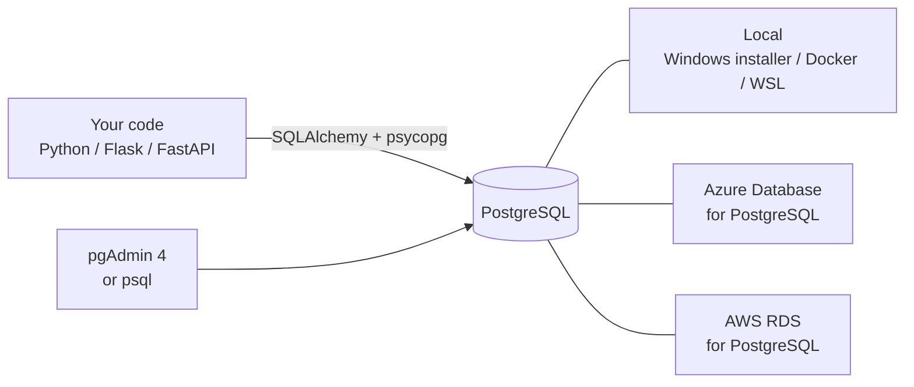

# PostgreSQL

**The database to reach for first.** PostgreSQL ("Postgres") stores your data in tables, keeps it safe when many people change it at once, and does far more than most databases: JSON, full-text search, AI vectors, geography. It's free, and it runs on your laptop, in Docker, and on every cloud.

Section: [[06 — DATABASES]] · Files instead of rows: [[Object storage]]

---

## Read these in order

| # | Note | You'll learn |
|---|---|---|
| 1 | **[[pgAdmin 4]]** | The point-and-click app: connect, browse tables, run SQL, import CSVs, back up |
| 2 | **[[PostgreSQL data types]]** | Every type, which to use — and why money is `numeric` and times are `timestamptz` |
| 3 | [[SQL fundamentals]] | Standard SQL: joins, grouping, window functions, query plans |
| 4 | **[[PostgreSQL SQL]]** | What Postgres adds: upserts, `RETURNING`, `DISTINCT ON`, JSONB, full-text search, indexes, permissions |
| 5 | **[[PostgreSQL with SQLAlchemy]]** | Using it from Python — connecting, Postgres types, upserts, bulk loads, async |
| 6 | [[Data modeling]] | Designing tables that stay correct as the data grows |
| ★ | **[[PostgreSQL reference]]** | The quick lookup — `psql` commands, admin queries, backup, troubleshooting |

**In the cloud:**

| Where | Note |
|---|---|
| Azure | **[[Azure Database for PostgreSQL]]** — Flexible Server |
| AWS | **[[AWS RDS for PostgreSQL]]** |
| Supabase (Postgres + auth + APIs) | [[Supabase]] · [[Supabase reference]] |

> ✅ **The SQL and Python in these notes was run against a real PostgreSQL 18 server**, and the cloud commands were checked against the Azure and AWS CLIs' own help.

---

## How it fits together

**The same SQL, the same Python and the same pgAdmin work against all of them.** Only the host name, username and `sslmode=require` change.

---

## Getting a Postgres to practise on

| Option | Command | Good for |
|---|---|---|
| **Windows installer** | From enterprisedb.com — includes pgAdmin | Easiest on Windows |
| **Docker** | `docker run -d --name pg -e POSTGRES_PASSWORD=secret -p 5432:5432 postgres:18` | Throwaway databases, one per project |
| **WSL / Ubuntu** | `sudo apt install postgresql` then `sudo service postgresql start` | Working inside Linux |
| **Cloud** | [[Azure Database for PostgreSQL]] · [[AWS RDS for PostgreSQL]] | Real apps; costs money |

> **Docker is the tidiest for projects** — each project gets its own clean Postgres, and `docker rm -f pg` throws it away ([[Docker deep dive]]). Connect to it from pgAdmin with host `localhost`, port `5432`.

> ⚠️ **Two Postgres servers can't both use port 5432.** If the Windows installer's service is running and you start Docker with `-p 5432:5432`, one of them fails. Use `-p 5433:5432` for Docker and connect to port 5433.

---

## The five rules

1. **`bigint` or `uuid` for IDs, `numeric` for money, `timestamptz` for times, `text` for text** ([[PostgreSQL data types]])
2. **Every table gets a primary key** — and foreign keys for its relationships
3. **Your app never connects as `postgres` or the cloud admin** — give it its own limited role ([[PostgreSQL SQL]])
4. **Values go into SQL as parameters, never pasted into the string** — f-strings in SQL are SQL injection ([[Security in practice]])
5. **Test restoring a backup** before you need it ([[pgAdmin 4]])

## Related

[[06 — DATABASES]] · [[PostgreSQL reference]] · [[SQL fundamentals]] · [[Data modeling]] · [[SQLAlchemy]] · [[Supabase]] · [[Object storage]] · [[Flask - connecting to a SQL database]]
