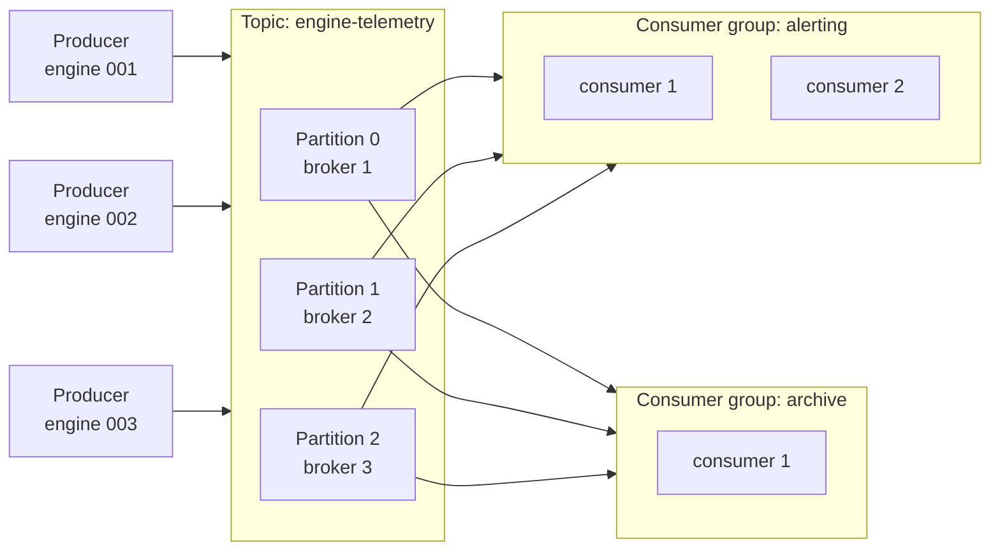

# Kafka

Template: [[_Dictionary template]] · Section: [[07 — DATA ENGINEERING]]

---

## One sentence

Kafka is a distributed system for moving and storing streams of events, so that many programs can read the same data independently and replay it later.

## In simple words

Imagine a giant conveyor belt running through a factory.

Machines drop items onto the belt. Anyone standing beside it can watch the items go past and take a copy — **without removing them**. The belt keeps everything for a week, so if you hire a new inspector on Friday, they can walk back to Monday and see everything they missed.

That's Kafka. The belt is a **topic**. Dropping things on is **producing**. Watching is **consuming**. And crucially — **reading doesn't delete**. That one property is what separates it from a normal queue.

## The problem it solves

Imagine 10,000 aircraft engines, each sending 50 sensor readings per second. That's **500,000 messages a second**.

You want to do four things with that data: store it, run real-time failure detection, feed a dashboard, and archive it for training models later.

**The naive design:** every sensor opens a connection to every consumer. Four consumers × 10,000 sensors = 40,000 connections, and every new consumer means reconfiguring every sensor.

```
BEFORE                              AFTER
sensor ──┬──▶ storage               sensor ──▶ ┌────────┐ ──▶ storage
         ├──▶ alerting                         │ KAFKA  │ ──▶ alerting
         ├──▶ dashboard                        │  log   │ ──▶ dashboard
         └──▶ archive                          └────────┘ ──▶ archive
   N × M connections                        N + M connections
```

**Four specific pains, and how Kafka answers each:**

| Pain | Kafka's answer |
|---|---|
| N producers × M consumers = a connection mess | Everyone talks to Kafka. N + M, not N × M. |
| A consumer goes down and data is lost forever | Kafka **stores** it. The consumer resumes from where it stopped. |
| A slow consumer backs up the producers | Producers write at their own speed; consumers read at theirs. Decoupled. |
| A new consumer can't see historical data | It reads from offset 0 and replays everything. |

> That last one is the killer feature and the reason Kafka isn't just a queue. Deploy a new fraud model on Friday and **replay six months of events through it** before it ever sees live traffic. With a traditional queue, consumed means gone forever.

## How it works

**A Kafka topic is an append-only log file.** That's genuinely it — the rest is distribution and bookkeeping.

Messages get appended to the end. Each gets a sequential number: its **offset**. Nothing is ever modified. Readers track their own position.

```
Topic "engine-telemetry", partition 0:

offset:    0     1     2     3     4     5     6
         ┌────┬────┬────┬────┬────┬────┬────┐
         │ e0 │ e1 │ e2 │ e3 │ e4 │ e5 │ e6 │ ← new events append here
         └────┴────┴────┴────┴────┴────┴────┘
                     ▲              ▲
              consumer-A     consumer-B
              (offset 2)     (offset 5)
```

Consumer A is behind Consumer B. Neither affects the other. Both read the same untouched data.

**Partitions** are how one topic scales beyond one machine. A topic is split into partitions, each living on a different **broker**. More partitions = more parallelism.

> **The critical trade-off: ordering is guaranteed *within* a partition, never across partitions.** Which partition a message lands in is decided by its **key**. Key by `engine_id` and all readings for one engine stay in order. Use no key and you get round-robin — maximum parallelism, no per-engine ordering. **This is the main design decision when you create a topic.**

## Important vocabulary

| Term | Meaning |
|---|---|
| **Event / message** | One record. A key, a value, a timestamp. |
| **Topic** | A named stream. `engine-telemetry`. |
| **Partition** | A slice of a topic. The unit of ordering and parallelism. |
| **Offset** | A message's sequential position in a partition. |
| **Producer** | Writes events. |
| **Consumer** | Reads events. |
| **Consumer group** | Consumers sharing the work of one topic. |
| **Broker** | One Kafka server. |
| **Cluster** | Several brokers. |
| **Replication factor** | How many brokers hold a copy of each partition. |
| **Retention** | How long events are kept. Hours to forever. |
| **Leader / follower** | The replica that handles reads/writes vs. the copies. |

## Architecture



**The consumer group rule — the thing everyone gets wrong:**

- Within **one group**, each partition goes to exactly **one** consumer. The work is *split*.
- Across **different groups**, everyone gets **everything**. The data is *copied*.

So "alerting" and "archive" each see all messages, but the two consumers inside "alerting" split them.

> **The consequence: adding more consumers than partitions does nothing.** With 3 partitions and 5 consumers in a group, 2 sit idle forever. **Partition count is your maximum parallelism**, and it's awkward to increase later (it changes key→partition mapping). Choose it deliberately: a common rule is 2–3× your expected peak consumer count.

## Code

### Level 1 — tiny

```python
from kafka import KafkaProducer, KafkaConsumer
import json

producer = KafkaProducer(
    bootstrap_servers="localhost:9092",
    value_serializer=lambda v: json.dumps(v).encode(),
)
producer.send("engine-telemetry", {"engine_id": "E001", "temp_c": 412.5})
producer.flush()

consumer = KafkaConsumer(
    "engine-telemetry",
    bootstrap_servers="localhost:9092",
    group_id="alerting",
    value_deserializer=lambda v: json.loads(v.decode()),
)
for msg in consumer:
    print(msg.offset, msg.value)
```

### Level 2 — practical

Keyed for ordering, with explicit offset control:

```python
import json
from kafka import KafkaProducer

producer = KafkaProducer(
    bootstrap_servers="localhost:9092",
    key_serializer=lambda k: k.encode(),
    value_serializer=lambda v: json.dumps(v).encode(),
    acks="all",              # wait for all replicas — durability over speed
    retries=5,
    linger_ms=10,            # batch for 10ms — big throughput win
    compression_type="lz4",
)

producer.send(
    "engine-telemetry",
    key=reading["engine_id"],        # ← same engine → same partition → ordered
    value=reading,
)
```

```python
import json
from kafka import KafkaConsumer

consumer = KafkaConsumer(
    "engine-telemetry",
    bootstrap_servers="localhost:9092",
    group_id="alerting",
    enable_auto_commit=False,        # ← commit manually, AFTER the work succeeds
    auto_offset_reset="earliest",
    value_deserializer=lambda v: json.loads(v.decode()),
)

for msg in consumer:
    try:
        handle(msg.value)            # do the work first
        consumer.commit()            # then record that we did it
    except Exception:
        logger.exception("failed at offset %s", msg.offset)
        # don't commit — it will be redelivered
```

> **`enable_auto_commit=False` is the single most important setting here.** With auto-commit on, Kafka records "I've read up to offset 500" on a timer — possibly *before* your code finished processing 500. Crash in between and those messages are silently skipped. Commit **after** the work succeeds, and you get at-least-once delivery.

### Level 3 — production

```python
from kafka import KafkaProducer

producer = KafkaProducer(
    bootstrap_servers=["b1:9092", "b2:9092", "b3:9092"],
    acks="all",
    enable_idempotence=True,         # ← no duplicates on retry
    max_in_flight_requests_per_connection=5,
    retries=2147483647,
    compression_type="lz4",
    linger_ms=20,
    batch_size=32768,
    security_protocol="SASL_SSL",
    sasl_mechanism="PLAIN",
)
```

Consuming with Spark, which is how you'd actually feed a pipeline ([[PySpark core]]):

```python
from pyspark.sql import functions as F

df = (spark.readStream
    .format("kafka")
    .option("kafka.bootstrap.servers", "b1:9092,b2:9092")
    .option("subscribe", "engine-telemetry")
    .option("startingOffsets", "latest")
    .load())

(df.selectExpr("CAST(value AS STRING) as json")
   .select(F.from_json("json", schema).alias("r")).select("r.*")
   .writeStream.format("delta")
   .option("checkpointLocation", "s3a://bronze/_checkpoints/telemetry")   # ← essential
   .trigger(processingTime="1 minute")
   .toTable("bronze.engine_telemetry"))
```

## What happens under the hood

**When a producer sends a message:**

1. The producer **serialises** key and value to bytes.
2. It picks a partition — `hash(key) % num_partitions`, or round-robin if there's no key.
3. The message goes into an in-memory **batch** for that partition (not sent yet — this is what `linger_ms` controls).
4. When the batch fills or the timer expires, it's compressed and sent to that partition's **leader broker**.
5. The leader **appends** it to the partition's log file on disk, and returns an offset.
6. **Follower** brokers pull the record and append it to their copies.
7. Once `acks` replicas confirm, the leader acknowledges to the producer.

> **Why Kafka is fast despite writing to disk:** it only ever *appends* — sequential disk writes are nearly as fast as memory, and vastly faster than random writes. It also uses the OS page cache and `sendfile()` to move data from disk to network **without copying it through userspace** ("zero-copy"). Kafka's speed comes from doing the simplest possible thing with the hardware, not from clever caching.

**When a consumer reads:**

1. It joins its group; the **group coordinator** assigns it partitions (a *rebalance*).
2. It fetches its last committed offset from the internal `__consumer_offsets` topic.
3. It long-polls the leader for messages from that offset.
4. It processes them, then commits the new offset.

## When to use it

- Many producers, many independent consumers of the same data
- You need **replay** — reprocessing history through new logic
- Consumers that fail must resume without data loss
- Buffering a fast producer against a slow consumer
- An event log as the source of truth (event sourcing)
- Sensor / telemetry ingestion at scale ([[20 — EMBEDDED]])

## When NOT to use it

| Situation | Use instead |
|---|---|
| Daily batch is fine | **Just do batch.** Read files on a schedule ([[Deployment patterns]]) |
| You need per-message ack/retry semantics | RabbitMQ, SQS |
| Request/response | HTTP ([[FastAPI fundamentals]]) |
| Small scale, one producer, one consumer | A database table, or Redis |
| You need queries, not a stream | PostgreSQL |
| Tiny devices talking directly | **MQTT** — Kafka clients are too heavy for an ESP32 |

> **Kafka is operationally expensive.** Brokers, ZooKeeper or KRaft, partition planning, retention tuning, monitoring, rebalance storms. **Don't adopt it because it's impressive.** Adopt it when you genuinely have multiple independent consumers or need replay. Most "we need Kafka" is a cron job and a table.

## Common mistakes

| Mistake | What happens | Fix |
|---|---|---|
| Auto-commit on | Messages silently skipped after a crash | `enable_auto_commit=False`, commit after processing |
| More consumers than partitions | Extra consumers idle | Increase partitions, or accept the cap |
| No message key | No per-entity ordering | Key by the entity id |
| Too few partitions | Can never scale consumers | Plan 2–3× peak consumers |
| Too many partitions | Rebalances slow, more open files | Thousands per cluster, not per topic |
| Assuming global ordering | Cross-partition order is undefined | Order is per-partition only |
| Slow processing in the consumer loop | Rebalance storms — Kafka thinks you died | Raise `max.poll.interval.ms`, or hand off to a worker |
| Losing the Spark checkpoint | Reprocesses everything | Back up `checkpointLocation`; never delete it |
| `acks=1` with data you care about | Silent loss if the leader dies | `acks="all"` |
| Treating it as a database | Terrible at lookups | Kafka streams; Postgres queries |

## Debugging

**"My consumer isn't receiving messages."** In this order:

1. **Is data actually in the topic?**
   `kafka-console-consumer --topic X --from-beginning --max-messages 5`
   Nothing? The problem is upstream — it's a producer bug.
2. **What's the consumer group's lag?**
   `kafka-consumer-groups --describe --group alerting`
   `LAG` shows messages behind. `CURRENT-OFFSET` = where you are.
3. **Is the group assigned any partitions?** If `CONSUMER-ID` is empty, nobody's connected. Check `group_id` and connectivity.
4. **Did the offset get committed past the data?** If `CURRENT-OFFSET == LOG-END-OFFSET`, you've already consumed it. Reset with `--reset-offsets --to-earliest`.
5. **Is it rebalancing constantly?** Look for repeated "Revoking/Assigning partitions" in the logs. Means processing is too slow between polls.

> **Reason about it as a chain: produced → stored → assigned → fetched → processed → committed.** Find the first broken link. That framing works for every streaming system, not just Kafka.

## Performance

| Knob | Effect |
|---|---|
| `linger_ms` | Wait to batch. Higher = more throughput, more latency. |
| `batch_size` | Bigger batches, fewer requests |
| `compression_type` | `lz4` fast, `zstd` smaller. Big network saving. |
| `acks` | `0` fastest/unsafe, `1` middle, `all` safest |
| Partitions | The main parallelism lever |
| `fetch.min.bytes` | Consumer waits for this much — fewer, bigger fetches |

A well-tuned cluster does millions of messages/sec. The usual bottleneck is **your consumer's processing**, not Kafka.

## Security

| Concern | Mitigation |
|---|---|
| Anyone can connect | SASL authentication (`SASL_SSL`) |
| Traffic readable on the wire | TLS |
| Any client reads any topic | ACLs per topic per principal |
| Sensitive data in messages | Encrypt the payload; Kafka won't do it for you |
| Data kept too long | Retention policy; GDPR needs compaction or key-level deletion |

> Kafka's default configuration is **wide open**. Authentication, TLS and ACLs are all opt-in. Never expose a default broker to a network you don't control.

## Production considerations

- **Replication factor 3** minimum, `min.insync.replicas=2`
- **Retention** — deliberately chosen; it's your replay window and your storage bill
- **Monitor consumer lag** — the single most important Kafka metric ([[Observability for data and ML pipelines]])
- **Schema Registry** — so a producer changing its payload doesn't break every consumer
- **Rack awareness** so replicas span failure domains
- Modern Kafka uses **KRaft** instead of ZooKeeper; new clusters should use it

## Alternatives

| Alternative | Choose it when |
|---|---|
| **Redpanda** | Kafka API, C++, no JVM, much simpler ops |
| **RabbitMQ** | You need per-message routing and acks, not replay |
| **MQTT** | Tiny devices, unreliable networks ([[20 — EMBEDDED]]) |
| **Pulsar** | Multi-tenancy, tiered storage |
| **Just a database** | Small scale. Genuinely. |

## Cloud equivalents

| Local | Azure | AWS | GCP |
|---|---|---|---|
| Kafka / Redpanda | Event Hubs *(Kafka-compatible)* | Kinesis / MSK | Pub/Sub |

> **Azure Event Hubs speaks the Kafka protocol** — existing Kafka clients connect by changing the connection string. Kinesis and Pub/Sub have their own APIs and different semantics (Kinesis shards ≠ partitions; Pub/Sub doesn't guarantee ordering by default). See [[Cloud comparison dictionary]].

## Real-world use

| Industry | Use |
|---|---|
| **Aerospace** | Engine telemetry ingestion, predictive maintenance ([[23 — AEROSPACE]]) |
| **Automotive** | Fleet telemetry, driver events |
| **Finance** | Trade events, fraud detection, audit logs |
| **Retail** | Clickstream, inventory, order events |
| **Manufacturing** | IoT sensors, production line monitoring |
| **Healthcare** | Device telemetry, HL7 event routing |

## Prerequisites

[[04 — COMPUTER SCIENCE]] (networking, filesystems) · [[05 — SOFTWARE ENGINEERING]] (distributed systems) · [[16 — DOCKER]]

## Learning progression

- **Beginner:** produce and consume from one topic. Understand offsets.
- **Intermediate:** consumer groups, partitioning by key, manual commits, retention.
- **Advanced:** exactly-once semantics, transactions, Kafka Streams, Connect, Schema Registry, rebalance tuning.
- **Research:** log-structured storage, consensus (KRaft/Raft), stream-table duality.

## Practical project

[[Project 003 — Distributed Sensor Pipeline]] — ESP32 → MQTT → Kafka → PySpark → Delta Lake.

## Related

[[07 — DATA ENGINEERING]] · [[PySpark core]] · [[Databricks and Delta Lake]] · [[MQTT]] · [[Adjacent tools you will meet]] · [[Docker deep dive]] · [[Kubernetes and AKS]] · [[Cloud comparison dictionary]] · [[Running the whole stack locally]] · [[Observability for data and ML pipelines]] · [[Deployment patterns]]
