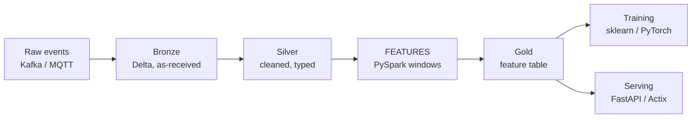

# Feature engineering

**Turning raw data into columns a model can actually learn from.** This is where most of the accuracy comes from — far more than model choice.

Index: [[08 — MACHINE LEARNING]] · Method: [[Classical ML in practice]] · API: [[scikit-learn]] · At scale: [[PySpark reference]]

---

## The idea, plainly

A model can only see the numbers you give it. It has no idea what a "customer" is, that December is Christmas, or that a temperature rising fast matters more than a temperature being high.

**A feature is one column of numbers that carries a clue.**

Raw row:

| customer | order_time | amount |
|---|---|---|
| C1 | 2026-12-24 23:40 | £8.50 |

A model sees `2026-12-24 23:40` as an opaque timestamp — useless. What actually carries signal:

| is_weekend | hour | is_late_night | days_since_last_order | orders_last_30d | amount_vs_their_average |
|---|---|---|---|---|---|
| 0 | 23 | 1 | 2 | 14 | 0.4 |

Same row. Now every column is a clue. **That transformation is the job.**

> **Feature engineering usually beats model tuning.** Going from raw columns to good features moves accuracy far more than swapping LightGBM for a neural network. Spend your time here.

---

## The rule that governs everything

> ⚠️ **A feature must be computable at prediction time, using only information from before the prediction.**

Ask it of every single feature you build:

1. **Will this value exist when I need the prediction?** `final_invoice_amount` doesn't exist when the order is placed.
2. **Does it use the future?** A centred rolling average, or "total orders this customer ever made" computed over the whole dataset including after this row.
3. **Does it leak the answer?** `days_until_failure` when predicting failure.

Fail any of these and you get a model that scores brilliantly offline and is worthless live. See the leakage table in [[Classical ML in practice]].

---

## The feature types

### 1. Numeric transforms

```python
import numpy as np

df["log_amount"] = np.log1p(df["amount"])       # log1p = log(1+x), safe when x is 0
df["amount_sq"] = df["amount"] ** 2             # let a linear model capture a curve
df["price_per_unit"] = df["amount"] / df["qty"].replace(0, np.nan)   # avoid /0
```

| Transform | When |
|---|---|
| `log1p` | Long right tail — money, counts, page views |
| Squaring / polynomial | Linear model, curved relationship |
| **Ratios** | **Almost always worth trying** — `load/rpm`, `spend/income` |
| Binning | The relationship is a step change, not gradual |

> **Ratios and differences carry more signal than raw values.** "£500 spent" means nothing; "£500 spent, which is 4× their normal" means everything.

> **Trees don't need scaling or log transforms** to find a split point — but a *ratio* still helps them, because a tree can't build one from two columns on its own.

### 2. Categorical encoding

```python
import pandas as pd

pd.get_dummies(df, columns=["country"])                    # one-hot: 1 column per value

from sklearn.preprocessing import OneHotEncoder, OrdinalEncoder
OneHotEncoder(handle_unknown="ignore", sparse_output=False) # unseen value -> all zeros, no crash
OrdinalEncoder()                                            # ONLY when genuinely ordered
```

| Cardinality | Use |
|---|---|
| 2–15 values | **One-hot** |
| Genuinely ordered (small/medium/large) | Ordinal |
| 15–1000 values | Target encoding, or leave it to LightGBM's native categorical support |
| Thousands (user IDs) | **Don't encode it — aggregate it instead** (see below) |

> ⚠️ **`handle_unknown="ignore"` is not optional.** A country that appears in production but wasn't in training crashes the encoder at inference. This is one of the most common production ML failures.

> ⚠️ **Target encoding leaks unless you fit it inside the CV fold.** Replacing "France" with "the average target for France" uses the target — computed over the whole training set, it leaks that row's own answer into its feature.

### 3. Time features

```python
import numpy as np

df["hour"] = df["ts"].dt.hour
df["dow"] = df["ts"].dt.dayofweek                    # 0 = Monday in pandas
df["is_weekend"] = df["dow"] >= 5
df["month"] = df["ts"].dt.month
df["days_since_signup"] = (df["ts"] - df["signup"]).dt.days

# cyclical - so 23:00 and 00:00 are CLOSE, not 23 apart
df["hour_sin"] = np.sin(2 * np.pi * df["hour"] / 24)
df["hour_cos"] = np.cos(2 * np.pi * df["hour"] / 24)
```

> **Cyclical encoding matters for anything circular** — hour, day of week, month, wind direction, angle. Without it the model thinks 23:00 and 00:00 are as far apart as possible.

> ⚠️ **Never feed a raw timestamp as a number.** The model learns "bigger number = later date" and cannot extrapolate past the training period — every future prediction is out of range.

### 4. Lag and rolling features — the big ones for time series

```python
g = df.sort_values("ts").groupby("device_id")

df["temp_lag_1"]   = g["temp"].shift(1)                          # the previous reading
df["temp_delta"]   = df["temp"] - df["temp_lag_1"]               # how much it changed
df["temp_mean_24"] = g["temp"].transform(lambda s: s.rolling(24).mean())
df["temp_std_24"]  = g["temp"].transform(lambda s: s.rolling(24).std())
df["temp_max_24"]  = g["temp"].transform(lambda s: s.rolling(24).max())
```

> ⚠️ **Every window must look only backwards.** `rolling(24)` is fine. `rolling(24, center=True)` uses the future and is leakage. `expanding()` is fine. Anything with `shift(-1)` is the future.

> ⚠️ **Sort and group before you shift.** `shift(1)` on an unsorted DataFrame gives you a random other row; without `groupby`, it gives you the previous *device's* reading.

> **The rate of change usually beats the level.** "Temperature rose 15° in an hour" predicts failure; "temperature is 80°" might be normal for that engine.

### 5. Aggregate features — how to use a high-cardinality ID

You can't one-hot 50,000 customer IDs. Instead, **summarise their history**:

```python
hist = orders[orders["ts"] < cutoff]        # ONLY data before the prediction point

agg = hist.groupby("customer_id").agg(
    n_orders=("order_id", "count"),
    avg_amount=("amount", "mean"),
    max_amount=("amount", "max"),
    last_order=("ts", "max"),
).reset_index()

df = df.merge(agg, on="customer_id", how="left")
df["days_since_last"] = (df["ts"] - df["last_order"]).dt.days
df["amount_vs_avg"] = df["amount"] / df["avg_amount"]
```

> ⚠️ **The `cutoff` filter is the whole game.** Aggregating over the entire dataset means the customer's "average order value" includes orders that happen *after* the row you're predicting. That's leakage, and it's the most common way people build a 0.99-scoring useless model.

---

## Doing it in each stack

### pandas — small data, exploration

```python
import pandas as pd, numpy as np

df = df.sort_values(["device_id", "ts"])
g = df.groupby("device_id")
df["temp_delta"] = g["temp"].diff()
df["temp_ma_24"] = g["temp"].transform(lambda s: s.rolling(24, min_periods=1).mean())
```

Best for: under a few million rows, and working out *what* the features should be. See [[pandas]].

### PySpark — production scale

Window functions are how you do lags and rolling windows in Spark:

```python
from pyspark.sql import Window
import pyspark.sql.functions as F

w      = Window.partitionBy("device_id").orderBy("ts")           # per device, in time order
w_roll = w.rowsBetween(-23, 0)                                   # this row + the 23 before it
w_time = (Window.partitionBy("device_id").orderBy(F.col("ts").cast("long"))
                .rangeBetween(-7 * 86400, 0))                    # a true "last 7 days"

feats = (df
    .withColumn("temp_lag_1",  F.lag("temp", 1).over(w))                 # previous reading
    .withColumn("temp_delta",  F.col("temp") - F.col("temp_lag_1"))      # change since then
    .withColumn("temp_ma_24",  F.avg("temp").over(w_roll))               # 24-row moving average
    .withColumn("temp_std_24", F.stddev("temp").over(w_roll))            # 24-row volatility
    .withColumn("temp_max_7d", F.max("temp").over(w_time))               # peak in the last 7 days
    .withColumn("hour",        F.hour("ts"))                             # time-of-day
    .withColumn("hour_sin",    F.sin(2 * F.pi() * F.hour("ts") / 24))    # cyclical encoding
    .withColumn("is_weekend",  F.dayofweek("ts").isin([1, 7]))           # 1=Sun, 7=Sat in Spark
)
```

> **`rowsBetween` counts rows; `rangeBetween` counts values.** With missing hours in your data, `rowsBetween(-23,0)` is "the last 24 readings", not "the last 24 hours". Use `rangeBetween` over a numeric timestamp when you mean actual elapsed time. Full detail in [[PySpark reference]].

**Aggregate features without leakage, in Spark:**

```python
from pyspark.sql import functions as F

hist = orders.filter(F.col("ts") < F.col("cutoff"))      # cut before aggregating
agg = hist.groupBy("customer_id").agg(
    F.count("*").alias("n_orders"),                      # how many orders so far
    F.avg("amount").alias("avg_amount"),                 # their typical order size
    F.max("ts").alias("last_order"),                     # when they last bought
)
df = df.join(F.broadcast(agg), "customer_id", "left")    # broadcast: agg is small
df = df.withColumn("amount_vs_avg", F.col("amount") / F.col("avg_amount"))
```

> ⚠️ **Check your row count before and after that join.** If a customer appears twice in `agg` you silently duplicate rows and every downstream number is wrong.

### scikit-learn — wrap it so it can't leak

```python
from sklearn.pipeline import Pipeline
from sklearn.compose import ColumnTransformer
from sklearn.preprocessing import StandardScaler, OneHotEncoder
from sklearn.impute import SimpleImputer

numeric = ["temp_delta", "temp_ma_24", "days_since_last"]
categorical = ["country", "device_type"]

pre = ColumnTransformer([
    ("num", Pipeline([("impute", SimpleImputer(strategy="median")),   # fill gaps with the median
                      ("scale", StandardScaler())]), numeric),        # mean 0, stddev 1
    ("cat", Pipeline([("impute", SimpleImputer(strategy="most_frequent")),
                      ("onehot", OneHotEncoder(handle_unknown="ignore"))]), categorical),
])

model = Pipeline([("pre", pre), ("clf", LGBMClassifier())])
model.fit(X_train, y_train)          # every step is fitted on the TRAINING FOLD only
```

> **The Pipeline is not a convenience — it's the correctness guarantee.** It makes it structurally impossible for the scaler to see the validation fold during cross-validation. Doing these steps by hand is how leakage creeps in ([[scikit-learn]]).

### Where each belongs in your architecture



| Layer | What happens | Tool |
|---|---|---|
| Bronze | Raw, untouched | [[Databricks and Delta Lake]] |
| Silver | Cleaned, typed, deduplicated | [[PySpark reference]] |
| **Gold / features** | **Windows, lags, aggregates** | **[[PySpark reference]] windows** |
| Training | Fit the model | [[scikit-learn]] · [[Tensors, autograd and the training loop]] |
| Serving | Same features, one row | [[FastAPI reference]] · [[Actix Web]] |

---

## The hardest part: training and serving must match

Your training pipeline computes features over a million rows in Spark. Your API computes them for **one** row in Python. **If those two disagree even slightly, your model degrades silently in production.**

This is called **training–serving skew**, and it's the number one cause of "it worked in the notebook".

### How it goes wrong

| Cause | Effect |
|---|---|
| Spark used the median, the API uses the mean to fill nulls | Systematic bias |
| Training rounded to 2dp, serving didn't | Small constant shift |
| Column order differs between fit and predict | **Plausible, completely wrong output** |
| Spark's `dayofweek` (1=Sunday) vs pandas' (0=Monday) | Every weekday feature is wrong |
| Training saw a category, serving sends a new one | Crash, or silent all-zeros |

### The three defences

**1. Ship the preprocessing inside the model artifact.**

```python
import joblib
joblib.dump(model, "model.joblib")     # the whole Pipeline: imputers, encoders, scaler, model
```

> **Save the pipeline, never the bare estimator.** Then the API cannot use a different scaler, because it doesn't have one — it just calls `.predict()` ([[Model export and serving]]).

**2. Write down the contract, and assert it.**

```python
import pandas as pd

FEATURE_ORDER = ["temp_delta", "temp_ma_24", "days_since_last", "hour_sin"]

def to_frame(req) -> pd.DataFrame:
    row = {f: getattr(req, f) for f in FEATURE_ORDER}     # explicit order, every time
    return pd.DataFrame([row], columns=FEATURE_ORDER)     # columns= pins the order
```

> ⚠️ **Wrong feature order does not raise an error.** The model happily predicts on temperature-as-humidity and returns a confident, meaningless number. Pin the order explicitly, and store `FEATURE_ORDER` alongside the model file.

**3. One definition, used by both paths.**

The cleanest version is a **feature table**: Spark computes features on a schedule and writes them to a store the API reads by key.

```python
# batch job, hourly
features.write.format("delta").mode("overwrite") \
    .option("replaceWhere", f"date = '{run_date}'").save(FEATURE_PATH)
```

```python
# API - looks up, does NOT recompute
row = await db.fetch_one("SELECT * FROM features WHERE device_id = :id", {"id": device_id})
```

> **This is what a "feature store" is.** Not necessarily a product — a table, written by one job, read by both training and serving. That single shared definition eliminates the entire skew category.

> **The trade-off is freshness.** Precomputed features are as old as the last batch run. For features that must be real-time (the last 5 minutes of readings), compute them in the request and accept the duplication — but then **test both paths produce the same number on the same input**.

---

## Choosing which features to keep

```python
from sklearn.inspection import permutation_importance
r = permutation_importance(model, X_val, y_val, n_repeats=10, random_state=42)

import pandas as pd
pd.Series(r.importances_mean, index=X_val.columns).sort_values(ascending=False).head(20)
```

```python
corr = X.corr().abs()                                   # find near-duplicate features
high = [(a, b) for a in corr for b in corr if a < b and corr.loc[a, b] > 0.95]
```

> **Read your top features and ask whether they make sense.** If `row_id`, `customer_id` or a timestamp is your strongest feature, you have leakage or a sorted dataset — not a model.

> **Drop features that are ~0.95+ correlated with another.** They add compute and noise without adding information, and they make importance scores misleading by splitting credit between duplicates.

> **More features is not better.** Each one is another thing to compute at serving time, another thing that can drift, another chance for a null. A model with 15 well-chosen features usually beats one with 200 scraped together.

---

## Common mistakes

| Mistake | Consequence |
|---|---|
| Aggregating over the whole dataset | **Leakage** — uses the future |
| Centred or forward-looking window | Leakage |
| `shift()` without sorting first | Random values from other rows |
| `shift()` without `groupby` | The previous *entity's* value |
| Raw timestamp as a number | Can't extrapolate past training |
| Hour as a plain integer | 23:00 and 00:00 look maximally distant |
| `OneHotEncoder` without `handle_unknown` | **Crashes on a new category in production** |
| Target encoding fitted outside the fold | Leakage |
| Scaler fitted before the split | Quiet overestimate |
| Saved the model but not the encoders | Plausible, wrong predictions |
| Feature order differs at serving | **Confidently wrong output, no error** |
| Spark `dayofweek` assumed to match pandas | Every weekday feature wrong |
| 200 features "just in case" | Slow, drifty, harder to debug |

## Related

[[08 — MACHINE LEARNING]] · [[Classical ML in practice]] · [[scikit-learn]] · [[PySpark reference]] · [[pandas]] · [[NumPy]] · [[Problem framing]] · [[Model export and serving]] · [[FastAPI reference]] · [[Databricks and Delta Lake]] · [[Monitoring and iteration]] · [[MLflow experiment tracking]] · [[Data modeling]]
