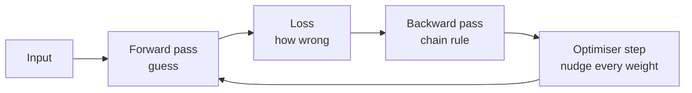

# 09 — DEEP LEARNING

> Neural networks: stacked layers that learn their own features.

**Why it matters:** Deep learning wins decisively on unstructured data — images, audio, text, long sequences — because it learns the features instead of you engineering them.

Home: [[ULTIMATE ENGINEER]] · Roadmap: [[THE ULTIMATE ENGINEER ROADMAP]]

---

## Frameworks

[[10 — PYTORCH]] — the default, and what this vault uses

[[TensorFlow and Keras]] — `.fit()`, and the mature mobile/browser deployment story

[[JAX]] — `grad` / `jit` / `vmap` / `pmap`; research and TPUs

## Language models

[[Large language models]] — tokens, training stages, running one, LoRA, failure modes

[[Transformers and LLM basics]] — the architecture underneath

## Fundamentals
[[Tensors, autograd and the training loop]] — the full treatment

Tensors · shapes · broadcasting · matrix multiplication · forward pass · loss functions · gradients · **backpropagation** · the chain rule · optimisers (SGD, Adam) · learning rate · batch size · epochs · training loop · validation loop · GPU acceleration ([[CUDA and GPU programming]]) · mixed precision · checkpoints

## Neural networks

Neurons · weights · bias · activation functions (ReLU, sigmoid, tanh, softmax) · MLPs · CNNs ([[CNNs and transfer learning]]) · RNNs · LSTMs · GRUs · attention · transformers ([[Transformers and LLM basics]])

## The one idea

**Backpropagation is the chain rule applied to a computational graph.** That's the whole idea — the maths from [[02 — MATHEMATICS]] doing exactly what it says.

## Why activations exist

Stack linear layers with no activation and you get... one linear layer. Non-linearity is what lets a network learn curves instead of straight lines.

## Related
[[10 — PYTORCH]] · [[11 — COMPUTER VISION]] · [[02 — MATHEMATICS]] · [[CUDA and GPU programming]]
