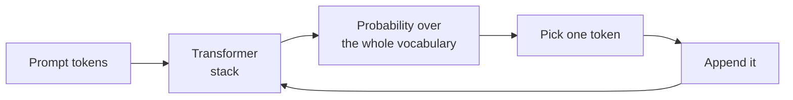
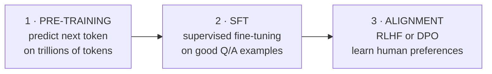

# Large language models

Template: [[_Dictionary template]] · Section: [[09 — DEEP LEARNING]]
Architecture basics: [[Transformers and LLM basics]] · Building with them: [[LLM and GenAI track]]

---

## One sentence

An LLM is a very large neural network trained to predict the next word, which turns out to be enough to make it useful for almost any language task.

## In simple words

Imagine reading every book in a library, and being asked to finish sentences.

At first you guess badly. After a trillion sentences you're extremely good — and to be good at finishing sentences you've had to *accidentally learn* grammar, facts, reasoning, translation, and how code works. Because all of that helps predict the next word.

**That's the whole trick.** An LLM does one thing — predict the next token — and everything else falls out of doing it extremely well at enormous scale.

## The problem it solves

Before LLMs, every language task needed its own model and its own labelled dataset. Sentiment analysis? Collect 50,000 labelled reviews. Summarisation? A different dataset, a different model. Translation? Another one.

An LLM is **one model that does all of them with no task-specific training** — you just describe the task. That collapse from "one model per task" to "one model, many prompts" is why they changed everything.

## How it works

### Tokens

The model doesn't see letters or words. It sees **tokens** — sub-word chunks from a fixed vocabulary.

```
"unbelievable" -> ["un", "believ", "able"]
"engine"       -> ["engine"]
```

Rules of thumb: **1 token ≈ 4 characters ≈ ¾ of a word** in English. Code and non-English use more tokens per character.

> Pricing and context limits are counted in tokens, not words. Count them with the provider's API, **never with `tiktoken` for a non-OpenAI model** — different tokeniser, wrong answer.

### The prediction loop



It generates **one token at a time**, feeding its own output back in. That's why output is slower than input, and why streaming makes such a difference to perceived speed.

### Sampling — how the token gets picked

| Parameter | Effect |
|---|---|
| **Temperature** | 0 = always the most likely token (deterministic-ish). Higher = more random. |
| **Top-p (nucleus)** | Only consider tokens in the top *p* probability mass |
| **Top-k** | Only consider the *k* most likely tokens |

> **Temperature 0 for extraction and classification** — you want the same answer every time. Higher for creative writing. Most production tasks want it low.

### Attention and the KV cache

Attention lets every token look at every other token ([[Transformers and LLM basics]]). Cost grows with **sequence length squared** — double the text, quadruple the compute.

The **KV cache** is the key optimisation: when generating token 500, the model has already computed the attention keys and values for tokens 1–499. Cache them and each new token costs only its own work rather than re-processing everything.

> **The KV cache is why long conversations use more memory, and why prompt caching saves so much** — the provider keeps the computed cache for a repeated prefix ([[LLM and GenAI track]]).

## How they're trained — three stages



| Stage | What happens | Cost |
|---|---|---|
| **Pre-training** | Learn language, facts, reasoning from raw text | Millions of £, months, thousands of GPUs |
| **Supervised fine-tuning (SFT)** | Learn to *follow instructions* from curated examples | Far cheaper |
| **Alignment (RLHF / DPO)** | Learn which answers humans prefer | Cheaper still |

**RLHF** = Reinforcement Learning from Human Feedback: humans rank outputs, a reward model learns those preferences, then [[Reinforcement learning in depth|PPO]] optimises the LLM against it.

**DPO** (Direct Preference Optimisation) achieves the same with a direct loss and no separate reward model — simpler and now more common.

> **This is where [[12 — REINFORCEMENT LEARNING]] and LLMs meet.** The alignment stage is genuinely an RL problem, and it's why PPO matters outside robotics.

## Model families

| Architecture | Sees | Trained to | Good at |
|---|---|---|---|
| **Encoder-only** (BERT) | Whole input, both directions | Fill in masked words | **Understanding** — classification, search |
| **Decoder-only** (GPT, Claude, Llama) | Only what came before | Predict next token | **Generating** — chat, code, reasoning |
| Encoder-decoder (T5) | Encodes then generates | Sequence to sequence | Translation, summarisation |

> **Nearly every modern "LLM" is decoder-only.** Encoder models are still the right choice for narrow high-volume classification — smaller, faster, cheaper ([[Choosing your approach]]).

## Running one yourself

| Model size | Memory (fp16) | Memory (4-bit) | Runs on |
|---|---|---|---|
| 1-3B | ~4-6 GB | ~1-2 GB | Laptop CPU |
| 7-8B | ~16 GB | ~5 GB | Consumer GPU |
| 13B | ~26 GB | ~8 GB | Good GPU |
| 70B | ~140 GB | ~40 GB | Multi-GPU |

**Rule of thumb:** fp16 needs roughly `2 × parameters` in bytes; 4-bit quantisation needs roughly `0.5 ×`.

```bash
# easiest local route
ollama run llama3.1:8b

# production serving - continuous batching, paged KV cache
pip install vllm
python -m vllm.entrypoints.openai.api_server --model meta-llama/Llama-3.1-8B-Instruct
```

> **vLLM is the standard production server** for open-weight models. Its **PagedAttention** manages the KV cache like virtual memory, giving far higher throughput than naive batching.

### Quantisation

Storing weights in fewer bits. 4-bit is roughly 4× smaller with modest quality loss.

| Format | Use |
|---|---|
| **GGUF** | CPU / llama.cpp / Ollama |
| **AWQ / GPTQ** | GPU inference |
| **bitsandbytes** | Quantised fine-tuning (QLoRA) |

## Adapting a model to your task

**The ladder — climb only as far as you need** ([[LLM and GenAI track]]):

1. **Prompting** — free, instant
2. **RAG** — give it your documents. **This is how you add knowledge.**
3. **Tools** — let it call functions
4. **Fine-tuning** — change *behaviour*, format, style

> **Fine-tuning does not add facts.** It adjusts how the model behaves. If it doesn't know your product catalogue, RAG is the answer — a fine-tune just makes it confidently wrong in a more consistent style. This is the single most common misconception.

### LoRA — how fine-tuning is actually done

Full fine-tuning of a 7B model needs ~80GB. **LoRA** freezes the original weights and trains small adapter matrices alongside — ~0.1% of the parameters, results close to full fine-tuning, and the adapter is a few megabytes.

**QLoRA** = LoRA on a 4-bit quantised base model. Fine-tunes a 7B model on a single consumer GPU.

```python
from peft import LoraConfig, get_peft_model
config = LoraConfig(r=16, lora_alpha=32, target_modules=["q_proj","v_proj"], lora_dropout=0.05)
model = get_peft_model(model, config)
model.print_trainable_parameters()     # "trainable: 0.06% of all params"
```

## The failure modes

| Failure | What it looks like | Mitigation |
|---|---|---|
| **Hallucination** | Confident, fluent, wrong | RAG + "only use the context" + require citations + allow "I don't know" |
| **Prompt injection** | User text contains instructions the model obeys | Separate instructions (`system`) from data (`user`, wrapped in tags); least privilege on tools |
| **Context loss** | Forgets the middle of a long document | Shorter context, better chunking, put key info at the start or end |
| **Sycophancy** | Agrees with whatever you assert | Don't lead the question |
| **Non-determinism** | Different answer each run | Temperature 0 — still not perfectly deterministic |
| **Cost explosion** | Fine in prototype, huge at volume | Caching, batch API, smaller model, distillation |
| **Silent truncation** | Long inputs cut off with no error | Count tokens before sending |

> **Prompt injection has no complete fix.** A document saying "ignore your instructions" is just text to the model. Reduce blast radius instead: never let model output trigger destructive actions unreviewed.

## Evaluating them

> **Without an eval set you are not improving your prompt — you are changing it and hoping.**

| Method | Use |
|---|---|
| Exact match | Classification, extraction |
| Assertions | Does it cite a source? Under 200 words? Valid JSON? |
| **LLM-as-judge** | Open-ended quality — but validate the judge against humans first |
| Human review | The ground truth. Expensive. |

Build 20–50 cases covering typical, edge, adversarial and known-failure inputs. **Every production bug becomes an eval case forever.** Track scores in [[MLflow experiment tracking]] like any other model metric.

## When to use an LLM

- Varied or fuzzy language tasks
- No labelled data
- Reasoning or generation required
- Low-to-moderate volume
- Rapid prototyping

## When NOT to use one

| Situation | Use instead |
|---|---|
| One narrow high-volume classification | Fine-tuned small encoder — cheaper, faster, offline |
| Deterministic rules | An `if` statement |
| Tabular prediction | Gradient boosting ([[Choosing your approach]]) |
| Exact arithmetic | Code. Give the LLM a calculator tool. |
| Must work offline on a microcontroller | [[20 — EMBEDDED]] — far too big |
| Answers must be provably correct | Don't. Or use it to draft, with human review. |

## Prerequisites

[[Transformers and LLM basics]] · [[09 — DEEP LEARNING]] · [[10 — PYTORCH]]

## Learning progression

- **Beginner:** prompting, temperature, tokens, context windows
- **Intermediate:** RAG, structured outputs, tool use, evals, cost control
- **Advanced:** LoRA/QLoRA fine-tuning, quantisation, vLLM serving, KV-cache behaviour
- **Research:** architecture variants, alignment methods, interpretability, long-context

## Practical project

Build the RAG system in [[LLM and GenAI track]] over your own notes; then distil it into a small fine-tuned classifier.

## Related

[[Transformers and LLM basics]] · [[LLM and GenAI track]] · [[09 — DEEP LEARNING]] · [[10 — PYTORCH]] · [[Reinforcement learning in depth]] · [[Choosing your approach]] · [[FastAPI fundamentals]] · [[Model export and serving]]
