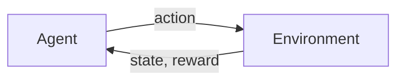
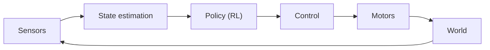

# 12 — REINFORCEMENT LEARNING

> Learning by trial and error, from rewards rather than labels.

**Why it matters:** Supervised learning needs someone to say what's correct. RL only needs a score. That makes it the natural fit for control and robotics — and much harder to make work.

Home: [[ULTIMATE ENGINEER]] · Roadmap: [[THE ULTIMATE ENGINEER ROADMAP]]

---

## Full note

**[[Reinforcement learning in depth]]** — MDPs, Bellman, Q-learning, DQN, policy gradients, PPO, SAC, reward shaping, and when *not* to use RL.

## Core concepts

**Agent** — the learner · **Environment** — the world · **State** — what it observes · **Action** — what it does · **Reward** — the score · **Policy** — state to action · **Value function** — expected future reward from a state · **Q function** — expected future reward from a state-action pair · **Exploration vs exploitation** · **Markov decision process**

## Algorithms

| Algorithm | Type | Note |
|---|---|---|
| Q-learning | Value-based | Tabular. The one to understand first. |
| DQN | Value-based, deep | Q-learning with a neural network |
| Policy gradients | Policy-based | Directly optimise the policy |
| Actor-critic | Both | Policy + value estimate |
| **PPO** | Policy-based | The reliable default |
| SAC | Off-policy | Continuous control, sample-efficient |

## How it connects to robotics

That loop is the same shape as a [[22 — CONTROL SYSTEMS]] feedback loop. RL learns the controller instead of you designing it.

> **The honest caveat:** classical control (PID, LQR, MPC) beats RL for most real robots — it's predictable, provable and doesn't need millions of trials. RL earns its place where the dynamics are unknown or too complex to model. **Learn control first.**

## The hard parts

Reward shaping (bad rewards produce bizarre behaviour) · sample efficiency (millions of episodes) · sim-to-real gap · reproducibility

## Related
[[22 — CONTROL SYSTEMS]] · [[21 — ROBOTICS]] · [[10 — PYTORCH]] · [[02 — MATHEMATICS]]
