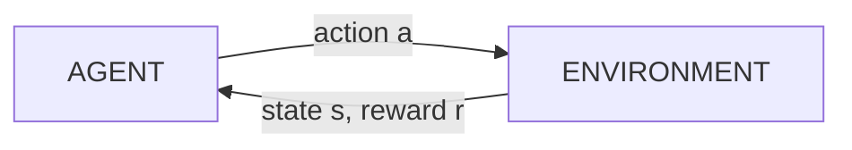

# Reinforcement learning in depth

Template: [[_Dictionary template]] · Section: [[12 — REINFORCEMENT LEARNING]]

---

## One sentence

Reinforcement learning is teaching an agent to act by giving it a score instead of an answer.

## In simple words

Teaching a dog to sit.

You don't show it a labelled dataset of ten thousand photos of sitting. You wait, and when it happens to sit, you give it a treat. It gradually works out which actions lead to treats.

**Supervised learning** needs someone to say *"the correct answer was X"*.
**Reinforcement learning** only needs someone to say *"that went well"* — eventually, and often much later.

That "much later" is the whole difficulty. If the dog sat, waited, then rolled over and got a treat — which action earned it? That's the **credit assignment problem**, and it's what makes RL hard.

## The problem it solves

Some problems have no correct answer to supervise against:

- What's the "correct" action for a robot at this exact joint angle? Nobody knows.
- What's the "correct" move in this chess position? Only the outcome tells you.
- What's the "correct" throttle setting right now? Depends on everything after it.

You *can* score outcomes. RL turns "I can score it" into "I can learn it".

## The setup



| Term | Meaning | Example (robot) |
|---|---|---|
| **Agent** | The learner | The control software |
| **Environment** | Everything else | The robot and the world |
| **State** *s* | What it observes | Position, velocity, sensor readings |
| **Action** *a* | What it can do | Motor voltages |
| **Reward** *r* | The score for that step | +1 closer to goal, −10 crashed |
| **Policy** π | State → action. **The thing you're learning.** | The controller |
| **Episode** | One run, start to finish | One attempt at the task |
| **Return** *G* | Total future reward | How well the whole run goes |

### Discounting

$$G_t = r_t + \gamma r_{t+1} + \gamma^2 r_{t+2} + \dots$$

**γ (gamma)**, between 0 and 1, is how much you care about the future.

- γ = 0 → completely greedy, only the immediate reward
- γ = 0.99 → patient, plans far ahead

> Typical values are 0.95–0.99. Too low and the agent won't sacrifice now for later; too high and learning becomes unstable because returns grow enormous.

## Markov Decision Processes

RL assumes the **Markov property**: *the current state contains everything needed to decide*. History doesn't matter beyond what's in the state.

> **This matters practically.** If your robot's state is only position, but velocity affects what it should do, the problem isn't Markov and RL will struggle. **Fix it by putting velocity in the state** — often by stacking the last few observations. Missing state information is a top cause of RL that won't learn.

## Value functions

| Function | Answers |
|---|---|
| **V(s)** | "How good is this state?" |
| **Q(s,a)** | "How good is taking action *a* in state *s*?" |

Q is more useful: if you know Q, the best policy is just "pick the action with the highest Q".

### The Bellman equation

$$Q(s,a) = r + \gamma \max_{a'} Q(s',a')$$

> **In English: the value of doing this now = the reward you get now + the value of the best thing you can do next.**
>
> That recursive definition is the foundation of nearly every value-based RL algorithm. Everything else is a way to estimate it.

## Exploration vs exploitation

**Exploit** what you know works, or **explore** in case something better exists?

Always exploit and you get stuck on the first decent strategy. Always explore and you never use what you learned.

| Strategy | How |
|---|---|
| **ε-greedy** | Random action with probability ε; decay ε over time |
| Boltzmann | Sample proportional to Q values |
| **Entropy bonus** | Reward the policy for staying uncertain (SAC uses this) |
| Optimistic init | Start Q values high so everything looks worth trying |

## The algorithms

### Q-learning — start here

Tabular, no neural network. Understand this and the rest are variations.

```python
import random
import numpy as np

Q = np.zeros((n_states, n_actions))

for episode in range(episodes):
    s = env.reset()
    done = False
    while not done:
        # epsilon-greedy
        a = env.action_space.sample() if random.random() < eps else np.argmax(Q[s])
        s2, r, done, _ = env.step(a)

        # Bellman update
        Q[s, a] += lr * (r + gamma * np.max(Q[s2]) * (not done) - Q[s, a])
        s = s2
    eps = max(0.01, eps * 0.995)
```

That single update line **is** the Bellman equation, nudged toward gradually.

### DQN — Q-learning with a neural network

When states are too many to tabulate (pixels, continuous values), approximate Q with a network.

Two tricks make it stable, and **both are essential**:

| Trick | Why |
|---|---|
| **Replay buffer** | Store past transitions and sample randomly. Breaks the correlation between consecutive samples — training on sequential data diverges. |
| **Target network** | A frozen copy of the network for computing the target. Without it you're chasing a moving target and it oscillates. |

```python
import torch
import torch.nn.functional as F

# sample a random batch from the buffer
s, a, r, s2, done = buffer.sample(batch_size)

with torch.no_grad():
    target = r + gamma * target_net(s2).max(1).values * (1 - done)   # frozen net

loss = F.smooth_l1_loss(q_net(s).gather(1, a.unsqueeze(1)).squeeze(), target)
optimizer.zero_grad(); loss.backward(); optimizer.step()

if step % 1000 == 0:
    target_net.load_state_dict(q_net.state_dict())      # periodic sync
```

> **DQN only works for discrete actions.** `max` over actions requires a finite list. Continuous control (a throttle value) needs policy methods.

### Policy gradients — learn the policy directly

Instead of learning values and deriving a policy, learn π(a|s) directly. Works naturally for continuous actions.

**REINFORCE**, the simplest version:

$$\nabla J = \mathbb{E}[\nabla \log \pi(a|s) \cdot G]$$

> **In English: make actions that led to high returns more likely, and actions that led to low returns less likely.** Weight the nudge by how good the outcome was.

High variance — one lucky episode can dominate. Hence:

### Actor-critic

Two networks:
- **Actor** — the policy, picks actions
- **Critic** — estimates value, judges how good they were

The critic gives a lower-variance signal than raw returns. Use the **advantage** A(s,a) = Q(s,a) − V(s): *how much better than average was this action?*

### PPO — the reliable default

The problem with policy gradients: one big update can destroy a working policy, and unlike supervised learning there's no fixed dataset to recover from — the agent now collects worse data, and it spirals.

**PPO clips the update** so the new policy can't move too far from the old one in a single step.

$$L = \min\left(\frac{\pi_{new}}{\pi_{old}}A,\ \ \text{clip}\left(\frac{\pi_{new}}{\pi_{old}}, 1-\epsilon, 1+\epsilon\right)A\right)$$

> **PPO is the sensible first choice for almost everything.** It's robust, works on continuous and discrete actions, and it's what trains LLMs in RLHF ([[Large language models]]). Start here unless you have a reason not to.

### SAC — for real robots

Off-policy (reuses old data, so far more sample-efficient) and maximises reward **plus entropy** — explicitly rewarding the policy for staying uncertain. Good exploration, stable, continuous actions.

> **SAC is the usual choice for physical robots**, where every sample costs real time and wear ([[21 — ROBOTICS]]).

### Choosing

| Algorithm | Actions | On/off-policy | Use when |
|---|---|---|---|
| Q-learning | Discrete | Off | Learning the concepts |
| DQN | Discrete | Off | Atari-like, discrete choices |
| REINFORCE | Both | On | Learning policy gradients |
| A2C/A3C | Both | On | Simple baseline |
| **PPO** | Both | On | ✅ **Default** |
| **SAC** | Continuous | Off | ✅ **Robots, sample-limited** |
| TD3 | Continuous | Off | Alternative to SAC |

## Code — using a library

Don't implement PPO yourself for real work.

```python
import gymnasium as gym
from stable_baselines3 import PPO

env = gym.make("CartPole-v1")
model = PPO("MlpPolicy", env, verbose=1, tensorboard_log="./logs")
model.learn(total_timesteps=100_000)
model.save("ppo_cartpole")

obs, _ = env.reset()
for _ in range(1000):
    action, _ = model.predict(obs, deterministic=True)     # deterministic at eval
    obs, reward, done, trunc, _ = env.step(action)
    if done or trunc: obs, _ = env.reset()
```

| Library | Use |
|---|---|
| **Gymnasium** | The standard environment API |
| **Stable-Baselines3** | Solid PyTorch implementations. Start here. |
| CleanRL | Single-file implementations — **best for learning** |
| Ray RLlib | Distributed, large scale |

## Reward shaping — where projects die

**The reward function is the specification.** Get it wrong and the agent optimises exactly what you asked for, not what you meant.

Classic failures:
- Reward for *not crashing* → the agent parks and never moves
- Reward for distance travelled → it drives in circles
- Reward for cleaning up mess → it creates mess to clean
- Reward per point in a boat race → it loops collecting the same pickups forever, never finishing

> **The agent is not misbehaving. It is doing exactly what you rewarded.** Every surprising RL behaviour is a correctly-optimised badly-specified reward.

**Practical guidance:**
- **Sparse rewards** (+1 only on success) are honest but very hard to learn from
- **Shaped rewards** (progress toward the goal) learn faster but are easy to game
- Always add a small **time penalty** so it doesn't dawdle
- Watch the trained agent with your own eyes before trusting any metric

## Why RL is hard

| Problem | Reality |
|---|---|
| **Sample inefficiency** | Millions of episodes. Impossible on real hardware without simulation. |
| **Instability** | Same code, different seed, completely different result |
| **Reward hacking** | It exploits your specification |
| **Credit assignment** | Which of 500 actions caused the outcome? |
| **Sim-to-real gap** | Works in simulation, fails on the robot |
| **Non-reproducibility** | Reported results are often unreproducible |

> **Always report results across multiple seeds.** RL variance between seeds is frequently larger than the improvement being claimed ([[27 — ML RESEARCH]]).

## When to use RL

- Sequential decisions where actions affect future states
- No labelled correct answers, but outcomes are scoreable
- A fast, safe simulator exists
- Game playing, resource allocation, some control problems
- LLM alignment ([[Large language models]])

## When NOT to use RL

| Situation | Use instead |
|---|---|
| You can write the controller | **PID / LQR / MPC** ([[PID and Kalman filters]]) — provable, predictable, no training |
| You have labelled examples of good behaviour | Supervised learning / imitation learning |
| No simulator, real trials are expensive | Don't. Build the simulator first. |
| Safety-critical with no fallback | Classical control. RL cannot be certified today. |
| One-shot decisions, no sequence | Ordinary ML ([[08 — MACHINE LEARNING]]) |

> **The honest position: classical control beats RL for most real robots.** It's predictable, provable, needs no training, and you can explain it to a safety engineer. **Learn [[22 — CONTROL SYSTEMS]] first.** RL earns its place when the dynamics are unknown or too complex to model.

## Common mistakes

| Mistake | Symptom | Fix |
|---|---|---|
| Rewards not normalised | Unstable, exploding gradients | Scale rewards to roughly [−1, 1] |
| No observation normalisation | Learns slowly or not at all | Running mean/std normaliser |
| State isn't Markov | Plateaus and never improves | Add velocity/history to the state |
| Too little exploration | Locks onto a mediocre strategy | Slower ε decay; entropy bonus |
| Evaluating with a stochastic policy | Noisy scores | `deterministic=True` at eval |
| One seed | Meaningless result | 3-5 seeds minimum |
| γ too high early | Unstable | Start ~0.95 |
| Reward hacking unnoticed | Great score, wrong behaviour | **Watch it run** |

## Debugging

1. **Does a random policy score what you expect?** That's your baseline.
2. **Can it learn a trivial version?** Shrink the problem until it's solvable, then grow it.
3. **Plot the reward curve.** Flat = not learning. Spiky = unstable. Rising then collapsing = catastrophic update.
4. **Watch an episode.** Most RL bugs are visible in ten seconds of video and invisible in metrics.
5. **Check the reward.** Log its components separately — which term is the agent actually maximising?
6. **Sanity check the environment.** Is `done` set correctly? Is the state what you think?

## Prerequisites

[[Mathematics reference]] (probability, expectation) · [[10 — PYTORCH]] · [[22 — CONTROL SYSTEMS]]

## Learning progression

- **Beginner:** MDPs, Bellman, tabular Q-learning on FrozenLake
- **Intermediate:** DQN, policy gradients, PPO via Stable-Baselines3, Gymnasium
- **Advanced:** SAC, reward design, sim-to-real, offline RL
- **Research:** exploration theory, model-based RL, multi-agent, RLHF

## Practical project

[[Project 009 — Autonomous Robotics System]] — train in simulation, compare against a PID controller, then attempt sim-to-real.

## Related

[[12 — REINFORCEMENT LEARNING]] · [[22 — CONTROL SYSTEMS]] · [[PID and Kalman filters]] · [[21 — ROBOTICS]] · [[10 — PYTORCH]] · [[Large language models]] · [[27 — ML RESEARCH]] · [[Mathematics reference]]
