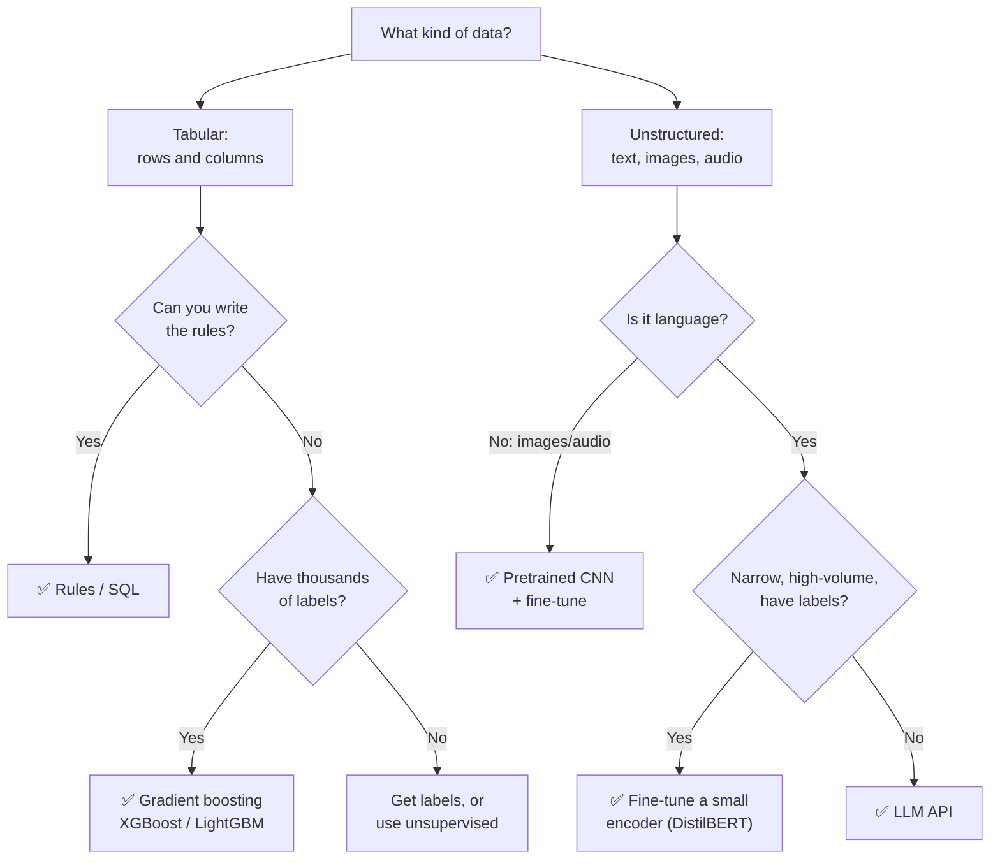
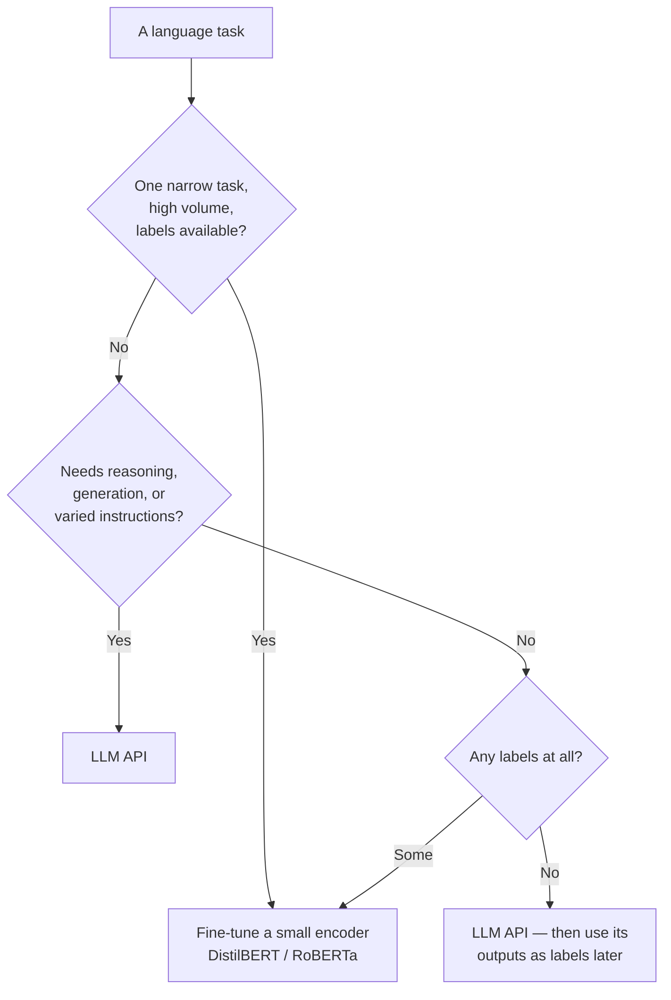

# Choosing your approach

> **What this is:** phase 3 of [[The playbook]] — picking rules vs. classical ML vs. deep learning vs. an LLM, and deciding what to build versus what to buy.
> **Why you care:** picking the wrong rung costs months. Almost everyone picks too high a rung, because the higher rungs are more interesting.
>
> **Working out what's even possible with a given dataset: [[How to use ML on data]].**

---

## The idea in plain English

There's a ladder of approaches. Each rung is more powerful, more expensive, harder to debug, and slower to ship than the one below.

**The right move is always the lowest rung that solves the problem.**

That sounds obvious and almost nobody does it, because rung 5 is exciting and rung 1 feels like admitting defeat. It isn't. Choosing the boring option that works is the actual skill.

---

## The ladder

| Rung | Approach | Ship time | Cost to run | Debuggable | Needs labels |
|---|---|---|---|---|---|
| 1 | **Rules / SQL** | Hours | ~£0 | Perfectly | No |
| 2 | **Classical ML** | Days | Pennies | Mostly | Yes, thousands |
| 3 | **Deep learning** | Weeks | GPU time | Barely | Yes, many |
| 4 | **Pretrained + fine-tune** | Days | Moderate | Barely | Yes, hundreds |
| 5 | **LLM API** | Hours | Per request, forever | No | No |

Note rungs 1 and 5 are both fast to ship. That's why LLMs are so tempting — they *feel* like rung 1 effort with rung 3 power. The catch is in the "cost to run" and "debuggable" columns, and it's a real catch.

---

## The decision tree



---

## 1. Tabular data — the most common case

**Use gradient boosting. Not a neural network.**

XGBoost, LightGBM, or CatBoost beat deep learning on tabular data in the overwhelming majority of real cases. This isn't nostalgia — it's a repeatedly demonstrated result, and it's what wins Kaggle competitions on tabular problems.

```python
import lightgbm as lgb
model = lgb.LGBMRegressor(n_estimators=500, learning_rate=0.05)
model.fit(X_train, y_train, eval_set=[(X_val, y_val)], callbacks=[lgb.early_stopping(50)])
```

**Why it wins:**

| | Gradient boosting | Neural network |
|---|---|---|
| Training time | Seconds to minutes, on CPU | Minutes to hours, wants a GPU |
| Tuning needed | Works well out of the box | Very sensitive |
| Mixed types & missing values | Handles natively | Needs encoding and imputation |
| Feature importance | Built in | Requires extra work |
| Small data (<100k rows) | Fine | Struggles |

> **When a neural net *does* win on tabular data:** very large datasets (millions of rows), high-cardinality categoricals where learned embeddings help, or when you need to combine tabular data with text or images in one model. Those are real, and they're the minority.

> **For the capstone, PyTorch on tabular RFM data is deliberately not the optimal choice** — it's there to exercise the training and ONNX serving pipeline ([[Model export and serving]]). Say that out loud in an interview; it reads as judgement, not as a mistake.

---

## 2. Unstructured data — deep learning earns its place

Images, audio, video, long text. Here neural networks aren't just better, they're the only thing that works.

**And you still don't train from scratch** — you start from a pretrained model and fine-tune ([[CNNs and transfer learning]]). Training from scratch needs millions of examples and is essentially never the right first move.

---

## 3. Language tasks — the fork that matters most now



| | Fine-tuned small model | LLM API |
|---|---|---|
| Cost | Train once (pennies), then ~free | Per request, forever |
| Latency | 5–20ms, local, CPU | Hundreds of ms + network |
| Needs labels | Yes, hundreds+ | No |
| New/changed requirements | Retrain | Change the prompt |
| Works offline | Yes | No |
| Best for | One narrow, high-volume task | Varied tasks, low volume, no labels |

> **The pattern that's genuinely best practice:** prototype with an LLM API (fast, no labels, proves the idea). If it becomes high-volume production, use the LLM's outputs as training labels and distil into a small fine-tuned model. You get the LLM's quality at the small model's cost and latency.

Full treatment: [[LLM and GenAI track]].

---

## 4. Build vs. buy

Before building anything, check whether it already exists.

| Task | Buy this instead |
|---|---|
| OCR / document extraction | Azure Document Intelligence |
| Speech to text | Azure Speech, Whisper |
| Translation | Azure Translator |
| Generic sentiment / entities / PII | Azure AI Language |
| Image classification (common objects) | Azure AI Vision |
| Generic chat, summarisation, extraction | An LLM API |

**Build when:** the task is specific to your domain, you have proprietary data that's your advantage, cost at your volume makes an API prohibitive, latency or offline requirements rule out an API, or the data can't leave your network.

> **Rule of thumb: buy the commodity, build the differentiator.** Nobody's business advantage is their OCR. Your advantage is the model that understands *your* customers, on *your* data. Spend your engineering there and buy the rest.

---

## 5. The cost dimension

Run the numbers *before* choosing, not after the first bill.

```
Volume × cost-per-prediction × 12 months  vs.  build cost + hosting + maintenance
```

Rough shape:

| Approach | Per prediction | 1M predictions/month |
|---|---|---|
| Rules in SQL | ~£0 | ~£0 |
| Gradient boosting on CPU | ~£0 | Pennies (it's just compute) |
| Small fine-tuned transformer | ~£0 | Container hosting cost |
| LLM API | Fraction of a penny to several pence | **Can be thousands of pounds** |

> **The LLM cost trap:** at prototype volume an LLM API costs nothing and feels free. At production volume it can dominate your entire infrastructure bill. Multiply your expected volume by the per-call cost *before* you architect around it — and see the cost levers in [[LLM and GenAI track]] (caching, batch, model choice), which routinely cut it by 50–90%.

**Don't forget the costs that aren't in the invoice:** engineering time to build, ongoing maintenance, retraining, monitoring, and the on-call burden. A model nobody maintains is a liability. Those costs are usually larger than the compute.

---

## 6. Choosing the model *within* an approach

Once you've picked a rung, pick the smallest thing on it.

**Classical ML:** logistic/linear regression first (it's a baseline and sometimes the answer), then LightGBM. Skip everything else unless you have a reason.

**Deep learning:** `resnet18` before `resnet50`. `distilbert` before `bert-large`. Small models train faster, need less data, deploy more easily, and are often within a couple of percent.

**LLMs:** see the model table in [[LLM and GenAI track]] — pick by task difficulty, and measure whether a cheaper model holds quality on *your* eval before defaulting to the largest.

> **Start small and scale up only when measurement demands it.** Starting with the biggest model means you never learn whether you needed it, you pay for it forever, and every iteration is slow.

---

## 7. The decision record

Write it down. Three lines in `DECISIONS.md`:

```markdown
## Sales forecasting: approach
Chose LightGBM over an LSTM.
Why: tabular weekly aggregates, ~5k rows. GBM trained in 4s vs 6min and scored
MAE 389 vs 412. Deep learning had no data-scale advantage here.
Revisit if: we move to daily grain per SKU (~2M rows) where embeddings may help.
```

> **The "revisit if" line is the valuable one.** It converts a decision into a trigger, so the choice gets re-examined when the conditions change rather than surviving forever by inertia. It's also exactly what a good interviewer probes for.

---

## When something goes wrong

| Symptom | Likely cause | Fix |
|---|---|---|
| Neural net barely beats logistic regression | Tabular data — wrong rung | Use gradient boosting; keep the simpler model |
| Months in, nothing shipped | Started at rung 3+ | Ship rung 1 or 2 now, improve behind the same interface |
| LLM bill exploded at launch | Cost not modelled at real volume | Caching, batch, smaller model, or distil to a fine-tune |
| Model can't be explained to stakeholders | Rung too high for the audience | A simpler model you can explain often wins politically *and* practically |
| Rebuilt something that exists as a service | No build-vs-buy check | Check the managed-service list first |
| Model works but nobody maintains it | Total cost of ownership ignored | Count maintenance in the decision |
| Constantly retraining for new requirements | Fine-tuned model on a task that keeps changing | An LLM with a prompt handles change better |

---

## Practice checklist

- [ ] The five-rung ladder and why lowest-that-works is correct
- [ ] The data-type decision tree
- [ ] **Gradient boosting beats neural networks on tabular data** — and the exceptions
- [ ] Pretrained + fine-tune for unstructured data, never from scratch
- [ ] Fine-tuned small model vs. LLM API — the real trade-off table
- [ ] The distillation pattern: prototype with an LLM, then distil
- [ ] Build vs. buy — buy the commodity, build the differentiator
- [ ] Modelling cost at production volume before choosing
- [ ] Picking the smallest model within an approach
- [ ] Writing the decision record with a "revisit if" trigger

## Hands-on

- [ ] Train LightGBM on the capstone RFM data and compare with your PyTorch model — time and score
- [ ] Model the annual cost of the capstone at 1M predictions/month for each approach
- [ ] Write three decision records for choices you already made in the capstone
- [ ] Find one thing in your capstone that a managed Azure service would have done for you

## Resources

- [LightGBM docs](https://lightgbm.readthedocs.io/)
- [Google: Rules of Machine Learning](https://developers.google.com/machine-learning/guides/rules-of-ml) — Rules 1–4 on starting simple

## Next

[[LLM and GenAI track]]
