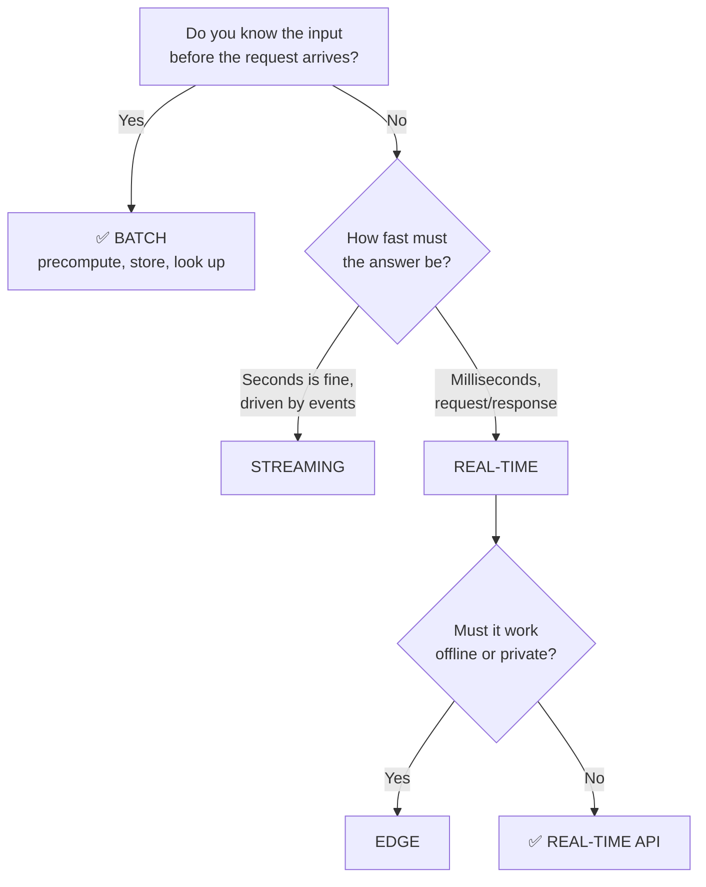
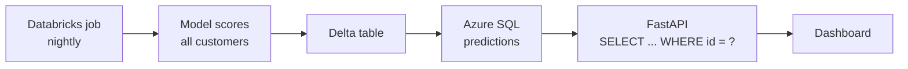

# Deployment patterns

> **What this is:** phases 6–7 of [[The playbook]] — how a model actually reaches users, and how to release it without breaking things.
> **Why you care:** this is the biggest architectural decision in the whole project, it's usually made by reflex, and the reflex is usually wrong.

---

## The idea in plain English

There are only four ways a prediction reaches whoever needs it:

1. **You computed it earlier and looked it up** (batch)
2. **You computed it just now because they asked** (real-time)
3. **You computed it as the event happened** (streaming)
4. **It was computed on their device** (edge)

That's the entire space. Everything else is a detail of one of these.

> **The default is batch, and most people skip past it.** "Real-time" sounds better, so it gets chosen without the question being asked. It multiplies your infrastructure, your failure modes, and your on-call burden — often for a prediction that changes once a day.

---

## The decision



**The single question that decides it:** *do you know the input in advance?*

- Scoring every customer's churn risk → you know every customer. **Batch.**
- Classifying the text a user just typed → you can't know it. **Real-time.**

---

## 1. Batch — the default

**Compute predictions on a schedule, write them to a table, serve them with a `SELECT`.**



```python
# in the nightly Databricks job — the "model serving" is just a job step
features = spark.table("retail.gold.customer_rfm")
predictions = score(features)                       # pandas UDF or a driver-side batch
predictions.write.format("delta").mode("overwrite").saveAsTable("retail.gold.customer_segments")
```

```python
from fastapi import Depends

# the API — no model in the request path at all
@router.get("/customers/{customer_id}/segment")
async def get_segment(customer_id: str, db=Depends(get_db)):
    row = await db.execute(
        text("SELECT segment, confidence, model_version, scored_at "
             "FROM customer_segments WHERE customer_id = :id"),
        {"id": customer_id},
    )
    ...
```

**Why this is so good:**

| Benefit | Why |
|---|---|
| **No model in the request path** | No cold starts, no inference latency, no GPU in production |
| **Serving is a database lookup** | ~5ms, and scales like any database |
| **Failures are not user-facing** | The job failed at 2am; yesterday's predictions are still there |
| **Trivial to debug** | The predictions are rows in a table you can query |
| **Cheap** | One cluster for 20 minutes a night |
| **Retry is free** | Re-run the job. Nobody notices. |

**Costs:** predictions are stale by up to one cycle, and you compute for everyone including those nobody asks about.

> **This is what the capstone does, and it's the right choice.** The nightly job is your model serving. The API is a lookup. Notice how much infrastructure that removes.

---

## 2. Real-time — when you genuinely can't precompute

The input arrives with the request. Load the model once at startup, run inference per request ([[FastAPI data and deployment]]).

```python
from fastapi import FastAPI
from fastapi.concurrency import run_in_threadpool
import onnxruntime as ort

@asynccontextmanager
async def lifespan(app: FastAPI):
    ml_models["forecast"] = ort.InferenceSession(settings.model_path)   # once
    yield
    ml_models.clear()

@router.post("/predict")
async def predict(req: PredictRequest):
    features = build_features(req)                                       # from saved feature_order
    out = await run_in_threadpool(ml_models["forecast"].run, None, {"features": features})
    return {"prediction": float(out[0][0]), "model_version": settings.model_version}
```

**What real-time adds to your job:**

- [ ] Latency budget — and knowing where the time actually goes
- [ ] Autoscaling and cold starts
- [ ] Model loading at startup, never per request
- [ ] Graceful degradation when the model fails
- [ ] Health checks: liveness *and* readiness
- [ ] Enough replicas that one crash isn't an outage

> **Latency reality check:** for a small tabular model, inference is 0.1–5ms while the database call is 5–50ms and the network is more. **Inference is rarely the bottleneck.** Measure before optimising the model — people quantize a model that's 2% of their latency.

### The hybrid — the pattern that's usually correct

Precompute the expensive part, compute the cheap part live:

```python
from fastapi import Depends

@router.get("/sales/forecast")
async def forecast(category: str, weeks: int, db=Depends(get_db)):
    features = await fetch_precomputed_features(db, category)   # batch job built these
    return run_model(features, weeks)                           # tiny live inference
```

> **Most good real-time systems are mostly batch.** The heavy feature engineering happens nightly in Spark; the request-time work is a lookup plus a small matrix multiply. If your API is doing joins and aggregations per request, move that into the batch job.

---

## 3. Streaming — events arriving continuously

Score events as they arrive, within seconds. Fraud detection on live transactions, anomaly detection on telemetry.

```python
(spark.readStream.format("kafka")
    .option("subscribe", "transactions").load()
    .transform(parse_and_featurise)
    .transform(score)
    .writeStream.format("delta")
    .option("checkpointLocation", "abfss://.../_checkpoints/scored")
    .trigger(processingTime="30 seconds")
    .toTable("retail.gold.scored_transactions"))
```

See [[Adjacent tools you will meet]] for Kafka/Event Hubs concepts.

> **The complexity you're signing up for:** late-arriving data, watermarks, exactly-once semantics, checkpoint management, backfills that are genuinely hard, and testing that's much harder. **Use micro-batch (a 1–5 minute trigger) before true streaming** — it gets you most of the freshness for a fraction of the difficulty.

---

## 4. Edge

The model runs on the user's device — phone, browser, sensor, robot.

**Why:** works offline, no per-request cost, data never leaves the device, near-zero latency.
**Cost:** you can't update it easily, you can't see what it's doing, and it must be small.

Formats: ONNX Runtime (Web/Mobile), Core ML, TensorFlow Lite, or compiled to native via [[C++ for this stack]].

---

## Rollout — never straight to 100%

```
Shadow  →  Canary  →  Ramp  →  Full
 (0%)      (5%)      (50%)    (100%)
```

### Shadow

The new model runs on real production traffic. Its output is **logged and thrown away**. The old system still serves users.

```python
from fastapi import BackgroundTasks

@router.post("/predict")
async def predict(req, background: BackgroundTasks):
    result = current_model.predict(req)
    background.add_task(log_shadow, req, candidate_model.predict(req), result)
    return result          # users still get the current model
```

> **This is the highest-value, most-skipped step.** It tells you how the new model behaves on *real* traffic — including the distribution shift and missing features that your clean test set never had — at **zero risk**. It's how you find the offline/online gap before it's your users finding it.

Run it for at least a few days. Compare distributions, not just averages.

### Canary → ramp → full

Send a small slice of real traffic to the new model, watch, then increase.

```bash
# Azure Container Apps: two revisions, split the traffic
az containerapp ingress traffic set --name retail-api --resource-group retail-rg \
  --revision-weight retail-api--v1=95 retail-api--v2=5
```

**Watch at every step:** error rate, p95 latency, prediction distribution, and the business metric if it's fast enough to see.

### Rollback

```bash
az containerapp ingress traffic set --name retail-api --resource-group retail-rg \
  --revision-weight retail-api--v1=100
```

Or, if you load from the MLflow registry by alias ([[MLflow experiment tracking]]), just move the alias:

```python
client.set_registered_model_alias("sales-forecaster", "champion", version=3)   # back to 3
```

> **Test your rollback before you need it.** A rollback path that has never been executed is a hypothesis. Practise it once, deliberately, in daylight.

### A/B testing

Canary asks *"is it broken?"* A/B asks *"is it better?"* — split traffic, measure the **business** metric, and run long enough for the result to mean something. Different question, different duration, and you need both.

---

## Where things run in this stack

| Pattern | Compute | Storage | Serving |
|---|---|---|---|
| **Batch** | Databricks job | Delta → Azure SQL | FastAPI `SELECT` |
| **Real-time** | Container Apps | Model in the image | FastAPI + ONNX |
| **Streaming** | Databricks Structured Streaming | Delta | Delta / Event Hubs |
| **Edge** | The device | On device | In the app |

Deployment mechanics: [[Containers and deployment]]. Pipelines that automate it: [[MLOps and CI-CD]].

---

## When something goes wrong

| Symptom | Likely cause | Fix |
|---|---|---|
| API slow, model is fast | Time is in the DB/network, not inference | Measure per stage before optimising |
| First request after idle is slow | Scale-to-zero cold start | `--min-replicas 1`, or accept it |
| Great offline, worse in production | Distribution shift, missing features | Shadow deploy first — it exists for this |
| Model update broke everything | Went straight to 100% | Shadow → canary → ramp |
| Can't roll back | Untested path, `:latest` tags | Version tags; registry aliases; practise it |
| Predictions stale | Batch job failed silently | Alerting on the job ([[Unity Catalog and orchestration]]) |
| Built real-time, could have been batch | Never asked the question | Ask: do I know the input in advance? |
| Streaming pipeline reprocesses everything | Lost checkpoint | Back up `checkpointLocation`; never delete it |
| OOM under load | Workers × model size > memory | Fewer workers, or more memory |
| Can't tell which model made a prediction | No version logged | Return and log `model_version` always |

---

## Practice checklist

- [ ] The four patterns, and the one question that chooses between them
- [ ] **Batch as the default**, and everything it removes from your job
- [ ] Batch serving = a database lookup, not a model call
- [ ] Real-time requirements: cold starts, health checks, degradation
- [ ] **The hybrid pattern** — precompute features, tiny live inference
- [ ] Why inference is rarely the latency bottleneck
- [ ] Streaming, and preferring micro-batch first
- [ ] Edge trade-offs
- [ ] **Shadow deployment** — the highest-value skipped step
- [ ] Canary → ramp → full, and what to watch at each step
- [ ] Rollback via traffic weights or registry aliases — tested, not assumed
- [ ] Canary vs. A/B — different questions

## Hands-on

- [ ] Rewrite the capstone segmentation endpoint as pure batch — precompute and look up. Compare latency.
- [ ] Deploy a `v2` revision to Container Apps and split traffic 95/5
- [ ] Roll back by traffic weight, then again by MLflow alias
- [ ] Add shadow logging to one endpoint and compare the two models over a day
- [ ] Time your `/predict` endpoint by stage — DB, features, inference — and find the real bottleneck

## Resources

- [Azure Container Apps: revisions and traffic splitting](https://learn.microsoft.com/azure/container-apps/revisions)
- [Chip Huyen: Designing Machine Learning Systems](https://huyenchip.com/mlops/) — chapter 7

## Next

[[Monitoring and iteration]]
