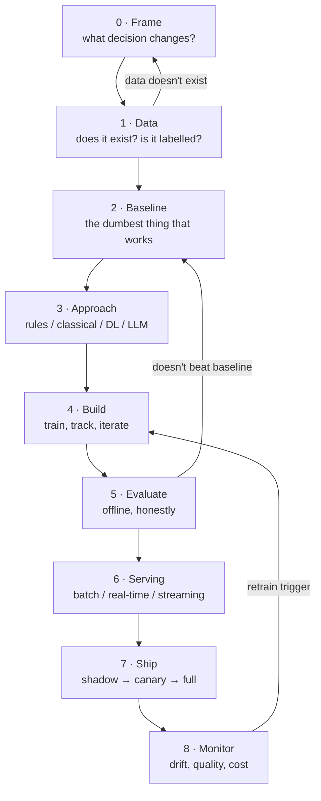

# The Playbook: Idea → Production

> **What this is:** the repeatable process for taking *any* AI idea — classical ML, deep learning, an LLM feature, a computer vision model — from "wouldn't it be good if…" to something running in production that people rely on.
> **Why you care:** stages 1–9 of this vault taught you the tools. This section teaches you the **order to use them in**, and the decisions that happen before you write any code.

---

## The idea in plain English

Most AI projects don't fail because the model was bad.

They fail because:

- Nobody could say what decision the model was supposed to change
- The data didn't exist, or existed but wasn't labelled, or was labelled badly
- The model beat nothing, because nobody computed a baseline
- It worked offline and was never deployed
- It was deployed and nobody noticed when it broke
- It was a machine learning solution to a problem that needed an `if` statement

Every one of those is a **process** failure, not a modelling failure. This playbook is the process.

> **The one-line summary:** *Frame the decision → check the data → build the dumbest baseline → only then model → prove it offline → ship the smallest thing → watch it → iterate.*

---

## The nine phases



Note the three loops back. **They fire more often than the arrows forward.** A project that never loops back is a project where somebody skipped an honest evaluation.

---

## Phase 0 — Frame the problem

**Output:** one paragraph that a non-technical person agrees with.

| Question | Why it matters |
|---|---|
| What **decision** changes because of this? | If no decision changes, the model is decoration |
| Who or what **acts** on the output? | A human? A system? Nobody? |
| What happens **today** without it? | That's your baseline, and it's often good |
| What does **wrong** cost? | Decides your precision/recall trade-off and how much monitoring you need |
| How **fast** does the answer need to be? | Decides batch vs. real-time — the biggest architecture fork |
| How would you know it **worked**? | If you can't measure it, you can't ship it responsibly |

> **The filter question that saves the most time: does this need ML at all?**
> Rules, a SQL query, or a lookup table beat a model whenever the logic is knowable. They're faster, free, debuggable, and never drift. "Flag orders over £10,000" is an `if` statement, not a fraud model. **Reach for ML when the rules are unknown, numerous, or keep changing** — not when they're just tedious to write.

Full detail: [[Problem framing]].

---

## Phase 1 — Check the data before anything else

**Output:** a real sample, in a notebook, that you have actually looked at.

- [ ] Does the data exist? Where? Who owns it?
- [ ] Can you legally use it? (personal data, retention, consent)
- [ ] Is there a **label** — the thing you're predicting — and is it trustworthy?
- [ ] How much is there? How far back?
- [ ] How much is missing, duplicated, or obviously wrong?
- [ ] Will it still be arriving next month?

> **The label is usually the blocker.** Companies have oceans of data and almost no labels. If nobody has recorded which transactions were fraudulent, you don't have a supervised learning problem — you have a labelling project first. Discover that in week one, not week six.

**The leakage check, at this stage:** for every feature, ask *"would I actually have this value at prediction time?"* A `refund_issued` column predicts churn brilliantly and is completely useless, because you only know it after the fact. **Target leakage is the number one cause of a model that scores 0.99 offline and fails in production.**

This is where the vault's data engineering earns its keep — [[ADLS Gen2]] for landing it, [[PySpark core]] for exploring at scale, [[Data modeling]] for shaping it.

---

## Phase 2 — Build the dumbest baseline

**Output:** a number your model has to beat.

| Problem | Baseline |
|---|---|
| Regression | Predict the mean. Or last week's value (time series). |
| Classification | Predict the majority class |
| Forecasting | "Same as last period" (naive) or a seasonal naive |
| Ranking | Sort by popularity |
| Anything | **The existing rules or human process** |

```python
baseline_mae = (test.revenue - test.revenue_lag_1).abs().mean()
print(f"Naive baseline: £{baseline_mae:,.0f}")     # everything is measured against this
```

> **Do this before building any model.** It takes twenty minutes and it does three things: it gives your metric meaning, it sometimes solves the problem outright, and it tells you early if the problem is unlearnable. A model that can't beat "same as last week" isn't a model.
>
> **Log the baseline in every MLflow run** ([[MLflow experiment tracking]]). A metric without a baseline next to it is a number nobody can interpret, including you in three months.

---

## Phase 3 — Choose your approach

The ladder, cheapest first. **Stop at the first rung that works.**

| Rung | Approach | Reach for it when |
|---|---|---|
| 1 | **Rules / SQL** | The logic is knowable and stable |
| 2 | **Classical ML** (logistic regression, gradient boosting) | Tabular data. **Usually the right answer.** |
| 3 | **Deep learning** | Images, audio, text, sequences — unstructured data |
| 4 | **Pretrained + fine-tune** | Same, but you have hundreds not millions of examples |
| 5 | **LLM API** | Language tasks, no labels, varied or fuzzy requirements |

> **On tabular data, gradient boosting (XGBoost / LightGBM) usually beats a neural network** — faster to train, easier to tune, and it tells you which features mattered. Deep learning wins decisively on unstructured data: images, audio, text, long sequences. Choose by data type, not by what's exciting.

Full decision trees, including build-vs-buy: [[Choosing your approach]].

---

## Phase 4 — Build

**Output:** a tracked, reproducible model.

The mechanics are stage 6 of this vault. The process discipline:

- [ ] **Split first, and correctly.** Time-based for anything temporal ([[Tensors, autograd and the training loop]]).
- [ ] **Overfit one batch** before a full training run. Thirty seconds; catches most bugs.
- [ ] **Track everything in MLflow** — including data version, scaler, and feature order.
- [ ] **Iterate on data before architecture.** Better features and cleaner labels beat a bigger model, almost every time.
- [ ] **Keep a `DECISIONS.md`.** Why you dropped those rows. Why that split date.

> **Where beginners waste the most time: tuning hyperparameters before fixing the data.** A 2% gain from a learning rate sweep is worthless next to the 15% you get from removing the leaked feature nobody noticed.

---

## Phase 5 — Evaluate honestly

**Output:** a number you'd defend to someone who wants the project cancelled.

- [ ] Test set touched **once**, at the end
- [ ] Compared against the baseline from Phase 2
- [ ] Broken down by **segment**, not just overall — by category, region, customer size
- [ ] Error analysis: look at 20 actual failures with your own eyes
- [ ] Cost of errors weighted (a false negative may cost 50× a false positive)

> **Aggregate metrics hide the failures that get you in trouble.** 92% accuracy overall can be 99% on your biggest category and 40% on a small one that happens to be your most valuable customers. **Always slice.**

> **The offline/online gap is real and always in the same direction.** Production is worse. Training data is cleaner, the distribution has shifted, and features arrive late or missing. Expect a drop and plan for it — that's what the shadow deploy in Phase 7 is for.

---

## Phase 6 — Choose the serving pattern

**This is the biggest architectural decision, and the default should be batch.**

| Pattern | Latency | Complexity | Use when |
|---|---|---|---|
| **Batch** | Hours | ★ | Predictions can be precomputed. **Start here.** |
| **Real-time** | Milliseconds | ★★★ | The input isn't known until the request arrives |
| **Streaming** | Seconds | ★★★★ | Continuous events, reaction needed within seconds |
| **Edge/embedded** | Instant | ★★★★ | Offline, or privacy demands local |

> **Most "real-time" requirements are batch requirements in disguise.** If you're scoring every customer nightly and looking the answer up when asked, that's batch — one Databricks job writing to a table, and the API is a `SELECT`. No model in the request path, no cold starts, no inference latency, trivially scalable.
>
> **You need real-time only when the input is unknown until request time** — the text the user just typed, the transaction happening now. Ask that question honestly; it saves an enormous amount of infrastructure.

Full detail, including rollout strategies: [[Deployment patterns]].

---

## Phase 7 — Ship it

**Output:** it's live, and you can turn it off.

Ship in stages. Never straight to 100%:

```
Shadow  →  Canary  →  Ramp  →  Full
(0%)       (5%)       (50%)    (100%)
```

- **Shadow** — runs on real traffic, output logged, nothing acted on. Compares production reality against your offline numbers **at zero risk**. This is the step people skip and regret.
- **Canary** — a small slice of real traffic actually uses it. Watch error rates and latency.
- **Ramp** — increase while monitoring.
- **Full** — with the rollback path still one command away.

- [ ] Model version returned in every response and logged
- [ ] Rollback tested, not just assumed ([[MLflow experiment tracking]] alias flip)
- [ ] Alerts wired before go-live, not after
- [ ] A named human who is responsible when it breaks

---

## Phase 8 — Monitor and iterate

**Output:** you find out it's broken before your users tell you.

Four things to watch, in priority order:

| Watch | Why |
|---|---|
| **Is it up?** Errors, latency, throughput | The unglamorous one that actually pages you |
| **Input drift** — feature distributions vs. training | The earliest warning, and available immediately |
| **Prediction drift** — output distribution over time | A sudden shift means something upstream changed |
| **Actual quality** — predictions vs. ground truth | The real answer, but it arrives late (weeks, sometimes never) |

> **You usually can't measure quality immediately** — you don't know if this week's forecast was right until next week. So you monitor the **proxies** (input and prediction drift) continuously and the **truth** whenever it arrives. A model with no ground-truth feedback loop at all is one you should be much more conservative with.

Full detail, including retraining triggers: [[Monitoring and iteration]].

---

## How this maps onto your stack

Everything above lands on the tools you've already learned:

| Phase | Where it happens |
|---|---|
| 0 Frame | A document. No code. |
| 1 Data | ADLS Gen2 → Databricks ([[ADLS Gen2]], [[PySpark core]]) |
| 2 Baseline | A Databricks notebook, twenty minutes |
| 3 Approach | A decision, written down ([[Choosing your approach]]) |
| 4 Build | PyTorch / sklearn + MLflow ([[MLflow experiment tracking]]) |
| 5 Evaluate | MLflow comparison, error analysis notebook |
| 6 Serving | Batch → Delta + Azure SQL. Real-time → ONNX + FastAPI. |
| 7 Ship | Container Apps revisions ([[FastAPI data and deployment]]) |
| 8 Monitor | Structured logs → prediction table → a Databricks job → the dashboard |

**The pleasing part:** you don't need new infrastructure for any of this. A monitoring pipeline is just another bronze→silver→gold pipeline where the source is your own prediction logs.

---

## The honest failure modes

| Failure | Looks like | Prevented by |
|---|---|---|
| **Solution looking for a problem** | "We should use AI for…" | Phase 0. Name the decision. |
| **No baseline** | "We got 0.87!" — 0.87 of what? | Phase 2. Twenty minutes. |
| **Target leakage** | Brilliant offline, useless live | Phase 1. "Would I have this at prediction time?" |
| **Test set contamination** | Score keeps improving, reality doesn't | Phase 5. Touch it once. |
| **Notebook that never ships** | Six months, no deployment | Phase 6-7. Ship the batch version in week two. |
| **Deploy and forget** | Quietly degrades for a year | Phase 8. Alerts before go-live. |
| **Over-engineering** | Kubernetes for 40 predictions a day | Phase 6. Batch is fine. |
| **Under-engineering** | No versioning, no rollback, no tests | Stage 7 of this vault |

---

## The two-week rule

If you can't get *something* into production within two weeks, the scope is wrong.

That something doesn't need to be the model. Ship in this order:

1. **Week 1:** the data pipeline, landing clean data, and the baseline in a table
2. **Week 2:** the baseline served through the API, end to end, deployed
3. **Then:** replace the baseline with a model, behind the same interface

> **You now have a working system with a bad model, which is enormously better than a good model with no system.** The interface is proven, the deployment path exists, the monitoring works, and improving the model is a contained change rather than a leap of faith. This ordering is the single most useful habit in this whole section.

---

## Practice checklist

- [ ] The nine phases, and which three loop back
- [ ] Phase 0: the six framing questions, and **"does this need ML at all?"**
- [ ] Phase 1: label availability and the target-leakage check
- [ ] Phase 2: the baseline table, and why it comes before modelling
- [ ] Phase 3: the approach ladder — rules → classical → DL → pretrained → LLM
- [ ] Phase 4: data before architecture
- [ ] Phase 5: touch test once, slice by segment, expect an offline/online gap
- [ ] Phase 6: **batch by default**, and the question that decides otherwise
- [ ] Phase 7: shadow → canary → ramp → full, with a tested rollback
- [ ] Phase 8: the four things to watch, and why quality arrives late
- [ ] The two-week rule and the ship-the-baseline-first ordering

## Hands-on

- [ ] Write the Phase 0 paragraph for your capstone, retrospectively — could you have justified it?
- [ ] Compute and log a baseline for both capstone models, if you haven't
- [ ] Take an idea you actually have and run it through Phases 0–3 on paper. Most ideas die at Phase 1, and that's the point.

## Section contents

- [[Problem framing]] — phases 0–2 in depth
- [[Choosing your approach]] — decision trees, build vs. buy
- [[LLM and GenAI track]] — the prompt → RAG → fine-tune ladder
- [[Deployment patterns]] — serving architectures and rollouts
- [[Monitoring and iteration]] — drift, retraining, incidents

## Resources

- [Google: Rules of Machine Learning](https://developers.google.com/machine-learning/guides/rules-of-ml) — 43 rules from production experience. Rules 1–3 are Phase 0–2. Read it once a year.
- [Chip Huyen: Designing Machine Learning Systems](https://huyenchip.com/mlops/) — the standard book on this material
- [Karpathy: A Recipe for Training Neural Networks](https://karpathy.github.io/2019/04/25/recipe/)

## Next

[[Problem framing]]
