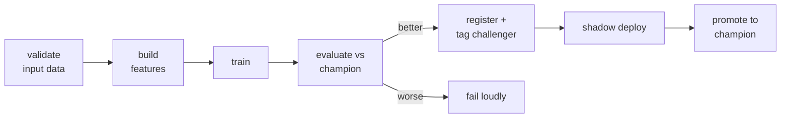

# Azure ML and the MLOps stack

> **What this is:** the Azure services for the model lifecycle, and how MLOps differs from ordinary DevOps.
> **Why you care:** shipping code is a solved problem. Shipping *models* adds two more moving parts — the data and the model itself — and each needs its own versioning, testing and release process.

---

## The idea in plain English

In normal software, one thing changes: **the code**. Version the code and you can reproduce any build exactly.

In machine learning, **three things change independently**:

```
        CODE                DATA               MODEL
   (training script)   (what it learned    (the weights that
                          from)             came out)
```

Change any one and the behaviour changes. So "which version is in production?" has three answers, and reproducing a result means pinning all three.

> **That's the whole of MLOps in one sentence: version and test data and models with the same rigour you already apply to code.** Everything else — registries, feature stores, drift monitoring — is machinery for that.

### What MLOps adds to DevOps

| | DevOps | MLOps |
|---|---|---|
| Versioned | Code | Code **+ data + model** |
| Tests | Unit, integration | Plus **data validation** and **model quality gates** |
| "It works" | Tests pass | Tests pass **and** it beats the current champion |
| Fails by | Throwing an error | **Silently getting less accurate** |
| Release | Deploy the build | Deploy, then **shadow, canary, monitor** |
| Rollback | Previous image | Previous **model version** — often just an alias flip |
| Done | Shipped | **Never** — it needs retraining forever |

---

## Two valid paths on Azure

There are two ways to do ML on Azure, and teams argue about it. Both are legitimate.

| | **Databricks-centric** | **Azure ML-centric** |
|---|---|---|
| Train | Databricks jobs | Azure ML compute clusters |
| Track | MLflow in Databricks | Azure ML (MLflow-compatible) |
| Registry | Unity Catalog models | Azure ML model registry |
| Serve | Container Apps / Databricks Model Serving | Azure ML managed endpoints |
| Pipelines | Databricks Workflows | Azure ML pipelines |
| Best when | Data engineering is already on Databricks | ML is the centre of gravity; you want managed endpoints |

> **For this stack, stay Databricks-centric.** Your data, Delta tables, Spark and MLflow are already there, and moving between platforms means moving data. Azure ML is here so you recognise it and can work in a team that chose it.
>
> **The reassuring part: Azure ML's tracking is MLflow.** Everything in [[MLflow experiment tracking]] transfers — you change the tracking URI and the rest of your code is unchanged.

---

## 1. The model registry — the centre of it all

Whichever path you take, this is the pivot point between training and serving.

```python
import mlflow
from mlflow import MlflowClient

mlflow.set_registry_uri("databricks-uc")     # register into Unity Catalog
client = MlflowClient()

# promote a run's model
mv = mlflow.register_model(f"runs:/{run_id}/model", "retail.models.sales_forecaster")

client.set_registered_model_alias("retail.models.sales_forecaster", "champion",   version=mv.version)
client.set_registered_model_alias("retail.models.sales_forecaster", "challenger", version=mv.version + 1)

client.update_model_version(
    name="retail.models.sales_forecaster", version=mv.version,
    description="LSTM, 8-week lookback. MAE 389 vs champion 412. Delta v14.",
)
```

**Serving loads by alias, never by path:**

```python
import mlflow

model = mlflow.pyfunc.load_model("models:/retail.models.sales_forecaster@champion")
```

> **This one indirection is what makes model releases sane.** Promoting a model is an alias change — seconds, no rebuild, no redeploy. Rolling back is pointing the alias at the old version. Compare that with baking a file path into an image and redeploying to change models.

**Registering into Unity Catalog** ([[Unity Catalog and orchestration]]) gives models the same three-level naming, permissions and lineage as your tables. One governance model for data *and* models is genuinely valuable.

---

## 2. The training pipeline

Training must be a **job**, not a notebook someone runs. Same reasoning as [[Unity Catalog and orchestration]]: repeatable, scheduled, logged, alerting.



### The data validation gate

Before training, assert the input is sane. Training on broken data produces a broken model that passes every code test.

```python
from pyspark.sql import functions as F

df = spark.table("retail.gold.customer_rfm")

assert df.count() > 1000, f"Only {df.count()} rows — upstream problem"
assert df.filter(F.col("monetary_value") < 0).count() == 0, "Negative monetary values"
assert df.filter(F.col("customer_id").isNull()).count() == 0, "Null customer IDs"

# distribution check against training-time stats
current_mean = df.agg(F.avg("monetary_value")).first()[0]
assert abs(current_mean - EXPECTED_MEAN) / EXPECTED_MEAN < 0.3, \
    f"monetary_value mean shifted: {current_mean:.0f} vs expected {EXPECTED_MEAN:.0f}"
```

> **Fail the job loudly rather than training on rubbish.** A failed job with an alert is a Tuesday morning annoyance. A model silently trained on a broken upstream join is a quarter of wrong decisions.

### The model quality gate

```python
import mlflow

new = evaluate(candidate, test_data)
champion = mlflow.pyfunc.load_model("models:/retail.models.sales_forecaster@champion")
old = evaluate(champion, test_data)                    # SAME test data

if new["mae"] >= old["mae"] * 0.98:                    # must be ≥2% better
    raise Exception(f"Candidate MAE {new['mae']:.1f} does not beat champion {old['mae']:.1f}")

if new["mae"] >= baseline_mae:                          # and must still beat naive
    raise Exception("Candidate does not beat the naive baseline")

mlflow.register_model(f"runs:/{run.info.run_id}/model", "retail.models.sales_forecaster")
```

> **Automatic retraining without an automatic quality gate is a machine for automatically deploying worse models.** The gate is the important half, and it must compare against the **current champion on the same test data** — not against the number in last quarter's notebook.

---

## 3. Feature stores — and whether you need one

**The problem they solve: training/serving skew.**

You compute `avg_basket_last_90d` in a Spark notebook for training, and again in Python inside the API for serving. Two implementations. They drift apart. Your model sees different numbers in production than it trained on, and nothing errors.

A feature store computes each feature **once**, from one definition, and serves it to both.

```python
from databricks.feature_engineering import FeatureEngineeringClient

fe = FeatureEngineeringClient()

fe.create_table(
    name="retail.features.customer_rfm",
    primary_keys=["customer_id"],
    timestamp_keys=["as_of_date"],          # ← enables point-in-time correctness
    df=rfm_features,
)

training_set = fe.create_training_set(
    df=labels,
    feature_lookups=[FeatureLookup(
        table_name="retail.features.customer_rfm",
        lookup_key="customer_id",
        timestamp_lookup_key="as_of_date",
    )],
    label="churned",
)
```

The killer feature is **point-in-time correctness**: for a label dated 1 March, it fetches the feature values *as they were on 1 March*, not today's. Doing that join by hand is fiddly and getting it wrong is a leakage bug ([[Problem framing]]).

> **Do you need one? Probably not yet.** For the capstone, `customer_rfm` in Delta *is* your feature store — one table, one definition, used by both training and the batch scoring job. That's the property that matters.
>
> **You need a real feature store when:** several models share features, you need low-latency online lookups, or you have genuine point-in-time complexity. Below that, a well-named Delta table does the job with none of the operational cost.

---

## 4. Azure ML, when you meet it

```python
from azure.ai.ml import MLClient, command
from azure.identity import DefaultAzureCredential

ml = MLClient(DefaultAzureCredential(), subscription_id, resource_group, workspace)

job = command(
    code="./src",
    command="python train.py --data ${{inputs.data}} --lr ${{inputs.lr}}",
    inputs={"data": Input(type="uri_folder", path="azureml://datastores/lake/paths/gold/"), "lr": 0.001},
    environment="azureml://registries/azureml/environments/sklearn-1.5/labels/latest",
    compute="cpu-cluster",
)
ml.jobs.create_or_update(job)
```

**What it gives you that Databricks doesn't:**

| Feature | Note |
|---|---|
| **Managed online endpoints** | Autoscaling REST serving with blue/green built in — genuinely nice |
| **Compute clusters** | Auto scale-to-zero GPU clusters for training |
| **AutoML** | Baseline models with no code — a decent Phase-2 baseline generator |
| **Responsible AI dashboard** | Fairness, error analysis, explanations |
| **Data assets** | Versioned dataset references |

```yaml
# managed endpoint deployment with traffic splitting
$schema: https://azuremlschemas.azureedge.net/latest/managedOnlineDeployment.schema.json
name: blue
endpoint_name: retail-forecast
model: azureml:sales_forecaster:3
instance_type: Standard_DS3_v2
instance_count: 2
```

```bash
az ml online-endpoint update --name retail-forecast --traffic "blue=90 green=10"
```

> That traffic split is the same canary idea as Container Apps revisions in [[Deployment patterns]] — every platform gives you a version of it, because everyone needs it.

**Authentication is the same story as everywhere else** — `DefaultAzureCredential`, managed identity, no stored secrets ([[Azure fundamentals]]).

---

## 5. The maturity ladder

Be honest about where you are, and move one rung at a time.

| Level | Looks like | You have |
|---|---|---|
| **0 · Manual** | Notebook, model emailed as a `.pkl` | Nothing reproducible |
| **1 · Tracked** | MLflow, versioned code, registry | Can reproduce and roll back |
| **2 · Automated training** | Scheduled retraining with quality gates | Retraining doesn't need a person |
| **3 · Automated deployment** | CI/CD promotes models, shadow/canary | Releases are routine |
| **4 · Monitored + auto-retrained** | Drift triggers retraining, gates block bad models | Self-maintaining |

> **The capstone should reach level 2, and that's a genuinely good place to be.** Most companies are at level 1. Level 4 is rarer than conference talks suggest, and it's only worth building when the model actually matters enough to justify it.

**Don't skip rungs.** Automated retraining (2) without tracking (1) means you can't tell what changed when it breaks. Auto-deployment (3) without monitoring (4) means you ship bad models faster.

---

## 6. What "done" looks like

- [ ] Training runs as a **scheduled job**, not a notebook
- [ ] Input data is **validated** before training, and failures alert
- [ ] Every run logs code version, **data version**, params, metrics, artifacts
- [ ] The model is in a **registry** with an alias
- [ ] A **quality gate** compares candidate vs. champion on the same test data
- [ ] Serving loads **by alias**, so promotion needs no redeploy
- [ ] Rollback is an alias flip, and you have **tested it**
- [ ] Every prediction is **logged** with its model version ([[Monitoring and iteration]])
- [ ] Drift and quality are **monitored**, with alerts
- [ ] The naive baseline stays deployed as a fallback
- [ ] A **runbook** exists for when it degrades

---

## When something goes wrong

| Symptom | Likely cause | Fix |
|---|---|---|
| Can't reproduce a model from three months ago | Data version not logged | Log the Delta version in every run |
| Retrained model performs worse in production | No quality gate, or gate used stale test data | Gate against the champion on the same data |
| Model works in training, wrong in serving | Training/serving skew | One feature definition; log feature order and the scaler |
| Promoting a model needs a redeploy | Serving loads a file path | Load by registry alias |
| Nobody knows which model is live | No version in responses or logs | Return and log `model_version` |
| Automated retraining shipped a bad model | Gate missing or too permissive | Require a margin over the champion |
| Training job trained on broken data | No data validation gate | Assert row counts, nulls, ranges, distributions |
| Features differ between train and serve | Two implementations | One shared definition, or a feature store |
| Leakage from future feature values | Point-in-time join done wrong | `timestamp_keys` / as-of joins |
| Everything works, then quietly decays | No monitoring | [[Monitoring and iteration]] |
| Team argues Databricks vs Azure ML | Both work | Follow the data; don't move it without a reason |

---

## Practice checklist

- [ ] **Code + data + model** — the three things that version independently
- [ ] What MLOps adds to DevOps
- [ ] Databricks-centric vs. Azure ML-centric, and why to follow the data
- [ ] The model registry, aliases, and **promotion without redeployment**
- [ ] Registering models into Unity Catalog for unified governance
- [ ] Training as a scheduled job with alerting
- [ ] **The data validation gate**
- [ ] **The model quality gate** — versus the current champion, same test data
- [ ] Training/serving skew and what a feature store solves
- [ ] Point-in-time correctness
- [ ] **Whether you actually need a feature store** — usually not yet
- [ ] Azure ML: managed endpoints, compute clusters, AutoML, traffic splitting
- [ ] The five-level maturity ladder, and not skipping rungs

## Hands-on

- [ ] Register both capstone models into Unity Catalog with `champion` aliases
- [ ] Change the API to load by alias instead of file path; promote a new version with no redeploy
- [ ] Add a data validation gate to the training job and trigger it by corrupting a column
- [ ] Add a quality gate that refuses to register a model that doesn't beat the champion by 2%
- [ ] Deliberately create training/serving skew (compute a feature two ways) and see that nothing errors
- [ ] Score yourself on the maturity ladder and pick the single next rung

## Resources

- [Databricks: MLOps guide](https://docs.databricks.com/machine-learning/mlops/index.html)
- [Azure ML documentation](https://learn.microsoft.com/azure/machine-learning/)
- [Databricks Feature Engineering](https://docs.databricks.com/machine-learning/feature-store/index.html)
- [Google: MLOps maturity levels](https://cloud.google.com/architecture/mlops-continuous-delivery-and-automation-pipelines-in-machine-learning)

## Next

[[Observability for data and ML pipelines]]
