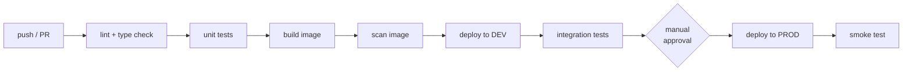

# CI-CD pipelines

> **What this is:** the robot that tests, builds and deploys your code every time you push — in both GitHub Actions and Azure DevOps.
> **Why you care:** [[Testing and CI-CD]] covers writing tests and a basic workflow. This is the full delivery pipeline: environments, approvals, infrastructure, and deploying data pipelines and models rather than just an app.

---

## The idea in plain English

**CI (Continuous Integration)** — every time anyone pushes, a robot on a clean machine checks out the code, installs it, and runs the tests. It stops "works on my machine" from being possible.

**CD (Continuous Delivery/Deployment)** — when those checks pass, the same robot builds the artifact and puts it where it needs to go.

The value isn't automation for its own sake. It's that **the path to production is one well-tested path that runs a hundred times**, rather than a person remembering eleven manual steps at 6pm on a Friday.

> **The rule that gives it teeth: if a human can deploy without the pipeline, the pipeline is decoration.** Branch protection plus deploy-only-from-CI is what makes it real.

---

## GitHub Actions vs. Azure DevOps

Both do the same job. You'll meet both.

| | GitHub Actions | Azure DevOps Pipelines |
|---|---|---|
| Config | `.github/workflows/*.yml` | `azure-pipelines.yml` |
| Unit of work | `job` → `steps` | `stage` → `job` → `steps` |
| Reusable step | `uses: action@v4` | `task: Name@2` |
| Approvals | Environments with reviewers | Environments with checks |
| Azure auth | OIDC federated credential | Service connection |
| Best when | The code is on GitHub | Enterprise Azure shop, or you use Boards/Repos |

> **For a personal project: GitHub Actions.** For a corporate Azure shop: whichever they already have. The *concepts* are identical, so learn one properly and the other is a syntax change.

---

## The full pipeline



**The two gates that matter:** tests must pass before a merge, and a human approves production.

---

## GitHub Actions — the real thing

```yaml
# .github/workflows/ci-cd.yml
name: CI/CD

on:
  push:
    branches: [main]
  pull_request:

env:
  REGISTRY: myacr.azurecr.io
  IMAGE: retail-api

permissions:
  id-token: write        # ← required for OIDC login to Azure
  contents: read

jobs:

  # ---------------- 1. QUALITY ----------------
  test:
    runs-on: ubuntu-latest
    steps:
      - uses: actions/checkout@v4

      - uses: astral-sh/setup-uv@v3
        with: {enable-cache: true}

      - run: uv sync --frozen

      - name: Lint
        run: |
          uv run ruff check .
          uv run ruff format --check .

      - name: Type check
        run: uv run mypy api/

      - name: Unit tests
        run: uv run pytest -m "not slow" --cov=api --cov-report=xml

      - uses: actions/upload-artifact@v4
        with: {name: coverage, path: coverage.xml}

  # ---------------- 2. BUILD ----------------
  build:
    needs: test
    if: github.ref == 'refs/heads/main'      # ← PRs test but don't build
    runs-on: ubuntu-latest
    outputs:
      tag: ${{ steps.meta.outputs.tag }}
    steps:
      - uses: actions/checkout@v4

      - id: meta
        run: echo "tag=$(git rev-parse --short HEAD)" >> $GITHUB_OUTPUT

      - uses: azure/login@v2
        with:
          client-id: ${{ secrets.AZURE_CLIENT_ID }}
          tenant-id: ${{ secrets.AZURE_TENANT_ID }}
          subscription-id: ${{ secrets.AZURE_SUBSCRIPTION_ID }}

      - run: az acr login --name myacr

      - uses: docker/build-push-action@v6
        with:
          push: true
          tags: |
            ${{ env.REGISTRY }}/${{ env.IMAGE }}:${{ steps.meta.outputs.tag }}
            ${{ env.REGISTRY }}/${{ env.IMAGE }}:latest
          cache-from: type=gha            # ← reuse layers between runs
          cache-to: type=gha,mode=max

      - name: Scan image
        uses: aquasecurity/trivy-action@master
        with:
          image-ref: ${{ env.REGISTRY }}/${{ env.IMAGE }}:${{ steps.meta.outputs.tag }}
          severity: CRITICAL,HIGH
          exit-code: '1'                  # fail the build on critical CVEs

  # ---------------- 3. DEPLOY DEV ----------------
  deploy-dev:
    needs: build
    runs-on: ubuntu-latest
    environment: dev
    steps:
      - uses: azure/login@v2
        with:
          client-id: ${{ secrets.AZURE_CLIENT_ID }}
          tenant-id: ${{ secrets.AZURE_TENANT_ID }}
          subscription-id: ${{ secrets.AZURE_SUBSCRIPTION_ID }}

      - run: |
          az containerapp update --name retail-api-dev --resource-group retail-dev-rg \
            --image ${{ env.REGISTRY }}/${{ env.IMAGE }}:${{ needs.build.outputs.tag }}

      - name: Smoke test
        run: |
          URL=$(az containerapp show --name retail-api-dev --resource-group retail-dev-rg \
                --query properties.configuration.ingress.fqdn -o tsv)
          curl -fsS "https://$URL/health" | tee /dev/stderr | grep -q '"ok"'

  # ---------------- 4. DEPLOY PROD (approval gated) ----------------
  deploy-prod:
    needs: deploy-dev
    runs-on: ubuntu-latest
    environment: production        # ← required reviewers configured in GitHub settings
    steps:
      - uses: azure/login@v2
        with:
          client-id: ${{ secrets.AZURE_CLIENT_ID }}
          tenant-id: ${{ secrets.AZURE_TENANT_ID }}
          subscription-id: ${{ secrets.AZURE_SUBSCRIPTION_ID }}

      # canary: 10% to the new revision first ([[Deployment patterns]])
      - run: |
          az containerapp update --name retail-api --resource-group retail-rg \
            --image ${{ env.REGISTRY }}/${{ env.IMAGE }}:${{ needs.build.outputs.tag }} \
            --revision-suffix ${{ needs.build.outputs.tag }}
          az containerapp ingress traffic set --name retail-api --resource-group retail-rg \
            --revision-weight latest=10
```

### The parts worth understanding

**`environment: production`** — this is what creates the approval gate. Configure required reviewers in *Settings → Environments*, and the job pauses until someone clicks approve. Environment secrets are also scoped here, so dev credentials can't reach prod.

**OIDC instead of a stored secret** — `permissions: id-token: write` plus `azure/login@v2` uses a **federated credential**: GitHub proves its identity to Azure and gets a short-lived token. **No client secret is stored anywhere, and nothing expires.**

```bash
# one-time setup: trust this repo's main branch
az ad app federated-credential create --id <app-id> --parameters '{
  "name": "github-main",
  "issuer": "https://token.actions.githubusercontent.com",
  "subject": "repo:Huz4y1/retail-platform:ref:refs/heads/main",
  "audiences": ["api://AzureADTokenExchange"]
}'
```

> **This is the modern way and it's strictly better than a stored secret.** A leaked client secret is valid until someone rotates it; an OIDC token lasts minutes and only works from that repo and branch. Use it wherever you can.

**`cache-from/to: type=gha`** — reuses Docker layers between CI runs. Turns a 4-minute rebuild into 40 seconds. The layer-ordering rules from [[Docker deep dive]] apply here too.

**Tag with the commit SHA** — `:latest` alone means you can never tell what's deployed or roll back to a specific build.

---

## Azure DevOps — the same thing

```yaml
# azure-pipelines.yml
trigger:
  branches: {include: [main]}

variables:
  imageName: retail-api
  registry: myacr.azurecr.io

stages:

  - stage: Test
    jobs:
      - job: RunTests
        pool: {vmImage: ubuntu-latest}
        steps:
          - task: UsePythonVersion@0
            inputs: {versionSpec: '3.12'}
          - script: pip install uv && uv sync --frozen
            displayName: Install
          - script: uv run ruff check . && uv run mypy api/
            displayName: Lint and type check
          - script: uv run pytest --junitxml=junit.xml --cov=api --cov-report=xml
            displayName: Tests
          - task: PublishTestResults@2
            inputs: {testResultsFiles: junit.xml}
            condition: succeededOrFailed()

  - stage: Build
    dependsOn: Test
    jobs:
      - job: BuildImage
        pool: {vmImage: ubuntu-latest}
        steps:
          - task: Docker@2
            inputs:
              containerRegistry: 'acr-service-connection'
              repository: $(imageName)
              command: buildAndPush
              tags: |
                $(Build.SourceVersion)
                latest

  - stage: DeployProd
    dependsOn: Build
    jobs:
      - deployment: Deploy               # ← "deployment" job, not "job"
        environment: production          # ← approvals attach to this
        pool: {vmImage: ubuntu-latest}
        strategy:
          runOnce:
            deploy:
              steps:
                - task: AzureCLI@2
                  inputs:
                    azureSubscription: 'azure-service-connection'
                    scriptType: bash
                    scriptLocation: inlineScript
                    inlineScript: |
                      az containerapp update --name retail-api \
                        --resource-group retail-rg \
                        --image $(registry)/$(imageName):$(Build.SourceVersion)
```

**Mapping between the two:**

| Concept | GitHub Actions | Azure DevOps |
|---|---|---|
| Trigger | `on:` | `trigger:` |
| Grouping | `jobs:` | `stages:` → `jobs:` |
| Ordering | `needs:` | `dependsOn:` |
| Reusable step | `uses:` | `task:` |
| Variable | `${{ env.X }}` | `$(X)` |
| Approval gate | `environment:` on a job | `environment:` on a `deployment` job |
| Azure auth | OIDC federated credential | Service connection |

---

## Deploying the things that aren't apps

An app is the easy case. Here's the rest of the stack.

### Databricks notebooks and jobs

Use **Databricks Asset Bundles** — the job definition lives in your repo and deploys like code:

```yaml
# databricks.yml
bundle:
  name: retail-pipeline

targets:
  dev:
    workspace: {host: https://adb-xxx.azuredatabricks.net}
    default: true
  prod:
    workspace: {host: https://adb-yyy.azuredatabricks.net}
    mode: production

resources:
  jobs:
    retail_daily:
      name: retail-daily-pipeline
      schedule: {quartz_cron_expression: "0 0 6 * * ?", timezone_id: Europe/London}
      email_notifications: {on_failure: [you@example.com]}
      tasks:
        - task_key: bronze
          notebook_task: {notebook_path: ./notebooks/01_bronze}
        - task_key: silver
          depends_on: [{task_key: bronze}]
          notebook_task: {notebook_path: ./notebooks/02_silver}
```

```yaml
      - run: |
          databricks bundle validate
          databricks bundle deploy --target prod
```

> **This is how you stop notebooks being untracked production code.** The job definition, the schedule, the alerting and the notebooks are all in Git, code-reviewed, and deployed by the pipeline — not clicked together in the UI where nobody can see the history.

### Database migrations

Schema changes need to be versioned and applied in order — never by hand.

```yaml
      - name: Migrate database
        run: uv run alembic upgrade head
```

> **Rules that prevent outages:** migrations must be **backwards compatible** with the currently running app, because for a moment both versions are live. Add a nullable column, deploy the code that uses it, *then* backfill, *then* add the constraint — three deploys. Never rename or drop a column in the same deploy as the code change.

### Infrastructure

```yaml
      - run: |
          terraform init
          terraform plan -out=tfplan          # ← post this on the PR
      # apply only after approval
      - run: terraform apply tfplan
```

> **Always `plan` on the PR and `apply` after approval.** The plan shows exactly what will be created, changed and *destroyed*. A `-/+` on a database means data loss. See [[Adjacent tools you will meet]].

### Models

Models have their own lifecycle — that's [[Azure ML and the MLOps stack]].

---

## Environments

| Environment | Purpose | Data |
|---|---|---|
| **dev** | Auto-deploy every merge to main | Sample or synthetic |
| **staging** | Pre-production rehearsal | Production-shaped, anonymised |
| **prod** | Real users | Real |

Keep them apart with **separate resource groups and separate catalogs** (`retail_dev.silver.sales` vs `retail_prod.silver.sales` — [[Unity Catalog and orchestration]]), and drive the difference from config, never from `if env == "prod"` branches scattered through the code.

> **Two environments is fine for a personal project.** Dev and prod. Don't build a five-environment promotion pipeline for a capstone — it's ceremony without benefit.

---

## Secrets in CI

| Where | How |
|---|---|
| GitHub Actions | Repository or Environment secrets; **OIDC for Azure** |
| Azure DevOps | Variable groups linked to Key Vault; service connections |
| Never | In the YAML, in the image, in a committed `.env` |

> **Secrets are not available to workflows triggered by pull requests from forks** — deliberately, so a stranger's PR can't exfiltrate your keys. Keep unit tests secret-free so PR checks always run; put anything needing credentials in a post-merge job.

---

## Making it fast

A slow pipeline gets bypassed. Aim for **under 5 minutes** to a merge decision.

| Technique | Saving |
|---|---|
| Cache dependencies (`enable-cache: true`) | Large |
| Cache Docker layers (`type=gha`) | Large |
| Run lint / type / test as parallel jobs | Wall-clock |
| `-m "not slow"` on PRs, everything on main | Large |
| `paths:` filters so docs changes don't rebuild | Skips entirely |
| Fail fast — lint before tests | Fails in 20s not 4min |

---

## When something goes wrong

| Symptom | Likely cause | Fix |
|---|---|---|
| Passes locally, fails in CI | Local env has something the runner doesn't | Commit the lockfile; `uv sync --frozen` |
| "Resource not accessible by integration" | Missing `permissions:` block | Add `id-token: write` for OIDC |
| Azure login fails | Federated credential subject doesn't match | Subject must match repo **and** ref exactly |
| Image push denied | Not logged into ACR, or no AcrPush role | `az acr login`; check the role |
| Deploy succeeds, app is broken | No smoke test | `curl /health` after every deploy |
| Failing check but merge allowed | No branch protection | Require status checks on `main` |
| Secrets empty on a PR | Fork PRs don't get secrets | Keep unit tests credential-free |
| Every run rebuilds everything | No caching | `cache-from/to: type=gha`, dependency cache |
| Pipeline takes 20 minutes | Slow tests on every PR | Split fast/slow with markers |
| Migration broke production | Not backwards compatible | Expand → migrate → contract, over three deploys |
| Can't tell what's deployed | Everything tagged `:latest` | Tag with the commit SHA |
| Notebook changes never reach the job | Notebooks edited in the UI | Databricks Asset Bundles from Git |

---

## Practice checklist

- [ ] CI vs. CD, and why the pipeline must be the *only* path to production
- [ ] GitHub Actions vs. Azure DevOps — the concept mapping
- [ ] The full pipeline shape: lint → test → build → scan → dev → integration → approval → prod
- [ ] **Environments as approval gates**
- [ ] **OIDC federated credentials instead of stored secrets**
- [ ] Docker layer caching in CI
- [ ] Tagging images with the commit SHA
- [ ] Image scanning as a build gate
- [ ] **Databricks Asset Bundles** — notebooks and jobs as versioned code
- [ ] Database migrations, and **expand → migrate → contract**
- [ ] `terraform plan` on the PR, `apply` after approval
- [ ] Environment separation via resource groups and catalogs, driven by config
- [ ] Keeping PR checks secret-free
- [ ] Keeping the pipeline under 5 minutes

## Hands-on

- [ ] Extend the capstone workflow to build and push an image tagged with the commit SHA
- [ ] Set up an OIDC federated credential and deploy to Azure with no stored secret
- [ ] Add a `production` environment with yourself as a required reviewer, and watch the job pause
- [ ] Add a smoke test that fails the deploy if `/health` doesn't respond
- [ ] Add Trivy scanning and introduce a vulnerable dependency to see it fail
- [ ] Convert your Databricks job to an Asset Bundle and deploy it from CI
- [ ] Time your pipeline, add caching, and time it again

## Resources

- [GitHub Actions docs](https://docs.github.com/actions)
- [Azure Pipelines docs](https://learn.microsoft.com/azure/devops/pipelines/)
- [Azure login with OIDC](https://learn.microsoft.com/azure/developer/github/connect-from-azure)
- [Databricks Asset Bundles](https://docs.databricks.com/dev-tools/bundles/index.html)

## Next

[[Azure ML and the MLOps stack]]
