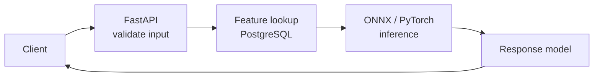

# 15 — FASTAPI

> The Python framework for building APIs.

**Why it matters:** FastAPI is the one door everything downstream goes through — dashboards, apps, other services. Type hints become validation, parsing and documentation at once.

Home: [[ULTIMATE ENGINEER]] · Roadmap: [[THE ULTIMATE ENGINEER ROADMAP]]

---

> **Already built.** [[FastAPI fundamentals]] · [[FastAPI data and deployment]]

## Complete references

**[[FastAPI reference]]** — the full API: routing, parameters, Pydantic, validation, responses, errors, dependencies, auth, middleware, CORS, lifespan, files, WebSockets, databases, testing, OpenAPI.

**[[Streamlit]]** — the dashboard/frontend layer: rerun model, caching, session state, every widget, charts, layout, multipage, fragments, chat.

**[[Streamlit deployment]]** — Docker, Community Cloud, Azure, AWS, GCP, Kubernetes.

## Topics

HTTP · REST · endpoints · GET/POST/PUT/DELETE · request bodies · response models · validation · **Pydantic** · authentication · authorisation · middleware · dependency injection · async · background tasks · error handling · testing · deployment

## Serving a PyTorch model

Load the model **once** at startup via `lifespan`, never per request. See [[FastAPI data and deployment]].

## The one rule about async

If you can't `await` everything inside it, use a plain `def`. An `async def` containing a blocking call freezes the whole server.

## Related
[[05 — SOFTWARE ENGINEERING]] · [[16 — DOCKER]] · [[Model export and serving]] · [[Actix Web]] (the Rust equivalent)
