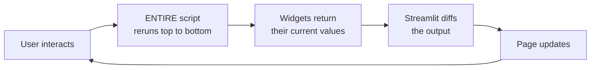
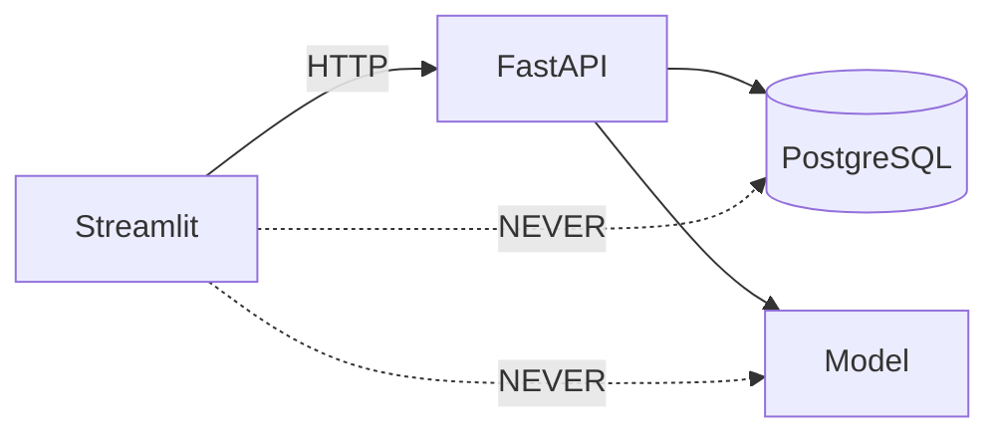

# Streamlit

Template: [[_Dictionary template]] · Section: [[15 — FASTAPI]]
Choosing it: [[Streamlit vs Django]] · Deploying it: [[Streamlit deployment]]

**This is the dashboard and frontend layer of every stack in this vault.**

---

## I want to…

**Find your task, click straight through to it.**

| I want to… | Go to |
|---|---|
| Understand what Streamlit is | [[#In simple words]] |
| **Run my app** | [[#Running it]] |
| Know whether to use it at all | [[#When to use it]] |
| **Understand why my variable keeps resetting** | [[#⚠️ The execution model — understand this or nothing makes sense]] |
| **Stop re-fetching data on every click** | [[#1. Caching — because reruns re-fetch everything]] |
| Choose `cache_data` or `cache_resource` | [[#The two decorators — pick the right one]] |
| Stop showing stale data | [[#Always set a TTL on live data]] |
| Cache something that won't hash | [[#Unhashable arguments]] |
| **Remember a value between reruns** | [[#2. Session state — for anything that must survive a rerun]] |
| Link a widget to stored state | [[#Binding widgets to state with `key`]] |
| Run code when a widget changes | [[#Callbacks]] |
| **Add a text box, number or date picker** | [[#Input]] |
| Add a dropdown, slider or checkbox | [[#Choice]] |
| Add a button, download or file upload | [[#Action]] |
| **Stop it rerunning on every keystroke** | [[#Forms — batch inputs into one rerun]] |
| Show text, markdown or a metric | [[#4. Display]] |
| **Show a dataframe or table** | [[#Data]] |
| Show a spinner, progress bar or toast | [[#Status]] |
| **Draw a chart** | [[#5. Charts]] |
| Draw an interactive chart | [[#Plotly — interactive, the usual choice]] |
| Draw a matplotlib figure | [[#Matplotlib — for anything scientific]] |
| **Lay the page out** | [[#6. Layout]] |
| Put controls in a sidebar | [[#Sidebar — controls go here]] |
| Split the page into columns | [[#Columns]] |
| Use tabs or a collapsible section | [[#Tabs, expanders, containers]] |
| **Add more than one page** | [[#7. Multipage apps]] |
| Rerun only part of the page | [[#8. Fragments — partial reruns]] |
| **Build a chat / LLM interface** | [[#9. Chat and LLM streaming]] |
| Store an API key or connect to a database | [[#10. Secrets and connections]] |
| Change the colours and fonts | [[#11. Theming]] |
| **Structure it properly with an API** | [[#12. The architecture rule]] |
| **Make a slow app faster** | [[#13. Performance]] |
| Add a login | [[#14. Authentication]] |
| Write tests | [[#15. Testing]] |
| Deploy it | [[#Cloud equivalents]] |
| **Fix something that's broken** | [[#Common mistakes]] |
| Debug it | [[#Debugging]] |
| Decide against it | [[#When NOT to use it]] |

### The numbered sections

1. [[#1. Caching — because reruns re-fetch everything\|Caching — because reruns re-fetch everything]] · 2. [[#2. Session state — for anything that must survive a rerun\|Session state — for anything that must survive a rerun]] · 3. [[#3. Widgets — the full set\|Widgets — the full set]]
4. [[#4. Display\|Display]] · 5. [[#5. Charts\|Charts]] · 6. [[#6. Layout\|Layout]]
7. [[#7. Multipage apps\|Multipage apps]] · 8. [[#8. Fragments — partial reruns\|Fragments — partial reruns]] · 9. [[#9. Chat and LLM streaming\|Chat and LLM streaming]]
10. [[#10. Secrets and connections\|Secrets and connections]] · 11. [[#11. Theming\|Theming]] · 12. [[#12. The architecture rule\|The architecture rule]]
13. [[#13. Performance\|Performance]] · 14. [[#14. Authentication\|Authentication]] · 15. [[#15. Testing\|Testing]]

---

## One sentence

Streamlit turns a Python script into a web app, with no HTML, CSS or JavaScript.

## In simple words

Normally, making a web page means learning three more languages and a framework.

Streamlit says: **write a Python script top to bottom. Every time you call a Streamlit function, that thing appears on a web page.**

```python
import streamlit as st
st.title("Hello")
name = st.text_input("Your name")
st.write(f"Hi {name}")
```

Three lines, a working web app with a text box that updates live. That's the entire pitch.

### Installing

```bash
uv add streamlit                     # in a uv project - PREFERRED
pip install streamlit                # plain pip, inside a virtual environment
```

**Without uv — a plain virtual environment:**

| | Windows (PowerShell) | WSL / Linux |
|---|---|---|
| Create | `python -m venv .venv` | `python3 -m venv .venv` |
| Activate | `.venv\Scripts\Activate.ps1` | `source .venv/bin/activate` |
| Install | `pip install streamlit` | `pip install streamlit` |

```bash
streamlit --version                  # check it worked
streamlit hello                      # the built-in demo app
```

> ⚠️ **In WSL, the browser doesn't open automatically** — the message prints a URL, and you click it or paste `http://localhost:8501` into Windows. WSL forwards the port for you, so no extra config is needed.

> ⚠️ **Port 8501 already in use?** A previous run is still going. `streamlit run app.py --server.port 8502`, or kill it: `taskkill /F /IM streamlit.exe` on Windows, `pkill -f streamlit` on WSL.

> **On Windows: if `streamlit` isn't recognised**, the Scripts folder isn't on PATH. Use `python -m streamlit run app.py`, or better, `uv run streamlit run app.py`.

### Chart libraries — what's extra

| Library | Need to install? |
|---|---|
| `st.line_chart`, `st.bar_chart`, `st.map` | **No** — built into Streamlit |
| **Altair** | **No** — ships as a Streamlit dependency |
| **Plotly** | **Yes** — `uv add plotly` |
| **Matplotlib** | **Yes** — `uv add matplotlib` |
| Saving a Plotly chart as PNG/PDF | `uv add kaleido` |

```bash
uv add plotly matplotlib             # the two you'll actually want
```

> **Plotly is the better default in WSL** — it renders as HTML in the browser, so it needs no display. Matplotlib in WSL can't open a GUI window, but inside Streamlit that doesn't matter: `st.pyplot(fig)` renders it to the page ([[Matplotlib and Plotly]]).

### Running it

```bash
streamlit run app.py                 # start it - opens http://localhost:8501 automatically
streamlit run app.py --server.port 8502          # a different port
streamlit run app.py --server.headless true      # don't open a browser (servers, Docker)
streamlit hello                      # the built-in demo app
streamlit cache clear                # wipe every cache when something looks stale
```

> **There is no build step and no `main()`.** The file *is* the app; save it and the browser offers to rerun.

## The problem it solves

You've built a model and a pipeline ([[Master architecture]]). Now someone non-technical needs to *see* the results.

**Before Streamlit, your options were:**

| Option | Problem |
|---|---|
| Send a Jupyter notebook | They can't run it, and it breaks when they try |
| Export a CSV | Static, stale the moment you send it |
| Build a React frontend | Weeks of work, a language you don't know |
| Build a Django app | Days of work, templates and routing to learn |

Streamlit gets a working, interactive, shareable dashboard in **an afternoon**, in the language you already use.

> **The trade you're making:** you get speed and simplicity. You give up fine-grained UI control and the ability to serve thousands of concurrent users. For internal tools and analyst dashboards that's the right trade nearly every time.

---

## ⚠️ The execution model — understand this or nothing makes sense

**Every time anyone interacts with anything, your entire script runs again from line 1.**

Move a slider? Rerun. Click a button? Rerun. Type a character? Rerun.

It is not a web app with event handlers. It is **a script that gets re-executed constantly**, and Streamlit diffs the output to update the page.

```python
import streamlit as st

count = 0                          # <- reset to 0 on EVERY rerun
if st.button("Add one"):
    count += 1
st.write(count)                    # always 0 or 1. Never 2.
```

That's not a bug. The script genuinely started over, so `count = 0` ran again.

> **Two features exist solely to work around this rule: caching and session state.** Everything else in Streamlit is widgets. Learn these two properly and Streamlit stops being surprising.



---

## 1. Caching — because reruns re-fetch everything

Without caching, every slider nudge re-hits your API or database. Ten interactions, ten identical queries.

```python
import pandas as pd
import requests
import streamlit as st

@st.cache_data(ttl=300)                      # remember for 5 minutes
def fetch_forecast(category: str, weeks: int) -> pd.DataFrame:
    r = requests.get(f"{API_URL}/forecast", params={"category": category, "weeks": weeks}, timeout=10)
    r.raise_for_status()
    return pd.DataFrame(r.json()["forecast"])
```

Streamlit hashes the **arguments**. Same arguments -> cached result, no network call.

### The two decorators — pick the right one

| Decorator | For | Behaviour |
|---|---|---|
| **`@st.cache_data`** | **Data** — DataFrames, dicts, API responses, query results | Returns a **copy** each time, so mutating it can't corrupt the cache |
| **`@st.cache_resource`** | **Connections and models** — DB pools, ML models, API clients | Returns the **same object**, shared across all users and sessions |

```python
import pandas as pd
import streamlit as st

@st.cache_resource                           # ONE model, shared by everyone
def load_model():
    return onnxruntime.InferenceSession("model.onnx")

@st.cache_resource                           # ONE connection pool
def get_engine():
    return create_engine(st.secrets["DATABASE_URL"], pool_pre_ping=True)

@st.cache_data(ttl=600)                      # data, copied per call
def run_query(sql: str) -> pd.DataFrame:
    return pd.read_sql(sql, get_engine())
```

> **Pick the wrong one and you get subtle bugs.** `cache_data` on a model tries to serialise it on every call — slow, and often it simply fails. `cache_resource` on a DataFrame means one user's edit is visible to everyone.
>
> **Rule of thumb: can it be pickled and copied cheaply? -> `cache_data`. Is it a live connection or a big object? -> `cache_resource`.**

### Always set a TTL on live data

```python
import streamlit as st

@st.cache_data(ttl=300)      # <- without this, the dashboard shows this morning's numbers forever
```

> **Missing `ttl` is the single most common Streamlit bug**, and it presents as "the dashboard is broken" when actually it's showing perfectly cached stale data. You'll waste an hour before checking the cache.

### Cache control

```python
import streamlit as st

st.cache_data.clear()                        # clear everything
fetch_forecast.clear()                       # clear one function

if st.button("Refresh"):                     # give users an escape hatch
    st.cache_data.clear()
    st.rerun()
```

### Unhashable arguments

```python
import pandas as pd
import streamlit as st

@st.cache_data
def query(_conn, sql: str):                  # <- leading underscore = don't hash this arg
    return pd.read_sql(sql, _conn)
```

---

## 2. Session state — for anything that must survive a rerun

`st.session_state` is a dict that persists across reruns, **per browser session**.

```python
import streamlit as st

if "count" not in st.session_state:          # initialise ONCE
    st.session_state.count = 0

if st.button("Add one"):
    st.session_state.count += 1

st.write(st.session_state.count)             # now it counts properly
```

### Binding widgets to state with `key`

Giving a widget a `key` binds it to session state automatically — the cleanest pattern:

```python
import streamlit as st

st.selectbox("Category", ["Kitchen", "Lighting"], key="category")
st.write(f"Showing: {st.session_state.category}")     # kept in sync both ways
```

### Callbacks

```python
import streamlit as st

def on_category_change():
    st.session_state.page = 1                # reset pagination when the filter changes

st.selectbox("Category", options, key="category", on_change=on_category_change)
```

> Callbacks run **before** the rerun, so state is already updated when the script re-executes.

> **`st.session_state` is per browser session and lives in memory.** Two people see separate state. A refresh clears it. It is not storage — for anything that must persist, write to a database.

---

## 3. Widgets — the full set

Every widget **returns its current value** on each rerun.

### Input

```python
from datetime import date
import streamlit as st

st.text_input("Name", value="", max_chars=50, placeholder="Type here")
st.text_area("Notes", height=150)
st.number_input("Weeks", min_value=1, max_value=52, value=4, step=1)
st.slider("Threshold", 0.0, 1.0, 0.5, step=0.05)
st.select_slider("Size", options=["S","M","L","XL"])
st.date_input("Date range", value=(date(2024,1,1), date(2024,12,31)))
st.time_input("Time")
st.color_picker("Colour", "#00A0A0")
```

### Choice

```python
import streamlit as st

st.checkbox("Include forecast")
st.toggle("Dark mode")
st.radio("Mode", ["Fast", "Accurate"], horizontal=True)
st.selectbox("Category", options, index=0)
st.multiselect("Categories", options, default=options[:2])
st.pills("View", ["Chart", "Table"])            # newer, compact
st.segmented_control("Range", ["7d", "30d", "90d"])
```

### Action

```python
import streamlit as st

if st.button("Run", type="primary", use_container_width=True): ...
st.download_button("Download CSV", df.to_csv(index=False), "data.csv", "text/csv")
st.link_button("Open docs", "https://example.com")
uploaded = st.file_uploader("Upload readings", type=["csv","parquet"])
picture = st.camera_input("Take a photo")
```

### Forms — batch inputs into one rerun

**Critically useful.** Without a form, every widget change triggers a full rerun. Inside a form, nothing happens until submit.

```python
import streamlit as st

with st.form("filters"):
    category = st.selectbox("Category", options)
    weeks    = st.slider("Weeks", 1, 52, 4)
    submitted = st.form_submit_button("Run forecast")

if submitted:
    result = fetch_forecast(category, weeks)     # runs ONCE, not on every keystroke
```

> **Use a form whenever the action is expensive** — an API call, a model run, a big query. Otherwise you fire it on every single widget interaction.

---

## 4. Display

```python
import streamlit as st

st.title("Retail Analytics")
st.header("Forecast")
st.subheader("By category")
st.markdown("**Bold** and `code` and [links](https://x.com)")
st.caption("Small grey text")
st.code("SELECT * FROM sales", language="sql")
st.divider()
st.write(anything)          # the magic catch-all - DataFrames, charts, dicts, objects
```

### Data

```python
import streamlit as st

st.dataframe(df, use_container_width=True, hide_index=True)   # interactive: sort, resize, search
st.table(df)                                                   # static
st.metric("Revenue", "GBP 12,400", delta="+8.2%")
st.json({"model": "v3"})
```

**`st.column_config`** — control how columns render:

```python
import streamlit as st

st.dataframe(df, column_config={
    "revenue":  st.column_config.NumberColumn("Revenue", format="%.2f"),
    "date":     st.column_config.DateColumn("Date", format="DD/MM/YYYY"),
    "trend":    st.column_config.LineChartColumn("Trend"),      # sparkline in a cell
    "progress": st.column_config.ProgressColumn("Progress", min_value=0, max_value=100),
    "url":      st.column_config.LinkColumn("Link"),
})
```

**`st.data_editor`** — an editable spreadsheet:

```python
import streamlit as st

edited = st.data_editor(df, num_rows="dynamic", key="editor")
if st.button("Save"):
    write_back(edited)
```

> `st.data_editor` returns the **edited** DataFrame. It's genuinely the fastest way to build a small internal CRUD tool.

### Status

```python
import streamlit as st

with st.spinner("Loading..."):
    data = slow_call()

with st.status("Running pipeline...", expanded=True) as status:
    st.write("Reading bronze...")
    st.write("Cleaning...")
    status.update(label="Done", state="complete")

progress = st.progress(0)
for i in range(100):
    progress.progress(i + 1, text=f"{i+1}%")

st.success("Done");  st.info("FYI");  st.warning("Careful");  st.error("Failed")
st.toast("Saved", icon="✅")
st.exception(err)
```

---

## 5. Charts

### Built-in — instant, limited

```python
import streamlit as st

st.line_chart(df, x="date", y=["revenue", "forecast"])
st.bar_chart(df, x="segment", y="count")
st.area_chart(df, x="date", y="revenue")
st.scatter_chart(df, x="frequency", y="monetary", color="segment", size="recency")
st.map(df)                                    # needs lat/lon columns
```

### Plotly — interactive, the usual choice

```python
import streamlit as st
import plotly.express as px
fig = px.line(df, x="date", y="revenue", color="category", title="Revenue by category")
fig.update_layout(hovermode="x unified")
st.plotly_chart(fig, use_container_width=True)
```

### Altair — declarative, best for layered charts

```python
import streamlit as st
import altair as alt
chart = (alt.Chart(df).mark_line()
    .encode(x="date:T", y="revenue:Q", color="category:N", tooltip=["date", "revenue"])
    .interactive())
st.altair_chart(chart, use_container_width=True)
```

### Matplotlib — for anything scientific

```python
import matplotlib.pyplot as plt
import streamlit as st

fig, ax = plt.subplots()
ax.plot(history["train"], label="train")
ax.plot(history["val"], label="val")
ax.legend()
st.pyplot(fig)
```

> **`use_container_width=True` on every chart.** Without it charts don't resize and the layout looks broken on other screens.

> **Which to use:** built-in for a quick look, **Plotly** for anything users interact with, Altair when you need layered/faceted charts, matplotlib for loss curves and scientific plots.

---

## 6. Layout

```python
import streamlit as st

st.set_page_config(page_title="Retail Analytics", page_icon="📊",
                   layout="wide", initial_sidebar_state="expanded")
```

> **`layout="wide"` on every dashboard.** The default centred column wastes most of a monitor.

### Sidebar — controls go here

```python
import streamlit as st

with st.sidebar:
    st.header("Filters")
    category = st.selectbox("Category", options)
    weeks    = st.slider("Weeks", 1, 52, 4)
```

### Columns

```python
import streamlit as st

c1, c2, c3 = st.columns(3)
c1.metric("Revenue", "12,400", "+8.2%")
c2.metric("Orders", "1,204")
c3.metric("Basket", "10.30", "-2.1%")

left, right = st.columns([2, 1])              # 2:1 width ratio
with left:  st.plotly_chart(fig)
with right: st.dataframe(summary)
```

### Tabs, expanders, containers

```python
import streamlit as st

tab1, tab2 = st.tabs(["Forecast", "Segments"])
with tab1: st.line_chart(df)

with st.expander("Show raw data"):            # collapsed by default
    st.dataframe(df)

with st.container(border=True):
    st.write("Boxed section")

placeholder = st.empty()                      # a slot you can overwrite later
placeholder.write("Loading...")
placeholder.line_chart(df)                    # replaces it
```

### Popovers and dialogs

```python
import streamlit as st

with st.popover("Settings"):
    st.checkbox("Show confidence bands")

@st.dialog("Confirm")
def confirm_delete(item):
    st.write(f"Delete {item}?")
    if st.button("Yes, delete"):
        delete(item); st.rerun()
```

---

## 7. Multipage apps

The modern way — `st.navigation` gives you full control:

```python
# app.py
import streamlit as st

pages = {
    "Analytics": [
        st.Page("views/overview.py",  title="Overview",  icon="📊", default=True),
        st.Page("views/forecast.py",  title="Forecast",  icon="📈"),
    ],
    "Admin": [
        st.Page("views/settings.py",  title="Settings",  icon="⚙️"),
    ],
}
pg = st.navigation(pages)
st.set_page_config(page_title="Retail", layout="wide")
pg.run()
```

The older convention still works — a `pages/` directory beside your main script, files auto-ordered by filename:

```
app.py
pages/
├── 1_Overview.py
├── 2_Forecast.py
└── 3_Settings.py
```

> **Session state is shared across pages**, so filters set on one page persist to the next. Caching is shared too.

---

## 8. Fragments — partial reruns

**The fix for "one slow chart makes the whole page slow".** A fragment reruns *on its own* without rerunning the rest of the script.

```python
import streamlit as st

@st.fragment(run_every="30s")                 # auto-refresh just this bit
def live_metrics():
    data = fetch_live()
    st.metric("Requests/min", data["rpm"])

live_metrics()
```

```python
import streamlit as st

@st.fragment
def filter_panel():
    cat = st.selectbox("Category", options)   # changing this reruns ONLY this fragment
    st.dataframe(filtered(cat))
```

> **Fragments are the single biggest performance feature in modern Streamlit.** If your dashboard has one expensive section and several cheap interactive ones, wrapping the cheap ones in fragments stops them triggering the expensive rerun.

---

## 9. Chat and LLM streaming

For an LLM interface ([[LLM and GenAI track]]):

```python
import streamlit as st

if "messages" not in st.session_state:
    st.session_state.messages = []

for m in st.session_state.messages:
    with st.chat_message(m["role"]):
        st.markdown(m["content"])

if prompt := st.chat_input("Ask about the data"):
    st.session_state.messages.append({"role": "user", "content": prompt})
    with st.chat_message("user"):
        st.markdown(prompt)

    with st.chat_message("assistant"):
        response = st.write_stream(stream_llm(prompt))    # renders tokens as they arrive
    st.session_state.messages.append({"role": "assistant", "content": response})
```

> **`st.write_stream` consumes a generator and returns the full text** when done — so you get live streaming *and* the complete string to store, in one call. It's what makes a Streamlit chat UI feel fast.

---

## 10. Secrets and connections

`.streamlit/secrets.toml` — **gitignored**:

```toml
API_URL = "http://localhost:8000"

[connections.postgres]
dialect  = "postgresql"
host     = "localhost"
port     = 5432
database = "pipeline"
username = "pipeline"
password = "devonly"
```

```python
import streamlit as st

api_url = st.secrets["API_URL"]

conn = st.connection("postgres", type="sql")
df = conn.query("SELECT * FROM daily_readings WHERE date > :d",
                params={"d": start}, ttl=600)          # caching built in
```

> **`st.connection` handles pooling and caching for you.** For the pipelines in this vault, though, the dashboard should call **[[FastAPI fundamentals|the API]]**, not the database directly — see the architecture rule below.

---

## 11. Theming

`.streamlit/config.toml`:

```toml
[theme]
base = "dark"
primaryColor = "#00A0A0"
backgroundColor = "#0E1117"
secondaryBackgroundColor = "#1A1D24"
textColor = "#FAFAFA"

[server]
port = 8501
headless = true
maxUploadSize = 200

[browser]
gatherUsageStats = false
```

Custom CSS, when you must:

```python
import streamlit as st

CSS = "<style>.stApp { max-width: 1400px; margin: auto; }</style>"
st.markdown(CSS, unsafe_allow_html=True)
```

> **Custom CSS targets internal `data-testid` attributes that can change between Streamlit versions.** Use it sparingly and pin your Streamlit version if you rely on it.

---

## 12. The architecture rule



> **The dashboard never touches the database or the model directly.** It calls the API.
>
> **Why:** the dashboard would need the database password, it would need to know the schema, and every schema change would break it. One API means one place holding credentials, one contract, one thing to change. This is the rule in [[Master architecture]] and it's the main structural decision in the whole stack.

```python
import requests
import streamlit as st

API_URL = st.secrets["API_URL"]

@st.cache_data(ttl=300)
def api_get(path: str, **params):
    r = requests.get(f"{API_URL}{path}", params=params, timeout=15)
    r.raise_for_status()
    return r.json()

try:
    with st.spinner("Loading..."):
        forecast = api_get("/sales/forecast", category=category, weeks=weeks)
except requests.HTTPError as e:
    st.error(f"API returned {e.response.status_code}. Is the service running?")
    st.stop()
except requests.RequestException:
    st.error("Could not reach the API.")
    st.stop()
```

> **Always wrap API calls in try/except.** Streamlit's default failure mode is a red Python traceback in the middle of the page — ugly, and meaningless to a non-developer. `st.error()` + `st.stop()` gives a clean message.

---

## 13. Performance

| Technique | Effect |
|---|---|
| **`@st.cache_data(ttl=...)`** | Stops re-fetching on every interaction. **Biggest win.** |
| **`@st.cache_resource`** | One model / connection pool, not one per rerun |
| **`st.form`** | Batches inputs into one rerun instead of one per keystroke |
| **`@st.fragment`** | Reruns one section, not the whole script |
| Filter in SQL, not pandas | Move work to the database |
| `st.dataframe` over `st.table` | Virtualised; handles large frames |
| Sample before plotting | Charts choke well before 100k points |
| `use_container_width=True` | Layout, not speed, but always do it |

> **Diagnose in this order:** is it cached? is it in a form? is it a fragment? is the API slow ([[Deployment patterns]] — usually the database)?

---

## 14. Authentication

Streamlit has **no built-in auth**. Options, in order of preference:

| Option | Use when |
|---|---|
| **Platform auth** — Container Apps / Cloud Run / ALB in front | ✅ Best. Identity handled before the request arrives. |
| `st.experimental_user` + OIDC | Native OIDC login, newer Streamlit |
| `streamlit-authenticator` | Simple username/password for a small team |
| A reverse proxy (oauth2-proxy, nginx) | Self-hosted |
| Roll your own with session state | ❌ Don't |

> **Put auth in front of the app, not inside it.** A password check in Python still runs the script — and anything before the check has already executed. Platform-level auth is both simpler and actually secure. See [[Streamlit deployment]].

---

## 15. Testing

```python
from streamlit.testing.v1 import AppTest

def test_dashboard_loads():
    at = AppTest.from_file("dashboard/app.py").run()
    assert not at.exception
    assert at.title[0].value == "Retail Analytics"

def test_filter_changes_output():
    at = AppTest.from_file("dashboard/app.py").run()
    at.selectbox[0].select("Lighting").run()
    assert "Lighting" in at.markdown[0].value
```

> `AppTest` runs the script headlessly and lets you inspect and drive widgets. Wire it into CI ([[Testing and CI-CD]]) — it catches the "someone renamed a column and the whole dashboard crashes" class of bug.

---

## When to use it

- Internal tools and analyst dashboards
- ML demos and model exploration
- Quick prototypes
- Data-entry tools (`st.data_editor`)
- LLM chat interfaces
- Anything where **you** are the frontend developer

## When NOT to use it

| Situation | Use instead |
|---|---|
| Public product with accounts and permissions | **Django** ([[Streamlit vs Django]]) or React + [[FastAPI fundamentals]] |
| Hundreds of concurrent users | React + API |
| Pixel-perfect or unusual UI | React |
| Mobile app | React Native ([[Expo]]) |
| A static report | Export a PDF |
| Sub-100ms interactions | Anything client-side — every interaction is a server round trip |

---

## Common mistakes

| Mistake | What happens | Fix |
|---|---|---|
| Expecting variables to persist | Reset every rerun | `st.session_state` |
| No `ttl` on cached data | Dashboard shows stale data forever | `@st.cache_data(ttl=300)` |
| `cache_data` on a model | Slow, or fails to serialise | `@st.cache_resource` |
| `cache_resource` on a DataFrame | One user's mutation affects everyone | `@st.cache_data` |
| No caching at all | Hammers the API on every interaction | Cache the fetch function |
| Expensive call outside a form | Fires on every keystroke | `st.form` |
| Unhandled API error | Red traceback on the page | try/except + `st.error` + `st.stop` |
| Dashboard queries the DB directly | Credentials in the dashboard, schema coupling | Call the API |
| Missing `--server.address=0.0.0.0` | Unreachable in Docker | Set it |
| Missing `--server.headless=true` | Container hangs asking for an email | Set it |
| Default centred layout | Wastes the screen | `layout="wide"` |
| Plotting 500k points | Browser freezes | Sample or aggregate first |
| Secrets in the script | Committed to git | `.streamlit/secrets.toml`, gitignored |

---

## Debugging

1. **Add `st.write(st.session_state)`** — see the entire state live. Fastest way to understand a state bug.
2. **Is it a caching problem?** Comment out the decorator. If the bug disappears, it's the cache.
3. **`streamlit run app.py --logger.level=debug`**
4. **Check the rerun count** — `st.write(time.time())` at the top shows how often the script runs.
5. **`st.exception(e)`** in a try/except to see the full traceback in the app.
6. **Clear the cache** — `C` then "Clear cache" in the app menu.

---

## Cloud equivalents

Streamlit is Streamlit everywhere — only the hosting changes:

| Local | Azure | AWS | GCP |
|---|---|---|---|
| `streamlit run` / Docker | Container Apps | App Runner / ECS | Cloud Run |

Full deployment detail per stack: **[[Streamlit deployment]]**

Also: **Streamlit Community Cloud** — free, one-click from a GitHub repo, ideal for portfolio projects.

---

## Alternatives

| Alternative | Choose it when |
|---|---|
| **Gradio** | ML model demos specifically; simpler, less flexible |
| **Dash** (Plotly) | You need callback-driven control and heavy charting |
| **Panel** | Scientific/HoloViz ecosystem |
| **Marimo** | Reactive notebooks; no full-rerun model |
| **Django** | A real product ([[Streamlit vs Django]]) |
| **React + FastAPI** | Full control, any scale |
| **Power BI** | Business users self-serving ([[Adjacent tools you will meet]]) |

---

## Real-world use

Internal analytics dashboards · ML model demos · data-labelling tools · A/B test readouts · LLM chat interfaces · ops dashboards · [[Project 005 — Real-time Prediction API]] · [[Capstone build guide]]

## Prerequisites

Python · [[FastAPI fundamentals]] (what it talks to) · [[Docker deep dive]] (to deploy it)

## Learning progression

- **Beginner:** widgets, `st.write`, layout, built-in charts
- **Intermediate:** **the rerun model**, caching, session state, forms, Plotly
- **Advanced:** fragments, multipage, `data_editor`, custom components, `AppTest`
- **Production:** platform auth, containerised deployment, secrets, monitoring

## Practical project

Build the dashboard in [[Capstone build guide]] Part 3 — every number sourced from the API, with caching and session-state filters.

## Related

[[Streamlit vs Django]] · [[Streamlit deployment]] · [[FastAPI fundamentals]] · [[FastAPI data and deployment]] · [[Docker deep dive]] · [[Master architecture]] · [[Deployment patterns]] · [[LLM and GenAI track]] · [[Observability for data and ML pipelines]]
