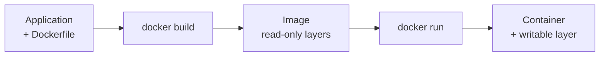

# 16 — DOCKER

> Packaging an application with everything it needs to run.

**Why it matters:** Containers ended 'works on my machine'. They're also the unit of deployment for everything in this vault.

Home: [[ULTIMATE ENGINEER]] · Roadmap: [[THE ULTIMATE ENGINEER ROADMAP]]

---

> **Already built.** [[Docker deep dive]] — the full treatment.

## Topics

Containers vs VMs · images · Dockerfiles · **layers and caching** · registries · volumes · networks · environment variables · Docker Compose · security · multi-stage builds

## The flow

## The three things that matter most

1. **Layer ordering** — dependencies before code, or every edit rebuilds everything
2. **`--host 0.0.0.0`** — `localhost` inside a container means that container
3. **Multi-stage builds** — build tools stay in stage 1

## Related
[[17 — KUBERNETES]] · [[Containers and deployment]] · [[Running the whole stack locally]] · [[04 — COMPUTER SCIENCE]]
