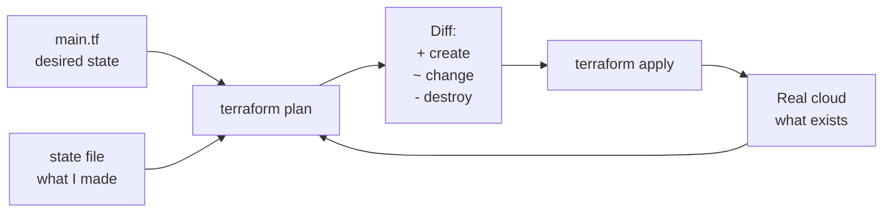

# Terraform

Template: [[_Dictionary template]] · Section: [[18 — TERRAFORM]]

---

## One sentence

Terraform lets you describe cloud infrastructure in files and have it created, changed and destroyed automatically.

## In simple words

Instead of clicking through a website to create a server, you write down what you want in a file:

> "I want one storage account, one database, and one Kubernetes cluster."

Terraform reads the file, looks at what exists, and makes reality match. Run it twice and the second run does **nothing** — because reality already matches.

## The problem it solves

You built your environment by clicking in the Azure portal. Three months later:

- What exactly did you create? Nobody wrote it down.
- Why is that firewall rule there? Nobody remembers.
- Make an identical staging environment? Three days of careful clicking, and it's subtly different.
- Someone changed something. Who? When? No idea.
- Delete everything cleanly? You'll miss something and pay for it for a year.

Terraform makes infrastructure **code**: reviewable in a pull request, versioned in Git, reproducible exactly, and deletable in one command.

## How it works



Terraform compares three things — your files, its state file, and reality — then computes the minimum set of changes.

## Important vocabulary

| Term | Meaning |
|---|---|
| **Provider** | The plugin for a cloud (`azurerm`, `aws`, `google`) |
| **Resource** | One thing to create |
| **Data source** | Read something that already exists |
| **Variable** | An input |
| **Output** | A value to expose |
| **Module** | A reusable group of resources |
| **State** | Terraform's record of what it created |
| **Plan** | The proposed change set |
| **Drift** | Reality differing from state (someone clicked in the portal) |

## Code

### Level 1 — tiny

```hcl
resource "azurerm_resource_group" "main" {
  name     = "retail-rg"
  location = "uksouth"
}
```

```bash
terraform init && terraform plan && terraform apply
```

### Level 2 — practical

```hcl
variable "environment" {
  type    = string
  default = "dev"
}

resource "azurerm_resource_group" "main" {
  name     = "retail-${var.environment}-rg"
  location = "uksouth"
}

resource "azurerm_storage_account" "lake" {
  name                     = "retail${var.environment}store"
  resource_group_name      = azurerm_resource_group.main.name   # <- implicit dependency
  location                 = azurerm_resource_group.main.location
  account_tier             = "Standard"
  account_replication_type = "LRS"
  is_hns_enabled           = true                                # ADLS Gen2
}

output "storage_endpoint" {
  value = azurerm_storage_account.lake.primary_dfs_endpoint
}
```

> **Dependencies are inferred, not declared.** Because the storage account references `azurerm_resource_group.main.name`, Terraform knows to create the group first. You almost never need `depends_on`.

### Level 3 — production

```hcl
terraform {
  required_version = ">= 1.9"
  required_providers {
    azurerm = { source = "hashicorp/azurerm", version = "~> 4.0" }
  }

  backend "azurerm" {                    # <- remote state with locking
    resource_group_name  = "tfstate-rg"
    storage_account_name = "tfstate01"
    container_name       = "tfstate"
    key                  = "retail.tfstate"
  }
}
```

```bash
terraform workspace new prod
terraform plan -var-file=prod.tfvars -out=tfplan
terraform apply tfplan
```

## What happens under the hood

When you run `terraform apply`:

1. **Init** — downloads provider plugins.
2. **Refresh** — queries the real cloud for each resource in state.
3. **Plan** — builds a dependency graph and diffs desired vs. actual.
4. **Lock** — takes a lock on the state file so nobody else applies simultaneously.
5. **Apply** — walks the graph, calling cloud APIs in dependency order, parallelising where it can.
6. **Write state** — records what now exists.

> **The state file is the critical piece.** Lose it and Terraform forgets what it made — it will try to create everything again. Corrupt it and it will try to destroy things it shouldn't. **Store it remotely, with locking and versioning, always.**

## When to use it

- More than one environment
- More than one person touching infrastructure
- Infrastructure that must be reproducible or auditable
- Anything you'll want to delete cleanly

## When NOT to use it

| Situation | Use instead |
|---|---|
| A one-off experiment you'll delete today | The CLI |
| Learning what a service even does | The portal — click first, codify after |
| Deploying application code | [[CI-CD pipelines]] — Terraform does infra, not apps |
| Config inside a running system | Ansible, or the app's own config |

> **Terraform manages infrastructure, not application state.** Don't use it to create database tables or deploy containers — use migrations ([[CI-CD pipelines]]) and your orchestrator.

## Common mistakes

| Mistake | What happens | Fix |
|---|---|---|
| State file committed to Git | Secrets leaked | `.gitignore` it; use a remote backend |
| Local state, two people | Corruption, duplicate resources | Remote backend with locking |
| `apply` without reading the plan | Accidental destruction | Always read it; look for `-/+` |
| Editing in the portal too | **Drift** — plan wants to undo your change | One source of truth |
| Hardcoded secrets in `.tf` | In Git forever | Variables + Key Vault |
| Unpinned provider versions | Breaks on upgrade | `version = "~> 4.0"` |
| One giant `main.tf` | Unreviewable, slow | Split into modules |
| `terraform destroy` on prod | Exactly what it says | Separate state per environment |

## Debugging

1. **`terraform plan`** — read it properly. `-/+` means destroy-and-recreate.
2. **`terraform state list`** — what does Terraform think exists?
3. **`terraform show`** — full current state.
4. **`terraform refresh`** — reconcile state with reality (detect drift).
5. **`TF_LOG=DEBUG terraform apply`** — the actual API calls.
6. **`terraform import`** — adopt an existing resource into state.

## Security

- **State contains secrets in plaintext** — passwords, keys, connection strings. Encrypt the backend, restrict access.
- Use **OIDC / managed identity** in CI rather than long-lived credentials ([[CI-CD pipelines]])
- Never commit `.tfvars` with real values
- Review `plan` output for accidental permission widening

## Alternatives

| Alternative | Choose it when |
|---|---|
| **Bicep / ARM** | Azure-only, want Microsoft-native tooling |
| **CloudFormation** | AWS-only |
| **Pulumi** | You'd rather write Python/TypeScript than HCL |
| **CDK** | Same, cloud-vendor version |
| **Ansible** | Configuring servers, not creating them |

## Cloud equivalents

Terraform is the cross-cloud one — that's its main advantage. See [[Cloud comparison dictionary]].

| Local | Azure | AWS | GCP |
|---|---|---|---|
| Terraform + Docker | Terraform / Bicep | Terraform / CloudFormation | Terraform / Deployment Manager |

## Prerequisites

[[19 — CLOUD]] · [[Azure fundamentals]] · [[Dev environment - Git, Docker, CLI]]

## Learning progression

- **Beginner:** one resource, `init`/`plan`/`apply`/`destroy`
- **Intermediate:** variables, outputs, remote state, workspaces
- **Advanced:** modules, `import`, drift management, CI integration, policy as code
- **Research:** state as a distributed-systems problem; declarative infrastructure semantics

## Practical project

[[Project 007 — Cloud Deployment]] — the same infrastructure, defined once, deployed to three clouds.

## Related

[[18 — TERRAFORM]] · [[19 — CLOUD]] · [[Adjacent tools you will meet]] · [[CI-CD pipelines]] · [[Kubernetes and AKS]] · [[26 — SECURITY]]
