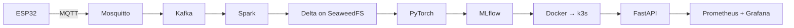
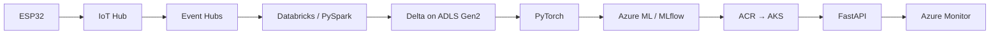
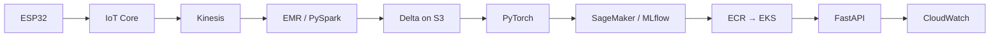
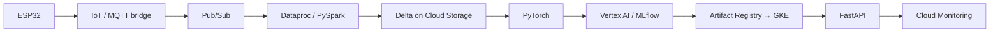

# Cloud comparison dictionary

One concept per row, four implementations per row. When you know one cloud, this tells you the other three.

Home: [[ULTIMATE ENGINEER]] · Architecture: [[Master architecture]]

---

> **This page is the translation table. To actually build it, see [[Pipeline setup - overview]]** - step-by-step guides for [[Pipeline setup - Local|Local]], [[Pipeline setup - Azure|Azure]], [[Pipeline setup - AWS|AWS]] and [[Pipeline setup - GCP|GCP]].

## The master table

| Concept | Local | Azure | AWS | GCP |
|---|---|---|---|---|
| **Server / VM** | Your laptop | Virtual Machines | EC2 | Compute Engine |
| **Serverless containers** | Docker | Container Apps | ECS Fargate / App Runner | Cloud Run |
| **Kubernetes** | k3s / kind | AKS | EKS | GKE |
| **Container registry** | local registry | ACR | ECR | Artifact Registry |
| **Relational DB** | [[PostgreSQL]] | [[Azure Database for PostgreSQL\|Azure DB for PostgreSQL]] | [[AWS RDS for PostgreSQL\|RDS]] | Cloud SQL |
| **Data warehouse** | DuckDB | Synapse / Fabric | Redshift | BigQuery |
| **Object storage** | [[SeaweedFS]] | [[ADLS Gen2\|Blob / ADLS Gen2]] | [[AWS S3\|S3]] | Cloud Storage |
| **Streaming** | Kafka | Event Hubs | Kinesis | Pub/Sub |
| **Message queue** | RabbitMQ | Service Bus | SQS | Cloud Tasks |
| **Pub/sub fan-out** | Kafka topics | Event Grid | SNS | Pub/Sub |
| **Spark** | Local Spark | Databricks / Synapse | EMR | Dataproc |
| **Notebooks** | Jupyter | Databricks | SageMaker Studio | Vertex AI Workbench |
| **ML platform** | MLflow | Azure ML | SageMaker | Vertex AI |
| **Experiment tracking** | MLflow | Azure ML (MLflow API) | SageMaker Experiments | Vertex AI Experiments |
| **Model registry** | MLflow Registry | Azure ML / Unity Catalog | SageMaker Registry | Vertex AI Registry |
| **IoT ingest** | Mosquitto (MQTT) | IoT Hub | IoT Core | IoT Core |
| **API hosting** | FastAPI + uvicorn | Container Apps / App Service | ECS / Lambda | Cloud Run |
| **Serverless functions** | — | Azure Functions | Lambda | Cloud Functions |
| **Secrets** | `.env` / Vault | Key Vault | Secrets Manager | Secret Manager |
| **Identity / permissions** | Unix users | Entra ID + RBAC | IAM | IAM |
| **Workload identity** | — | Managed Identity | IAM Roles for Service Accounts | Workload Identity |
| **Monitoring** | Prometheus | Azure Monitor | CloudWatch | Cloud Monitoring |
| **Logs** | Loki | Log Analytics | CloudWatch Logs | Cloud Logging |
| **Traces** | Tempo / Jaeger | Application Insights | X-Ray | Cloud Trace |
| **Dashboards** | Grafana | Azure Monitor Workbooks | CloudWatch Dashboards | Cloud Monitoring |
| **Network boundary** | Docker network | VNet | VPC | VPC |
| **Load balancer** | nginx | Azure Load Balancer / App Gateway | ALB / NLB | Cloud Load Balancing |
| **CDN** | — | Azure Front Door | CloudFront | Cloud CDN |
| **IaC** | Terraform | Terraform / Bicep | Terraform / CloudFormation | Terraform |
| **CI/CD** | GitHub Actions | Azure DevOps / Actions | CodePipeline / Actions | Cloud Build / Actions |
| **GPU** | Your NVIDIA card | NC / ND series | P / G instances | A2 / G2 instances |

---

## The same pipeline, four times

### Local — *your laptop is the server*

Full setup: [[Running the whole stack locally]]

### Azure

### AWS

### GCP

> **Notice how little changes.** The middle of every pipeline — PySpark, Delta, PyTorch, MLflow, Docker, FastAPI — is **identical across all four**. Only the edges (ingest, storage endpoint, identity, monitoring) differ. That's the single most useful thing on this page: **learn the open-source middle deeply, and the cloud becomes a config change.**

---

## What genuinely differs

The table implies these are interchangeable. Mostly they are. These are the places they aren't:

| Area | Real difference |
|---|---|
| **Identity** | The hardest thing to port. Entra ID, IAM and GCP IAM have genuinely different models. Budget real time here. |
| **Networking** | VNet/VPC concepts map, but the details (peering, private endpoints, egress) don't. |
| **Streaming semantics** | Kinesis shards ≠ Kafka partitions ≠ Pub/Sub subscriptions. Ordering and replay guarantees differ. |
| **Spark flavour** | Databricks is genuinely ahead (Photon, Unity Catalog). EMR and Dataproc are closer to vanilla Spark. |
| **Warehouse** | BigQuery is architecturally unusual (separated storage/compute, no indexes). Not a drop-in for Redshift/Synapse. |
| **Egress cost** | All four charge to get data *out*. This quietly dominates multi-cloud designs. |

> **Don't design for multi-cloud portability by default.** It costs real effort and you almost certainly won't move. Design for *portable concepts* — object storage, containers, Spark, Postgres — and accept cloud-specific identity and networking. That gets you 90% of the portability for 10% of the cost.

---

## Which to learn

You already have [[Data Engineering]] built on Azure. That's the right choice to go deep on.

**The skill that transfers is the concept, not the console.** An engineer who deeply understands object storage, a distributed log, Spark's execution model, and container orchestration can be productive on any of the four in a fortnight. An engineer who memorised the Azure portal cannot.

---

## Per-technology pages

Each of these has (or will have) its own dictionary page with the full structure:

[[Kafka]] · [[Docker deep dive]] · [[Kubernetes and AKS]] · [[PySpark core]] · [[Databricks and Delta Lake]] · [[ADLS Gen2]] · [[Azure SQL Database]] · [[MLflow experiment tracking]] · [[FastAPI fundamentals]] · [[Terraform]] · [[MQTT]] · [[29 — DICTIONARY]]
