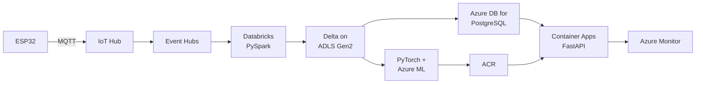

# Pipeline setup - Azure

The full pipeline on Azure, end to end, from an empty subscription.

Overview: [[Pipeline setup - overview]] · Local first: [[Pipeline setup - Local]] · Fundamentals: [[Azure fundamentals]]

---

## 💸 Before anything else

```
Portal → Cost Management + Billing → Budgets → Add
```

**Set it to £20 with alerts at 50% and 80%.** Do this before creating a single resource. It's free and it's the difference between a £30 mistake and a £600 one.

## What you'll build



## Variables used throughout

```bash
export RG=pipeline-rg
export LOC=uksouth
export SUFFIX=$RANDOM          # storage/ACR names are GLOBALLY unique
export SA=pipelinestore$SUFFIX
export ACR=pipelineacr$SUFFIX
export PG=pipeline-pg-$SUFFIX
export KV=pipeline-kv-$SUFFIX
```

> **Pick one region and never change it.** Cross-region traffic costs money and latency for zero benefit.

---

## Step 1 — Foundation

```bash
az login
az account show --output table
az account set --subscription "<your subscription>"

az group create --name $RG --location $LOC
```

**A resource group is a folder with one superpower: `az group delete` removes everything inside it.** That is your cost-control mechanism. Put everything in this one group.

### Identity — do this now, not later

```bash
# Key Vault for secrets
az keyvault create --name $KV --resource-group $RG --location $LOC \
  --enable-rbac-authorization true
```

> **The single most confusing thing in Azure: control plane vs data plane.**
>
> Being **Owner** of a storage account does **not** let you read the files in it. You need a separate *Data* role. If you see `403 AuthorizationPermissionMismatch`, this is why, essentially every time.

Full explanation: [[Azure fundamentals]].

---

## Step 2 — Storage

### Object storage — ADLS Gen2

```bash
az storage account create \
  --name $SA --resource-group $RG --location $LOC \
  --sku Standard_LRS \
  --enable-hierarchical-namespace true     # <- THIS MAKES IT ADLS Gen2
```

> ⚠️ **Hierarchical namespace can only be set at creation.** Forget it and you have plain blob storage — no real directories, slow renames — and you'll be migrating to a new account later. There is no way to turn it on afterwards.

Give **yourself** the data-plane role, then create containers:

```bash
SA_ID=$(az storage account show -n $SA -g $RG --query id -o tsv)
ME=$(az ad signed-in-user show --query id -o tsv)

az role assignment create --assignee $ME \
  --role "Storage Blob Data Contributor" --scope $SA_ID

# wait ~2 min for propagation, then:
for c in bronze silver gold mlflow; do
  az storage fs create -n $c --account-name $SA --auth-mode login
done
```

> **`--auth-mode login` on every `az storage` command.** Without it the CLI hunts for account keys and fails confusingly even when your RBAC is perfect.

### Warehouse — Azure Database for PostgreSQL

```bash
az postgres flexible-server create \
  --name $PG --resource-group $RG --location $LOC \
  --admin-user pipelineadmin \
  --admin-password '<a-long-random-password>' \
  --sku-name Standard_B1ms --tier Burstable \
  --storage-size 32 --version 16 \
  --public-access 0.0.0.0     # allows Azure services; see note

az postgres flexible-server db create \
  --resource-group $RG --server-name $PG --database-name pipeline
```

> **`--public-access 0.0.0.0` is a special value meaning "allow Azure-internal traffic"**, not "allow the whole internet". Confusing, but that's the API. Add your own IP separately:
> ```bash
> MYIP=$(curl -s ifconfig.me)
> az postgres flexible-server firewall-rule create -g $RG -n $PG \
>   --rule-name my-laptop --start-ip-address $MYIP --end-ip-address $MYIP
> ```

> **Burstable B1ms is the cheapest tier that works.** It still bills continuously — stop the server between sessions:
> `az postgres flexible-server stop -g $RG -n $PG`

---

## Step 3 — Ingest and streaming

```bash
# Event Hubs (= Kafka)
az eventhubs namespace create --name pipeline-ehns-$SUFFIX \
  --resource-group $RG --location $LOC --sku Basic

az eventhubs eventhub create --name telemetry \
  --namespace-name pipeline-ehns-$SUFFIX --resource-group $RG \
  --partition-count 2

# IoT Hub (= MQTT broker with device identity)
az iot hub create --name pipeline-iot-$SUFFIX \
  --resource-group $RG --location $LOC --sku F1 --partition-count 2
```

> **Event Hubs speaks the Kafka protocol.** Existing Kafka clients connect by changing the connection string — no code change. That's why [[Kafka]] transfers directly.

> **IoT Hub F1 is the free tier** — 8,000 messages/day. Plenty for learning. `Basic` tier Event Hubs is the cheapest paid option.

Register a device:
```bash
az iot hub device-identity create --hub-name pipeline-iot-$SUFFIX --device-id sensor-01
az iot hub device-identity connection-string show \
  --hub-name pipeline-iot-$SUFFIX --device-id sensor-01
```

---

## Step 4 — Process: Databricks

```bash
az databricks workspace create --name pipeline-dbw \
  --resource-group $RG --location $LOC --sku standard
```

### Connect Databricks to ADLS

The clean way is a **service principal**:

```bash
az ad sp create-for-rbac --name pipeline-databricks \
  --role "Storage Blob Data Contributor" --scopes $SA_ID
# note the appId, password and tenant
```

In a notebook:
```python
spark.conf.set(f"fs.azure.account.auth.type.{SA}.dfs.core.windows.net", "OAuth")
spark.conf.set(f"fs.azure.account.oauth.provider.type.{SA}.dfs.core.windows.net",
    "org.apache.hadoop.fs.azurebfs.oauth2.ClientCredsTokenProvider")
spark.conf.set(f"fs.azure.account.oauth2.client.id.{SA}.dfs.core.windows.net",
    dbutils.secrets.get("pipeline", "sp-id"))
spark.conf.set(f"fs.azure.account.oauth2.client.secret.{SA}.dfs.core.windows.net",
    dbutils.secrets.get("pipeline", "sp-secret"))
spark.conf.set(f"fs.azure.account.oauth2.client.endpoint.{SA}.dfs.core.windows.net",
    f"https://login.microsoftonline.com/{TENANT}/oauth2/token")
```

### ⚠️ Set auto-terminate on the cluster immediately

```
Compute → Create → Terminate after [15] minutes of inactivity
```

> **A Databricks cluster left running over a weekend is the classic expensive mistake in this entire vault.** You pay Azure for the VMs *and* Databricks for DBUs on top. Set auto-terminate before you write a line of code.

### The pipeline — identical to local, one line different

```python
LAKE = f"abfss://bronze@{SA}.dfs.core.windows.net"     # vs s3a://bronze locally

bronze = spark.read.json(f"{LAKE}/raw/")
bronze.write.format("delta").mode("append").saveAsTable("bronze.readings")
# silver / gold exactly as in [[Pipeline setup - Local]]
```

Write gold to Postgres:
```python
(gold.write.format("jdbc")
   .option("url", f"jdbc:postgresql://{PG}.postgres.database.azure.com:5432/pipeline?sslmode=require")
   .option("dbtable", "daily_readings")
   .option("user", "pipelineadmin").option("password", dbutils.secrets.get("pipeline","pg-pw"))
   .option("batchsize", 10000)
   .mode("overwrite").save())
```

> `sslmode=require` is mandatory on Azure PostgreSQL.

> [[Databricks and Delta Lake]] · [[Unity Catalog and orchestration]]

---

## Step 5 — Train + registry

Azure ML's tracking **is MLflow**, so your local code works unchanged:

```bash
az ml workspace create --name pipeline-aml --resource-group $RG --location $LOC
```

```python
import mlflow
mlflow.set_tracking_uri(azureml_mlflow_uri)     # from the workspace
mlflow.set_experiment("sensor-model")
# everything else identical to [[Pipeline setup - Local]]
```

> **This is the reassuring part.** Everything in [[MLflow experiment tracking]] transfers — you change a URI, not your code.

Alternatively stay Databricks-centric and register into Unity Catalog. Both are valid; see [[Azure ML and the MLOps stack]].

---

## Step 6 — Serve

### Container registry

```bash
az acr create --name $ACR --resource-group $RG --sku Basic
az acr login --name $ACR

docker build -t $ACR.azurecr.io/pipeline-api:v1 .
docker push $ACR.azurecr.io/pipeline-api:v1
```

> **Tag with a version, never rely on `:latest`.** With `:latest` you can't tell what's running and can't roll back.

### Container Apps

```bash
az containerapp env create --name pipeline-env --resource-group $RG --location $LOC

az containerapp create \
  --name pipeline-api --resource-group $RG --environment pipeline-env \
  --image $ACR.azurecr.io/pipeline-api:v1 \
  --registry-server $ACR.azurecr.io \
  --target-port 8000 --ingress external \
  --min-replicas 0 --max-replicas 3 \
  --cpu 1 --memory 2Gi \
  --secrets "db-url=<connection-string>" \
  --env-vars "DATABASE_URL=secretref:db-url" "ENV=azure" "MODEL_VERSION=v1"

# your public URL
az containerapp show --name pipeline-api --resource-group $RG \
  --query properties.configuration.ingress.fqdn -o tsv
```

| Flag | Why |
|---|---|
| `--min-replicas 0` | **Scale to zero — £0 when idle.** Costs a ~10s cold start. |
| `--secrets` + `secretref:` | Encrypted by the platform, never in the image |
| `--ingress external` | Reachable from the internet |

### Managed identity — the better way to do secrets

```bash
az containerapp identity assign --name pipeline-api --resource-group $RG --system-assigned

PRINCIPAL=$(az containerapp identity show --name pipeline-api -g $RG --query principalId -o tsv)
KV_ID=$(az keyvault show -n $KV -g $RG --query id -o tsv)

az role assignment create --assignee $PRINCIPAL \
  --role "Key Vault Secrets User" --scope $KV_ID
```

Then `DefaultAzureCredential()` in your app just works, and **no secret exists anywhere to leak**.

> [[FastAPI data and deployment]] · [[Deployment patterns]]

---

## Step 7 — Observe

Container Apps sends logs to Log Analytics automatically:

```bash
az containerapp logs show --name pipeline-api --resource-group $RG --follow
```

For traces and metrics, wire OpenTelemetry to Application Insights:

```bash
az monitor app-insights component create --app pipeline-ai \
  --location $LOC --resource-group $RG
```

```python
from azure.monitor.opentelemetry import configure_azure_monitor
configure_azure_monitor(connection_string=settings.appinsights_connection_string)
```

> Your OTel instrumentation is vendor-neutral — the same code that points at Grafana locally points at Azure Monitor here. [[Observability for data and ML pipelines]]

---

## The five verification checks

```bash
# 1 - data arrives
az storage fs file list --account-name $SA -f bronze --auth-mode login -o table

# 2 - pipeline ran
#     Databricks: check the Delta table row count

# 3 - database serves
psql "host=$PG.postgres.database.azure.com user=pipelineadmin dbname=pipeline sslmode=require" \
  -c "SELECT count(*) FROM daily_readings;"

# 4 - API predicts
URL=$(az containerapp show -n pipeline-api -g $RG --query properties.configuration.ingress.fqdn -o tsv)
curl -s https://$URL/health

# 5 - monitoring
az containerapp logs show -n pipeline-api -g $RG --tail 20
```

---

## 🔻 Teardown

```bash
az group delete --name $RG --yes --no-wait
```

**One command removes everything.** That is the whole reason for putting it all in one resource group.

To keep the data but stop the bill:
```bash
az postgres flexible-server stop -g $RG -n $PG
az containerapp update -n pipeline-api -g $RG --min-replicas 0
# and terminate the Databricks cluster
```

---

## Troubleshooting

| Symptom | Cause | Fix |
|---|---|---|
| `403 AuthorizationPermissionMismatch` | Control-plane role, no **Data** role | Assign `Storage Blob Data Contributor` |
| Role assigned but still denied | Propagation delay | Wait 5 min; `az logout && az login` |
| `az storage` asks for a key | Missing `--auth-mode login` | Add it |
| Storage name already taken | Globally unique across all Azure | Add `$RANDOM` |
| Directory renames are slow | HNS not enabled | Recreate the account — can't retrofit |
| Postgres connection refused | Firewall; your IP changed | Add a firewall rule |
| Databricks can't reach Postgres | Missing the `0.0.0.0` Azure-services rule | Add it |
| JDBC write takes 20 min | Default batch size | `batchsize=10000` |
| Container image pull fails | ACR not attached / no AcrPull | `--registry-server`, check the role |
| First request takes 10s | Scale-to-zero cold start | Expected; `--min-replicas 1` if it matters |
| Surprise bill | Databricks cluster or Postgres left running | Auto-terminate; stop the server; budget alert |

More: [[I HAVE A PROBLEM]] · [[Azure fundamentals]]

## Next

[[Pipeline setup - AWS]] — the same pipeline, different nouns.

## Related

[[Pipeline setup - overview]] · [[ADLS Gen2]] · [[Databricks and Delta Lake]] · [[Azure SQL Database]] · [[Azure ML and the MLOps stack]] · [[Cloud comparison dictionary]] · [[Terraform]]
