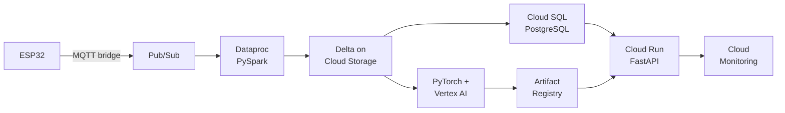

# Pipeline setup - GCP

The full pipeline on Google Cloud, end to end, from an empty project.

Overview: [[Pipeline setup - overview]] · Local first: [[Pipeline setup - Local]]

---

## 💸 Before anything else

```bash
gcloud billing budgets create --billing-account=<ACCOUNT_ID> \
  --display-name="pipeline-budget" --budget-amount=25GBP \
  --threshold-rule=percent=0.5 --threshold-rule=percent=0.9
```

Or: `Console → Billing → Budgets & alerts → Create budget`.

> **GCP's advantage: a project is a real container.** Delete the project and *everything* inside it goes — closer to Azure's resource group than to AWS. That makes teardown genuinely safe.

## What you'll build



## Variables

```bash
export PROJECT=pipeline-$RANDOM
export REGION=europe-west2        # London
export BUCKET=gs://$PROJECT-lake
```

---

## Step 1 — Foundation

```bash
gcloud auth login
gcloud projects create $PROJECT
gcloud config set project $PROJECT
gcloud config set compute/region $REGION

# link billing (required before most APIs work)
gcloud billing projects link $PROJECT --billing-account=<ACCOUNT_ID>
```

### Enable the APIs

**This is the GCP-specific gotcha.** Nothing works until you explicitly enable its API:

```bash
gcloud services enable \
  storage.googleapis.com \
  sqladmin.googleapis.com \
  pubsub.googleapis.com \
  dataproc.googleapis.com \
  run.googleapis.com \
  artifactregistry.googleapis.com \
  secretmanager.googleapis.com \
  aiplatform.googleapis.com \
  cloudbuild.googleapis.com \
  monitoring.googleapis.com \
  logging.googleapis.com
```

> **"API not enabled" is the single most common first error on GCP** and it's easy to miss — the message names the API, so read it and enable that one.

### Service account

```bash
gcloud iam service-accounts create pipeline-sa \
  --display-name="Pipeline service account"

export SA_EMAIL=pipeline-sa@$PROJECT.iam.gserviceaccount.com

for role in roles/storage.objectAdmin roles/cloudsql.client \
            roles/pubsub.editor roles/secretmanager.secretAccessor; do
  gcloud projects add-iam-policy-binding $PROJECT \
    --member="serviceAccount:$SA_EMAIL" --role="$role"
done
```

> **GCP IAM is the simplest of the three.** A **member** (who) gets a **role** (what) on a **resource** (where) — and roles are mostly sensible predefined bundles. No trust policies to write as in AWS, no control-plane/data-plane split as in Azure.

---

## Step 2 — Storage

### Object storage — Cloud Storage

```bash
gcloud storage buckets create $BUCKET \
  --location=$REGION \
  --uniform-bucket-level-access      # <- use IAM only, not legacy ACLs

for p in bronze silver gold mlflow; do
  echo | gcloud storage cp - $BUCKET/$p/.keep
done

# versioning - your undo button
gcloud storage buckets update $BUCKET --versioning
```

> **`--uniform-bucket-level-access` should be on.** Without it you get both IAM *and* per-object ACLs, which is two overlapping permission systems and a reliable source of confusion.

### Warehouse — Cloud SQL PostgreSQL

```bash
gcloud sql instances create pipeline-pg \
  --database-version=POSTGRES_16 \
  --tier=db-f1-micro \
  --region=$REGION \
  --storage-size=10GB \
  --no-backup                      # learning only

gcloud sql databases create pipeline --instance=pipeline-pg
gcloud sql users set-password postgres --instance=pipeline-pg --password='<long-random>'
```

Connect from your laptop via the **Cloud SQL Auth Proxy** — no IP allowlisting needed:

```bash
cloud-sql-proxy $PROJECT:$REGION:pipeline-pg --port 5432 &
psql "postgresql://postgres:<pw>@localhost:5432/pipeline"
```

> **The Auth Proxy is genuinely nicer than the other two clouds' firewall dance.** It authenticates with your gcloud identity and tunnels over TLS — no firewall rules, no IP that changes when you move office.

> **`db-f1-micro` is the cheapest tier.** It still bills continuously. Stop it between sessions:
> `gcloud sql instances patch pipeline-pg --activation-policy=NEVER`

---

## Step 3 — Ingest and streaming

```bash
# Pub/Sub (= Kafka / Event Hubs / Kinesis)
gcloud pubsub topics create telemetry
gcloud pubsub subscriptions create telemetry-sub --topic=telemetry
```

> **Pub/Sub is the easiest streaming service of the three** — no shards, no partitions, no capacity planning. It scales automatically and you pay per message.
>
> **The trade-off: no ordering by default.** Kafka guarantees order within a partition; Pub/Sub needs `--enable-message-ordering` plus an ordering key, and that reduces throughput. If per-device ordering matters, plan for it.

> **Note: Google retired IoT Core.** For MQTT you run your own broker (Mosquitto on a VM, or a partner service) bridging into Pub/Sub. That's the one place GCP is weaker than Azure and AWS for IoT.

Publish a test message:
```bash
gcloud pubsub topics publish telemetry --message='{"device_id":"1","temp":42.1}'
gcloud pubsub subscriptions pull telemetry-sub --auto-ack --limit=5
```

---

## Step 4 — Process: Dataproc

```bash
gcloud dataproc clusters create pipeline-spark \
  --region=$REGION \
  --single-node \
  --master-machine-type=n2-standard-4 \
  --image-version=2.2-debian12 \
  --max-idle=30m \
  --service-account=$SA_EMAIL
```

> ⚠️ **`--max-idle=30m` is not optional.** Dataproc bills per VM-hour. A cluster left running overnight costs real money.

> **`--single-node` is fine for learning** and much cheaper than a real cluster. Or skip Dataproc entirely and run Spark locally against GCS — the connector works the same.

### Spark + Delta on GCS

```python
from pyspark.sql import SparkSession

spark = (SparkSession.builder.appName("pipeline")
    .config("spark.jars.packages", "io.delta:delta-spark_2.12:3.2.0")
    .config("spark.sql.extensions", "io.delta.sql.DeltaSparkSessionExtension")
    .config("spark.sql.catalog.spark_catalog",
            "org.apache.spark.sql.delta.catalog.DeltaCatalog")
    .getOrCreate())

LAKE = f"gs://{PROJECT}-lake"     # vs s3a:// and abfss://
```

> **On Dataproc the GCS connector is preinstalled and credentials come from the service account.** No keys, no endpoint config — the simplest of the three.

Bronze/silver/gold code is **identical to [[Pipeline setup - Local]]**.

Write gold to Cloud SQL:
```python
(gold.write.format("jdbc")
   .option("url", "jdbc:postgresql://<proxy-or-private-ip>:5432/pipeline")
   .option("dbtable", "daily_readings")
   .option("user", "postgres").option("password", pw)
   .option("batchsize", 10000)
   .mode("overwrite").save())
```

### BigQuery — the GCP-specific option

You could skip Postgres entirely and serve from **BigQuery**:

```bash
bq mk --dataset $PROJECT:pipeline
bq load --source_format=PARQUET pipeline.daily_readings "$BUCKET/gold/*.parquet"
```

> **BigQuery is architecturally unusual** — separated storage and compute, no indexes, you pay per byte scanned. Brilliant for analytics over huge tables; **wrong for millisecond point lookups** from an API. For this pipeline's serving layer, Postgres is the right choice; BigQuery is the right choice for the analyst-facing warehouse.

---

## Step 5 — Train + registry

**Vertex AI** is GCP's ML platform, and its Workbench notebooks and training jobs are good.

As with the other clouds, **self-hosted MLflow with artifacts in GCS is the simplest path for learning**:

```python
import mlflow

mlflow.set_tracking_uri("http://<mlflow-host>:5000")
# artifacts to gs://$PROJECT-lake/mlflow
```

> Vertex AI Experiments and Model Registry are the managed equivalents. Concepts from [[MLflow experiment tracking]] transfer directly.

---

## Step 6 — Serve

### Artifact Registry

```bash
gcloud artifacts repositories create pipeline \
  --repository-format=docker --location=$REGION

gcloud auth configure-docker $REGION-docker.pkg.dev

export IMG=$REGION-docker.pkg.dev/$PROJECT/pipeline/api:v1
docker build -t $IMG .
docker push $IMG
```

### Cloud Run

```bash
gcloud run deploy pipeline-api \
  --image=$IMG \
  --region=$REGION \
  --platform=managed \
  --allow-unauthenticated \
  --port=8000 \
  --cpu=1 --memory=2Gi \
  --min-instances=0 --max-instances=3 \
  --service-account=$SA_EMAIL \
  --set-env-vars="ENV=gcp,MODEL_VERSION=v1" \
  --set-secrets="DATABASE_URL=db-url:latest" \
  --add-cloudsql-instances=$PROJECT:$REGION:pipeline-pg
```

> **Cloud Run is the nicest of the three container platforms.** One command, HTTPS URL, scale to zero, and `--add-cloudsql-instances` wires the database connection with no networking configuration at all.

> **`--min-instances=0` means £0 when idle**, at the cost of a cold start. `--allow-unauthenticated` makes it public — remove it and only authenticated callers get in.

### Secrets

```bash
echo -n "postgresql://..." | gcloud secrets create db-url --data-file=-
gcloud secrets add-iam-policy-binding db-url \
  --member="serviceAccount:$SA_EMAIL" --role="roles/secretmanager.secretAccessor"
```

Referenced above with `--set-secrets`, so the value never appears in your image or config.

> [[FastAPI data and deployment]]

---

## Step 7 — Observe

Cloud Run sends logs and basic metrics to Cloud Logging/Monitoring automatically:

```bash
gcloud run services logs read pipeline-api --region=$REGION --limit=50
```

For traces, point OpenTelemetry at Cloud Trace — same instrumentation code as everywhere else.

> [[Observability for data and ML pipelines]]

---

## The five verification checks

```bash
# 1 - data arrives
gcloud storage ls $BUCKET/bronze/**

# 2 - pipeline ran (check the Delta table)

# 3 - database serves
cloud-sql-proxy $PROJECT:$REGION:pipeline-pg --port 5432 &
psql "postgresql://postgres:<pw>@localhost:5432/pipeline" -c "SELECT count(*) FROM daily_readings;"

# 4 - API predicts
URL=$(gcloud run services describe pipeline-api --region=$REGION --format='value(status.url)')
curl -s $URL/health

# 5 - monitoring
gcloud run services logs read pipeline-api --region=$REGION --limit=20
```

---

## 🔻 Teardown

```bash
gcloud projects delete $PROJECT
```

**One command, everything gone.** Deletion is scheduled with a ~30-day recovery window, and billing stops immediately.

To keep the project but stop the bill:
```bash
gcloud sql instances patch pipeline-pg --activation-policy=NEVER
gcloud dataproc clusters delete pipeline-spark --region=$REGION
gcloud run services update pipeline-api --region=$REGION --min-instances=0
```

---

## Troubleshooting

| Symptom | Cause | Fix |
|---|---|---|
| `API [x] not enabled` | GCP requires explicit enabling | `gcloud services enable x.googleapis.com` |
| `PERMISSION_DENIED` | Service account missing a role | `add-iam-policy-binding` |
| Billing not linked | Most APIs refuse to work | `gcloud billing projects link` |
| Can't reach Cloud SQL | Not using the proxy | `cloud-sql-proxy`, or `--add-cloudsql-instances` on Cloud Run |
| Bucket name taken | GCS names are globally unique | Include the project name |
| Docker push denied | Docker not configured for the registry | `gcloud auth configure-docker $REGION-docker.pkg.dev` |
| Cloud Run 503 on first hit | Cold start from zero | Expected; `--min-instances=1` if it matters |
| Cloud Run can't read a secret | SA lacks `secretAccessor` | Bind the role on the secret |
| Pub/Sub messages out of order | No ordering by default | `--enable-message-ordering` + ordering key |
| Dataproc bill larger than expected | No idle timeout | `--max-idle=30m` |
| BigQuery query cost surprise | Billed per byte scanned | `SELECT` only the columns you need; partition tables |

More: [[I HAVE A PROBLEM]]

## Related

[[Pipeline setup - overview]] · [[Pipeline setup - Local]] · [[Pipeline setup - Azure]] · [[Pipeline setup - AWS]] · [[Cloud comparison dictionary]] · [[Terraform]] · [[PySpark core]]
