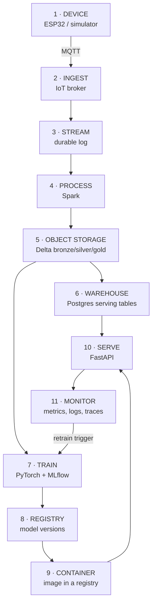
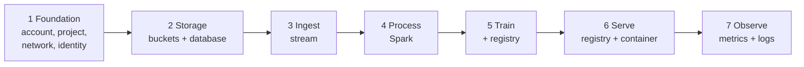

# Pipeline setup - overview

**Read this first.** It explains what all four guides build, why each piece exists, and the order to build them in.

Section: [[19 — CLOUD]] · Translation table: [[Cloud comparison dictionary]]

| Guide | |
|---|---|
| 💻 [[Pipeline setup - Local]] | Your laptop. Free. **Start here.** |
| 🔷 [[Pipeline setup - Azure]] | |
| 🟠 [[Pipeline setup - AWS]] | |
| 🔵 [[Pipeline setup - GCP]] | |

---

## What you're building

The same system, four times. A sensor sends readings; a pipeline cleans and stores them; a model learns from them; an API serves predictions; monitoring tells you it's all still working.



## Why each piece exists

Don't build a component until you can say what breaks without it.

| # | Piece | Without it | Note |
|---|---|---|---|
| 1 | **Device** | No data | [[20 — EMBEDDED]] |
| 2 | **Ingest** | Devices connect straight to your database — no auth, no buffering, no scale | [[MQTT]] |
| 3 | **Stream** | A consumer that dies loses data forever; you can't replay history | [[Kafka]] |
| 4 | **Process** | Raw data is unusable; nothing cleans or aggregates it | [[PySpark core]] |
| 5 | **Object storage** | Nowhere cheap to keep everything; no audit trail | [[SeaweedFS]] · [[ADLS Gen2]] |
| 6 | **Warehouse** | Lookups take seconds instead of milliseconds | [[Azure SQL Database]] · [[PostgreSQL reference]] |
| 7 | **Train** | No model | [[Tensors, autograd and the training loop]] |
| 8 | **Registry** | You can't tell which model is live or roll one back | [[MLflow experiment tracking]] |
| 9 | **Container registry** | Nowhere to put the image the platform pulls | [[Docker deep dive]] |
| 10 | **Serve** | The model helps nobody | [[FastAPI fundamentals]] |
| 11 | **Monitor** | It breaks silently and you find out from a user | [[Observability for data and ML pipelines]] |

> **You do not need all eleven to start.** [[Deployment patterns]] argues most systems should be batch: device → storage → process → database → API. Streaming (3) earns its place only when you genuinely need replay or many independent consumers.

## The build order — and why

Every guide follows this order. It isn't arbitrary.



**Storage before compute.** Compute is worthless with nowhere to write. Storage is also cheap and safe to leave running while you build the rest.

**Identity before anything talks to anything.** The single biggest time sink in all three clouds is permissions. Set up identity first and the rest slots in.

**Serving last.** It depends on a trained model, which depends on data, which depends on the pipeline.

## The five things that are the same everywhere

Learn these once and all four guides become the same guide with different nouns.

| Concept | What it means |
|---|---|
| **Object storage is the centre** | Everything reads from and writes to buckets. It's cheap, infinite, and the one thing you never delete. |
| **Identity is a triangle** | A **principal** (who) gets a **role** (what) on a **scope** (where). All three clouds. Only the names differ. |
| **Containers are the deployment unit** | Build once, push to a registry, the platform pulls and runs it. Identical everywhere. |
| **Config at the edges** | Paths, endpoints and credentials come from environment variables. Your pipeline code never knows which cloud it's on. |
| **Managed identity beats secrets** | Every cloud can give a running service an identity so no password exists to leak. Always prefer it. |

## The one code change between clouds

If you do this properly, this is genuinely all that differs:

```python
# api/config.py
from pydantic_settings import BaseSettings

class Settings(BaseSettings):
    env: str = "local"          # local | azure | aws | gcp
    lake_root: str              # s3a://bronze | abfss://... | s3a://... | gs://...
    database_url: str
    stream_endpoint: str
    mlflow_tracking_uri: str
    model_config = {"env_file": ".env"}

settings = Settings()
```

| Env var | Local | Azure | AWS | GCP |
|---|---|---|---|---|
| `LAKE_ROOT` | `s3a://bronze` | `abfss://bronze@acct.dfs.core.windows.net` | `s3a://my-bronze` | `gs://my-bronze` |
| `DATABASE_URL` | `postgresql://…@localhost` | `…@srv.postgres.database.azure.com` | `…@rds…amazonaws.com` | `…@/db?host=/cloudsql/…` |

> **If you find yourself writing `if env == "azure"` inside business logic, the abstraction is in the wrong place.** Only the edges — config, auth, and the storage path — should know where they're running.

## 💸 Cost — read before touching a cloud guide

| Rule | Why |
|---|---|
| **Set a budget alert first** | Before creating anything. Every cloud has them and they're free. |
| **Put everything in one resource group / project** | So you can delete it all in one command |
| **One region for everything** | Cross-region traffic costs money and latency, for zero benefit |
| **Tear down at the end of every session** | Every guide ends with a teardown section. Use it. |
| **Scale-to-zero where offered** | Container Apps, Cloud Run, App Runner all bill nothing when idle |

**What bills you even when idle:**

| Always costs | Nearly free when idle |
|---|---|
| Managed databases (unless serverless/paused) | Object storage (pennies) |
| Kubernetes control planes and nodes | Scale-to-zero containers |
| Managed Kafka / Event Hubs / Kinesis | Container registries (small) |
| **GPU instances** ← the expensive mistake | Secret stores |
| NAT gateways, static IPs | Serverless functions |

> **The classic expensive mistake is a GPU node or a Spark cluster left running overnight.** Set auto-terminate the moment you create one.

## Which to build

**Build [[Pipeline setup - Local]] first, whatever your goal.** It's free, fast to iterate, teaches every concept, and gives you a CI environment. The cloud guides then become "the same thing, with someone else's hardware and a bill".

| Then… | If |
|---|---|
| [[Pipeline setup - Azure]] | You're following [[Data Engineering]], or targeting Microsoft-heavy employers |
| [[Pipeline setup - AWS]] | Largest market share; most job adverts |
| [[Pipeline setup - GCP]] | Best data/ML tooling (BigQuery, Vertex AI); smallest of the three |

> **Depth in one beats familiarity with three.** Build one properly, then read the other guides to see the translation. The concepts transfer; the consoles don't.

## Verify it works — the same five checks everywhere

Every guide ends with these. If all five pass, the pipeline is real.

1. **Data arrives** — publish a test reading, see it land in raw storage
2. **Pipeline runs** — bronze → silver → gold, row counts sane
3. **Database serves** — `SELECT` returns the gold rows in milliseconds
4. **API predicts** — `curl /predict` returns a number and a `model_version`
5. **Monitoring sees it** — the request appears in metrics and logs

## Related

[[Cloud comparison dictionary]] · [[Master architecture]] · [[Deployment patterns]] · [[Terraform]] · [[CI-CD pipelines]] · [[Observability for data and ML pipelines]] · [[I HAVE A PROBLEM]]
