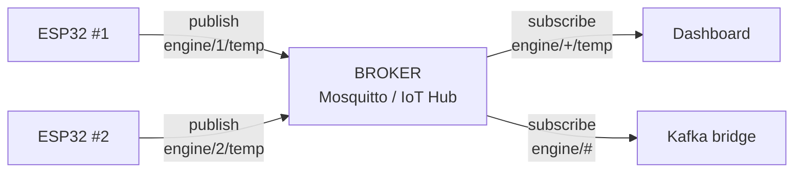

# MQTT

Template: [[_Dictionary template]] · Sections: [[20 — EMBEDDED]] · [[07 — DATA ENGINEERING]]

---

## One sentence

MQTT is a lightweight publish/subscribe messaging protocol designed for small devices on unreliable networks.

## In simple words

Imagine a noticeboard in a village with poor phone signal.

Anyone can pin a note under a heading ("weather", "engine-1/temperature"). Anyone interested in a heading gets told when a new note appears. Nobody needs to know who else is reading or writing — they only need to know the heading.

MQTT is that noticeboard, designed for devices with tiny memory and connections that drop constantly.

## The problem it solves

You have an ESP32 on a jet engine test rig. It has ~500KB of RAM, runs on battery, and its WiFi drops every few minutes.

**Why not just use HTTP?**

| HTTP | MQTT |
|---|---|
| New TCP + TLS handshake per request | One persistent connection |
| Headers are hundreds of bytes | **2-byte** minimum header |
| Client must poll to receive | Server pushes instantly |
| A dropped connection loses the message | QoS levels retry for you |
| Client must know the server's address and route | Publisher only knows a topic name |

On a battery device sending a reading every second, HTTP's overhead genuinely dominates the power budget. MQTT was designed in 1999 for oil pipeline monitoring over satellite — the constraints were extreme, and that's why it's still the IoT default.

## How it works

A central **broker** receives everything and forwards it to subscribers.



**Topics are hierarchical strings** with wildcards:

| Pattern | Matches |
|---|---|
| `engine/1/temp` | Exactly that |
| `engine/+/temp` | `+` = one level. All engines' temp. |
| `engine/#` | `#` = everything below. All engine data. |

## Important vocabulary

| Term | Meaning |
|---|---|
| **Broker** | The server everything connects to |
| **Publish** | Send a message to a topic |
| **Subscribe** | Ask to receive a topic's messages |
| **Topic** | A hierarchical name — `engine/1/temp` |
| **QoS** | Delivery guarantee level (0, 1, 2) |
| **Retained message** | The broker keeps the last message per topic for new subscribers |
| **Last Will** | A message the broker sends **if your device dies** |
| **Keep-alive** | How often the client pings so the broker knows it's alive |

## Quality of Service

| QoS | Guarantee | Cost | Use for |
|---|---|---|---|
| **0** | At most once — fire and forget | Cheapest | High-frequency sensor readings where one loss doesn't matter |
| **1** | **At least once** — retried until acknowledged. **May duplicate.** | Moderate | ✅ The sensible default |
| **2** | Exactly once — four-way handshake | Expensive | Commands you must not repeat |

> **QoS 1 duplicates.** Design consumers to be **idempotent** — process the same reading twice and get the same result. That's the same discipline as [[Unity Catalog and orchestration]].

## Code

### Level 1 — tiny (Python)

```python
import paho.mqtt.client as mqtt
import paho.mqtt.client as mqtt

client = mqtt.Client()
client.connect("localhost", 1883)
client.publish("engine/1/temp", "412.5")
```

### Level 2 — ESP32 (C++)

```cpp
#include <WiFi.h>
#include <PubSubClient.h>

WiFiClient wifi;
PubSubClient mqtt(wifi);

void reconnect() {
  while (!mqtt.connected()) {
    // Last Will: the broker publishes this if we vanish
    if (mqtt.connect("engine-01", "user", "pass",
                     "engine/1/status", 1, true, "offline")) {
      mqtt.publish("engine/1/status", "online", true);   // retained
    } else {
      delay(5000);
    }
  }
}

void loop() {
  if (!mqtt.connected()) reconnect();
  mqtt.loop();                                  // MUST be called regularly

  if (millis() - last > 1000) {                 // non-blocking timing
    last = millis();
    char payload[64];
    snprintf(payload, sizeof(payload),
             "{\"t\":%lu,\"temp\":%.2f}", millis(), readTemp());
    mqtt.publish("engine/1/temp", payload, false);
  }
}
```

> **`mqtt.loop()` must be called often.** It handles keep-alives and incoming messages. Block the main loop with `delay()` and the broker decides you're dead and disconnects you. Use the non-blocking pattern from [[Non-blocking timing]].

> **Last Will is the feature people miss.** The broker publishes it automatically when your device disconnects uncleanly — so a dashboard can show "offline" within seconds of a device losing power, with no polling.

### Level 3 — bridging to Kafka

MQTT is a great *transport* and a poor *store*. Bridge it into [[Kafka]] for durability and replay:

```
ESP32 --MQTT--> Mosquitto --bridge--> Kafka --> PySpark --> Delta
```

On Azure that bridge is built in: IoT Hub exposes an Event Hubs-compatible endpoint. See [[Cloud comparison dictionary]].

## What happens under the hood

When you publish:

1. The client sends a `PUBLISH` packet over its **existing** TCP connection — no handshake.
2. The fixed header is **2 bytes**: message type and remaining length.
3. The broker matches the topic against every subscriber's filter (a topic tree walk).
4. It forwards the payload to each match.
5. For QoS 1 it waits for `PUBACK`, retrying until it arrives.

> MQTT does **not** store messages beyond retained ones and in-flight QoS. **It is not a log.** A subscriber that was offline missed everything — unless it used a persistent session. That is exactly the gap [[Kafka]] fills.

## When to use it

- Battery or memory-constrained devices ([[20 — EMBEDDED]])
- Unreliable or high-latency networks
- Many devices, few consumers
- Push notifications to devices
- Home automation, telemetry, vehicle tracking

## When NOT to use it

| Situation | Use instead |
|---|---|
| You need replay/history | [[Kafka]] |
| Request/response | HTTP ([[FastAPI fundamentals]]) |
| Large payloads (images, files) | HTTP or object storage |
| Between cloud services | Kafka, Event Hubs, service bus |
| Complex routing rules | RabbitMQ |

## Common mistakes

| Mistake | What happens | Fix |
|---|---|---|
| `delay()` blocking the loop | Broker disconnects you | Non-blocking timing, call `mqtt.loop()` |
| QoS 0 for data that matters | Silent loss | QoS 1 |
| Assuming QoS 1 never duplicates | Double-counted readings | Make consumers idempotent |
| No Last Will | Can't tell offline from quiet | Set one |
| Treating it as storage | Offline subscribers lose everything | Bridge to Kafka |
| Topic per device with no hierarchy | Can't wildcard-subscribe | `site/line/device/metric` |
| Unencrypted on a real network | Anyone can read and publish | TLS + auth |
| Huge JSON payloads on a tiny MCU | Memory exhaustion | Compact payloads, or CBOR/binary |

## Debugging

1. **Is the broker reachable?** `mosquitto_sub -h host -t '#' -v` — subscribe to everything.
2. **Is the device publishing?** Watch that wildcard subscription while it runs.
3. **Is it connecting at all?** Check broker logs for connect/disconnect churn.
4. **Repeated reconnects?** Almost always a blocked main loop or a keep-alive that's too short.
5. **Subscriber sees nothing?** Check the topic filter — `+` and `#` have precise meanings.

## Performance

Thousands of messages/sec per broker is routine. The limits are usually connection count and QoS 2 overhead. Keep payloads small — on constrained devices, serialisation cost matters more than network.

## Security

| Concern | Mitigation |
|---|---|
| Plaintext by default | TLS (port 8883) |
| Anonymous access allowed by default | Username/password or client certificates |
| Any client can publish anywhere | Broker ACLs per topic |
| Device credentials in firmware | Per-device certificates; rotate |

> **Mosquitto's default config allows anonymous access.** Never expose a default broker to the internet.

## Alternatives

| Alternative | Choose it when |
|---|---|
| **CoAP** | Even more constrained, UDP-based |
| **HTTP** | Occasional messages, existing infrastructure |
| **[[Kafka]]** | You need durability and replay |
| **AMQP** | Enterprise routing, transactions |

## Cloud equivalents

| Local | Azure | AWS | GCP |
|---|---|---|---|
| Mosquitto | IoT Hub | IoT Core | IoT Core / Pub/Sub bridge |

## Real-world use

Aerospace test-rig telemetry ([[23 — AEROSPACE]]) · automotive fleet tracking · industrial sensors · home automation · [[21 — ROBOTICS]] telemetry

## Prerequisites

[[04 — COMPUTER SCIENCE]] (TCP, ports) · [[20 — EMBEDDED]] · [[WiFi (ESP32)]]

## Learning progression

- **Beginner:** publish and subscribe with Mosquitto locally
- **Intermediate:** QoS, retained messages, Last Will, topic design
- **Advanced:** TLS, per-device certs, bridging to Kafka, persistent sessions at scale
- **Research:** protocol efficiency for constrained devices, MQTT-SN over non-IP links

## Practical project

[[Project 008 — Physical Intelligent Engine Monitor]] — ESP32 + sensors + MQTT into the pipeline.

## Related

[[Kafka]] · [[20 — EMBEDDED]] · [[ESP32 board overview]] · [[WiFi (ESP32)]] · [[Non-blocking timing]] · [[PySpark core]] · [[Cloud comparison dictionary]] · [[21 — ROBOTICS]]
