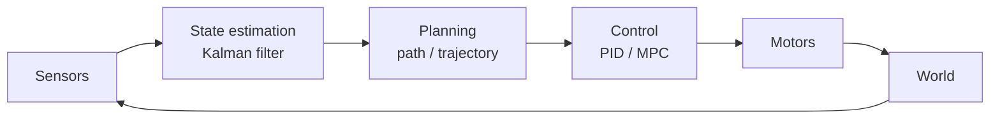

# 21 — ROBOTICS

> Machines that sense, decide and act in the physical world.

**Why it matters:** Robotics is the integration discipline — embedded, control, vision, ML and mechanical engineering all failing at once.

Home: [[ULTIMATE ENGINEER]] · Roadmap: [[THE ULTIMATE ENGINEER ROADMAP]]

---

## The loop

Everything in robotics is a box in that diagram.

## Sensing

Encoders · IMUs · cameras ([[11 — COMPUTER VISION]]) · LiDAR · GPS · [[Sensors overview]] · **sensor fusion**

## State estimation

Where am I, and how fast? · **Kalman filters** · extended/unscented Kalman filters · particle filters · SLAM

> **Why fusion:** no single sensor is trustworthy. GPS is accurate but slow and drops out; an IMU is fast but drifts. Combined, they cover each other's weaknesses. That's a Kalman filter's whole job.

## Planning

Path planning · A* ([[04 — COMPUTER SCIENCE]]) · RRT · trajectory optimisation

## Control
[[22 — CONTROL SYSTEMS]] — PID, LQR, MPC

## Software

**ROS 2** — nodes, topics, services, actions · simulation: Gazebo, Webots · **PX4** and SITL for flight

> **The working detail: [[ROS 2 in practice]]** — topics vs services, QoS, tf2, the debug commands, and the watchdog that stops the robot.

## Related
[[ROS 2 in practice]] · [[20 — EMBEDDED]] · [[22 — CONTROL SYSTEMS]] · [[12 — REINFORCEMENT LEARNING]] · [[11 — COMPUTER VISION]] · [[23 — AEROSPACE]]
