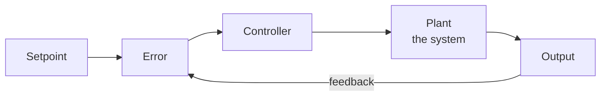

# 22 — CONTROL SYSTEMS

> The mathematics of making a system behave the way you want.

**Why it matters:** Control theory is what stands between a motor and a robot that doesn't shake itself apart. It's also older, more reliable and more provable than RL.

Home: [[ULTIMATE ENGINEER]] · Roadmap: [[THE ULTIMATE ENGINEER ROADMAP]]

---

## Reference

**[[PID and Kalman filters]]** — the formulas, the code, tuning procedures, and the three bugs everyone hits.

## Core ideas

**Open-loop** — act without checking the result. A toaster.
**Closed-loop** — measure, compare to target, correct. A thermostat.



## PID — the workhorse

| Term | Responds to | Effect |
|---|---|---|
| **P** proportional | Current error | Bigger error, bigger push |
| **I** integral | Accumulated past error | Removes steady-state offset |
| **D** derivative | Rate of change | Damps overshoot |

```
output = Kp*e + Ki*integral(e) + Kd*de/dt
```

> **PID controls most of the physical world** — motors, heaters, cruise control, drone attitude. Learn it properly before anything more advanced. Most "we need ML for control" is a badly tuned PID.

> **Integral windup** is the classic bug: if the actuator saturates, the integral term keeps accumulating and the system overshoots wildly when it recovers. Clamp it.

## Beyond PID

Transfer functions · state-space representation · **stability** · poles and zeros · observers · **Kalman filters** · **LQR** (optimal control) · **MPC** (model predictive control)

## Where it connects

[[21 — ROBOTICS]] — every actuator · [[23 — AEROSPACE]] — flight control · [[20 — EMBEDDED]] — where the loop actually runs · [[12 — REINFORCEMENT LEARNING]] — learning a controller instead of designing one

## Related
[[02 — MATHEMATICS]] · [[Feedback and PID control]] · [[Noise and Filtering]] · [[Sampling and Resolution]] · [[24 — SCIENTIFIC COMPUTING]]
