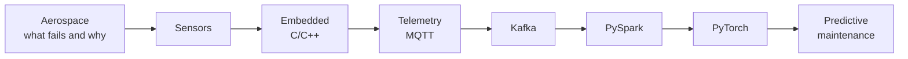

# 23 — AEROSPACE

> Flight, propulsion, and the software that keeps aircraft in the air.

**Why it matters:** The most demanding integration of everything in this vault — physics, embedded, control, ML — with the lowest tolerance for failure.

Home: [[ULTIMATE ENGINEER]] · Roadmap: [[THE ULTIMATE ENGINEER ROADMAP]]

---

## Aerodynamics

Lift · drag · thrust · weight · pressure · airflow · **Reynolds number** (laminar vs turbulent) · **Mach number** · compressibility

## Thermodynamics and propulsion

Combustion · compressors · turbines · jet engines · turbofans · turboprops · turbojets

## Flight dynamics

Stability · control surfaces · the six degrees of freedom · trim

## Avionics

Flight computers · sensors · telemetry · redundancy · **DO-178C** (safety-critical software certification)

## Where it meets this vault

That chain is the whole point of [[Project 010 — Advanced Aerospace Intelligent System]] — and of the engine-failure dataset used from [[Project 001 — Aircraft Engine Sensor Analyzer]] onward.

## Related
[[20 — EMBEDDED]] · [[22 — CONTROL SYSTEMS]] · [[21 — ROBOTICS]] · [[Physics]] · [[Thrust, Lift and how Drones fly]] · [[Forces and Newton's Laws]] · [[Rotational motion and Inertia]]
