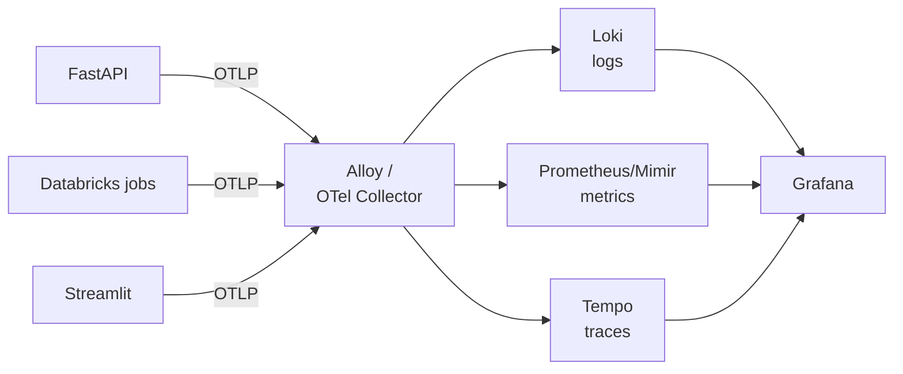

# Observability for data and ML pipelines

> **What this is:** wiring traces, metrics and logs through the *whole* pipeline — ingestion, Spark, Delta, training, registry, API, dashboard — so you can answer "what happened?" for any number on any screen.
> **Why you care:** you already have the tooling in [[Observability]]. This note is what to instrument in a **data** system, which is different from a web app in ways that matter.

---

## The idea in plain English

**Monitoring** answers questions you knew to ask: *is the API up? is latency high?*

**Observability** is being able to answer questions you **didn't** know to ask: *why is Tuesday's revenue figure for the Kitchen category wrong?*

For a web app, "what happened" means one request. For a data pipeline, it means a **chain across hours**:

```
a CSV landed at 01:00
  → a Spark job read it at 02:00
    → wrote a Delta table version
      → a model scored it at 03:00
        → wrote predictions
          → an API served one at 14:32
            → a dashboard drew a number
```

Any link can be the culprit. Observability is being able to walk that chain backwards from the wrong number.

### Why data pipelines are different from web services

| | Web service | Data pipeline |
|---|---|---|
| Unit of work | A request (milliseconds) | A job run (minutes to hours) |
| Failure | An exception, immediately | **A number that's quietly wrong** |
| "Healthy" | 200s and low latency | Correct data, arriving on time |
| Volume | Millions of small events | Few events, enormous payloads |
| Key question | "Is it up?" | **"Is it right, and is it fresh?"** |

> **The whole difference in one line: a data pipeline can be 100% green and 100% wrong.** Every job succeeded, no errors, dashboards up — and a silent join change doubled your revenue figures. That's what data observability has to catch, and ordinary APM won't.

---

## The five pillars

Three are standard; two are specific to data.

| Pillar | Question | Tool |
|---|---|---|
| **Logs** | What happened? | [[Loki]] |
| **Metrics** | How much, how fast? | [[Prometheus-Mimir]] |
| **Traces** | Where did the time go, across services? | [[Tempo]] |
| **Freshness** | Is the data recent enough? | Custom metrics |
| **Quality** | Is the data *correct*? | Assertions in the pipeline |

The last two are the ones people miss, and they're the ones that catch the silent failures.

---

## The stack

You already have all of this — [[OpenTelemetry]], [[Alloy or Otel Collector]], [[Grafana]], [[Loki]], [[Tempo]], [[Prometheus-Mimir]], [[Clickhouse]].



> **Instrument once with OpenTelemetry and you're not locked in.** OTel is the vendor-neutral standard — the collector can route to Grafana's stack, to ClickHouse, or to Azure Monitor without touching your application code. If you later join a company on Datadog, your instrumentation still works.

**On Azure**, the managed equivalent is Azure Monitor / Application Insights. It speaks OTLP too:

```python
from azure.monitor.opentelemetry import configure_azure_monitor
configure_azure_monitor(connection_string=settings.appinsights_connection_string)
```

---

## 1. Tracing the API

Auto-instrumentation covers most of it:

```bash
uv add opentelemetry-distro opentelemetry-exporter-otlp \
       opentelemetry-instrumentation-fastapi \
       opentelemetry-instrumentation-sqlalchemy \
       opentelemetry-instrumentation-requests
```

```python
# api/telemetry.py
from opentelemetry import trace
from opentelemetry.sdk.resources import Resource
from opentelemetry.sdk.trace import TracerProvider
from opentelemetry.sdk.trace.export import BatchSpanProcessor
from opentelemetry.exporter.otlp.proto.grpc.trace_exporter import OTLPSpanExporter
from opentelemetry.instrumentation.fastapi import FastAPIInstrumentor
from opentelemetry.instrumentation.sqlalchemy import SQLAlchemyInstrumentor

def setup_telemetry(app, engine):
    provider = TracerProvider(resource=Resource.create({
        "service.name": "retail-api",
        "service.version": settings.app_version,
        "deployment.environment": settings.env,
    }))
    provider.add_span_processor(BatchSpanProcessor(OTLPSpanExporter(endpoint=settings.otlp_endpoint)))
    trace.set_tracer_provider(provider)

    FastAPIInstrumentor.instrument_app(app)
    SQLAlchemyInstrumentor().instrument(engine=engine.sync_engine)
```

Then add the **model-specific spans that auto-instrumentation can't know about**:

```python
from fastapi.concurrency import run_in_threadpool

tracer = trace.get_tracer(__name__)

@router.post("/predict/segment")
async def predict_segment(req: SegmentRequest):
    span = trace.get_current_span()
    span.set_attribute("model.name", "customer_segmenter")
    span.set_attribute("model.version", settings.model_version)
    span.set_attribute("customer.id", req.customer_id)

    with tracer.start_as_current_span("fetch_features") as s:
        features = await fetch_features(req.customer_id)
        s.set_attribute("feature.count", len(features))

    with tracer.start_as_current_span("inference") as s:
        probs = await run_in_threadpool(session.run, None, {"features": features})
        s.set_attribute("prediction.confidence", float(probs.max()))

    span.set_attribute("prediction.segment", SEGMENT_LABELS[int(probs.argmax())])
    return ...
```

Now a slow request shows you *exactly* where the time went — feature fetch, inference, or the database — instead of you guessing. Usually it's the database ([[Deployment patterns]]).

> **Attributes to always set on an ML span:** `model.name`, `model.version`, `prediction.confidence`. When someone questions a prediction weeks later, the trace answers which model produced it and how sure it was.
>
> **Never put PII in span attributes.** Traces go to a third-party backend and are widely readable. A customer *ID* is usually fine; a name, email or address is not.

---

## 2. Instrumenting Spark jobs

A job is one long span with child spans per stage:

```python
# pipelines/telemetry.py
from contextlib import contextmanager
from opentelemetry import trace
import time

tracer = trace.get_tracer("retail-pipeline")

@contextmanager
def traced_stage(name: str, **attrs):
    with tracer.start_as_current_span(name) as span:
        for k, v in attrs.items():
            span.set_attribute(k, v)
        start = time.perf_counter()
        try:
            yield span
        finally:
            span.set_attribute("duration_seconds", time.perf_counter() - start)
```

```python
# notebooks/02_silver
with traced_stage("silver", run_date=run_date) as span:
    bronze = spark.table("retail.bronze.online_retail")
    n_in = bronze.count()

    silver = clean_sales(bronze)
    n_out = silver.count()

    # ← the attributes that actually matter for a data pipeline
    span.set_attribute("rows.in", n_in)
    span.set_attribute("rows.out", n_out)
    span.set_attribute("rows.dropped", n_in - n_out)
    span.set_attribute("rows.dropped_pct", round((n_in - n_out) / n_in * 100, 2))

    silver.write.format("delta").mode("overwrite").saveAsTable("retail.silver.sales")
    span.set_attribute("delta.version", get_delta_version("retail.silver.sales"))
```

> **`rows.in` / `rows.out` / `rows.dropped_pct` are the highest-value data-pipeline telemetry there is.** Graph `rows.dropped_pct` over time and a silent upstream change becomes a visible step in a chart. It's the row-count discipline from [[SQL fundamentals]] and [[PySpark core]], turned into a metric.

> **`delta.version` closes the loop.** Combined with the MLflow run ID ([[MLflow experiment tracking]]) and the `model_version` in your prediction log ([[Monitoring and iteration]]), you can trace a number on a dashboard all the way back to the exact table version it came from.

---

## 3. The metrics that matter

### Pipeline metrics

| Metric | Type | Alert when |
|---|---|---|
| `pipeline_job_duration_seconds` | histogram | > 2× the normal p95 |
| `pipeline_rows_processed` | counter | Drops > 50% day over day |
| `pipeline_rows_dropped_pct` | gauge | Moves outside its normal band |
| `pipeline_last_success_timestamp` | gauge | **Older than the expected interval** |
| `pipeline_job_failures_total` | counter | Any increase |

### Freshness — the most important one

```python
import time
from prometheus_client import Gauge
last_success = Gauge("pipeline_last_success_timestamp",
                     "Unix time of last successful run", ["pipeline"])
last_success.labels(pipeline="silver").set(time.time())
```

```promql
# alert: silver hasn't succeeded in 26 hours
(time() - pipeline_last_success_timestamp{pipeline="silver"}) > 93600
```

> **Freshness is the alert that catches the failure mode nobody expects: nothing is broken, and nothing has run.** A disabled schedule, a paused cluster, an expired credential. The API is healthy, the dashboards render, every metric is green — and the data is eleven days old. **If you add one alert from this note, add this one.**

### Model metrics

| Metric | Alert when |
|---|---|
| `model_predictions_total{model,version}` | Drops to zero |
| `model_inference_duration_seconds` | p95 > budget |
| `model_prediction_value` (histogram) | Distribution shifts ([[Monitoring and iteration]]) |
| `model_feature_psi{feature}` | > 0.25 |
| `model_errors_total` | Any increase |

```python
from prometheus_client import Counter, Histogram

predictions = Counter("model_predictions_total", "Predictions served", ["model", "version"])
inference_time = Histogram("model_inference_duration_seconds", "Inference latency", ["model"])

with inference_time.labels(model="segmenter").time():
    probs = session.run(None, inputs)
predictions.labels(model="segmenter", version=settings.model_version).inc()
```

> **Label by `version`.** Then a Grafana panel of prediction distribution *split by model version* makes a bad deploy obvious the moment traffic shifts — you see the old and new distributions side by side.

> **Never label a metric with something unbounded** — `customer_id`, `request_id`, a timestamp. Every distinct label value creates a new time series, and high-cardinality labels are the classic way to take Prometheus down. IDs belong in logs and traces, not metric labels.

---

## 4. Structured logs, correlated with traces

Logs are only useful at this scale if they're **structured** and carry the trace ID:

```python
import json, logging, sys
from opentelemetry import trace

class OtelJsonFormatter(logging.Formatter):
    def format(self, record):
        ctx = trace.get_current_span().get_span_context()
        payload = {
            "time": self.formatTime(record),
            "level": record.levelname,
            "logger": record.name,
            "message": record.getMessage(),
            **getattr(record, "extra_fields", {}),
        }
        if ctx.is_valid:
            payload["trace_id"] = format(ctx.trace_id, "032x")     # ← the magic
            payload["span_id"] = format(ctx.span_id, "016x")
        return json.dumps(payload)

handler = logging.StreamHandler(sys.stdout)
handler.setFormatter(OtelJsonFormatter())
logging.basicConfig(handlers=[handler], level=settings.log_level)
```

> **`trace_id` in the log line is what ties everything together.** In Grafana you click a slow span in Tempo and jump straight to that request's logs in Loki. Without it you're grepping by timestamp and hoping.

Log to **stdout**, never a file — containers are ephemeral ([[Docker deep dive]]).

---

## 5. Data quality as telemetry

The pillar that's unique to data. Assertions in the pipeline become metrics **and** gates.

```python
from pyspark.sql import functions as F
from prometheus_client import Gauge
quality = Gauge("data_quality_check", "1 = pass, 0 = fail", ["table", "check"])

def check(table: str, name: str, condition: bool, detail: str = ""):
    quality.labels(table=table, check=name).set(1 if condition else 0)
    if not condition:
        raise AssertionError(f"[{table}] {name} failed. {detail}")

df = spark.table("retail.gold.daily_sales")
check("daily_sales", "row_count",    df.count() > 100)
check("daily_sales", "no_negatives", df.filter(F.col("revenue") < 0).count() == 0)
check("daily_sales", "no_nulls",     df.filter(F.col("revenue").isNull()).count() == 0)
check("daily_sales", "freshness",    df.agg(F.max("date")).first()[0] >= expected_date)
```

Two benefits at once: the job **fails loudly** ([[Unity Catalog and orchestration]]), and you get a **historical record** of which checks pass — so you can see a check that's been flapping for a fortnight.

> **Bad data should stop the pipeline, not flow into the dashboard.** It's much better to have yesterday's correct numbers plus an alert than today's wrong numbers silently rendered. Failing loudly is a feature.

---

## 6. The dashboard

One Grafana dashboard, five rows, matching the pipeline:

| Row | Panels |
|---|---|
| **Pipeline health** | Last success per stage, duration trend, failures, **freshness** |
| **Data volume** | Rows in/out per stage, `rows_dropped_pct` over time |
| **Data quality** | Check pass/fail matrix, null rates |
| **Model** | Predictions/min by version, inference p95, prediction distribution, PSI |
| **Serving** | Request rate, error rate, latency p50/p95/p99, saturation |

> The last row is the classic **RED** method (Rate, Errors, Duration). Rows 1–4 are the data-specific additions — and they're where the silent failures show up.

---

## 7. Alerting that people don't ignore

| Severity | Example | Route |
|---|---|---|
| **Page** | API down; prediction freshness > 2× expected | Phone |
| **Ticket** | PSI > 0.25; quality check failing repeatedly | Work queue |
| **FYI** | Job slower than usual; single retry | Dashboard only |

> **Every alert must be actionable and must name the action.** An alert nobody acts on trains everyone to ignore all alerts, including the real ones. If you can't say what a person should *do*, it's a dashboard panel, not an alert.

Put the runbook link in the alert itself:

```yaml
annotations:
  summary: "Silver pipeline stale ({{ $value | humanizeDuration }} since last success)"
  runbook_url: "https://github.com/Huz4y1/retail-platform/blob/main/RUNBOOK.md#silver-stale"
```

---

## What to instrument, in order

If you do nothing else, do these five, in this order:

1. **Pipeline freshness** — the highest-value alert in the whole note
2. **Job failure alerts** — Databricks `email_notifications.on_failure`, one line
3. **Row counts in/out per stage** — catches silent data loss
4. **Structured logs with `trace_id`** — makes everything else debuggable
5. **Prediction volume and distribution by model version** — catches bad deploys

Everything after that is refinement.

---

## When something goes wrong

| Symptom | Likely cause | Fix |
|---|---|---|
| All green, data is 11 days old | No freshness metric | `pipeline_last_success_timestamp` + alert |
| Revenue figure wrong, no idea why | No row-count telemetry, no lineage | `rows.in/out`, `delta.version` in spans |
| Slow endpoint, can't find the cause | No child spans | Span per stage: features, inference, DB |
| Logs exist but can't correlate with a trace | No `trace_id` in log lines | Inject it in the formatter |
| Prometheus fell over | High-cardinality labels (`customer_id`) | IDs go in logs/traces, never metric labels |
| Alerts fire constantly, everyone mutes them | Non-actionable alerts | Delete or downgrade them; every alert names an action |
| Bad data reached the dashboard | Quality checks warn instead of failing | Raise, and stop the pipeline |
| Traces vanish in Databricks | Executors can't reach the collector, or the provider isn't set on workers | Instrument driver-side; check egress |
| Container logs missing entirely | Python buffered stdout | `ENV PYTHONUNBUFFERED=1` |
| PII appeared in the tracing backend | Attributes set from raw request bodies | Allow-list attributes; never log request bodies |
| Can't tell which model made a prediction | No `model.version` attribute | Set it on every span and log line |

---

## Practice checklist

- [ ] Monitoring vs. observability, and the chain a data question has to walk
- [ ] **Why a data pipeline can be 100% green and 100% wrong**
- [ ] The five pillars — logs, metrics, traces, **freshness, quality**
- [ ] OpenTelemetry as the vendor-neutral layer, and routing to Grafana or Azure Monitor
- [ ] Auto-instrumenting FastAPI and SQLAlchemy, then adding model spans
- [ ] `model.name` / `model.version` / `prediction.confidence` on every ML span
- [ ] **No PII in spans; no unbounded labels in metrics**
- [ ] Tracing Spark stages with `rows.in` / `rows.out` / `rows.dropped_pct`
- [ ] Logging `delta.version` to close the lineage loop
- [ ] **Freshness as the single highest-value alert**
- [ ] Structured JSON logs carrying `trace_id`
- [ ] Data quality checks as both gates and metrics
- [ ] The five-row dashboard, and RED for the serving layer
- [ ] Alerting tiers, and every alert naming an action

## Hands-on

- [ ] Add OTel auto-instrumentation to the capstone API and view a trace in [[Tempo]]
- [ ] Add custom spans for feature fetch and inference; find your real bottleneck
- [ ] Add `trace_id` to log lines and click from a Tempo span to Loki logs
- [ ] Emit `rows.in`/`rows.out` from each pipeline stage and graph `rows_dropped_pct`
- [ ] Add the freshness gauge and alert; trigger it by disabling the job
- [ ] Turn the capstone's quality assertions into `data_quality_check` metrics
- [ ] Build the five-row Grafana dashboard
- [ ] Deploy a "new model version", watch the prediction distribution split by version

## Resources

- [OpenTelemetry Python](https://opentelemetry.io/docs/languages/python/)
- [Grafana: Loki + Tempo correlation](https://grafana.com/docs/grafana/latest/datasources/tempo/)
- [Azure Monitor OpenTelemetry](https://learn.microsoft.com/azure/azure-monitor/app/opentelemetry-enable)
- [[Observability]] — the tooling notes for each component

## Next

[[Systems performance]]
