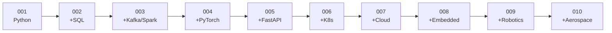

# 28 — PROJECTS

> Ten projects that build the full architecture, one layer at a time.

Home: [[ULTIMATE ENGINEER]] · Template: [[_Project template]]

---

## The rule

**Each project keeps the previous one's architecture and adds exactly one layer.** By Project 010 you have one large system you understand completely, not ten disconnected toys.

## The sequence

| # | Project | Adds | Stack |
|---|---|---|---|
| 001 | [[Project 001 — Aircraft Engine Sensor Analyzer]] | The basics | Python, CSV, testing, Git |
| 002 | [[Project 002 — Aircraft Sensor Data Pipeline]] | Persistence | + PostgreSQL, SQL |
| 003 | [[Project 003 — Distributed Sensor Pipeline]] | Scale + streaming | + Kafka, PySpark, Delta |
| 004 | [[Project 004 — Engine Failure Neural Network]] | Intelligence | + PyTorch, MLflow |
| 005 | [[Project 005 — Real-time Prediction API]] | Serving | + FastAPI, Docker |
| 006 | [[Project 006 — Complete ML Platform]] | Orchestration | + Kubernetes |
| 007 | [[Project 007 — Cloud Deployment]] | Cloud | Azure, AWS, GCP |
| 008 | [[Project 008 — Physical Intelligent Engine Monitor]] | **The physical world** | + ESP32, C/C++, sensors, MQTT |
| 009 | [[Project 009 — Autonomous Robotics System]] | Autonomy | + ROS 2, CV, control |
| 010 | [[Project 010 — Advanced Aerospace Intelligent System]] | Everything | + simulation, telemetry |

## Also

[[Capstone build guide]] — a complete parallel project on retail data, fully written up

## The dataset

Projects 001-007 use **NASA C-MAPSS Turbofan Engine Degradation** — run-to-failure sensor data from simulated jet engines.

Projects 008-010 use **data you generate yourself**. Real sensors are noisy, drift and disconnect. That step is deliberate and it's the most valuable one in the sequence.
