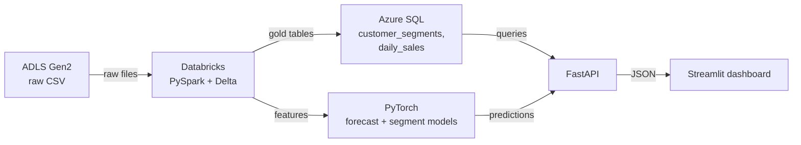

# Capstone: Retail Analytics & Forecasting Platform

> **What this is:** one project that forces every stage of this roadmap to actually connect.
> **Why you care:** this is the thing you show people. Twenty notes of knowledge is invisible; a working URL is not.

Build it in the order below — each part depends on the last. Step-by-step instructions are in [[Capstone build guide]].

---

## Why one big project instead of five small ones

Five tutorials teach you five tools. One integrated project teaches you the thing that's actually hard: **the joins between them.**

Nobody struggles with "how do I write a Spark filter." People struggle with:

- The schema you chose in Databricks turning out to be wrong for the API
- The model that works in a notebook giving different answers in the container
- Feature order mismatching between training and serving
- The pipeline succeeding and writing an empty table
- Everything working locally and nothing working in Azure

**Those problems only appear when the pieces have to fit together.** That's the entire point of a capstone, and it's why an interviewer will ask about it: the integration problems are where real engineering lives.

---

## Dataset

**UCI Online Retail II** — real UK-based online retail transactions (Dec 2009–Dec 2011): invoices, product descriptions, quantities, unit prices, customer IDs, countries. Public, free, realistic, and messy enough to need genuine cleaning.

- [Dataset page (UCI Machine Learning Repository)](https://archive.ics.uci.edu/dataset/502/online+retail+ii)

**Roughly:** ~1M rows, 8 columns, about 45MB. Small enough to iterate quickly, real enough to be awkward.

### The mess you'll actually find

This is why it's a good teaching dataset. Every one of these needs a decision:

| Problem | Roughly | The decision |
|---|---|---|
| Cancelled invoices (`InvoiceNo` starts with `C`) | ~2% | Exclude from sales; they're returns, not negative sales |
| Negative quantities | ~2% | Mostly the cancellations; investigate the rest |
| Missing `CustomerID` | ~20% | Can't attribute to a customer. Exclude from RFM, keep for revenue totals? **Decide and document.** |
| Zero or negative unit prices | small | Adjustments and data errors. Exclude. |
| Inconsistent descriptions for one `StockCode` | common | Take the most frequent, or the most recent |
| Test/admin rows (`POSTAGE`, `MANUAL`, `?`) | small | Exclude non-product `StockCode`s |
| Duplicate rows | some | Deduplicate on `(invoice, product, customer)` |
| Extreme outliers (quantity 80,995) | a few | Real bulk orders. Keep — but they'll wreck your model if unscaled. |

> **The 20% missing `CustomerID` is the interesting one, and there's no single right answer.** Dropping them loses a fifth of your revenue. Keeping them breaks customer-level analysis. The professional answer is *both*: keep them in `daily_sales` (revenue is revenue), exclude them from `customer_rfm` (you can't compute recency for an unknown customer), and **write down that this is what you did and why.** "I made a defensible decision and documented it" is exactly what a good interviewer is listening for.

---

## What you're building

A platform that ingests raw transaction data, cleans and models it, trains a model on it, and serves both the curated data and model predictions through an API and a dashboard.

### Why each arrow is the way it is

**ADLS → Databricks.** Raw files land somewhere cheap and immutable before anything touches them. Bronze is your audit trail ([[ADLS Gen2]]).

**Databricks → Azure SQL.** Spark is brilliant at scanning 500 million rows and terrible at answering "customer 17850's segment" in 5ms. The lake does heavy thinking once; the database serves the answers ([[Azure SQL Database]]).

**Databricks → PyTorch.** Training reads curated features from the lake, not raw CSV. The pipeline's output *is* the training data — which means model quality depends on data quality, which is the whole reason data engineering exists.

**Azure SQL + PyTorch → FastAPI.** One door. The API owns the credentials and the model, so nothing downstream needs either ([[FastAPI fundamentals]]).

**FastAPI → Streamlit.** The dashboard is a client. It has no database password and no model file. Swap Streamlit for Power BI, a mobile app, or a React frontend and nothing behind the API changes.

> **The one architectural rule of this project: the dashboard never touches the lake, the database, or the model directly.** If you find yourself putting a connection string in the Streamlit app, stop — that's the architecture failing, and it's exactly the shortcut an interviewer will probe.

---

## The two models

**1. Sales forecasting** — predict next-week revenue per product category (regression)

Time series. A small feed-forward net or LSTM over lagged features. Evaluated with MAE, in pounds, against a naive "same as last week" baseline.

> The baseline is not optional. If your LSTM can't beat "next week = last week", you have a random number generator with extra steps. **Log `baseline_mae` in every MLflow run** ([[MLflow experiment tracking]]).

**2. Customer segmentation** — cluster or classify customers by purchase behavior (RFM: recency, frequency, monetary value)

Two honest routes:
- **Clustering (K-means on RFM)** — no labels needed. Genuinely the standard industry approach. Then a small PyTorch classifier learns to reproduce the cluster assignment, so you have something to serve.
- **Rule-based labels then supervised** — define segments with business rules (champion, loyal, at-risk, lost), then train a classifier.

Either is defensible. The second is easier to explain and easier to evaluate.

> **Be honest with yourself about the second model.** A neural network is not the best tool for RFM segmentation — K-means or a decision tree would be simpler and just as good. You're using PyTorch here to practise the serving pipeline end to end. **Say that out loud in an interview.** "I used a neural net to exercise the ONNX export and serving path; in production I'd ship the K-means model" is a *much* stronger answer than pretending deep learning was the right choice.

---

## What "done" looks like

Not "the notebook ran." Concretely:

- [ ] A public URL showing forecasts and segments, from models you trained, over data that started as a raw CSV
- [ ] A Databricks Workflow that runs the pipeline on a schedule and emails you when it fails
- [ ] Re-running the pipeline produces identical results (idempotent)
- [ ] MLflow runs you can point at and say "this one, because of this metric"
- [ ] A test suite that runs in CI on every push
- [ ] A README a stranger could follow to rebuild it
- [ ] You can explain every arrow in that diagram, and why it isn't an arrow somewhere else

---

## Milestones

- [ ] **Part 1:** Ingest raw data into ADLS Gen2, transform with PySpark into bronze/silver/gold Delta tables, write gold tables to Azure SQL
- [ ] **Part 2:** Engineer features, train both PyTorch models, track experiments in MLflow, export the winners
- [ ] **Part 3:** Build the FastAPI serving layer and the Streamlit dashboard on top of it

Full step-by-step in [[Capstone build guide]].

**Rough pacing at 8–10 hours/week:** Part 1 about a week, Part 2 about a week, Part 3 about a week, plus a few days of deployment friction that always takes longer than expected. Call it 2–3 weeks.

---

## Before you start — five things that save days

**1. Design the schema first.** Read [[Data modeling]] and write the grain statements before any pipeline code. Restructuring a schema after the API and dashboard depend on it is genuinely painful.

**2. Set a budget alert on your Azure subscription.** Today, before anything else. And set Databricks cluster auto-terminate to 15 minutes the moment you create one. A cluster left running over a weekend is the classic expensive lesson ([[Azure fundamentals]]).

**3. Git from commit one.** Not "once it works." You'll want to go back, and the commit history is itself evidence of how you work — an interviewer may look at it.

**4. Everything in one region.** Pick `uksouth` and never think about it again. Cross-region traffic costs money and latency for zero benefit.

**5. Write down decisions as you make them.** A `DECISIONS.md` with three lines per choice ("dropped null CustomerIDs from RFM because recency is undefined; kept them in revenue totals"). In three weeks you won't remember why, and this is the exact material an interviewer digs into.

---

## Things that will go wrong, and where the answer is

| It will happen | Where the fix is |
|---|---|
| `403 AuthorizationPermissionMismatch` reading from ADLS | [[Azure fundamentals]] — data-plane roles |
| Databricks can't reach Azure SQL | [[Azure SQL Database]] — the "allow Azure services" firewall rule |
| JDBC write to Azure SQL takes 20 minutes | [[Azure SQL Database]] — `batchsize` |
| Pipeline re-run duplicated every row | [[Unity Catalog and orchestration]] — idempotency |
| Model works in the notebook, fails in Docker | [[Model export and serving]] — export contracts |
| Predictions are plausible but wrong | [[Model export and serving]] — feature order and scaling |
| Validation score brilliant, forecast useless | [[Tensors, autograd and the training loop]] — you split time series randomly |
| `pyodbc` fails only inside the container | [[FastAPI data and deployment]] — ODBC Driver 18 |
| Dashboard can't reach the API in Docker | [[Dev environment - Git, Docker, CLI]] — service name, not `localhost` |
| Unexpected Azure bill | [[Azure fundamentals]] — auto-terminate, budget alerts |

> Every one of these is in a note already. When you get stuck, the answer is usually one link away — that's what the vault is for.
