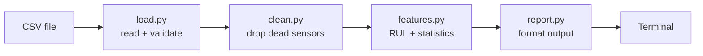

# Project 001 — Aircraft Engine Sensor Analyzer

Index: [[28 — PROJECTS]] · Template: [[_Project template]]

---

## What you're building

A command-line Python tool that reads NASA turbofan engine sensor data from CSV, cleans it, computes per-engine health statistics, and prints a report saying which engines are closest to failure.

No database, no cloud, no model. Just Python that works, is tested, and is in version control.

## Why this project exists

Every later project adds a layer to this one. If the foundation is sloppy — untested functions, no structure, logic tangled with I/O — every layer above inherits it.

**Afterwards you will understand:** how to structure a Python project properly, why separating I/O from logic makes everything testable, and what a real pytest suite looks like.

> **This project looks too easy.** That's why people skip it and then struggle at Project 003, when a Spark job fails and their logic isn't testable in isolation. Do it properly.

## Concepts used

| Concept | Note | New? |
|---|---|---|
| Python project structure | [[03 — PROGRAMMING]] | New |
| Virtual environments, `uv` | [[Dev environment - Git, Docker, CLI]] | New |
| Git, branching, commits | [[Git-GitHub]] | Revision |
| Testing with pytest | [[Testing and CI-CD]] | New |
| Separating logic from I/O | [[Testing and CI-CD]] | New |
| Vectorisation with pandas | [[When to leave Python]] | New |
| Descriptive statistics | [[02 — MATHEMATICS]] | Revision |

## Prerequisites

Basic Python. That's it.

## The dataset

**NASA C-MAPSS Turbofan Engine Degradation** — run-to-failure data from simulated jet engines.

- [NASA Prognostics Data Repository](https://www.nasa.gov/intelligent-systems-division/discovery-and-systems-health/pcoe/pcoe-data-set-repository/)

Each row is one engine, one time cycle, 21 sensor readings plus 3 operational settings. Engines run until they fail. **Every engine's last row is the moment of failure** — which is what makes RUL (Remaining Useful Life) computable.

```
unit  cycle  setting1  setting2  setting3  s1     s2      ...  s21
1     1      -0.0007   -0.0004   100.0     518.67 641.82  ...  23.4190
1     2       0.0019   -0.0003   100.0     518.67 642.15  ...  23.4236
...
1     192     ...                                                        <- failure
2     1       ...
```

## Architecture



Four modules, one job each. `load.py` and `report.py` touch the outside world; `clean.py` and `features.py` are **pure functions** — DataFrame in, DataFrame out.

> **That split is the whole point of the project.** Pure functions can be tested with three rows of fake data in milliseconds. Functions that read files cannot.

## Build steps

- [ ] **1 — Set up the project**
  ```bash
  uv init engine-analyzer && cd engine-analyzer
  uv add pandas
  uv add --dev pytest ruff
  git init
  ```
  Structure:
  ```
  engine-analyzer/
  ├── src/analyzer/
  │   ├── load.py       # I/O
  │   ├── clean.py      # pure
  │   ├── features.py   # pure
  │   ├── report.py     # I/O
  │   └── cli.py        # entry point
  ├── tests/
  ├── data/             # gitignored
  ├── pyproject.toml
  └── .gitignore
  ```
  **Done when:** `uv run pytest` runs (and finds no tests yet), and `data/` is gitignored.

- [ ] **2 — Load the data**
  Read the whitespace-separated file, name the columns explicitly, and return a DataFrame.
  ```python
  from pathlib import Path
  import pandas as pd

  COLUMNS = ["unit", "cycle", "setting1", "setting2", "setting3"] + [f"s{i}" for i in range(1, 22)]

  def load_engine_data(path: Path) -> pd.DataFrame:
      df = pd.read_csv(path, sep=r"\s+", header=None, names=COLUMNS)
      if df.empty:
          raise ValueError(f"No rows in {path}")
      return df
  ```
  **Done when:** it loads and `df.shape` matches the file.

- [ ] **3 — Clean it**
  Some sensors never change — they carry zero information. Find and drop them.
  ```python
  import pandas as pd

  def drop_constant_sensors(df: pd.DataFrame) -> pd.DataFrame:
      sensor_cols = [c for c in df.columns if c.startswith("s")]
      constant = [c for c in sensor_cols if df[c].nunique() == 1]
      return df.drop(columns=constant)
  ```
  **Done when:** you can say how many sensors were dropped and why.

- [ ] **4 — Compute RUL**
  Remaining Useful Life = how many cycles until this engine fails.
  ```python
  import pandas as pd

  def add_rul(df: pd.DataFrame) -> pd.DataFrame:
      max_cycle = df.groupby("unit")["cycle"].transform("max")
      return df.assign(rul=max_cycle - df["cycle"])
  ```
  **Done when:** every engine's final row has `rul == 0`.

  > **`groupby().transform()` is the key idea.** It computes per-group and broadcasts back to every row — no loop, no merge. This is the vectorised thinking from [[When to leave Python]], and it's the same idea as a SQL window function ([[SQL fundamentals]]).

- [ ] **5 — Per-engine statistics**
  Total cycles, mean/std/min/max per sensor, and the trend (does the sensor drift as failure approaches?).

- [ ] **6 — The report**
  Print the 10 engines with the fewest cycles remaining, and the 5 sensors that correlate most strongly with RUL.

- [ ] **7 — Tests**
  ```python
  # tests/test_features.py
  import pandas as pd
  import pytest

  def test_rul_counts_down_to_zero():
      df = pd.DataFrame({"unit": [1, 1, 1], "cycle": [1, 2, 3]})
      result = add_rul(df)
      assert result["rul"].tolist() == [2, 1, 0]

  def test_rul_is_per_engine():
      df = pd.DataFrame({"unit": [1, 1, 2], "cycle": [1, 2, 1]})
      assert add_rul(df)["rul"].tolist() == [1, 0, 0]

  @pytest.mark.parametrize("values,should_drop", [
      ([1, 1, 1], True),
      ([1, 2, 3], False),
      ([1, 1, 2], False),
  ])
  def test_constant_sensor_detection(values, should_drop):
      df = pd.DataFrame({"unit": [1, 1, 1], "s1": values})
      dropped = "s1" not in drop_constant_sensors(df).columns
      assert dropped == should_drop
  ```
  **Done when:** `uv run pytest -v` is green and covers every pure function.

- [ ] **8 — CLI**
  ```bash
  uv run python -m analyzer.cli data/train_FD001.txt --top 10
  ```

- [ ] **9 — Git history**
  A commit per step, with imperative messages ("Add RUL calculation"). Not one giant commit at the end.

## Checkpoints

- [ ] `uv run pytest` — green, and the tests genuinely fail if you break the logic
- [ ] The report prints, and the numbers are sane against a manual check of one engine in the raw file
- [ ] `git log --oneline` shows a readable story
- [ ] **No function both reads a file and computes something**

## Make it fail deliberately

- [ ] Break `add_rul` (use `min` instead of `max`) — confirm a test catches it
- [ ] Feed it an empty CSV — does it fail with a clear message or a confusing traceback?
- [ ] Feed it a file with a missing column — same question

> Step 2's `if df.empty: raise` exists because of this. Validate at the boundary, fail clearly ([[_Troubleshooting template]]).

## What will go wrong

| Symptom | Cause | Fix |
|---|---|---|
| All columns named `0, 1, 2...` | No `names=` and the file has no header | Pass `names=COLUMNS` |
| `ParserError` | Whitespace-separated, not comma | `sep=r"\s+"` |
| RUL is negative | Used `min` instead of `max` | The test catches this |
| RUL wrong at engine boundaries | Forgot `groupby("unit")` | Test with two engines |
| Tests can't import `analyzer` | Package not installed | `uv sync`; check `pyproject.toml` |
| Data committed to git | No `.gitignore` | Add `data/` before the first commit |

## Stretch goals

- [ ] Plot sensor drift against RUL for one engine — you'll *see* the degradation
- [ ] Add `ruff` to a pre-commit hook
- [ ] Add a GitHub Actions workflow running the tests ([[Testing and CI-CD]])
- [ ] Compute the naive baseline: predict mean RUL for everything. **That's the number Project 004 has to beat** ([[Problem framing]]).

## What you learned

*Fill this in afterwards. Three lines on what surprised you.*

## Next project

[[Project 002 — Aircraft Sensor Data Pipeline]] — the same logic, but the data lands in PostgreSQL and the statistics become SQL.
