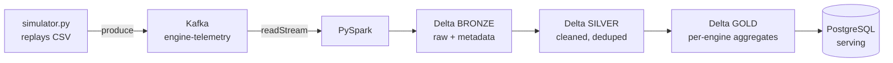

# Project 003 — Distributed Sensor Pipeline

Index: [[28 — PROJECTS]] · Previous: [[Project 002 — Aircraft Sensor Data Pipeline]]

---

## What you're building

The CSV becomes a **live stream**. A simulator publishes engine readings to **Kafka** one cycle at a time. **PySpark** consumes them, writes **Delta Lake** tables in bronze/silver/gold layers on **SeaweedFS**, and the gold tables land in Postgres for serving.

This is the first project that looks like a real data platform.

## Why this project exists

Project 002 processes a file that already exists. Real systems process data that is **still arriving**, from sources that fail, in volumes one machine can't hold.

**Afterwards you will understand:** why a distributed log exists, what lazy evaluation actually buys you, why Delta's transaction log matters, and what "idempotent" means when the input never stops.

## Concepts used

| Concept | Note | New? |
|---|---|---|
| Distributed logs, partitions, offsets | [[Kafka]] | New |
| Distributed computing, DAG, shuffles | [[PySpark core]] | New |
| ACID on object storage, time travel, MERGE | [[Databricks and Delta Lake]] | New |
| Bronze/silver/gold | [[ADLS Gen2]] | New |
| Object storage | [[Running the whole stack locally]] | New |
| Checkpointing | [[Adjacent tools you will meet]] | New |
| Idempotency | [[Unity Catalog and orchestration]] | Revision |

## Prerequisites

[[Project 002 — Aircraft Sensor Data Pipeline]] · [[Docker deep dive]]

## Architecture



## The stack

Bring up [[Running the whole stack locally]] — SeaweedFS, Kafka, Postgres, Spark. That compose file is this project's infrastructure.

## Build steps

- [ ] **1 — The simulator**
  Replay the CSV as if it were live, keyed by engine so ordering is preserved per unit.
  ```python
  import json
  import time
  from kafka import KafkaProducer

  producer = KafkaProducer(
      bootstrap_servers="localhost:9092",
      key_serializer=lambda k: str(k).encode(),
      value_serializer=lambda v: json.dumps(v).encode(),
      acks="all",
  )

  for row in df.itertuples():
      producer.send(
          "engine-telemetry",
          key=f"{row.dataset}-{row.unit}",     # <- same engine, same partition, ordered
          value=row._asdict(),
      )
      time.sleep(0.01)
  producer.flush()
  ```
  > **The key is the design decision.** Keying by engine guarantees one engine's readings stay in order. Without a key you get round-robin — more parallelism, no ordering ([[Kafka]]).

- [ ] **2 — Create the topic deliberately**
  ```bash
  kafka-topics --create --topic engine-telemetry \
    --partitions 3 --replication-factor 1 \
    --bootstrap-server localhost:9092
  ```
  **3 partitions = maximum 3 parallel consumers in a group.** Increasing it later changes key-to-partition mapping, so choose now.

- [ ] **3 — Bronze: land it untouched**
  ```python
  from pyspark.sql import functions as F

  raw = (spark.readStream.format("kafka")
      .option("kafka.bootstrap.servers", "localhost:9092")
      .option("subscribe", "engine-telemetry")
      .option("startingOffsets", "earliest")
      .load())

  bronze = (raw
      .select(F.from_json(F.col("value").cast("string"), SCHEMA).alias("r"),
              F.col("topic"), F.col("partition"), F.col("offset"),
              F.col("timestamp").alias("kafka_ts"))
      .select("r.*", "topic", "partition", "offset", "kafka_ts")
      .withColumn("_ingested_at", F.current_timestamp()))

  (bronze.writeStream.format("delta")
      .outputMode("append")
      .option("checkpointLocation", "s3a://bronze/_checkpoints/telemetry")
      .trigger(processingTime="30 seconds")
      .start("s3a://bronze/engine_telemetry/"))
  ```
  > **`checkpointLocation` is how the stream remembers its offsets.** Delete it and you reprocess everything from the beginning. Back it up; never delete it casually.

  > Keep `partition` and `offset` in bronze. They're your audit trail back to the exact Kafka message.

- [ ] **4 — Silver: clean and deduplicate**
  ```python
  from pyspark.sql import functions as F
  from pyspark.sql import Window

  def clean(df):
      return (df
          .filter(F.col("unit").isNotNull())
          .filter(F.col("cycle") > 0)
          .dropDuplicates(["dataset", "unit", "cycle"])   # <- at-least-once means duplicates
          .withColumn("rul",
              F.max("cycle").over(Window.partitionBy("dataset", "unit")) - F.col("cycle")))
  ```
  > **QoS/at-least-once delivery means duplicates are normal, not a bug.** Deduplicating on the grain key is how you cope. Same grain as Project 002's `UNIQUE` constraint — the concept follows you up the stack.

- [ ] **5 — Gold: aggregate**
  ```python
  from pyspark.sql import functions as F

  gold = (silver.groupBy("dataset", "unit")
      .agg(F.max("cycle").alias("total_cycles"),
           F.avg("s11").alias("mean_s11"),
           F.stddev("s11").alias("std_s11"),
           F.corr("s11", "rul").alias("corr_s11_rul")))

  (gold.write.format("delta").mode("overwrite")
       .save("s3a://gold/engine_summary/"))
  ```

- [ ] **6 — Land gold in Postgres**
  ```python
  (gold.write.format("jdbc")
      .option("url", "jdbc:postgresql://localhost:5432/engines")
      .option("dbtable", "engine_summary")
      .option("user", "engine").option("password", "devonly")
      .option("batchsize", 10000)          # <- or this takes forever
      .mode("overwrite").save())
  ```

- [ ] **7 — Prove Delta does what it claims**
  ```python
  spark.sql("DESCRIBE HISTORY delta.`s3a://silver/engine_telemetry/`").show()
  spark.read.format("delta").option("versionAsOf", 2).load(path).count()
  spark.sql("RESTORE TABLE delta.`s3a://silver/...` TO VERSION AS OF 2")
  ```
  **Done when:** you have overwritten a table with rubbish and restored it.

- [ ] **8 — Test the transformations**
  Because `clean()` is a pure `DataFrame -> DataFrame` function, you can test it on three rows:
  ```python
  def test_clean_deduplicates(spark):
      df = spark.createDataFrame(
          [("FD001", 1, 1), ("FD001", 1, 1)], ["dataset", "unit", "cycle"])
      assert clean(df).count() == 1
  ```
  With `spark.sql.shuffle.partitions=2` this runs in seconds ([[Testing and CI-CD]]).

## Checkpoints

- [ ] The simulator runs and `kafka-console-consumer` shows messages
- [ ] Bronze row count grows as the simulator runs
- [ ] Silver has no duplicates on `(dataset, unit, cycle)`
- [ ] Gold numbers **match Project 002's SQL results**
- [ ] You restored a Delta table with time travel
- [ ] Killing Spark mid-stream and restarting resumes from the checkpoint, losing nothing

## Make it fail deliberately

- [ ] Run the simulator twice — bronze duplicates, silver doesn't. Understand why.
- [ ] Delete the checkpoint directory and restart — watch it reprocess from offset 0
- [ ] Kill a Spark executor mid-job and watch it recover
- [ ] Add a 4th consumer to a 3-partition topic and watch it sit idle

## What will go wrong

| Symptom | Cause | Fix |
|---|---|---|
| Spark can't reach SeaweedFS | Missing `path.style.access` | Set it `true` |
| `ClassNotFoundException: S3AFileSystem` | Jar mismatch | Match `hadoop-aws` to Spark's Hadoop version |
| Delta commands unrecognised | Extensions not configured | Set `spark.sql.extensions` + catalog |
| Tests take minutes | 200 shuffle partitions | `spark.sql.shuffle.partitions=2` |
| Stream reprocesses everything | Checkpoint lost | Never delete it |
| Consumer receives nothing | Wrong `group_id`, or offsets already committed | `kafka-consumer-groups --describe` |
| JDBC write takes 20 min | Default batch size | `batchsize=10000` |
| Thousands of tiny files | Frequent micro-batches | `OPTIMIZE`; longer trigger |

## Stretch goals

- [ ] Add `MERGE` for upserts instead of overwrite ([[Databricks and Delta Lake]])
- [ ] `OPTIMIZE ... ZORDER BY (unit)` and measure the query difference
- [ ] Add data-quality assertions that fail the job
- [ ] Replace Kafka with Redpanda and change nothing else — it's the same protocol

## What you learned

*Fill in afterwards.*

## Next project

[[Project 004 — Engine Failure Neural Network]]
