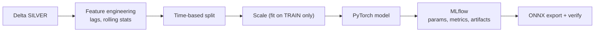

# Project 004 — Engine Failure Neural Network

Index: [[28 — PROJECTS]] · Previous: [[Project 003 — Distributed Sensor Pipeline]]

---

## What you're building

A model that predicts **Remaining Useful Life** — how many cycles until this engine fails — from its recent sensor readings. Trained in PyTorch, tracked in MLflow, exported to ONNX.

## Why this project exists

You now have a pipeline producing clean data. This is where it becomes a prediction.

**Afterwards you will understand:** why the baseline matters more than the model, why time-series data must never be split randomly, and why a model that scores brilliantly offline can be worthless.

## Concepts used

| Concept | Note | New? |
|---|---|---|
| Tensors, autograd, the training loop | [[Tensors, autograd and the training loop]] | New |
| Time-series splitting, leakage | [[Problem framing]] | New |
| Baselines | [[Problem framing]] | New |
| Choosing an approach | [[Choosing your approach]] | New |
| Experiment tracking | [[MLflow experiment tracking]] | New |
| ONNX export and verification | [[Model export and serving]] | New |

## Architecture



## ⚠️ Read this before writing any model code

Three rules, in order of how much damage breaking them causes:

**1. Split by time, never randomly.**
```python
train = df[df.cycle_start < "2024-08-01"]
val   = df[(df.cycle_start >= "2024-08-01") & (df.cycle_start < "2024-10-01")]
test  = df[df.cycle_start >= "2024-10-01"]
assert train.cycle_start.max() < val.cycle_start.min() < test.cycle_start.min()
```
A random split lets the model see the future. Your score looks superb and the model is useless.

**2. Split by engine too.** The same engine must not appear in both train and test — the model would memorise that unit's signature rather than learning degradation.

**3. Compute the baseline first.**
```python
baseline_rul = train.rul.mean()
baseline_mae = (test.rul - baseline_rul).abs().mean()
print(f"Baseline MAE: {baseline_mae:.1f} cycles")   # BEAT THIS
```

> If your neural network doesn't beat "predict the average", you don't have a model. **Log this number in every MLflow run** ([[Problem framing]]).

## Build steps

- [ ] **1 — Features**
  ```python
  FEATURE_ORDER = [                       # <- save this. Serving depends on it.
      "s2", "s3", "s4", "s7", "s11", "s12", "s15",
      "s2_roll_mean_5", "s11_roll_mean_5", "s11_roll_std_5",
      "s11_lag_1", "s11_lag_5",
      "cycle",
  ]
  ```
  Rolling windows and lags **per engine**:
  ```python
  from pyspark.sql import functions as F
  from pyspark.sql import Window

  w = Window.partitionBy("unit").orderBy("cycle").rowsBetween(-4, 0)
  df = df.withColumn("s11_roll_mean_5", F.avg("s11").over(w))
  ```
  > Same window-function idea as Project 002's SQL. It follows you everywhere.

- [ ] **2 — A classical baseline before the neural net**
  ```python
  from sklearn.metrics import mean_absolute_error
  import lightgbm as lgb
  gbm = lgb.LGBMRegressor(n_estimators=400, learning_rate=0.05)
  gbm.fit(X_train, y_train, eval_set=[(X_val, y_val)],
          callbacks=[lgb.early_stopping(50)])
  gbm_mae = mean_absolute_error(y_test, gbm.predict(X_test))
  ```
  > **This takes ten minutes and often beats the neural network** on tabular data ([[Choosing your approach]]). If it does, that is a *result*, not a failure — report it honestly.

- [ ] **3 — Scale, fit on train only**
  ```python
  from sklearn.preprocessing import StandardScaler
  import joblib

  scaler = StandardScaler().fit(X_train)        # TRAIN ONLY
  X_train = scaler.transform(X_train)
  X_val, X_test = scaler.transform(X_val), scaler.transform(X_test)
  joblib.dump(scaler, "models/scaler.pkl")      # <- serving needs THIS EXACT object
  ```

- [ ] **4 — The model**
  ```python
  from torch import nn

  class RULNet(nn.Module):
      def __init__(self, n_features, hidden=64):
          super().__init__()
          self.net = nn.Sequential(
              nn.Linear(n_features, hidden), nn.ReLU(), nn.Dropout(0.2),
              nn.Linear(hidden, hidden // 2), nn.ReLU(),
              nn.Linear(hidden // 2, 1),
          )
      def forward(self, x):
          return self.net(x)
  ```

- [ ] **5 — Sanity check: overfit one batch**
  ```python
  X, y = next(iter(train_loader))
  for i in range(500):
      opt.zero_grad(); loss = criterion(model(X), y); loss.backward(); opt.step()
  # loss MUST approach zero
  ```
  > **Thirty seconds, and it catches most bugs** — wrong shapes, gradients not flowing, a broken loss. Do this before every real training run.

- [ ] **6 — Train, with the loop written by hand**
  Use the full loop from [[Tensors, autograd and the training loop]] — early stopping, LR scheduling, restoring the best checkpoint.

- [ ] **7 — Track everything**
  ```python
  import mlflow

  with mlflow.start_run(run_name="rulnet-h64"):
      mlflow.log_params({...,
          "delta_version": delta_version,        # <- reproducibility
          "train_end": "2024-07-31",
          "feature_order": ",".join(FEATURE_ORDER)})
      mlflow.log_metric("baseline_mae", baseline_mae)
      mlflow.log_metric("gbm_mae", gbm_mae)
      mlflow.log_metric("test_mae", test_mae)
      mlflow.log_artifact("models/scaler.pkl")
      mlflow.pytorch.log_model(model, "model")
  ```

- [ ] **8 — Sweep 3+ configurations**, compare in the MLflow UI, pick on **validation**, report **test** for that one run only.

- [ ] **9 — Export and verify**
  ```python
  import numpy as np
  import onnxruntime as ort
  import torch

  model.eval()                                  # <- MANDATORY
  torch.onnx.export(model, dummy, "models/rul_v1.onnx",
      input_names=["features"], output_names=["rul"],
      dynamic_axes={"features": {0: "batch"}, "rul": {0: "batch"}},
      opset_version=17)

  x = torch.randn(8, len(FEATURE_ORDER))        # batch 8, not 1
  np.testing.assert_allclose(
      model(x).detach().numpy(),
      ort.InferenceSession("models/rul_v1.onnx").run(None, {"features": x.numpy()})[0],
      rtol=1e-4)
  ```

## Checkpoints

- [ ] The model **beats the naive baseline** — or you can explain why it doesn't
- [ ] You know whether LightGBM beat the neural net, and you're honest about it
- [ ] Train/val/test split asserts no time or engine leakage
- [ ] Loss curves plotted and logged
- [ ] ONNX matches PyTorch at a different batch size
- [ ] `feature_order`, scaler and `delta_version` are all logged

## Make it fail deliberately

- [ ] Use `random_split` instead of a time split — watch the score improve and mean nothing
- [ ] Remove `optimizer.zero_grad()` — watch training degrade
- [ ] Export without `model.eval()` — get different answers for the same input
- [ ] Shuffle `FEATURE_ORDER` at inference — **no error, wrong answers**

## What will go wrong

| Symptom | Cause | Fix |
|---|---|---|
| Loss doesn't decrease | Missing `zero_grad`/`backward`/`step` | Check all six loop lines |
| Loss is NaN | LR too high, or NaN in inputs | Lower LR; `torch.isnan(X).any()` |
| Shape error in loss | Targets `(N,)` vs preds `(N,1)` | `.unsqueeze(1)` |
| Val loss much better than expected | Leakage | Assert the split |
| ONNX differs from PyTorch | Not in eval mode | `model.eval()` before export |
| Can't beat the baseline | Features lack signal | More/better features, not a bigger model |

## Stretch goals

- [ ] An LSTM over sequences instead of engineered lag features — compare honestly
- [ ] Predict a **distribution** rather than a point (quantile loss) — maintenance cares about worst case
- [ ] Register the winner in the MLflow registry with a `champion` alias

## What you learned

*Fill in afterwards.*

## Next project

[[Project 005 — Real-time Prediction API]]
