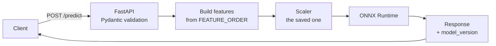

# Project 005 — Real-time Prediction API

Index: [[28 — PROJECTS]] · Previous: [[Project 004 — Engine Failure Neural Network]]

---

## What you're building

A **FastAPI** service that loads the ONNX model once at startup, accepts engine sensor readings over HTTP, and returns a predicted Remaining Useful Life — containerised with Docker and reachable from a browser.

## Why this project exists

A model in a notebook helps nobody. This is the step where it becomes something another program can call.

**Afterwards you will understand:** why models load at startup and not per request, what the "serving contract" is and how silently it breaks, and why a blocking call inside `async def` destroys your throughput.

## Concepts used

| Concept | Note | New? |
|---|---|---|
| HTTP, REST, status codes | [[FastAPI fundamentals]] | New |
| Pydantic validation | [[FastAPI fundamentals]] | New |
| `lifespan`, loading once | [[FastAPI data and deployment]] | New |
| **Feature order / dtype contract** | [[Model export and serving]] | Revision |
| async vs sync endpoints | [[FastAPI fundamentals]] | New |
| Dockerising, multi-stage | [[Docker deep dive]] | New |
| Testing with `TestClient` | [[Testing and CI-CD]] | Revision |

## Architecture



## Build steps

- [ ] **1 — Project layout**
  ```
  api/
  ├── main.py            # app + lifespan
  ├── config.py          # settings from env
  ├── models.py          # Pydantic request/response
  ├── routers/predict.py # thin
  └── services/rul.py    # logic, NO FastAPI imports
  ```
  > Keep `services/` free of FastAPI imports and you can unit-test it with plain function calls, reuse it in a batch job, and swap frameworks later ([[Testing and CI-CD]]).

- [ ] **2 — Load once at startup**
  ```python
  from pathlib import Path
  import json
  from fastapi import FastAPI
  import joblib
  import onnxruntime as ort

  state = {}

  @asynccontextmanager
  async def lifespan(app: FastAPI):
      meta = json.loads(Path(settings.model_meta).read_text())
      state["feature_order"] = meta["feature_order"]      # <- the contract
      state["version"] = meta["version"]
      state["scaler"] = joblib.load(settings.scaler_path)
      state["session"] = ort.InferenceSession(settings.model_path)
      yield
      state.clear()

  app = FastAPI(title="Engine RUL API", lifespan=lifespan)
  ```
  > Loading per request adds hundreds of milliseconds to every call. Loading once is the difference between 3ms and 300ms.
  > **Let a missing model file crash startup.** A container that fails to start rolls back; a "healthy" container returning 500s does not.

- [ ] **3 — Validated request/response**
  ```python
  from pydantic import BaseModel, Field

  class ReadingRequest(BaseModel):
      unit: int = Field(..., ge=1)
      cycle: int = Field(..., ge=1)
      sensors: dict[str, float]

  class RULResponse(BaseModel):
      unit: int
      predicted_rul: float
      model_version: str
      warning: str | None = None
  ```
  > `model_version` in every response. When a prediction is questioned in three weeks, you can say which model made it.

- [ ] **4 — Build features from the saved order, never by hand**
  ```python
  import numpy as np

  def build_features(payload: ReadingRequest) -> np.ndarray:
      row = [payload.sensors.get(f, payload.cycle if f == "cycle" else 0.0)
             for f in state["feature_order"]]                 # <- from metadata
      x = np.array([row], dtype=np.float32)                   # <- float32, not 64
      return state["scaler"].transform(x).astype(np.float32)  # <- the SAVED scaler
  ```
  > **The three silent killers, all in four lines:** wrong feature order (no error, wrong answers), wrong dtype (ONNX errors — mercifully), and a refitted scaler (drifts as traffic changes).

- [ ] **5 — The endpoint**
  ```python
  from fastapi.concurrency import run_in_threadpool

  @router.post("/predict", response_model=RULResponse)
  async def predict(req: ReadingRequest):
      x = build_features(req)
      out = await run_in_threadpool(state["session"].run, None, {"features": x})
      rul = float(out[0][0][0])
      return RULResponse(
          unit=req.unit, predicted_rul=rul, model_version=state["version"],
          warning="Below 20 cycles - schedule maintenance" if rul < 20 else None)
  ```
  > `run_in_threadpool` keeps blocking CPU work off the event loop. Skip it and the API works perfectly with one user and collapses with ten ([[FastAPI fundamentals]]).

- [ ] **6 — Health and readiness**
  ```python
  from fastapi import HTTPException

  @router.get("/health")   # liveness: instant, NO dependencies
  async def health(): return {"status": "ok"}

  @router.get("/ready")    # readiness: can I actually serve?
  async def ready():
      if "session" not in state: raise HTTPException(503, "model not loaded")
      return {"status": "ready", "model_version": state["version"]}
  ```
  > Never check a dependency in liveness. A brief blip then restarts every container at once.

- [ ] **7 — Tests**
  ```python
  def test_health(): assert client.get("/health").status_code == 200

  def test_rejects_bad_input():
      r = client.post("/predict", json={"unit": -1, "cycle": 5, "sensors": {}})
      assert r.status_code == 422

  def test_returns_model_version():
      r = client.post("/predict", json=VALID)
      assert r.json()["model_version"]

  def test_onnx_matches_pytorch():         # the contract test
      ...  # from Project 004
  ```

- [ ] **8 — Dockerise**
  ```dockerfile
  FROM python:3.12-slim
  WORKDIR /app
  COPY pyproject.toml uv.lock ./
  RUN pip install --no-cache-dir uv && uv sync --frozen --no-dev
  COPY api/ ./api/
  COPY models/ ./models/
  RUN useradd --create-home appuser && chown -R appuser /app
  USER appuser
  ENV PYTHONUNBUFFERED=1
  EXPOSE 8000
  CMD ["uv","run","uvicorn","api.main:app","--host","0.0.0.0","--port","8000","--workers","2"]
  ```
  > `onnxruntime`, **not** `torch` — 300MB instead of 2.5GB. Dependencies copied before code so edits don't reinstall everything. `--host 0.0.0.0` or nothing reaches it.

## Checkpoints

- [ ] `http://localhost:8000/docs` renders and "Try it out" returns a prediction
- [ ] Bad input gives **422** with the offending field named
- [ ] Predictions match the notebook exactly for the same input
- [ ] Runs in Docker with no local Python
- [ ] `pytest` green, including the ONNX contract test

## Make it fail deliberately

- [ ] Put `time.sleep(5)` in an `async def`, fire 5 concurrent requests, watch them queue
- [ ] Shuffle `feature_order` in the metadata — **no error, wrong predictions**
- [ ] Remove `--host 0.0.0.0` and try to reach the container
- [ ] Delete the model file and confirm startup fails loudly

## What will go wrong

| Symptom | Cause | Fix |
|---|---|---|
| 422 on valid-looking JSON | Missing `Content-Type` | `requests.post(url, json=...)` |
| Works with 1 user, dies with 10 | Blocking call in `async def` | `run_in_threadpool`, or plain `def` |
| ONNX "unexpected input data type" | float64 | `.astype(np.float32)` |
| Predictions plausible but wrong | Feature order or scaler | Load both from metadata |
| Connection refused in Docker | Bound to `127.0.0.1` | `--host 0.0.0.0` |
| No logs from the container | Buffered stdout | `ENV PYTHONUNBUFFERED=1` |
| First request slow, rest fast | Model loaded per request | `lifespan` |

## Stretch goals

- [ ] Batch endpoint accepting a list — measure throughput vs single calls
- [ ] API key auth via a `Depends` dependency
- [ ] Structured JSON logging with latency per request ([[Observability for data and ML pipelines]])
- [ ] A Streamlit dashboard calling **only** this API ([[Streamlit vs Django]])

## What you learned

*Fill in afterwards.*

## Next project

[[Project 006 — Complete ML Platform]]
