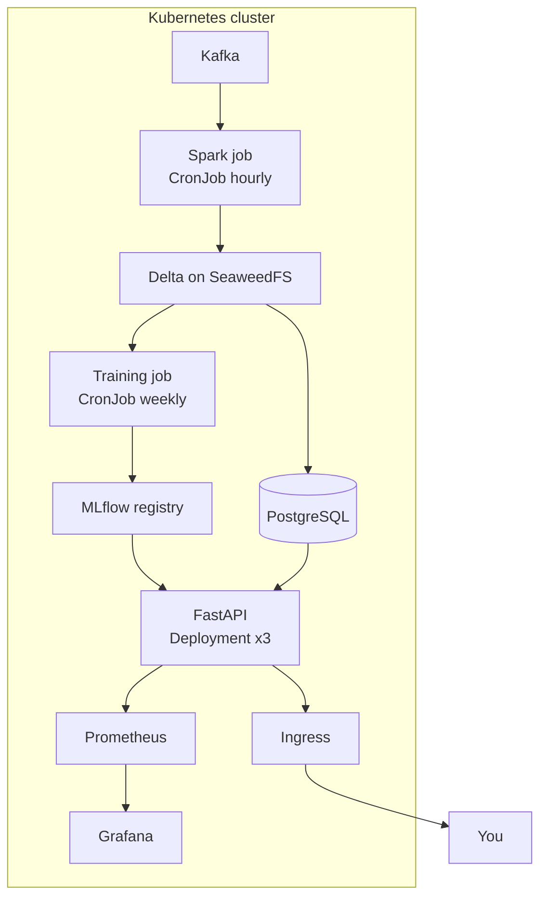

# Project 006 — Complete ML Platform

Index: [[28 — PROJECTS]] · Previous: [[Project 005 — Real-time Prediction API]]

---

## What you're building

Everything from Projects 003-005 running together as one orchestrated system on **Kubernetes**, with scheduled pipelines, scheduled retraining, monitoring, and a dashboard. One `kubectl apply` brings up the whole platform.

## Why this project exists

You have the parts. This is where they become a **system** that runs without you.

**Afterwards you will understand:** what an orchestrator actually does, why liveness and readiness are different, and why the hardest part of a platform is the bits between the components.

## Concepts used

| Concept | Note | New? |
|---|---|---|
| Pods, deployments, services, ingress | [[Kubernetes and AKS]] | New |
| CronJobs for scheduled work | [[Kubernetes and AKS]] | New |
| Resource requests and limits | [[Kubernetes and AKS]] | New |
| Liveness vs readiness | [[Kubernetes and AKS]] | Revision |
| Orchestration, DAGs, idempotency | [[Unity Catalog and orchestration]] | Revision |
| Model registry and aliases | [[Azure ML and the MLOps stack]] | New |
| Metrics, drift, freshness | [[Monitoring and iteration]] | New |

## Architecture



## Build steps

- [ ] **1 — A local cluster**
  ```bash
  k3d cluster create mlplatform --agents 2 -p "8080:80@loadbalancer"
  kubectl get nodes
  ```
  > `k3d` runs a real Kubernetes cluster inside Docker. Free, disposable, and identical in concept to AKS/EKS/GKE.

- [ ] **2 — Namespace and config**
  ```bash
  kubectl create namespace mlplatform
  kubectl create configmap app-config --from-literal=MODEL_VERSION=v1 -n mlplatform
  kubectl create secret generic db-creds --from-literal=password=devonly -n mlplatform
  ```
  > **Kubernetes Secrets are base64, not encrypted.** Fine locally; in production use Key Vault + the CSI driver ([[26 — SECURITY]]).

- [ ] **3 — Stateful dependencies**
  Postgres, SeaweedFS and Kafka as `StatefulSet`s with `PersistentVolumeClaim`s.
  > **Stateful things in Kubernetes are genuinely harder than stateless ones.** In production you'd use managed services (RDS, Blob, Event Hubs) and keep only your own code in the cluster. Doing it here teaches you why.

- [ ] **4 — The API deployment**
  ```yaml
  apiVersion: apps/v1
  kind: Deployment
  metadata: {name: rul-api, namespace: mlplatform}
  spec:
    replicas: 3
    selector: {matchLabels: {app: rul-api}}
    template:
      metadata: {labels: {app: rul-api}}
      spec:
        containers:
        - name: api
          image: rul-api:v1
          ports: [{containerPort: 8000}]
          resources:
            requests: {memory: "512Mi", cpu: "250m"}
            limits:   {memory: "2Gi",   cpu: "1000m"}
          livenessProbe:
            httpGet: {path: /health, port: 8000}
            initialDelaySeconds: 20
          readinessProbe:
            httpGet: {path: /ready, port: 8000}
            initialDelaySeconds: 5
  ```
  > **Both probes, and requests *and* limits.** Omitting resources is worse than guessing: the scheduler assumes ~nothing and packs your pod onto a full node.

- [ ] **5 — Scheduled pipeline**
  ```yaml
  apiVersion: batch/v1
  kind: CronJob
  metadata: {name: hourly-pipeline}
  spec:
    schedule: "0 * * * *"
    concurrencyPolicy: Forbid          # <- don't overlap runs
    jobTemplate:
      spec:
        backoffLimit: 2
        template:
          spec:
            restartPolicy: OnFailure
            containers:
            - name: pipeline
              image: spark-pipeline:v1
              args: ["--run-date", "$(date -I)"]
  ```
  > `concurrencyPolicy: Forbid` stops a slow run overlapping the next and corrupting your tables — the same idea as `max_concurrent_runs: 1`.

- [ ] **6 — Scheduled retraining with a quality gate**
  ```python
  new = evaluate(candidate, test_data)
  champ = evaluate(load_champion(), test_data)      # SAME test data
  if new["mae"] >= champ["mae"] * 0.98:
      raise SystemExit(f"Candidate {new['mae']:.1f} does not beat champion {champ['mae']:.1f}")
  register_and_promote(candidate)
  ```
  > **Automatic retraining without an automatic quality gate automatically deploys worse models.** The gate is the important half.

- [ ] **7 — Serve by alias, not by path**
  ```python
  import mlflow

  model = mlflow.pyfunc.load_model("models:/engine-rul@champion")
  ```
  Promotion becomes an alias flip — seconds, no rebuild, no redeploy. Rollback likewise.

- [ ] **8 — Monitoring**
  Prometheus + Grafana, with the five things that matter ([[Observability for data and ML pipelines]]):
  1. `pipeline_last_success_timestamp` — **freshness, the alert everyone forgets**
  2. Job failures
  3. `rows_in` / `rows_out` per stage
  4. Prediction distribution **by model version**
  5. API rate, errors, latency

- [ ] **9 — Ingress**
  ```yaml
  spec:
    rules:
    - http:
        paths:
        - {path: /api, pathType: Prefix, backend: {service: {name: rul-api, port: {number: 80}}}}
        - {path: /,    pathType: Prefix, backend: {service: {name: dashboard, port: {number: 80}}}}
  ```

## Checkpoints

- [ ] `kubectl apply -f k8s/` brings up everything from nothing
- [ ] Killing a pod: it comes back automatically, and the API never stops responding
- [ ] The CronJob runs on schedule and you can see its logs
- [ ] A rolling update deploys with **zero dropped requests**
- [ ] `kubectl rollout undo` returns to the previous version
- [ ] Grafana shows freshness, drift and latency
- [ ] Retraining refuses to promote a worse model

## Make it fail deliberately

- [ ] `kubectl delete pod <api-pod>` during a load test — measure dropped requests
- [ ] Set memory limit to 128Mi and watch `OOMKilled`
- [ ] Break the Service selector — `kubectl get endpoints` shows `<none>`
- [ ] Point liveness at `/ready` (which checks the DB), stop Postgres, and watch every pod restart in a loop. **This is why they're separate.**

## What will go wrong

| Symptom | Cause | Fix |
|---|---|---|
| `ImagePullBackOff` | k3d can't see your local image | `k3d image import rul-api:v1 -c mlplatform` |
| `CrashLoopBackOff` | App crashing on start | `kubectl logs <pod> --previous` |
| `Pending` forever | Insufficient CPU/memory | `kubectl describe pod` — read Events |
| Service times out | Selector doesn't match labels | `kubectl get endpoints` |
| All pods restart together | Liveness checks a dependency | Liveness = process only |
| CronJob never runs | Wrong cron, or suspended | `kubectl get cronjob` |
| Rollout stuck | New pods never become ready | `describe` the new pod |

## Stretch goals

- [ ] HorizontalPodAutoscaler on CPU; load-test and watch it scale
- [ ] Helm chart so the whole platform is one `helm install`
- [ ] Shadow deployment: a second model version logging predictions but serving none
- [ ] Network policies so only the API may reach Postgres

## What you learned

*Fill in afterwards.*

## Next project

[[Project 007 — Cloud Deployment]]
