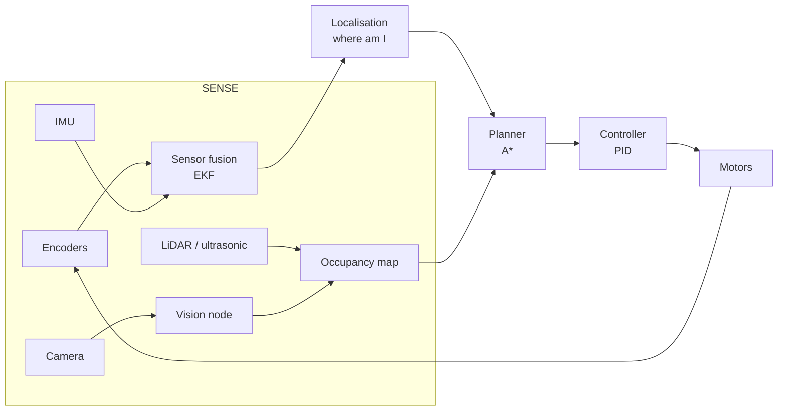

# Project 009 — Autonomous Robotics System

Index: [[28 — PROJECTS]] · Previous: [[Project 008 — Physical Intelligent Engine Monitor]]

---

## What you're building

A small mobile robot that senses its surroundings, estimates where it is, plans a path, and drives there — built on **ROS 2**, with a **PID** controller, sensor fusion, and vision-based obstacle detection.

## Why this project exists

Project 008 sensed the world. This one **acts** on it — which means every mistake has physical consequences and a delayed feedback loop.

**Afterwards you will understand:** why control theory exists, why no single sensor can be trusted, and why the gap between simulation and reality is the hardest problem in robotics.

## Concepts used

| Concept | Note | New? |
|---|---|---|
| The sense-plan-act loop | [[21 — ROBOTICS]] | New |
| PID control, tuning, windup | [[22 — CONTROL SYSTEMS]] · [[Feedback and PID control]] | New |
| Sensor fusion, Kalman filters | [[21 — ROBOTICS]] | New |
| Path planning, A* | [[04 — COMPUTER SCIENCE]] | New |
| Vision | [[11 — COMPUTER VISION]] · [[CNNs and transfer learning]] | Revision |
| Motors and encoders | [[DC Motors]] · [[Torque and Gearing]] | Revision |
| ROS 2 | [[21 — ROBOTICS]] | New |

## Architecture



## Build steps

- [ ] **1 — Simulate first**
  ```bash
  ros2 launch turtlebot3_gazebo turtlebot3_world.launch.py
  ```
  > **Never debug on hardware what you can debug in simulation.** Sim is faster, repeatable, and doesn't drive into walls. Gazebo or Webots.

- [ ] **2 — ROS 2 fundamentals**
  ```python
  class VelocityPublisher(Node):
      def __init__(self):
          super().__init__("velocity_publisher")
          self.pub = self.create_publisher(Twist, "cmd_vel", 10)
          self.timer = self.create_timer(0.1, self.tick)   # 10 Hz

      def tick(self):
          msg = Twist()
          msg.linear.x = 0.2
          self.pub.publish(msg)
  ```
  | ROS 2 concept | Equivalent you know |
  |---|---|
  | Node | A process/service |
  | Topic | A [[Kafka]] topic (but no persistence) |
  | Publisher/subscriber | Producer/consumer |
  | Service | A request/response HTTP call |
  | Action | A long-running job with progress |

  > **ROS 2 topics are pub/sub with no history.** A node that starts late missed everything — exactly the gap between [[MQTT]] and [[Kafka]]. The concept keeps recurring.

- [ ] **3 — Odometry from encoders**
  ```python
  import math

  d_left  = (ticks_left  - prev_left)  * METRES_PER_TICK
  d_right = (ticks_right - prev_right) * METRES_PER_TICK
  d_centre = (d_left + d_right) / 2
  d_theta  = (d_right - d_left) / WHEEL_BASE

  x     += d_centre * math.cos(theta + d_theta / 2)
  y     += d_centre * math.sin(theta + d_theta / 2)
  theta += d_theta
  ```
  > **Odometry drifts.** Wheels slip, ticks are quantised, and error **accumulates without bound**. After ten metres you may be half a metre out. This is precisely why fusion exists.

- [ ] **4 — Sensor fusion**
  | Sensor | Good at | Bad at |
  |---|---|---|
  | Encoders | Smooth, high rate | Drifts, slips |
  | IMU | Fast rotation sensing | Drifts badly over time |
  | Camera/LiDAR | Absolute reference | Slow, occlusion, lighting |

  An **Extended Kalman Filter** combines them: predict from encoders+IMU at high rate, correct from absolute observations when available.
  ```bash
  ros2 launch robot_localization ekf.launch.py
  ```
  > **The Kalman filter's one idea:** track not just your estimate but your *uncertainty*, and trust each sensor in proportion to how uncertain it is. That's it.

- [ ] **5 — PID for velocity**
  ```python
  error = target_velocity - measured_velocity
  self.integral += error * dt
  self.integral = max(-LIMIT, min(LIMIT, self.integral))   # <- anti-windup
  derivative = (error - self.prev_error) / dt
  output = self.kp * error + self.ki * self.integral + self.kd * derivative
  self.prev_error = error
  ```
  **Tuning, in order:**
  1. `Ki = Kd = 0`. Raise `Kp` until it oscillates, then halve it.
  2. Raise `Ki` until steady-state error disappears. Too much = oscillation.
  3. Raise `Kd` to damp overshoot. Too much = noise amplification.

  > **The integral clamp is not optional.** If the motor saturates, the integral term winds up and the robot overshoots wildly when it recovers ([[Feedback and PID control]]).

- [ ] **6 — Occupancy grid + A***
  Grid of cells, each free/occupied/unknown. A* finds the shortest path ([[04 — COMPUTER SCIENCE]]).
  > **Inflate obstacles by the robot's radius** before planning. Otherwise A* happily plans a path through a gap the robot physically cannot fit through — a classic and very visible bug.

- [ ] **7 — Vision**
  Fine-tune a small CNN to detect obstacles or targets ([[CNNs and transfer learning]]). Publish detections as a ROS 2 topic that the planner consumes.

- [ ] **8 — Move to hardware**
  Expect it to be worse. **The sim-to-real gap is real:** friction, motor deadband, sensor noise, latency, and battery voltage sag all change behaviour.

- [ ] **9 — Telemetry into the pipeline**
  Publish robot state to MQTT → Kafka → Delta, reusing Projects 003-006. Now you can analyse *why* a run failed after the fact.

## Checkpoints

- [ ] Robot drives to a waypoint in simulation
- [ ] PID holds velocity within tolerance under changing load
- [ ] Fused pose drifts noticeably less than raw odometry
- [ ] It stops for obstacles, reliably
- [ ] It works on real hardware, however badly at first
- [ ] Every run is logged and reviewable

## Make it fail deliberately

- [ ] Remove the integral clamp, stall the wheels, then release — watch it overshoot
- [ ] Set `Kp` far too high and watch it oscillate
- [ ] Drive on a slippery surface and watch odometry diverge from truth
- [ ] Plan without obstacle inflation and watch it wedge itself

## What will go wrong

| Symptom | Cause | Fix |
|---|---|---|
| Robot oscillates | `Kp` too high | Halve it; add `Kd` |
| Never reaches target | No integral term | Add `Ki` |
| Overshoots after a stall | Integral windup | Clamp the integral |
| Position drifts | Odometry only | Fuse with IMU and absolute reference |
| Works in sim, not reality | Sim-to-real gap | Model friction/deadband; tune on hardware |
| Motors don't turn below a threshold | Deadband | Add a minimum PWM offset |
| Jerky motion | Control rate too low, or noisy derivative | Raise rate; filter the derivative |
| Path goes through a wall | Obstacles not inflated | Inflate by robot radius + margin |
| Node sees no messages | QoS mismatch | Match reliability/durability settings |

## Stretch goals

- [ ] SLAM — build the map while navigating (`slam_toolbox`)
- [ ] Replace PID with **MPC** and compare
- [ ] Train an RL policy in sim and attempt sim-to-real ([[12 — REINFORCEMENT LEARNING]])
- [ ] Predict motor failure from current draw, reusing Project 008's model

## What you learned

*Fill in afterwards.*

## Next project

[[Project 010 — Advanced Aerospace Intelligent System]]
