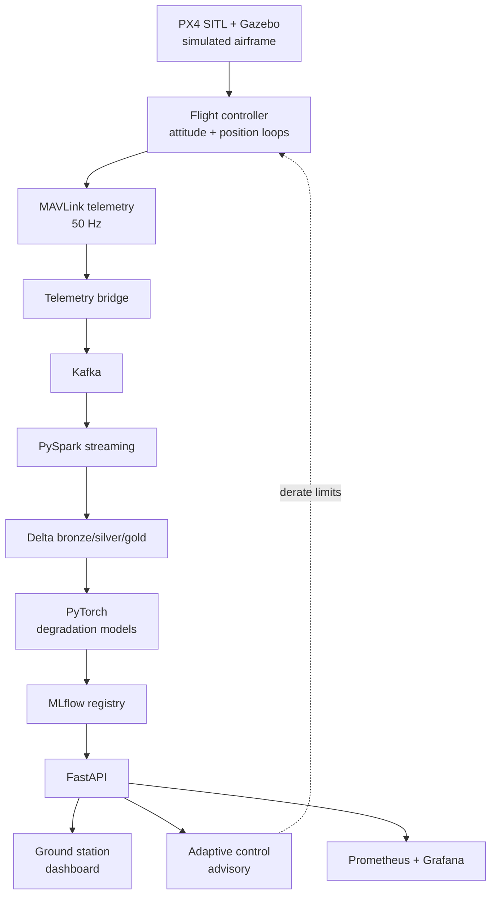

# Project 010 — Advanced Aerospace Intelligent System

Index: [[28 — PROJECTS]] · Previous: [[Project 009 — Autonomous Robotics System]]

---

## What you're building

The synthesis. A simulated aircraft (PX4 SITL) flying missions, streaming telemetry through the full pipeline, with models that **predict component degradation** and a control system that **adapts** to it — monitored, versioned and deployed like production software.

Every section of this vault appears in this project.

## Why this project exists

Each earlier project added one layer. This one proves you can hold the **whole system** in your head at once — physics, embedded, control, streaming, ML, serving, monitoring.

**Afterwards you will understand:** what "systems engineering" means, and why safety-critical software is a different discipline.

## Concepts used

Essentially everything: [[23 — AEROSPACE]] · [[22 — CONTROL SYSTEMS]] · [[20 — EMBEDDED]] · [[21 — ROBOTICS]] · [[Kafka]] · [[PySpark core]] · [[Databricks and Delta Lake]] · [[Tensors, autograd and the training loop]] · [[MLflow experiment tracking]] · [[FastAPI fundamentals]] · [[Kubernetes and AKS]] · [[Observability for data and ML pipelines]] · [[26 — SECURITY]]

## Architecture



## The models

| Model | Predicts | Data |
|---|---|---|
| **Motor degradation** | Efficiency loss per motor | Current vs. commanded thrust over time |
| **Battery health** | Usable capacity remaining | Voltage sag under known load |
| **Anomaly detection** | "This flight is unusual" | Autoencoder reconstruction error |
| **Endurance** | Remaining flight time | Current state + planned mission |

> **Anomaly detection is the honest choice here** because you have almost no labelled failures. An autoencoder trained on normal flight flags anything it reconstructs badly. That's unsupervised, which fits the data you can actually get ([[Choosing your approach]]).

## Build steps

- [ ] **1 — PX4 SITL**
  ```bash
  make px4_sitl gazebo-classic
  # then fly a mission from QGroundControl
  ```
  > Simulation lets you crash a thousand times for free. **Use it for everything you can.**

- [ ] **2 — Understand the control loops**
  ```
  Position setpoint -> Position controller -> Velocity setpoint
    -> Velocity controller -> Attitude setpoint
      -> Attitude controller -> Rate setpoint
        -> Rate controller -> Motor outputs
```
  **Nested PID loops**, inner ones running faster than outer. The rate loop runs at ~1kHz; position at ~50Hz.
  > **Cascade control is the pattern:** each loop's output is the next loop's setpoint. Tune from the inside out — a badly tuned rate loop makes every outer loop untunable ([[22 — CONTROL SYSTEMS]]).

- [ ] **3 — Telemetry bridge**
  ```python
  import time
  from pymavlink import mavutil
  conn = mavutil.mavlink_connection("udp:127.0.0.1:14550")
  while True:
      msg = conn.recv_match(blocking=True)
      producer.send("flight-telemetry",
                    key=str(vehicle_id),
                    value={"ts": time.time(), "type": msg.get_type(), **msg.to_dict()})
  ```
  > 50Hz × many message types is a genuine stream. This is where [[Kafka]] earns its place instead of being over-engineering.

- [ ] **4 — Bronze/silver/gold for flight data**
  - **Bronze:** every MAVLink message, untouched
  - **Silver:** one row per timestamp per vehicle, message types joined, units normalised
  - **Gold:** per-flight summaries, per-motor efficiency curves, battery discharge profiles

  > **Time alignment is the hard part.** Different message types arrive at different rates. You need windowed joins or forward-fill within a tolerance — and getting it wrong silently corrupts every downstream feature.

- [ ] **5 — Physics-informed features**
  Don't just feed raw numbers. Use aerodynamics ([[23 — AEROSPACE]]):
  ```python
  expected_current = k_thrust * (commanded_throttle ** 2)
  efficiency_ratio = actual_current / expected_current      # <- degradation signal
  ```
  > **A feature grounded in physics beats ten raw sensor columns.** Domain knowledge is the highest-leverage thing in applied ML, and this is the clearest example of it in the whole sequence.

- [ ] **6 — Train and validate**
  Split **by flight**, never by row — rows within a flight are massively correlated, and mixing them is leakage.

- [ ] **7 — Serve as advisory, not authority**
  ```python
  @router.get("/vehicle/{id}/health")
  async def health(id: str):
      return {"motor_efficiency": {...}, "battery_health_pct": 87.2,
              "estimated_endurance_s": 412, "recommendation": "derate_to_80pct",
              "model_version": "v3", "confidence": 0.91}
  ```
  > **⚠️ The model advises; it must never directly command the aircraft.** A model failure must degrade to normal flight, not to loss of control. This is the core principle of safety-critical design and the most important idea in this project.

- [ ] **8 — Close the loop safely**
  The flight controller consumes advisories to derate limits or trigger return-to-launch — with **hard-coded bounds** the model cannot exceed.

- [ ] **9 — Full observability**
  Every layer instrumented ([[Observability for data and ML pipelines]]): telemetry rate, pipeline freshness, model drift, prediction distribution, advisory-acceptance rate.

- [ ] **10 — Write it up**
  Architecture, decisions, results, limitations, what you'd do differently. This is the artefact that gets you interviews.

## Checkpoints

- [ ] Simulated flights produce telemetry into Kafka at full rate
- [ ] Delta tables reconstruct any flight exactly
- [ ] Degradation model detects a **deliberately** degraded motor in simulation
- [ ] Anomaly detector flags an injected fault
- [ ] Advisory reaches the flight controller and is visibly bounded
- [ ] Grafana shows the whole system in one screen
- [ ] A written report a stranger could follow

## Make it fail deliberately

- [ ] Inject a motor efficiency fault in simulation — does the model catch it, and how early?
- [ ] Stop the pipeline; confirm the freshness alert fires
- [ ] Feed the advisory an absurd value; confirm bounds reject it
- [ ] Corrupt telemetry timestamps; see how time alignment copes

## What will go wrong

| Symptom | Cause | Fix |
|---|---|---|
| Telemetry gaps | UDP drops; no backpressure | Buffer; monitor sequence numbers |
| Timestamps disagree between messages | Different clocks and rates | Align to a single reference; record all |
| Model flags everything as anomalous | Threshold too tight; trained on too little normal data | More normal flights; recalibrate |
| Model misses real degradation | Signal swamped by flight-condition variation | Physics-informed features; condition on flight regime |
| Great in sim, useless on hardware | Sim-to-real | Validate on real logs before trusting |
| Advisory causes instability | Loop closed too tightly | Rate-limit changes; widen bounds; advisory only |

## Stretch goals

- [ ] Multi-vehicle fleet with cross-vehicle comparison
- [ ] Digital twin — simulate expected behaviour and compare live
- [ ] RL for energy-optimal trajectories, in sim only ([[12 — REINFORCEMENT LEARNING]])
- [ ] Read DO-178C and write down honestly what would need to change for certification

## What you learned

*Fill in afterwards. If you finish this, you have built something most engineers never do.*

## Where next

You've built the architecture in [[Master architecture]] end to end. From here: go deeper in one direction ([[31 — CAREERS]]), or start reading and reproducing papers ([[27 — ML RESEARCH]]).
