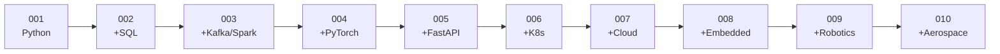

# _Project template

Home: [[ULTIMATE ENGINEER]] · Index: [[28 — PROJECTS]]

---

## The template

```markdown
---
tags: [project, <tech>, <tech>]
status: not-started      # not-started | in-progress | done
---

# Project NNN — <Name>

## What you're building

<One paragraph. What exists at the end that didn't before.>

## Why this project exists

<Which gap in the knowledge base it closes.
What you will understand afterwards that you don't now.>

## Concepts used

| Concept | Note | New or revision? |
|---|---|---|
| <concept> | [[link]] | New |

## Prerequisites

<Projects and notes to do first.>

## Architecture

```mermaid
<diagram of THIS project>
```

## Build steps

- [ ] **Step 1 — <name>**
      <what to do, and what "done" looks like>
- [ ] **Step 2 — <name>**

## Checkpoints

<Observable proof it works. Not "the code runs" — a specific
thing you can look at and verify.>

## What will go wrong

| Symptom | Cause | Where the fix is |
|---|---|---|

## Stretch goals

- [ ] <optional depth>

## What you learned

<Fill in AFTER. The most valuable section on the page.
Three lines on what surprised you.>

## Next project

[[Project NNN+1 — ...]]
```

---

## Rules for every project

**1. Ship something end to end before making any part good.**
A working ugly pipeline beats a beautiful half-pipeline. You learn the *joins* between components, and those are where the real difficulty lives.

**2. Write `DECISIONS.md` as you go.**
Three lines per judgement call: what you chose, why, and what would make you revisit it. This is the document that makes interviews go well, and you cannot reconstruct it later.

**3. Every project keeps the previous one's architecture.**
Project 004 doesn't start fresh — it adds a model to Project 003's pipeline. By Project 010 you have one large system you understand completely, not ten toys.

**4. Fill in "What you learned" afterwards.**
If you can't name three surprises, you probably followed instructions without understanding them.

**5. Break it deliberately.**
Every project has a "make it fail" step. Understanding a failure mode once is worth more than reading about ten.

---

## The progression

Each project adds exactly one layer to the architecture in [[Master architecture]].

| # | Project | Adds | Stack |
|---|---|---|---|
| 001 | [[Project 001 — Aircraft Engine Sensor Analyzer]] | The basics | Python, CSV, testing, Git |
| 002 | [[Project 002 — Aircraft Sensor Data Pipeline]] | Persistence | + PostgreSQL, SQL |
| 003 | [[Project 003 — Distributed Sensor Pipeline]] | Scale + streaming | + Kafka, PySpark, Delta Lake |
| 004 | [[Project 004 — Engine Failure Neural Network]] | Intelligence | + PyTorch, MLflow |
| 005 | [[Project 005 — Real-time Prediction API]] | Serving | + FastAPI, Docker |
| 006 | [[Project 006 — Complete ML Platform]] | Orchestration | + Kubernetes |
| 007 | [[Project 007 — Cloud Deployment]] | Cloud | Azure, AWS, GCP |
| 008 | [[Project 008 — Physical Intelligent Engine Monitor]] | **Physical world** | + ESP32, C/C++, sensors, MQTT |
| 009 | [[Project 009 — Autonomous Robotics System]] | Autonomy | + ROS 2, CV, control |
| 010 | [[Project 010 — Advanced Aerospace Intelligent System]] | Everything | + simulation, telemetry |



---

## Choosing a dataset

Projects 001–007 use **NASA C-MAPSS Turbofan Engine Degradation** — run-to-failure sensor data from simulated jet engines. Free, realistic, and genuinely a predictive-maintenance problem rather than a toy.

- [NASA Prognostics Data Repository](https://www.nasa.gov/intelligent-systems-division/discovery-and-systems-health/pcoe/pcoe-data-set-repository/)

Projects 008–010 use **data you generate yourself** from real sensors, which is a different and harder problem — real sensors are noisy, drift, and disconnect.

> The switch from clean public data to your own messy sensor data at Project 008 is deliberate, and it's the most valuable step in the sequence.
