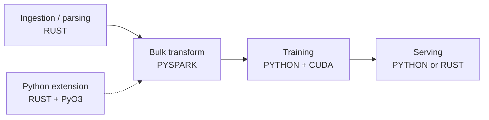

# Rust for this stack

> **What this is:** where Rust fits a data/ML system — fast ingestion, Python extensions, and serving — and why it's increasingly the default choice for new performance-critical components.
> **Why you care:** your [[The 10x Engineer]] ML stack line already says *data processing (Rust), orchestration (Rust)*. This is how that actually works, and what it buys you over C++.

Language fundamentals are in [[Rust]] — ownership, types, traits, crates. This note is what you do with them **here**.

---

## The idea in plain English

Rust's pitch is one sentence: **C++ speed, with the compiler proving you didn't make the memory mistakes.**

In C++, a use-after-free or a data race compiles fine and fails at 3am in production. In Rust, it **doesn't compile**. The borrow checker is a proof system that runs at build time.

The price is real: you argue with the compiler while learning, and some patterns that are trivial in Python (two things pointing at the same mutable object) require deliberate thought.

The payoff: **"if it compiles, it probably works"** is not a joke in Rust, particularly for concurrency. You can parallelise aggressively without the low-grade fear that accompanies threaded C++.

> **The reason it matters for data work specifically:** data pipelines are embarrassingly parallel — process a million records independently. That's exactly where C++ threading bugs live, and exactly where Rust's guarantees pay off most.

---

## You're already using it

| Tool | Written in |
|---|---|
| **polars** | Rust |
| **ruff** (your linter) | Rust |
| **uv** (your package manager) | Rust |
| **pydantic-core** | Rust |
| **tokenizers** (Hugging Face) | Rust |
| **Delta Lake (delta-rs)** | Rust |
| **DataFusion / Arrow** | Rust |

> **This is the strongest argument for Rust in data engineering: the fastest tools in the modern Python data stack are Rust with a Python wrapper.** That's not a coincidence, and it's the exact pattern you'd follow yourself.

---

## Where Rust fits



| Job | Why Rust |
|---|---|
| **Custom high-volume ingestion / parsing** | Per-record overhead dominates; safe parallelism |
| **A Python extension for a hot loop** | PyO3 + maturin is genuinely pleasant |
| **A low-latency API** | No GC pauses, tiny memory footprint ([[Actix Web]]) |
| **CLI tools** | Single static binary, no runtime to install |
| **Orchestration daemons** | Long-running, low memory, no interpreter |

**Where Rust does *not* fit:** model training. The ecosystem isn't there and won't be — PyTorch is Python + C++ + CUDA and that's fine. Train in Python; consider Rust for the layers either side.

---

## 1. Fast ingestion — the flagship use case

The capstone reads a CSV with Spark. But imagine 500 million records of a bespoke format, arriving hourly, where per-record parsing dominates.

```rust
use rayon::prelude::*;
use serde::Deserialize;
use std::fs::File;

#[derive(Debug, Deserialize)]
struct Sale {
    invoice_no: String,
    product_id: String,
    quantity: i32,
    unit_price: f64,
    customer_id: Option<String>,          // ← Option: nullable, enforced by the type system
}

fn main() -> anyhow::Result<()> {
    let mut rdr = csv::Reader::from_reader(File::open("online_retail.csv")?);
    let rows: Vec<Sale> = rdr.deserialize().filter_map(Result::ok).collect();

    // parallel across all cores — one word changed from .iter()
    let revenue: f64 = rows
        .par_iter()
        .filter(|s| s.quantity > 0 && !s.invoice_no.starts_with('C'))
        .map(|s| s.quantity as f64 * s.unit_price)
        .sum();

    println!("total revenue: {revenue:.2}");
    Ok(())
}
```

```toml
[dependencies]
csv = "1.3"
serde = { version = "1", features = ["derive"] }
rayon = "1.10"
anyhow = "1"
```

**Three things worth noticing:**

**`.par_iter()` instead of `.iter()`** — that one change parallelises across every core. **Rayon can guarantee this is safe because the compiler already proved there are no shared mutable references.** In C++ that's a code review and a prayer; in Rust it's a word.

**`Option<String>` for `customer_id`** — the 20% missing customer IDs from [[Capstone overview and architecture]] become a *type*. You cannot use the value without handling the `None` case; the compiler refuses. That whole category of null bug disappears.

**`?` for error propagation** — no exceptions. A function returns `Result`, and `?` passes failures up. Errors are values you must handle, not surprises.

> **This is the same cleaning logic as your silver layer, expressed in a language where nulls and errors are part of the type.** Rust's `Option` and `Result` are why "if it compiles, it probably works" holds — the compiler forces you to handle exactly the cases that bite you at 3am.

---

## 2. A Python extension — the highest-value pattern

Rewrite one hot function, keep Python everywhere else. This is how polars, ruff and pydantic-core are built.

```rust
// src/lib.rs
use pyo3::prelude::*;
use rayon::prelude::*;

/// Compute revenue for many rows, in parallel.
#[pyfunction]
fn compute_revenue(quantities: Vec<i32>, prices: Vec<f64>) -> PyResult<Vec<f64>> {
    Ok(quantities
        .par_iter()
        .zip(prices.par_iter())
        .map(|(q, p)| *q as f64 * p)
        .collect())
}

#[pymodule]
fn fastretail(m: &Bound<'_, PyModule>) -> PyResult<()> {
    m.add_function(wrap_pyfunction!(compute_revenue, m)?)?;
    Ok(())
}
```

```toml
# Cargo.toml
[lib]
name = "fastretail"
crate-type = ["cdylib"]

[dependencies]
pyo3 = { version = "0.23", features = ["extension-module"] }
rayon = "1.10"
```

```bash
uv add --dev maturin
maturin develop --release        # builds and installs into your venv
```

```python
import fastretail
revenue = fastretail.compute_revenue(quantities, prices)     # just a Python function
```

> **`maturin develop --release` — don't forget `--release`.** A debug Rust build can be **10–50× slower** than a release build, and slower than numpy. People benchmark the debug build, conclude Rust isn't worth it, and move on. Same trap as forgetting `-O3` in [[C++ for this stack]].

> **Be honest about the comparison though:** for `quantity * price` over an array, **numpy is already this fast** — it's compiled C calling SIMD instructions. Rust wins when the per-item logic is *complex* and can't vectorise: parsing, branching, string work, custom state machines. Benchmark against the vectorised Python version, not the loop ([[When to leave Python]]).

---

## 3. Serving

You already have [[Actix Web]]. Serving an ONNX model from it:

```rust
use actix_web::{post, web, App, HttpServer, HttpResponse};
use ort::{session::Session, value::Tensor};
use serde::{Deserialize, Serialize};
use std::sync::Arc;

#[derive(Deserialize)]
struct SegmentRequest { customer_id: String, recency_days: f32, frequency: f32, monetary_value: f32 }

#[derive(Serialize)]
struct SegmentResponse { customer_id: String, segment: String, confidence: f32, model_version: String }

const LABELS: [&str; 4] = ["at_risk", "regular", "loyal", "champion"];

#[post("/predict/segment")]
async fn predict(state: web::Data<Arc<AppState>>, req: web::Json<SegmentRequest>)
    -> actix_web::Result<HttpResponse>
{
    // FEATURE ORDER must match training exactly — same contract as everywhere else
    let input = Tensor::from_array(([1usize, 3], vec![
        req.recency_days, req.frequency, req.monetary_value,
    ])).map_err(actix_web::error::ErrorInternalServerError)?;

    let outputs = state.session.run(ort::inputs!["features" => input])
        .map_err(actix_web::error::ErrorInternalServerError)?;

    let (_, probs) = outputs["prediction"].try_extract_tensor::<f32>()
        .map_err(actix_web::error::ErrorInternalServerError)?;

    let idx = probs.iter().enumerate()
        .max_by(|a, b| a.1.partial_cmp(b.1).unwrap()).map(|(i, _)| i).unwrap_or(0);

    Ok(HttpResponse::Ok().json(SegmentResponse {
        customer_id: req.customer_id.clone(),
        segment: LABELS[idx].to_string(),
        confidence: probs[idx],
        model_version: state.model_version.clone(),
    }))
}

#[actix_web::main]
async fn main() -> std::io::Result<()> {
    // load the model ONCE at startup — same rule as [[FastAPI data and deployment]]
    let state = Arc::new(AppState {
        session: Session::builder().unwrap().commit_from_file("models/segment_v1.onnx").unwrap(),
        model_version: "v1".into(),
    });

    HttpServer::new(move || App::new().app_data(web::Data::new(state.clone())).service(predict))
        .bind(("0.0.0.0", 8000))?          // ← 0.0.0.0, same container rule
        .run().await
}
```

**FastAPI vs. Actix for serving a model:**

| | FastAPI (Python) | Actix (Rust) |
|---|---|---|
| Time to build | Hours | Days |
| Latency | Good (ms) | Excellent (µs), **no GC pauses** |
| Memory | ~300MB+ | ~15MB |
| Image size | ~300MB | **~20MB** |
| Ecosystem | Everything | Thinner for ML |
| Iterating on the model | Trivial | Rebuild |

> **Use FastAPI unless you have a measured reason not to.** The Python overhead is usually dwarfed by the database call ([[Deployment patterns]]). Rust serving earns its place at very high request volumes, hard latency floors (p99 in single-digit ms), or memory-constrained deployments — and note the tail-latency argument is real: no garbage collector means no unpredictable pauses.

---

## 4. The concepts that block Python people

### Ownership

```rust
let s1 = String::from("hello");
let s2 = s1;                       // s1 is MOVED, not copied
// println!("{s1}");               // ✗ compile error: value borrowed after move
```

Every value has exactly one owner. Assigning **moves** ownership. When the owner goes out of scope, the value is freed — automatically, deterministically, with no garbage collector and no `free()`.

### Borrowing

```rust
fn total(sales: &[Sale]) -> f64 { ... }        // borrow — read only, no copy
fn clean(sales: &mut Vec<Sale>) { ... }        // mutable borrow — exclusive
```

**The rule:** any number of immutable borrows, **or** exactly one mutable borrow. Never both.

> **That single rule eliminates data races at compile time.** If nothing else can read while one thing writes, concurrent mutation is impossible. It's also why `.par_iter()` is safe to sprinkle around — and it's the reason Rust exists.

### `Option` and `Result` — no nulls, no exceptions

```rust
let customer: Option<String> = row.customer_id;

match customer {
    Some(id) => process(id),
    None     => skip(),                        // the compiler MAKES you handle this
}

let n: i32 = text.parse()?;                    // ? propagates the error upward
let n: i32 = text.parse().unwrap_or(0);        // or supply a default
```

> **`.unwrap()` panics on failure.** It's fine in a prototype or a test; in production code it's a crash waiting to happen. Use `?`, `unwrap_or`, or a proper `match`. A codebase littered with `.unwrap()` has thrown away most of what Rust offers.

### Cargo — the thing you'll actually enjoy

```bash
cargo new retail-ingest
cargo add polars --features lazy
cargo build --release        # ← ALWAYS --release for benchmarks
cargo test
cargo clippy                 # a genuinely excellent linter
cargo fmt
```

> After CMake ([[C++ for this stack]]), Cargo feels like a gift. Dependencies, builds, tests, docs, formatting and linting in one tool that works identically everywhere. It's a real reason to choose Rust for a new component.

---

## 5. polars from Rust

polars is a Rust library with a Python wrapper. You can use the library directly:

```rust
use polars::prelude::*;

fn main() -> PolarsResult<()> {
    let df = LazyFrame::scan_parquet("sales/*.parquet", Default::default())?
        .filter(col("quantity").gt(lit(0)))
        .with_column((col("quantity") * col("unit_price")).alias("revenue"))
        .group_by([col("product_id")])
        .agg([col("revenue").sum()])
        .collect()?;

    println!("{df}");
    Ok(())
}
```

> **Identical API shape to the Python version** in [[When to leave Python]] — and to Spark. Lazy, then `.collect()`. Learn the model once and it transfers across polars, Spark and DataFusion.
>
> **But:** if you're only doing dataframe operations, the Python polars bindings are already running this exact Rust code. Going to Rust buys you nothing there. Do it when you need dataframe work *plus* custom logic, or a standalone binary.

---

## When something goes wrong

| Symptom | Likely cause | Fix |
|---|---|---|
| Rust slower than numpy | Debug build | `--release` / `maturin develop --release` |
| Still slower than numpy | Competing with SIMD/BLAS on simple maths | Rust wins on complex per-item logic, not on `a * b` |
| "borrow of moved value" | Ownership moved on assignment | `.clone()`, or borrow with `&` |
| "cannot borrow as mutable more than once" | Two mutable borrows alive | Restructure; narrow the scopes |
| Fighting the borrow checker constantly | Porting a Python object graph directly | Rethink in terms of ownership; consider `Arc<Mutex<T>>` sparingly |
| Panics in production | `.unwrap()` everywhere | `?`, `unwrap_or`, `match` |
| PyO3 module won't import | Wrong `crate-type` or module name mismatch | `cdylib`; `#[pymodule]` name must match `[lib] name` |
| Huge container | Built in the toolchain image | Multi-stage: `rust:1.83` → `debian:bookworm-slim` |
| Slow compile times | Rust compiles slowly; it's real | `cargo check` while iterating; incremental builds |
| ONNX gives wrong numbers | Feature order / dtype | Same contract as Python ([[Model export and serving]]) |

---

## Practice checklist

- [ ] Rust's pitch: C++ speed with compile-time memory safety
- [ ] **How much of your Python stack is already Rust** — polars, ruff, uv, pydantic-core, tokenizers
- [ ] Where Rust fits: ingestion, extensions, serving, CLIs — **not** training
- [ ] `.par_iter()` with rayon, and **why the borrow checker makes it safe**
- [ ] `Option` for nullable data, `Result` and `?` for errors
- [ ] **PyO3 + maturin** — the rewrite-one-function pattern
- [ ] **`--release` always**, for benchmarks and production
- [ ] Benchmarking against *vectorised* Python, not a Python loop
- [ ] Serving with Actix + ONNX, and when it beats FastAPI
- [ ] Ownership, moves, and borrowing rules
- [ ] Avoiding `.unwrap()` in production code
- [ ] Cargo vs. CMake
- [ ] polars from Rust, and when that's pointless

## Hands-on

- [ ] Write a Rust CLI that reads the retail CSV and computes total revenue; compare timing with pandas
- [ ] Add `.par_iter()` and measure the speedup across your cores
- [ ] Build a PyO3 extension for one capstone function; benchmark **against the vectorised version**
- [ ] Build it in debug and release; measure both — the gap is the lesson
- [ ] Serve your ONNX segmentation model from Actix; compare image size and p99 latency with FastAPI
- [ ] Deliberately trigger a borrow-checker error and work out what it was protecting you from

## Resources

- [The Rust Book](https://doc.rust-lang.org/book/) — chapter 4 (ownership) is the one that matters
- [PyO3 user guide](https://pyo3.rs/) · [maturin](https://www.maturin.rs/)
- [Rayon](https://docs.rs/rayon/) · [polars Rust API](https://docs.rs/polars/)
- [ort — ONNX Runtime for Rust](https://ort.pyke.io/)
- [[Rust]] — language fundamentals · [[Crates, Modules and modularisation]] · [[Actix Web]] · [[Serde]]

## Next

[[Certification map]]
