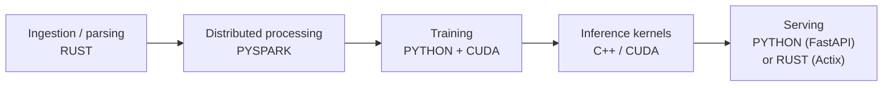

# When to leave Python

> **What this is:** how to tell whether your problem needs C++, Rust or CUDA — or whether you just wrote slow Python.
> **Why you care:** rewriting in a systems language is a 10× time investment. Most "Python is too slow" problems are fixed in an afternoon without leaving Python, and doing the rewrite first means you pay the cost and often keep the bug.

---

## The idea in plain English

Python is slow in a very specific way: **each individual operation** is slow, because every value is a full object and the interpreter checks types at runtime.

But most of the "Python" you run in data work **isn't Python**. `numpy`, `pandas`, `polars`, PyTorch and Spark are C, C++, Rust and CUDA underneath. When you call `df.groupby(...).sum()`, Python does almost nothing — it hands a pointer to compiled code and waits.

> **So the real question is never "is Python fast enough?"** It's: **"is my work happening inside the fast library, or in a Python loop around it?"**

```python
# ~2 seconds — 10 million interpreter steps
total = 0
for x in values:
    total += x * 2

# ~10 milliseconds — one call into compiled code
total = (values * 2).sum()
```

Same result. 200× difference. **No language change.**

---

## The ladder — climb it before you rewrite

Each rung is cheaper than the one below. Most problems stop at rung 3.

| Rung | Move | Typical gain | Cost to you |
|---|---|---|---|
| 1 | **Measure it** | — | An hour |
| 2 | **Fix the algorithm** | 10–1000× | Thinking |
| 3 | **Vectorise** (numpy/pandas/polars) | 10–100× | An afternoon |
| 4 | **Use a better library** (polars, DuckDB) | 5–50× | A day |
| 5 | **Parallelise** (multiprocessing, Spark) | ~N cores | A day |
| 6 | **Numba / Cython** | 10–100× on loops | Days |
| 7 | **Rust / C++ extension** | 10–100× | **Weeks** |
| 8 | **CUDA** | 10–1000× on parallel maths | Weeks |

> **Rung 1 is not optional and it is skipped constantly.** People rewrite the wrong function all the time. Measure first, every time — the bottleneck is almost never where you think.

---

## Rung 1 — Measure

```python
import cProfile, pstats
cProfile.run("main()", "profile.out")
pstats.Stats("profile.out").sort_stats("cumulative").print_stats(20)
```

Line by line:

```bash
uv add --dev line_profiler
kernprof -l -v script.py        # decorate the function with @profile
```

Memory:

```bash
uv add --dev memray
memray run script.py && memray flamegraph memray-script.bin
```

> **The 80/20 rule holds brutally here.** Usually one function is 90% of the runtime. Find it, and you often find it's doing something silly — a nested loop over a DataFrame, a query inside a loop, a file reopened per row.

**Before optimising anything, ask:**

| Question | If yes |
|---|---|
| Am I I/O bound, not CPU bound? | A faster language changes **nothing**. Fix the I/O. |
| Am I doing work in a loop that a library could vectorise? | Rung 3 |
| Am I calling the database per row? | Batch it — this is usually the whole problem |
| Is it slow, or just slow *once*? | Cache it |
| Does it need to be fast, or just finish overnight? | It's a batch job. Leave it. |

> **If you're I/O bound — waiting on a network, disk or database — the language is irrelevant.** Rust waits at exactly the same speed as Python. Use async, batching, or connection pooling instead ([[FastAPI data and deployment]]).

---

## Rung 2 — Fix the algorithm

The biggest wins are almost never the language.

```python
# O(n²) — 10,000 items = 100,000,000 comparisons
for a in items:
    if a in other_list:          # ← list lookup is O(n)
        ...

# O(n) — the same work in 10,000 steps
other = set(other_list)          # ← set lookup is O(1)
for a in items:
    if a in other:
        ...
```

> A rewrite in Rust makes an O(n²) algorithm about 50× faster. Fixing it to O(n) makes it 10,000× faster, in one line, in Python. **Algorithms beat languages, and it isn't close.**

---

## Rung 3 — Vectorise

The single highest-value skill in this note.

```python
# ✗ ~30 seconds on 1M rows — the classic mistake
for i, row in df.iterrows():
    df.at[i, "revenue"] = row["quantity"] * row["unit_price"]

# ✓ ~10 milliseconds
df["revenue"] = df["quantity"] * df["unit_price"]
```

> **`iterrows()` is almost always a bug.** It creates a Series object per row. If you find yourself writing it, there is a vectorised way — `np.where`, `.map`, `.merge`, `groupby().transform()`, or `np.select` for multi-condition logic.

```python
import numpy as np

# multi-condition logic, vectorised
conditions = [df.recency < 30, df.recency < 90, df.recency < 365]
choices    = ["active", "lapsing", "dormant"]
df["status"] = np.select(conditions, choices, default="lost")
```

---

## Rung 4 — A better library

| Instead of | Use | Gain |
|---|---|---|
| pandas | **polars** | 5–30×. Written in **Rust**, multithreaded, lazy. |
| pandas for SQL-ish work | **DuckDB** | Often 10×+, and you write SQL |
| `json` | `orjson` | 5–10× |
| `csv` | `pyarrow.csv` | 10×+ |
| pandas → Spark (as a first step) | polars / DuckDB | Both handle far more than people expect on one machine |

```python
import polars as pl

result = (pl.scan_parquet("sales/*.parquet")          # lazy — nothing read yet
    .filter(pl.col("quantity") > 0)
    .with_columns((pl.col("quantity") * pl.col("unit_price")).alias("revenue"))
    .group_by("product_id")
    .agg(pl.col("revenue").sum())
    .collect())                                        # now it runs, optimised
```

> **Notice the shape — lazy, then `.collect()`.** It's the same idea as [[PySpark core]]: build a plan, let the engine optimise it, then execute. Learning polars makes Spark's model click, and vice versa.

> **A modern laptop handles far more than people assume.** DuckDB and polars comfortably process tens of gigabytes on one machine. Reach for Spark when data genuinely exceeds one machine, or when you need Delta and a cluster — not by reflex.

---

## Rung 5 — Parallelise

```python
from concurrent.futures import ProcessPoolExecutor
with ProcessPoolExecutor(max_workers=8) as pool:
    results = list(pool.map(process_chunk, chunks))
```

> **Threads don't help CPU-bound Python** because of the GIL — only one thread runs bytecode at a time. Use **processes** for CPU work and **threads/async** for I/O. (Python 3.13+ has an experimental free-threaded build, but don't rely on it yet.)
>
> Note that numpy, polars and PyTorch **release the GIL** during compiled work, so they're already multithreaded internally. Another reason vectorising beats parallelising by hand.

---

## Rung 6 — Numba

A middle rung people forget. Decorate a numeric Python function and it's compiled to machine code:

```python
from numba import njit

@njit
def rolling_max_drawdown(prices):
    peak, worst = prices[0], 0.0
    for p in prices:                      # a real loop, compiled
        peak = max(peak, p)
        worst = min(worst, (p - peak) / peak)
    return worst
```

10–100× on numeric loops, for one decorator and no new language.

> **Numba is the right answer when your logic is genuinely sequential** — a loop where each step depends on the last, which vectorisation can't express. That's exactly where people reach for C++ unnecessarily.

---

## Rungs 7–8 — Actually leaving Python

Only now. The genuine reasons:

| Reason | Language | Example |
|---|---|---|
| **Per-item overhead dominates** and it can't vectorise | Rust / C++ | A custom parser over 500M records |
| **Latency floor** — microseconds matter | Rust / C++ | Real-time trading, robotics control |
| **Memory control** — no GC pauses | Rust / C++ | Predictable-latency services |
| **Embedding / no runtime** | C / C++ / Rust | Firmware, WASM, a shared library ([[Embedded]]) |
| **Massively parallel maths** | **CUDA** | Training, large matrix ops |
| **A binary to hand someone** | Rust / Go | A CLI with no install steps |

**And the honest anti-reasons:**

| "Reason" | Reality |
|---|---|
| "Python is slow" | Measure it. It's usually your loop, not Python. |
| "Rust is faster" | Yes, and you'll ship in six weeks instead of two days |
| "It's more professional" | Shipping is professional |
| "I want to learn Rust" | ✅ **A completely valid reason** — just be honest that it's the reason |

> **The rewrite is not the end of the cost.** It's a build toolchain, cross-compilation, a Python binding layer, CI changes, and a codebase fewer people can maintain. Take it on when the measurement demands it, or when learning *is* the point.

---

## Where each language actually fits this stack

Matching the ML stack line in [[The 10x Engineer]] — *data processing (Rust), math engine (C), orchestration (Rust)*:



| Layer | Language | Why |
|---|---|---|
| Custom ingestion / parsing | **Rust** | Per-record overhead dominates; safe concurrency ([[Rust for this stack]]) |
| Bulk transformation | **PySpark** | Distributed, and the API is already fast |
| Model training | **Python + CUDA** | PyTorch is C++/CUDA already ([[CUDA and GPU programming]]) |
| Custom operators | **C++ / CUDA** | When no built-in op exists ([[C++ for this stack]]) |
| Serving | **Python** or **Rust** | Python is fine; Rust for latency floors ([[Actix Web]]) |
| Edge / embedded | **C / C++ / Rust** | No Python runtime available |

> **Python stays the orchestration layer even in a heavily optimised system.** You write the pipeline in Python and it calls fast things. That's not a compromise — that's the design PyTorch, Spark and polars all use deliberately.

---

## The pattern that gets you both

You rarely rewrite everything. You rewrite **one function** and call it from Python.

```rust
// Rust, exposed to Python with PyO3
use pyo3::prelude::*;

#[pyfunction]
fn parse_invoices(raw: Vec<String>) -> PyResult<Vec<f64>> {
    Ok(raw.iter().filter_map(|s| s.parse().ok()).collect())
}

#[pymodule]
fn fastparse(m: &Bound<'_, PyModule>) -> PyResult<()> {
    m.add_function(wrap_pyfunction!(parse_invoices, m)?)
}
```

```python
import fastparse
values = fastparse.parse_invoices(raw_lines)     # just a Python function
```

> **This is how polars, pydantic-core, ruff and tokenizers all work** — a Rust core with a Python interface. You get the speed exactly where it matters and keep Python everywhere else. It's the right shape, and it's far less work than a full rewrite.

---

## When something goes wrong

| Symptom | Likely cause | Fix |
|---|---|---|
| Rewrote it, barely faster | You were I/O bound | Profile first; fix the I/O |
| pandas op takes minutes | `iterrows` / `apply` | Vectorise |
| Multiprocessing slower than serial | Pickling overhead > the work | Bigger chunks, or shared memory |
| Threads don't speed up CPU work | The GIL | Use processes |
| Numba errors on your function | Unsupported types (dicts, objects) | Numeric arrays and scalars only |
| Rust extension slower than numpy | numpy already calls optimised BLAS | Don't compete with BLAS |
| Spark slower than pandas | Data is small; overhead dominates | Use polars/DuckDB below ~10GB |
| Out of memory, not slow | Wrong problem entirely | Chunk it, or use lazy evaluation |
| Optimised the wrong function | Didn't profile | Rung 1 |

---

## Practice checklist

- [ ] **Why Python is slow, and why most data Python isn't Python**
- [ ] The eight-rung ladder, and stopping early
- [ ] Profiling with cProfile, line_profiler, memray
- [ ] **Checking whether you're I/O bound before anything else**
- [ ] Algorithms beat languages — O(n²) → O(n)
- [ ] Vectorising, and why `iterrows` is almost always a bug
- [ ] polars and DuckDB, and lazy evaluation
- [ ] Processes for CPU, threads/async for I/O, and the GIL
- [ ] Numba for genuinely sequential numeric loops
- [ ] The real reasons to leave Python — and the fake ones
- [ ] Where each language fits the stack
- [ ] **The extension pattern** — rewrite one function, keep Python around it

## Hands-on

- [ ] Profile the capstone pipeline and find the single slowest function
- [ ] Rewrite one `iterrows` loop as a vectorised operation; time both
- [ ] Redo one Spark gold aggregation in polars and DuckDB; compare all three
- [ ] Write a sequential numeric loop, add `@njit`, and measure
- [ ] Decide honestly whether *anything* in the capstone justifies leaving Python

## Resources

- [Polars user guide](https://docs.pola.rs/)
- [DuckDB docs](https://duckdb.org/docs/)
- [Numba docs](https://numba.readthedocs.io/)
- [PyO3 user guide](https://pyo3.rs/) — Rust extensions for Python

## Next

[[CUDA and GPU programming]]
