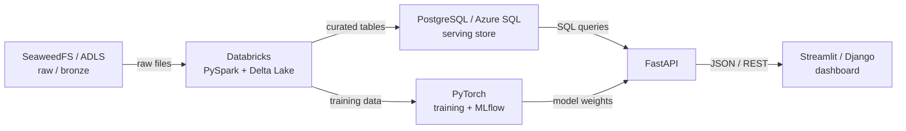

# Data Engineering

A **curated path** through the vault for the data / ML engineering stack — the notes in the order they make sense, not the order they're filed in.

The notes themselves live in the numbered sections ([[ULTIMATE ENGINEER]]). This page is the reading order.

Starts where solid Python leaves off.

## The stack

Dashboards never touch the lake or the model directly — FastAPI is the one door everything downstream goes through.

## The path

**1 · Foundations**

[[SQL fundamentals]] — window functions, execution order, query plans *(deeper than [[SQL]])*

[[Dev environment - Git, Docker, CLI]] — *(see also [[Git-GitHub]])*

**2 · Storage and databases**

[[Azure fundamentals]] → [[ADLS Gen2]] → [[Azure SQL Database]]

Local equivalents: [[SeaweedFS]] · [[PostgreSQL reference]]

**3 · Distributed processing**

[[PySpark core]] → [[Databricks and Delta Lake]] → [[Unity Catalog and orchestration]]

**4 · Serving layer**

[[FastAPI fundamentals]] → [[FastAPI data and deployment]]

**5 · Dashboards**

[[Streamlit vs Django]] — *(see also [[Django]])*

**6 · ML and deep learning**

[[Tensors, autograd and the training loop]] → [[CNNs and transfer learning]] → [[Transformers and LLM basics]] → [[MLflow experiment tracking]] → [[Model export and serving]]

**7 · Engineering practices**

[[Testing and CI-CD]] · [[Data modeling]] · [[Adjacent tools you will meet]]

**8 · Containers and deployment**

[[Docker deep dive]] → [[Running the whole stack locally]] → [[Kubernetes and AKS]] → [[Containers and deployment]]

**9 · MLOps and CI-CD**

[[CI-CD pipelines]] → [[Azure ML and the MLOps stack]] → [[Observability for data and ML pipelines]]

**10 · Systems performance** *(optional)*

[[When to leave Python]] → [[CUDA and GPU programming]] → [[C++ for this stack]] → [[Rust for this stack]]

**11 · Certifications**

[[Certification map]]

**12 · Capstone**

[[Capstone overview and architecture]] → [[Capstone build guide]]

**13 · Idea to production** *(reference, not a stage)*

[[The playbook]] · [[Problem framing]] · [[Choosing your approach]] · [[LLM and GenAI track]] · [[Deployment patterns]] · [[Monitoring and iteration]]

## Pacing

At roughly 8-10 focused hours/week:

| Stage | Focus | Est. |
|---|---|---|
| 1 | Foundations | 1 week |
| 2 | Storage & databases | 2 weeks |
| 3 | PySpark & Databricks | 3-4 weeks |
| 4 | FastAPI | 2 weeks |
| 5 | Dashboards | 1-2 weeks |
| 6 | PyTorch | 4-5 weeks |
| 7 | Engineering practices | ~1 week dedicated |
| 8-9 | Containers, deployment, MLOps | 2 weeks |
| 10 | Systems performance *(optional)* | 2-3 weeks |
| 12 | Capstone | 2-3 weeks |
| **Total** | | **~18-23 weeks** |

Status board: [[Progress tracker]] · Full taxonomy: [[ULTIMATE ENGINEER]]
