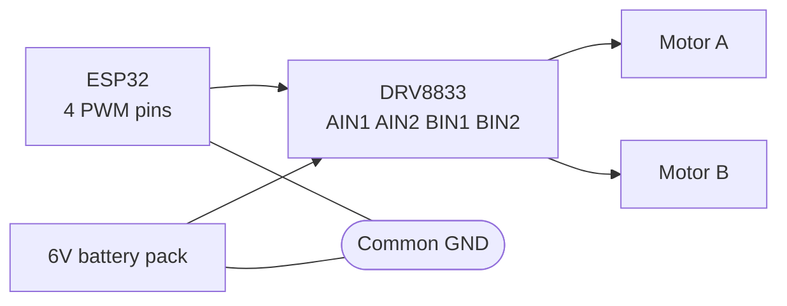

An H-bridge is four switches arranged so you can connect a motor's two terminals to the supply either way round, which is how you reverse a DC motor without rewiring it.

A single transistor can only turn a motor on and off. To reverse it you need to swap which terminal is positive, and that takes four switches.

Why it is called an H

Draw the four switches and the motor between them and it looks like the letter H.

```
        V+                     V+
        │                      │
    ┌───┴───┐              ┌───┴───┐
   S1       S2            S1       S2
    │       │              │       │
    ├──[M]──┤              ├──[M]──┤
    │       │              │       │
   S3       S4            S3       S4
    └───┬───┘              └───┬───┘
        │                      │
       GND                    GND

   S1 + S4 closed          S2 + S3 closed
   left  = +               left  = -
   right = -               right = +
   FORWARD                 REVERSE
```

The truth table:

|S1|S2|S3|S4|Result|
|---|---|---|---|---|
|On|Off|Off|On|Forward|
|Off|On|On|Off|Reverse|
|Off|Off|Off|Off|Coast, motor freewheels|
|Off|Off|On|On|Brake, both terminals shorted to GND|
|On|On|Off|Off|Brake, both terminals to V+|
|**On**|**Off**|**On**|**Off**|**Shoot-through, dead short, destroys the driver**|

That last row is why you buy a module rather than building one from four MOSFETs. If S1 and S3 are ever on at the same time, even for a microsecond during a switch transition, you have wired the supply directly to ground through two transistors. Commercial driver chips have built-in dead-time logic to make this impossible. Your breadboard does not.

Buy a module. There is no learning benefit to destroying MOSFETs.

Which module

|Module|Motor V|Current/ch|Voltage loss|3.3V logic|Verdict|
|---|---|---|---|---|---|
|DRV8833|2.7 - 10.8V|1.5A (2A peak)|~0.3V|Yes|**Best for small robots**|
|TB6612FNG|4.5 - 13.5V|1.2A (3A peak)|~0.5V|Yes|Excellent, tiny|
|L298N|5 - 35V|2A|**~2V**|Yes, but marginal|Ancient, in every kit|
|L9110S|2.5 - 12V|0.8A|~0.6V|Yes|Cheap and cheerful|
|BTS7960|6 - 27V|43A|Very low|Yes|Big motors|

The L298N deserves a specific warning. It is a 1970s bipolar design and it drops roughly 2V across itself. Feed it 6V and your motor gets 4V, so it runs noticeably slower than it should and the big heatsink gets hot. It is in every kit because it is old and cheap. If you can, use a DRV8833 or TB6612FNG instead, which are MOSFET based, waste almost nothing and run cold.

Wiring a DRV8833

Two motors, six connections to the ESP32, and PWM on all four inputs.



```
   6V pack + ──────┬──────── DRV8833 VM
                   │
                  ─┴─ 470µF
                  ─┬─
                   │
   6V pack - ──────┴──────── DRV8833 GND
                              │
   ESP32 GND ─────────────────┘

   ESP32 GPIO25 ──────────── AIN1
   ESP32 GPIO26 ──────────── AIN2
   ESP32 GPIO27 ──────────── BIN1
   ESP32 GPIO14 ──────────── BIN2
   ESP32 3V3    ──────────── SLP (sleep, pull high to enable)

   DRV8833 AOUT1 ─────────── MOTOR A terminal 1
   DRV8833 AOUT2 ─────────── MOTOR A terminal 2
   DRV8833 BOUT1 ─────────── MOTOR B terminal 1
   DRV8833 BOUT2 ─────────── MOTOR B terminal 2
```

|From|To|Note|
|---|---|---|
|Battery +|DRV8833 VM|motor supply, 2.7 - 10.8V|
|Battery -|DRV8833 GND|-|
|Battery - |ESP32 GND|**shared ground, mandatory**|
|Across VM and GND|470µF electrolytic|+ leg to VM, stops brownouts|
|ESP32 GPIO25|AIN1|PWM capable|
|ESP32 GPIO26|AIN2|PWM capable|
|ESP32 GPIO27|BIN1|-|
|ESP32 GPIO14|BIN2|-|
|ESP32 3V3|SLP / nSLEEP|**must be HIGH or the chip does nothing**|
|AOUT1, AOUT2|Motor A terminals|swap them to flip which way "forward" is|
|BOUT1, BOUT2|Motor B terminals|-|

The `SLP` pin catches people out. It is an active-low sleep pin, so it must be pulled HIGH for the driver to work at all. Leave it floating and the module is silently dead. Some breakouts have a pull-up fitted already, most do not.

How the two inputs per motor work

Each motor has two inputs and between them they cover all four states.

|IN1|IN2|Motor|
|---|---|---|
|LOW|LOW|Coast, freewheeling|
|HIGH|LOW|Forward|
|LOW|HIGH|Reverse|
|HIGH|HIGH|Brake|

Speed control works by PWMing one input while holding the other at a fixed level. Two ways of doing it:

|Method|IN1|IN2|Behaviour|
|---|---|---|---|
|Fast decay|PWM|LOW|Motor coasts between pulses. Standard|
|Slow decay|HIGH|inverted PWM|Motor brakes between pulses. Better low-speed control|

Fast decay is what the code below does and it is fine to start with.

Code

```cpp
// DRV8833 two motor control

#define AIN1 25
#define AIN2 26
#define BIN1 27
#define BIN2 14
#define SLP  33

const int FREQ = 1000;
const int RES  = 8;      // 0 - 255

void setup() {
  ledcAttach(AIN1, FREQ, RES);
  ledcAttach(AIN2, FREQ, RES);
  ledcAttach(BIN1, FREQ, RES);
  ledcAttach(BIN2, FREQ, RES);

  pinMode(SLP, OUTPUT);
  digitalWrite(SLP, HIGH);     // wake the driver up

  stopAll();
}

// speed: -255 (full reverse) to +255 (full forward)
void setMotor(int in1, int in2, int speed) {
  if (speed > 0) {
    ledcWrite(in1, speed);
    ledcWrite(in2, 0);
  } else if (speed < 0) {
    ledcWrite(in1, 0);
    ledcWrite(in2, -speed);
  } else {
    ledcWrite(in1, 0);
    ledcWrite(in2, 0);        // coast
  }
}

void stopAll() {
  setMotor(AIN1, AIN2, 0);
  setMotor(BIN1, BIN2, 0);
}

void loop() {
  // both forward
  setMotor(AIN1, AIN2, 200);
  setMotor(BIN1, BIN2, 200);
  delay(2000);

  // spin on the spot
  setMotor(AIN1, AIN2, 200);
  setMotor(BIN1, BIN2, -200);
  delay(1500);

  // both reverse
  setMotor(AIN1, AIN2, -200);
  setMotor(BIN1, BIN2, -200);
  delay(2000);

  stopAll();
  delay(2000);
}
```

Notice `setMotor` never sets both inputs HIGH at once. Keeping that invariant in one function is why you should not sprinkle `ledcWrite` calls around your codebase.

Motors will not start below roughly 25% duty. There is not enough torque to overcome static friction, so the motor just buzzes and heats. Map your speed range from about 60 to 255 rather than 0 to 255.

If you are using an L298N instead

Similar idea, three pins per motor rather than two.

|L298N pin|Connect to|Purpose|
|---|---|---|
|ENA|ESP32 PWM pin|Speed for motor A|
|IN1, IN2|ESP32 GPIO|Direction for motor A|
|ENB|ESP32 PWM pin|Speed for motor B|
|IN3, IN4|ESP32 GPIO|Direction for motor B|
|12V|Motor supply +|-|
|GND|Motor supply - and ESP32 GND|shared|
|5V|Output, 5V regulator|only valid if the jumper is fitted and Vin > 7V|
|OUT1-4|Motor terminals|-|

|IN1|IN2|ENA|Motor A|
|---|---|---|---|
|HIGH|LOW|PWM|Forward at PWM speed|
|LOW|HIGH|PWM|Reverse at PWM speed|
|X|X|LOW|Stopped|
|HIGH|HIGH|HIGH|Brake|

The `5V` pin on an L298N is an output from its onboard regulator, not an input. It only works if the little jumper next to the terminals is fitted and you are feeding at least 7V into `12V`. If you feed 12V in with the jumper fitted and also plug in USB, you have two supplies fighting. Remove the jumper if the ESP32 is USB powered.

Also remember the 2V drop. For a 6V motor to get 6V you need to feed the L298N about 8V.

Power, the part that goes wrong

The single most common H-bridge problem is the ESP32 resetting when a motor starts.

|Cause|Fix|
|---|---|
|Motor and logic share one supply|Separate them, or at minimum add bulk capacitance|
|No bulk capacitor|470µF - 1000µF across VM and GND|
|Motor inrush pulls the rail down|Ramp the PWM up instead of jumping to full|
|Thin wires to the motor supply|Thicker wire, shorter runs|

Remember that a DC motor pulls its **stall current** at the instant it starts, which for a small yellow gear motor is around 1.5A. See [[DC Motors]].

The flyback diodes are already inside the module. Both the DRV8833 and the L298N have built-in protection diodes, so you do not need to add them. This is another reason to use a module. See [[Flyback diode protection]] for what they are doing.

Debugging

|Symptom|Check|
|---|---|
|Nothing happens at all|SLP / STBY pin pulled HIGH? Shared ground?|
|One motor works, one does not|Swap the motors between channels. Motor or driver?|
|Motor only goes one way|One of the two input pins is not connected or not PWM configured|
|ESP32 resets when motor starts|Power problem. Bulk capacitor, separate supply|
|Motor weak and driver hot|L298N voltage drop, or supply cannot deliver the current|
|Motor buzzes, does not turn|PWM duty too low, or motor stalled|
|Both motors run at once when only one commanded|Wiring crossed, or code setting the wrong pins|

The mistake everyone makes

Leaving the `SLP` (DRV8833) or `STBY` (TB6612) pin floating. The module is completely dead, every wire looks right, and there is nothing in the code to fix. It must be pulled HIGH.

Second: powering the motors from the ESP32's `5V` or `3V3` pin. The board resets the instant a motor moves and the serial monitor shows a boot log, which looks exactly like a firmware crash.

Third: no shared ground between the motor supply and the ESP32.

Fourth: trying to build an H-bridge from four discrete MOSFETs on a breadboard. Shoot-through will destroy them, and the current levels are beyond what breadboard contacts can carry anyway.
