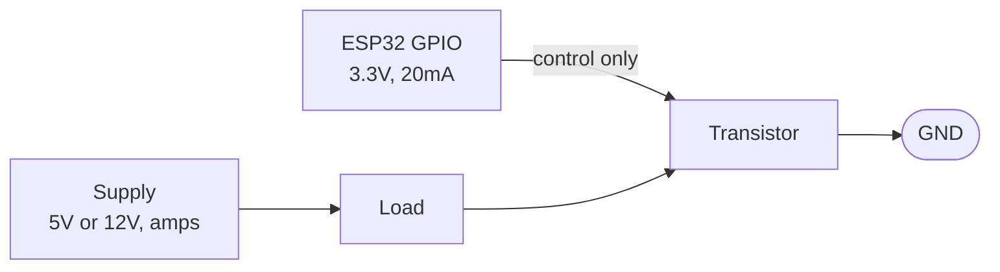

A GPIO pin can give you 20mA, and almost everything worth switching wants more than that, so you use the pin to control a transistor and the transistor does the heavy lifting.

The important idea: the load's current comes from the power supply, not from the ESP32. The pin only opens and closes a gate.



When you need one

|Load|Current|Needs a transistor?|
|---|---|---|
|One LED with a resistor|6mA|No|
|Three LEDs|18mA|Borderline, prefer yes|
|LED strip, 1m|500mA+|Yes|
|Relay coil|70mA|Yes|
|Small DC motor|150mA - 1.5A|Yes, plus a flyback diode|
|Solenoid / valve|500mA+|Yes, plus a flyback diode|
|Buzzer (active)|30mA|Yes|
|Anything on a different voltage|Any|Yes, this is the other reason|

That last row is easy to forget. Even a low-current 12V load needs a transistor, because the GPIO can only produce 3.3V and cannot switch a 12V rail at all.

Low-side switching with a MOSFET

This is the arrangement to learn. The load hangs off the positive rail and the transistor sits between the load and ground.

```
   12V ────────────┬───────────┐
                   │           │
                  ◀|─ 1N4007   │      flyback, only for coils/motors
                   │           │
                   └──[LOAD]───┘
                        │
                        │ D
   GPIO16 ──[220Ω]──────┤ G      IRLB8721
                        │ S
                        ├──[10kΩ]── GND
                        │
   GND ─────────────────┴────────────── ESP32 GND
```

|From|To|Note|
|---|---|---|
|12V supply +|Load terminal 1|load's own supply|
|Load terminal 2|MOSFET drain|-|
|Flyback diode across load|Stripe (cathode) to +12V|only needed for motors, relays, solenoids|
|ESP32 GPIO16|220Ω resistor leg 1|-|
|220Ω resistor leg 2|MOSFET gate|limits the gate charging spike|
|MOSFET gate|10kΩ resistor leg 1|-|
|10kΩ resistor leg 2|GND|holds the gate off during boot|
|MOSFET source|GND|-|
|12V supply -|ESP32 GND|**shared ground, mandatory**|

Two rows in that table are the ones people skip and then spend an evening debugging.

The **shared ground** row. The GPIO's 3.3V is measured relative to the ESP32's ground. If the 12V supply has its own separate ground, the MOSFET's gate has no reference and nothing switches. Grounds must be physically joined.

The **10kΩ gate pull-down**. Before `setup()` runs, every GPIO is floating. A floating MOSFET gate is a tiny capacitor that will drift to whatever voltage the surroundings suggest, and it can easily drift high enough to switch your load on. The symptom is a motor twitching or an LED strip flashing every time you press reset or upload. The pull-down holds it firmly off.

Why low-side and not high-side

Low-side means switching the negative connection. High-side means switching the positive connection. Low-side is much easier and it is what you should do.

The reason: an N-channel MOSFET turns on when the gate is above the **source**. In low-side the source is at 0V, so 3.3V on the gate is 3.3V above the source, job done. In high-side the source sits at the load voltage, say 12V, so to turn it on you would need 15V+ on the gate, which the ESP32 cannot produce.

High-side switching needs a P-channel MOSFET plus a small NPN to drive it, or a dedicated gate driver chip. Do not start there. The only downside of low-side is that the load's negative terminal is not at ground when it is off, which almost never matters in hobby projects.

Choosing the transistor

|Load current|Part|Notes|
|---|---|---|
|Under 200mA|2N7000 or BS170|Small logic-level MOSFET, TO-92 package|
|Under 500mA|2N2222 or BC337 NPN|Needs a proper base resistor|
|Up to a few amps|IRLB8721 or AO3400|Logic-level MOSFET, fully on at 2.5V|
|Up to 10A+|IRLB8721 with a heatsink|Check Rds(on) at 3.3V|

The 3.3V trap: the extremely common **IRF540N** needs 10V on its gate. At 3.3V it is only partly on, it drops a couple of volts, gets hot, and your motor runs weak. Not a power supply problem, a gate threshold problem. You need a **logic-level** part. See [[Transistors and MOSFETs]].

The BJT version

If you only have BJTs, the arrangement is the same but the base resistor calculation matters, because a BJT is current-controlled.

```
   5V ─────────[LOAD]───┐
                        │ C
   GPIO16 ──[1kΩ]───────┤ B     2N2222
                        │ E
   GND ─────────────────┴────── ESP32 GND
```

|From|To|Note|
|---|---|---|
|5V supply +|Load terminal 1|-|
|Load terminal 2|Transistor collector|-|
|ESP32 GPIO16|1kΩ resistor leg 1|-|
|1kΩ resistor leg 2|Transistor base|**mandatory, not optional**|
|Transistor emitter|GND|-|
|5V supply -|ESP32 GND|shared ground|

Without the base resistor, the base-emitter junction looks like a 0.7V diode straight to ground and the GPIO tries to dump unlimited current into it. That kills the pin.

Sizing it:

```
Ib = Ic / 20                          (drive it hard into saturation)
Rb = (Vgpio - 0.7) / Ib

Load = 200mA
Ib   = 200 / 20 = 10mA
Rb   = (3.3 - 0.7) / 0.010
     = 2.6 / 0.010
     = 260Ω    ->  use 220Ω
```

Dividing by 20 rather than the transistor's real gain of 100-300 is deliberate. You want the transistor fully saturated, hard on, dropping as little voltage as possible. Driving it "just enough" leaves it partly on and hot.

For loads under 50mA, 1kΩ is fine and is what everyone reaches for by default.

Code

```cpp
#define SWITCH_PIN 16

void setup() {
  pinMode(SWITCH_PIN, OUTPUT);
  digitalWrite(SWITCH_PIN, LOW);    // off first, before anything else
}

void loop() {
  digitalWrite(SWITCH_PIN, HIGH);   // load on
  delay(2000);
  digitalWrite(SWITCH_PIN, LOW);    // load off
  delay(2000);
}
```

Dimming or speed control with PWM:

```cpp
#define SWITCH_PIN 16

void setup() {
  ledcAttach(SWITCH_PIN, 1000, 8);   // 1kHz, 8 bit resolution
  ledcWrite(SWITCH_PIN, 0);
}

void loop() {
  for (int d = 0; d <= 255; d += 5) {
    ledcWrite(SWITCH_PIN, d);
    delay(30);
  }
  for (int d = 255; d >= 0; d -= 5) {
    ledcWrite(SWITCH_PIN, d);
    delay(30);
  }
}
```

PWM frequency guidance:

|Load|Frequency|Why|
|---|---|---|
|LEDs|1kHz - 5kHz|Above flicker perception|
|DC motor|1kHz|20kHz if the whine annoys you|
|Heater / big resistive load|10Hz - 100Hz|Thermal mass smooths it anyway|
|Solenoid|Do not PWM|Use full on or full off|

Driving a relay

A relay is a coil switching a mechanical contact, so it can switch mains or high current loads that a MOSFET cannot. The coil is typically 5V at 70mA, well beyond a GPIO.

```
   5V ────────┬──────────┐
              │          │
             ◀|─ 1N4007  │       stripe UP, this is essential
              │          │
              └─[COIL]───┘
                   │
                   │ C
   GPIO16 ─[1kΩ]───┤ B      2N2222
                   │ E
   GND ────────────┴──────── ESP32 GND
```

|From|To|Note|
|---|---|---|
|5V supply +|Relay coil pin 1|and diode cathode (stripe)|
|Relay coil pin 2|Transistor collector|and diode anode|
|Diode|Across the coil, stripe to 5V|**backwards on purpose**|
|ESP32 GPIO16|1kΩ resistor|-|
|1kΩ resistor|Transistor base|-|
|Transistor emitter|GND|-|
|5V supply -|ESP32 GND|shared ground|

The flyback diode is not optional here. See [[Flyback diode protection]].

In practice, buy a relay module. They come with the transistor, the diode and often an optocoupler already fitted, and cost less than the parts. Check whether it is active-HIGH or active-LOW, and check the coil voltage, since many "5V relay modules" will not reliably trigger from a 3.3V signal even though their input pin is labelled compatible. Look for one that explicitly says 3.3V trigger.

If it is switching mains, stop and get someone competent to check it. Mains kills.

Testing it

|Test|How|Expected|
|---|---|---|
|Transistor works|Jumper the gate/base straight to 3V3|Load turns on|
|Pin works|LED and resistor from that pin to GND|Blinks|
|Ground shared|Multimeter continuity, ESP32 GND to supply GND|Beeps|
|MOSFET fully on|Measure drain to source with load on|Under 0.1V. Volts means it is not fully on|

That last test is the diagnostic for the IRF540N problem. If you measure 2V across a MOSFET that should be on, the gate is not being driven hard enough.

The mistake everyone makes

Using an IRF540N on 3.3V. It half works, the motor is weak, the MOSFET runs hot, and every symptom points at the power supply. Get a logic-level part.

Second: no shared ground with the external supply. Everything looks right and nothing switches.

Third: no gate pull-down, so the load fires briefly on every boot and reset.

Fourth: no base resistor on a BJT, which kills the GPIO.

Fifth: no flyback diode on an inductive load, which kills the transistor, sometimes weeks later.
