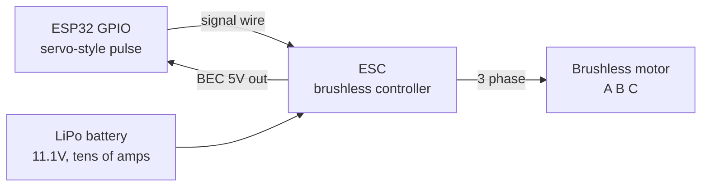

A brushless motor has no brushes to wear out, instead an electronic controller called an ESC energises three coils in sequence to drag the rotor round.

This is what is in drones, RC cars, e-bikes and modern cordless drills. Far more power for the weight than a brushed motor, far more efficient, and considerably more dangerous.

Why three wires

A brushed motor has a mechanical commutator, physical contacts that swap the coil polarity as the shaft turns. A brushless motor moves that job into electronics. Three coils, driven in a rotating pattern, produce a magnetic field that spins and the rotor chases it.



You never drive a brushless motor directly. It is always motor plus ESC, treat them as one unit.

The two kinds

|  |Outrunner|Inrunner|
|---|---|---|
|Which part spins|The outer can|The inner shaft only|
|Speed|Lower RPM|Very high RPM|
|Torque|Higher|Lower, usually geared|
|Used in|Drones, direct drive|RC cars, ducted fans|

|  |Sensorless|Sensored|
|---|---|---|
|How the ESC knows rotor position|Measures back-EMF on the idle coil|Hall sensors inside the motor|
|Extra wires|None|A sensor cable|
|Low speed behaviour|Stutters, can fail to start|Smooth from zero|
|Cost|Cheap, standard|More|

Almost everything hobbyist is sensorless outrunner. Which means it will cog and stutter at very low throttle, that is normal and not a fault.

Reading the markings

|Marking|Means|
|---|---|
|`2212`|Stator size, 22mm diameter × 12mm tall. Bigger = more power|
|`920KV`|RPM per volt with no load. 920KV on 11.1V ≈ 10,200 RPM unloaded|
|`3S`|Designed for a 3 cell LiPo, 11.1V nominal|
|ESC `30A`|Continuous current rating|
|ESC `2-4S`|Battery voltage range it accepts|

KV is the key number. High KV means fast and low torque, suited to small propellers. Low KV means slower with more torque, suited to large propellers. Getting this wrong means either no thrust or a burnt motor.

Controlling it, this is the good news

An ESC accepts exactly the same signal as a hobby servo. A pulse every 20ms, width 1.0ms to 2.0ms, except here it means throttle rather than angle.

|Pulse width|Throttle|
|---|---|
|1.0ms|Zero / armed|
|1.5ms|50%|
|2.0ms|100%|

So the code is servo code. You use the ESP32Servo library and write angles, and the ESC reads them as throttle.

Arming

An ESC will not run until it sees a zero throttle signal for a moment at startup. This is a safety feature so a motor cannot spin up the instant you connect a battery with the throttle stick already forward. In practice: send 1.0ms for a couple of seconds first, listen for the confirmation beeps, then it will respond.

Wiring

An ESC has three sets of connections. Battery in (thick red and black), motor out (three thick wires, usually all the same colour), and a servo-style 3-pin lead for signal.

```
   LiPo + ────────────── ESC red (thick)
   LiPo - ────────────── ESC black (thick)

   ESC ──A─────────────── MOTOR wire 1
   ESC ──B─────────────── MOTOR wire 2
   ESC ──C─────────────── MOTOR wire 3

   ESC servo lead:
       orange/white ───── ESP32 GPIO13
       red (BEC 5V)  ──── ESP32 VIN   (or leave disconnected)
       brown/black   ──── ESP32 GND
```

|From|To|Note|
|---|---|---|
|LiPo +|ESC thick red|check polarity twice, reversed = instant destruction|
|LiPo -|ESC thick black|-|
|ESC A|Motor wire 1|-|
|ESC B|Motor wire 2|-|
|ESC C|Motor wire 3|**swap any two to reverse direction**|
|ESC signal (orange/white)|ESP32 GPIO13|3.3V pulse is fine|
|ESC ground (brown/black)|ESP32 GND|**mandatory shared ground**|
|ESC BEC (red)|ESP32 VIN, or nothing|only if you want the ESC to power the board|

That "swap any two motor wires to reverse" is genuinely how you change direction on a brushless motor. There is no wiring order to get right, any of the six permutations works, three go one way and three go the other.

The BEC

Most ESCs include a **BEC**, a small built-in 5V regulator on the red servo wire, meant to power your receiver. You can use it to power the ESP32 through `VIN`. Two cautions: it is usually rated for only 1-3A, and if you are also powering the ESP32 over USB, do not connect the BEC red wire, or you have two supplies fighting each other. When in doubt, leave the red wire out and only connect signal and ground.

Code

```cpp
#include <ESP32Servo.h>

Servo esc;

#define ESC_PIN 13

void setup() {
  Serial.begin(115200);

  esc.setPeriodHertz(50);
  esc.attach(ESC_PIN, 1000, 2000);   // 1.0ms to 2.0ms

  // arm: hold minimum throttle so the ESC accepts commands
  esc.writeMicroseconds(1000);
  Serial.println("arming, remove propeller before testing");
  delay(3000);
}

void loop() {
  esc.writeMicroseconds(1200);   // ~20% throttle
  delay(3000);
  esc.writeMicroseconds(1000);   // stop
  delay(3000);
}
```

Ramp throttle gradually rather than jumping. A sudden jump to full pulls enormous current and can desync the ESC, which makes the motor screech and stop.

```cpp
void rampTo(int target, int from, int stepDelay) {
  int step = (target > from) ? 5 : -5;
  for (int us = from; abs(us - target) > 5; us += step) {
    esc.writeMicroseconds(us);
    delay(stepDelay);
  }
  esc.writeMicroseconds(target);
}
```

Current draw, the reality

This is a different scale to everything else in this section.

|Setup|Current|
|---|---|
|Small 1806 drone motor, 2S|5 - 10A|
|2212 920KV with a 10 inch prop, 3S|~15A peak|
|Four of those on a quad|60A total|
|A 30A ESC at full throttle|30A continuous, 40A burst|

At 15A, a thin breadboard jumper wire will glow and melt. Breadboards are rated for about 1A per contact. **Brushless motors do not go on a breadboard.** Battery and motor connections need proper soldered joints or XT60 connectors.

A 3S LiPo can dump over 100A into a short circuit. It will vaporise the wire and set fire to things. This is the one part of hobby electronics where the danger is real rather than theoretical.

Safety, not optional

|Rule|Why|
|---|---|
|Remove the propeller for every code test|A prop at 10,000 RPM removes fingers|
|Bolt the motor down|An unsecured motor becomes a projectile|
|Never leave a LiPo charging unattended|They burn fiercely and cannot be put out with water|
|Use a LiPo bag for charging and storage|-|
|Check polarity twice before connecting|Reverse polarity destroys the ESC instantly, sometimes on fire|
|Never discharge a LiPo cell below 3.0V|Permanent damage and a fire risk on the next charge|
|Store LiPos at 3.8V per cell|"Storage charge" mode on the charger|

Picking a combination

|Want|Motor|ESC|Battery|
|---|---|---|---|
|Learning, bench test|2212 1000KV|30A|3S 1300mAh|
|Small quad|1806 2300KV|12A|2S/3S|
|RC car|Sensored inrunner|Car-specific ESC with reverse|2S/3S|

Rule: pick the ESC rated at least 1.5× the motor's maximum current draw. A 20A motor gets a 30A ESC.

The mistake everyone makes

Testing with the propeller attached. There is no gentler way to say this: at some point your code will do something you did not intend, the motor will go to full throttle, and if a prop is fitted it will hurt you or destroy your workspace. Take it off, always, every test.

Second: connecting the ESC's BEC red wire while also plugged into USB, so two 5V supplies fight and something gets damaged.

Third: expecting the motor to run smoothly at very low throttle. Sensorless ESCs stutter near zero. That is the design, not a fault.

Fourth: skipping the arming sequence, so the ESC beeps angrily and refuses to do anything, and you assume the wiring is wrong.
