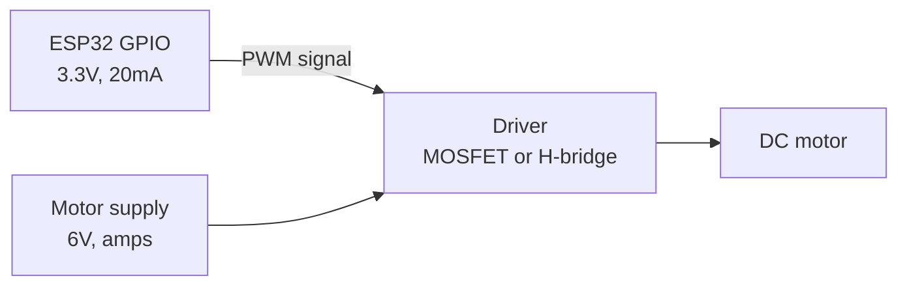

A brushed DC motor is the simplest motor there is, put voltage across the two terminals and it spins, swap the terminals and it spins the other way.

No controller needed to make it turn. All the complexity is in controlling speed and direction safely, and in surviving the electrical mess it makes.

Schematic symbol

```
        ┌─────┐
   ─────┤  M  ├─────
        └─────┘
```

Two terminals, no polarity marking that matters, either way is valid, it just changes direction.

What controls what

|You want|You do|
|---|---|
|Spin|Apply voltage|
|Spin faster|Higher voltage, or higher PWM duty cycle|
|Reverse|Swap the polarity, which needs an H-bridge|
|Stop (coast)|Disconnect both terminals|
|Stop (brake)|Short both terminals together|
|Hold position|You cannot, use a [[Servo Motors]] or [[Stepper Motors]]|

Current draw, the reality

This is where beginners get hurt. A motor's current depends on how hard it is working, and the numbers are much bigger than you expect.

|State|What it means|Current (typical yellow TT gear motor, 6V)|
|---|---|---|
|Free running|Spinning with no load|~150mA|
|Under load|Driving a robot on carpet|300 - 500mA|
|Stall|Shaft physically held still|**~1.5A**|
|Inrush|The instant you switch it on|Stall current, briefly|

Two things follow from that table.

Every start is a stall. At the moment you apply power the shaft is not moving, so the motor briefly pulls its full stall current. Your driver and your supply must survive that, not just the running current.

Stall current is what you size for. If the wheels jam against a wall your code will happily hold full power while the motor pulls 1.5A and the driver cooks.

For a bigger motor, multiply everything. A cheap 775 motor stalls at over 20A.

Never connect a motor directly to a GPIO

An ESP32 pin gives 20mA. A motor wants hundreds of milliamps as a minimum. Connecting one directly will not spin the motor and will damage the pin. You always need a driver between them.



One direction only, with a MOSFET

If you never need to reverse, a single logic-level N-channel MOSFET is the cheapest driver.

```
   6V ───────┬──────────────┐
             │              │
            ◀|─ 1N5819      │      flyback diode, stripe up
             │              │
             └───[ M ]──────┘
                    │
                    │ D
   GPIO ──[220Ω]────┤ G   IRLB8721
                    │ S
                    ├──[10kΩ]── GND
                    │
   GND ─────────────┴───────────── ESP32 GND
```

|From|To|Note|
|---|---|---|
|6V supply +|Motor terminal 1|and diode cathode (striped end)|
|Motor terminal 2|MOSFET drain|and diode anode|
|Diode across motor|Stripe to +6V|flyback, backwards on purpose|
|ESP32 GPIO16|220Ω resistor|-|
|220Ω resistor|MOSFET gate|-|
|MOSFET gate|10kΩ to GND|stops the motor spinning at boot|
|MOSFET source|GND|-|
|6V supply -|ESP32 GND|**shared ground, mandatory**|

The flyback diode is not optional on a motor. See [[Flyback diode protection]].

```cpp
#define MOTOR_PIN 16

void setup() {
  ledcAttach(MOTOR_PIN, 1000, 8);   // 1kHz PWM, 8 bit
  ledcWrite(MOTOR_PIN, 0);
}

void loop() {
  ledcWrite(MOTOR_PIN, 120);   // slow-ish
  delay(2000);
  ledcWrite(MOTOR_PIN, 255);   // full
  delay(2000);
  ledcWrite(MOTOR_PIN, 0);     // coast to stop
  delay(2000);
}
```

Both directions, with an H-bridge

To reverse you need to swap which terminal is positive, and that needs four switches arranged in an H. Buy a module, do not build one. See [[H-Bridge motor driver]].

|Module|Motor voltage|Current per channel|Notes|
|---|---|---|---|
|DRV8833|2.7 - 10.8V|1.5A|Good for small robots, 3.3V logic friendly, efficient|
|TB6612FNG|4.5 - 13.5V|1.2A|Better than L298N, cheap, 3.3V logic|
|L298N|5 - 35V|2A|Ancient, wastes ~2V as heat, but everywhere in kits|
|BTS7960|6 - 27V|43A|For big motors|

If you have a choice, take a DRV8833 or TB6612FNG over an L298N. The L298N is an old bipolar design that drops around 2V across itself, so a 6V supply gives your motor 4V and the heatsink gets hot.

PWM frequency

Low PWM frequencies make the motor audibly whine at that pitch. Around 1kHz is a reasonable default. Push it to 20kHz and it goes above hearing, but cheap H-bridges lose efficiency at higher frequencies. Try 1kHz, and if the whine annoys you, go to 20kHz and watch the driver temperature.

Motors do not start at low duty cycles. Below maybe 20-30% duty there is not enough torque to overcome friction and the motor just buzzes. Map your speed range from about 60 to 255 rather than 0 to 255.

Gearboxes

A bare DC motor spins fast with almost no torque, which is useless for driving wheels. A gearbox trades speed for torque. The yellow TT motors in robot kits have roughly a 48:1 gearbox built in. Ratios are usually printed on the motor.

Noise

Brushed motors are electrically filthy. The brushes spark continuously, throwing noise onto the supply and into the air. Three fixes, use all of them:

|Fix|Why|
|---|---|
|100nF ceramic across the motor terminals|Soaks up brush sparking noise at source|
|470µF - 1000µF across the motor supply rail|Stops the rail sagging on current spikes|
|Separate the motor supply from the ESP32's 3V3|Keeps the mess away from the logic|

The mistake everyone makes

Powering the motor from the ESP32's `3V3` or `5V` pin. The board's regulator cannot supply motor current, the rail collapses, and the ESP32 resets the instant the motor starts. The serial monitor shows a boot log and it looks like a firmware crash. Give the motor its own supply and join the grounds.

Second: no flyback diode, then wondering why the ESP32 randomly reboots or the MOSFET died. The spike when a motor switches off is many times the supply voltage.

Third: sizing everything for running current rather than stall current, so the first time a wheel jams the driver burns out.
