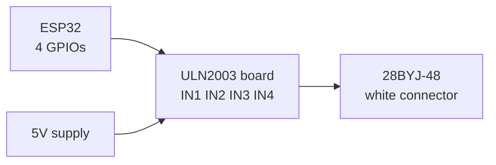

A stepper motor moves in fixed, countable increments instead of spinning freely, so you can command it to go exactly 200 steps and know precisely where the shaft ended up.

That is the trade. You get open-loop position accuracy without any sensor, and in exchange you get low top speed, constant current draw even when stationary, and the possibility of silently losing steps if you push it too hard.

How it works

Inside are several coils arranged around a toothed rotor. Energise coil A and the rotor snaps to align with it. Energise B and it snaps one tooth further. Repeat in the right order and the shaft walks round one step at a time.

```
   Step   A1   A2   B1   B2
   ────────────────────────
     1     +    -    .    .
     2     .    .    +    -
     3     -    +    .    .
     4     .    .    -    +
```

That is full-step drive. Your driver chip generates this sequence, you just give it pulses.

Step angle

|Steps per revolution|Degrees per step|Common in|
|---|---|---|
|200|1.8°|NEMA 17, the standard 3D printer motor|
|400|0.9°|High resolution NEMA 17|
|48|7.5°|Small cheap steppers|
|~2048 (geared)|~0.176° at output|28BYJ-48|

Microstepping splits each step electrically into halves, quarters, up to 1/256. It does not really improve accuracy, but it massively reduces noise and vibration. 1/16 is a good default on an A4988 or DRV8825.

Unipolar vs bipolar

|  |Unipolar|Bipolar|
|---|---|---|
|Wires|5 or 6|4|
|Coils|Centre tapped|Plain|
|Driver|Simple, e.g. ULN2003|Needs an H-bridge per coil, e.g. A4988|
|Torque|Lower, half the winding used at a time|Higher|
|Example motor|28BYJ-48|NEMA 17|

The two you will actually meet: the little blue **28BYJ-48** with its ULN2003 board, which comes in every kit, and the **NEMA 17**, which is the 3D printer motor.

The 28BYJ-48 with ULN2003, the beginner one

This is the easy one and it will run happily on 5V. Four control pins, no current tuning, no heat.



```
   5V supply ──────────── ULN2003 (+)
   GND ────────────────── ULN2003 (-)
   ESP32 GND ──────────── ULN2003 (-)

   ESP32 GPIO14 ───────── IN1
   ESP32 GPIO27 ───────── IN2
   ESP32 GPIO26 ───────── IN3
   ESP32 GPIO25 ───────── IN4

   ULN2003 socket ─────── motor's white 5 pin plug
```

|From|To|Note|
|---|---|---|
|5V supply +|ULN2003 `+` terminal|~250mA, USB 5V can just about do it|
|5V supply -|ULN2003 `-` terminal|-|
|ULN2003 `-`|ESP32 GND|**shared ground**|
|ESP32 GPIO14|IN1|any output pin|
|ESP32 GPIO27|IN2|-|
|ESP32 GPIO26|IN3|-|
|ESP32 GPIO25|IN4|-|
|Motor plug|ULN2003 white socket|only fits one way|

```cpp
#include <Stepper.h>

// 28BYJ-48 in half-step mode via ULN2003
const int STEPS_PER_REV = 2048;

// note the pin order: IN1, IN3, IN2, IN4 -- not sequential
Stepper motor(STEPS_PER_REV, 14, 26, 27, 25);

void setup() {
  motor.setSpeed(10);        // RPM, this motor is slow, don't exceed ~15
}

void loop() {
  motor.step(STEPS_PER_REV);    // one full turn clockwise
  delay(1000);
  motor.step(-STEPS_PER_REV);   // one full turn back
  delay(1000);
}
```

The pin order `IN1, IN3, IN2, IN4` looks like a typo and is not. The Stepper library expects the coils in a different order to how the board labels them. If your motor buzzes and vibrates without turning, this is the first thing to check.

NEMA 17 with an A4988 or DRV8825

This is the grown-up setup. The driver takes just two signals: a pulse to move one step, and a level to set direction.

|Driver pin|Connect to|Purpose|
|---|---|---|
|STEP|ESP32 GPIO|One pulse = one step|
|DIR|ESP32 GPIO|HIGH or LOW sets direction|
|EN|ESP32 GPIO or GND|LOW = enabled. Leave floating/high to release the motor|
|MS1/MS2/MS3|3V3 or GND|Sets microstepping|
|VDD / VMOT|3.3V logic / 8-35V motor|Two separate supplies|
|1A 1B 2A 2B|Motor coils|**Pairs matter, see below**|
|GND|Both grounds|-|

```
   12V ────┬──── VMOT              ┌──── 1A ──┐
           │                       │          │  coil A
          ─┴─ 100µF                ├──── 1B ──┘
          ─┬─  (mandatory)         │
           │            ┌──────────┴──┐
   GND ────┴────────────┤   A4988     │
                        │             │
   ESP32 3V3 ───────────┤ VDD     2A ─┼──┐
   ESP32 GND ───────────┤ GND     2B ─┼──┘  coil B
   ESP32 GPIO14 ────────┤ STEP        │
   ESP32 GPIO27 ────────┤ DIR         │
   ESP32 GPIO26 ────────┤ EN          │
                        └─────────────┘
```

|From|To|Note|
|---|---|---|
|12V supply +|A4988 VMOT|motor supply, 8V to 35V|
|12V supply -|A4988 GND (motor side)|-|
|Across VMOT and GND|100µF electrolytic|**mandatory, the driver dies without it**|
|ESP32 3V3|A4988 VDD|logic supply|
|ESP32 GND|A4988 GND (logic side)|shared ground|
|ESP32 GPIO14|STEP|one pulse per step|
|ESP32 GPIO27|DIR|-|
|ESP32 GPIO26|EN|drive LOW to enable|
|Motor coil 1 pair|1A, 1B|find pairs with a multimeter|
|Motor coil 2 pair|2A, 2B|-|

Finding the coil pairs: multimeter on resistance, probe pairs of the four motor wires. Two of them will read a few ohms, those are one coil. The other two are the other coil. If you probe across coils you get open circuit. Getting the pairing wrong makes the motor vibrate and not turn.

Setting the current limit is the other essential step, and you must do it before running the motor for long. There is a tiny trimmer pot on the driver. Measure the voltage between that pot and GND with the motor connected and powered but not moving:

```
   A4988:  Vref = Imax × 8 × Rsense       (Rsense usually 0.068Ω or 0.1Ω)
   DRV8825: Vref = Imax / 2
```

For a typical 1.5A NEMA 17 on a DRV8825, Vref = 0.75V. Set it, then feel the motor after a minute of running. Too hot to hold means turn it down.

```cpp
#define STEP_PIN 14
#define DIR_PIN  27
#define EN_PIN   26

void setup() {
  pinMode(STEP_PIN, OUTPUT);
  pinMode(DIR_PIN, OUTPUT);
  pinMode(EN_PIN, OUTPUT);
  digitalWrite(EN_PIN, LOW);      // LOW enables the driver
}

void oneStep() {
  digitalWrite(STEP_PIN, HIGH);
  delayMicroseconds(800);          // shorter = faster, too short = missed steps
  digitalWrite(STEP_PIN, LOW);
  delayMicroseconds(800);
}

void loop() {
  digitalWrite(DIR_PIN, HIGH);
  for (int i = 0; i < 200; i++) oneStep();   // one revolution at full step
  delay(1000);

  digitalWrite(DIR_PIN, LOW);
  for (int i = 0; i < 200; i++) oneStep();
  delay(1000);
}
```

For anything real, use the **AccelStepper** library. Steppers cannot go from stopped to fast instantly, they will just stall and buzz. AccelStepper ramps the speed up and down for you, which is the difference between a motor that works and one that does not.

Current draw, the reality

|Motor|Current|Notes|
|---|---|---|
|28BYJ-48|~250mA|Constant, whether moving or not|
|NEMA 17|1.0 - 2.0A per coil|Set by the driver's current limit, not the motor|
|NEMA 17 idle|Same as moving|A stepper holding still draws full current|

That last row is the thing that surprises people. A stepper is not like a DC motor. Standing still and holding position draws just as much power as moving, and the motor gets warm doing nothing. If you do not need holding torque, disable the driver with the EN pin to save power and heat.

The mistake everyone makes

Connecting or disconnecting the motor while the A4988 or DRV8825 is powered. This kills the driver instantly and reliably. Power off, then unplug. Every time.

Second: no 100µF capacitor across VMOT. The driver will die, possibly on the first power-up.

Third: missed steps. A stepper has no feedback, so if the load is too heavy or you accelerate too hard it silently skips steps and your position tracking is now wrong with no error to catch. Symptoms are a grinding buzz and a shaft that drifts out of alignment over time. Fix by going slower, accelerating gently, or raising the current limit.

Fourth: wiring the four motor wires in whatever order they came out of the connector. Find the coil pairs with a multimeter first.
